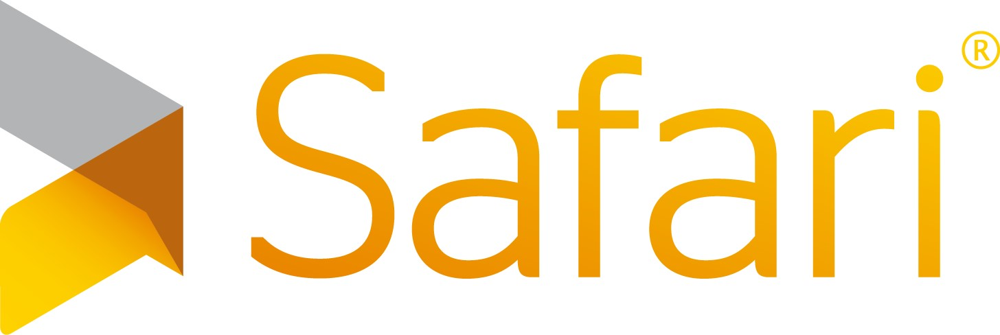

# 序言

  

当我们撰写[*Site Reliability Engineering*](http://bit.ly/2kIcNYM)时，我们的目标是:解释Google的生产工程和运营的理念和原则。这本书是我们试图与其他计算机世界分享我们团队的最佳实践和经验教训的尝试。我们假设SRE本书可能吸引少量的工程师从事注重可靠性的大型工作，并且内容的数量和重点都将限制本书的吸引力。

事实证明，我们在这两个方面都被误解了。

令我们感到惊讶和高兴的是，SRE本书在发行后令人振奋的时期是计算机上的畅销书，不仅出售或下载很多，而且还很畅销。它正在被很多人*阅读*。我们收到了来自世界各地有关本书，团队，实践和成果的问题。我们被要求谈论各章节，方法和事件。我们发现自己处于意外状况，因为我们处于非周期状态，因此不得不拒绝外部请求。

像大多数成功的灾难一样，SRE本书创造了一个机会去选择是可以用人工来应对(“雇佣更多人！进行更多的口语交流！”)还是采用更具扩展性的方式。作为SRE，我们会偏向于后一种方法，这会让少数读者感到惊讶。我们决定编写第二本SRE书-扩展了我们最常被要求谈论的内容，并解决了读者对第一本书最常见的问题。

关于第一本SRE书，我们收到了许多不同的问题，要求和意见，其中有两个主题对我们特别有趣:如果不加以解决，它们是将SRE的课程用于生产的障碍。这些主题通俗地概括为:

- 原理很有趣，但是如何在*我*的项目/团队/公司中将其付诸实践？

- SRE的方法对我不起作用；这仅在Google的文化中可行，并且仅在Google的规模上才有意义。

这本第二本SRE书籍的目的是(a)在第一卷中概述的原则上添加更多实施细节，以及(b)消除仅在“Google规模”或“Google文化”下可以实施SRE的想法。

该卷是以前工作的“伴侣”，而不是新版本。这两本书应该合为一体。如果您已经熟悉本书的前身，您将会从本书中获得最大收益。第一本SRE书籍[免费在线提供](http://www.google.com/sre)。

通过设计，本书的结构大致遵循第一卷的结构。我们希望您能够一并阅读各章。本卷的每一章都假定您熟悉上一本书中的相应内容。我们的目标是让您随时随地在原理和实践之间来回切换。这样，您可以将两本书都用来参考正在进行的工作。

接下来，谈谈精神:我们从一些读者那里得知，在描述Google改善运营的过程时，我们过于专注于“只是我们”。一些读者建议说，我们也远离Google之外的世界的实际情况，并且没有用DevOps的原理解决[我们的思想的相互作用](http://bit.ly/2J5S63y)。在本书中，我们试图引起人们的注意，这是一种完全公平的批评。

但是，我们确实认为SRE的高度自觉性有助于其作为一门学科的有用性。对我们来说，这是一个特点，而不是错误。我们不主张SRE是构建和运行高度可靠的系统的唯一方法(甚至通常是最佳方法)。这是对我们最成功的方式。

我们还将花一些时间谈论SRE和DevOps之间的关系。要牢记的重要一点是它们没有冲突。

我们想预先确认这本书一定是不完整的。即使在Google的内部，SRE学科也是一个广阔的领域，并且由于它在Google以外的广泛实践，它的发展速度甚至更快。我们没有将内容广泛和肤浅，而是集中讨论了第一本书中最需要的实施细节。

最后，该书及其前身不是福音。请不要那样对待他们。即使经过了这么多年，我们仍在寻找条件和情况，使我们调整(或在某些情况下替代)以前坚定的信念。SRE既是一门学科，又是一段旅程。

我们希望您喜欢在这些页面中阅读的内容，并找到有用的书。组装它是一种爱的劳动。我们很高兴，有一个不断壮大的SRE专业人士社区，我们可以与他们一起学习和改进。

与往常一样，非常感谢您的直接反馈。每当您做出贡献时，它都会教给我们一些有价值的东西。

> # **如何阅读这本书**
>
>本书是Google第一本书[*Site Reliability Engineering*](http://bit.ly/2kIcNYM)的配套书。为了充分利用此书，我们建议您阅读或参考第一本SRE书籍(可通过[*google.com/sre*](http://google.com/sre))免费在线阅读。这两部作品在以下方面互为补充:

>- 以前的工作是对原理和哲学的介绍。本册集中于如何应用这些原理。(在某些领域，尤其是配置管理和金丝雀发布，我们还涵盖了一些新领域，为其他主题的实际处理提供了背景。)

>- SRE仅着重于Google如何实践SRE。这项工作包括许多其他公司的观点-从传统企业(包括The Home Depot和*《纽约时报》 *)到数字本地人(Evernote，Spotify等)。

>- SRE没有直接涉及到更大的运营社区，尤其是DevOps，而这本书直接谈到了SRE和DevOps如何相互联系。

>该书假定您将在此书与其前身之间切换。例如，您可以阅读第一本书中的[第4章，“服务级别目标”](http://bit.ly/2szBKsK)，然后在本卷中阅读其实现补充(第2章)。
>
>本书假定每一章只是更长的讨论和旅程的起点。因此，这本书旨在成为对话的发起者，而不是硬道理。
>
>-编者

## 本书中使用的惯例

本书使用以下印刷约定:

*斜体*

>表示新的术语，URL，电子邮件地址，文件名和文件扩展名。

恒定宽度

>用于程序清单，以及在段落中用于引用程序元素，例如变量或函数名称，数据库，数据类型，环境变量，语句和关键字。

**恒定宽度加粗**

>显示用户应按字面意义键入的命令或其他文本。

*等宽斜体*

>显示应由用户提供的值或由上下文确定的值替换的文本。
>
>该元素表示一个提示或建议。
>
>此元素表示一般注释。
>
>此元素表示警告或注意。

## **使用代码示例**

可从[*http://g.co/SiteReliabilityWorkbookMaterials*](http://g.co/SiteReliabilityWorkbookMaterials)下载补充材料(代码示例，练习等)。

这本书可以帮助您完成工作。通常，如果本书提供了示例代码，则可以在程序和文档中使用它。除非您要复制大部分代码，否则无需与我们联系以获取许可。例如，编写使用本书中若干代码段的程序无需许可。出售或分发O'Reilly书籍中的示例CD-ROM确实需要获得许可。引用本书并引用示例代码来回答问题无需许可。确实需要将本书中的大量示例代码合并到产品的文档中。

我们感谢但不要求注明出处。出处通常包括标题，作者，出版者和ISBN。例如:“*《站点可靠性工作手册》*，由Betsy Beyer，Niall Richard Murphy，David K.Rensin，Kent Kawahara和Stephen Thorne(O'Reilly)编辑。版权所有2018 Google LLC，978-1-492-02950-2。”

如果您认为使用代码示例超出合理使用范围或获得上述允许，请随时通过*permissions@oreilly.com*与我们联系。

## **O'Reilly Safari**

[*Safari*](http://oreilly.com/safari)(以前称为Safari Books Online)是会员-面向企业，政府，教育工作者和个人的培训和参考平台。

成员可以访问来自250多家发行商的数千本书，培训视频，学习路径，互动教程以及精选的播放列表，其中包括O'Reilly Media，《哈佛商业评论》，Prentice Hall Professional，Addison-Wesley Professional，Microsoft Press，Sams，Que ，Peachpit Press，Adobe，Focal Press，Cisco Press，John Wiley＆Sons，Syngress，Morgan Kaufmann，IBM Redbooks，Packt，Adobe Press，FT Press，Apress，Manning，New Riders，McGraw-Hill，Jones＆Bartlett和Course技术，等等。

有关更多信息，请访问[*http://oreilly.com/safari*](http://www.oreilly.com/safari)。

## **如何联系我们**

请将有关本书的评论和问题发送给出版商:

> O'Reilly Media，Inc.
>
> 1005 Gravenstein Highway North
>
>塞巴斯托波尔，CA 95472
>
> 800-998-9938(在美国或加拿大)
>
> 707-829-0515(国际或本地)
>
> 707-829-0104(传真)

我们为这本书提供了一个网页，其中列出了勘误表，示例以及所有其他信息。您可以通过[*http://bit.ly/siteReliabilityWkbk*](http://bit.ly/siteReliabilityWkbk)访问此页面。

要对本书发表评论或提出技术问题，请发送电子邮件至*bookquestions@oreilly.com*。

有关我们的书籍，课程，会议和新闻的更多信息，请访问我们的网站[*http://www.oreilly.com*](http://www.oreilly.com/)。

在脸书上找我们:[*http://facebook.com/oreilly*](http://facebook.com/oreilly)

在推特上关注我们:[*http://twitter.com/oreillymedia*](http://twitter.com/oreillymedia)

在YouTube上观看我们:[*http://www.youtube.com/oreillymedia*](http://www.youtube.com/oreillymedia)

## **致谢**

本书是作者，技术作家和评论家等100多人的热情和慷慨捐助的产物。每章都有一个供个人作者和技术作家使用的标题。我们还要花点时间感谢此处未列出的所有人。

我们要感谢以下审稿人提供了宝贵的(有时是针对性的)反馈:安倍·哈桑(Abe Hassan)，亚历克斯·佩里(Alex Perry)，卡拉·唐纳利(Cara Donnelly)，克里斯·琼斯(Chris Jones)，科迪·史密斯(Cody Smith)，德莫特·达菲(Jerrod Todd)，杰伊·贾德科维兹(Jay Judkowitz)，约翰·T·里斯(John T.Reese)，莉兹·芳·琼斯(Liz Fong-Jones)，迈克·丹尼斯(Mike Danese)，穆拉里·苏里尔(Nuralan Desai)，尼科尔·卡斯卡拉诺(NiccolòCascarano)，拉尔夫·皮尔森(Ralph Pearson)，萨利姆(Salim) Virji，Todd Underwood，Vivek Rau和Zoltan Egyed。

我们想对以下人员表示最深切的感谢，他们将其作为我们此卷的整体质量标准。他们在整个著作中做出了巨大贡献:Alex Matey，Max Luebbe，Matt Brown和JC van Winkel。

作为Google SRE的领导人，Benjamin Treynor Sloss和Ben Lutch是这本书在Google内部的主要执行赞助商；他们坚信坚定不移的后续项目是SRE第一本书的重要伴侣，这对于使本书得以实现至关重要。

尽管在每一章中都特别感谢作者和技术作家，但我们还是想通过提供周到的意见，讨论和评论来认可对每一章做出贡献的人。按照章节顺序，它们是:

- **第2章:**哈维尔·科恩(Javier Kohen)，帕特里克·伊顿(Patrick Eaton)，理查德·邦迪(Richard Bondi)，亚尼夫·阿克宁(Yaniv Aknin)

- **第4章:**Alex Matey，Clint Pauline，Cody Smith，JC van Winkel，OlaKłapcińska，ŠtěpánDavidovič

- **第5章:**Alex Matey，Clint Pauline，Cody Smith，Iain Cooke，JC van Winkel，ŠtěpánDavidovič

- **第6章:**Dermot Duffy，James O'Keeffe，Stephen Thorne

- **第七章:**马克·布罗迪

- **第8章:**Alex Perry，Alex Hidalgo，David Huska，Sebastian Kirsch，Sabrina Farmer，Steven Carstensen，Liz Fong-Jones，Nandu Shah(Evernote)，Robert Holley(Evernote)

- **第9章:**Alex Hidalgo，Alex Matey，Alex Perry，Dave Rensin，Matt Brown，Tor Gunnar Houeland，Trevor Strohman

- **第10章:**约翰·T·里斯

- **第11章:**Daniel E. Eisenbud，Dave Rensin，Dmitry Nefedkin，DževadTrumić，Edward Wu(Niantic)，JC van Winkel，Lucas Pereira，Luke Stone，Matt Brown，Natalia Sakowska，Niall Richard Murphy，Phil Keslin(Niantic)，Rita Sodt，Scott Devoid，Simon Donovan，TomaszKulczyński

- **第12章:**伊沃·克卡(Ivo Krka)，马特·布朗(Matt Brown)，尼基·尼科洛西(Nicky Nicolosi)，丹妮亚·赖莉

- **第13章:**Bartosz Janota(Spotify)，Cara Donnelly，Chris Farrar，JohannesRußek(Spotify)，Max Charas，Max Luebbe，Michelle Duffy，NelsonArapé(Spotify)，Riccardo Petrocco(Spotify)，Rickard Zwahlen(Spotify)，Robert Stephenson(Spotify) ，史蒂文·瑟古德(Steven Thurgood)

- **第14章:**夏琳·佩雷斯(Charlene Perez)，戴夫·坎宁安(Dave Cunningham)，戴夫·雷辛(Dave Rensin)，杰西·范·温克尔(JC van Winkel)，约翰·里斯(John Reese)，斯蒂芬·索恩

- **第15章:**Alex Matey，Bo Shi，Charlene Perez，Dave Rensin，Eric Johnson，Juliette Benton，Lars Wander，Mike Danese，Narayan Desai，Niall Richard Murphy，ŠtěpánDavidovič，Stephen Thorne

- **第16章:**Alex Matey，Liz Fong-Jones，Max Luebbe

- **第17章:**安德鲁·哈维(Andrew Harvey)，亚历山大·史基曼(Aleksander Szymanek)，布拉德·克拉托奇维尔(Brad Kratochvil)，埃德·韦尔温(Ed Wehrwein)，邓肯·萨金(Dancan Sargeant)，杰西卡·赖斯兰(Jessika Reissland)，马特·布朗(Pattr Sieklucki)和托马斯·亚当西克

- **第18章:**Brian Balser(*纽约时报*)，Deep Kapadia(*纽约时报*)，Michelle Duffy，XavierLlorà

- **第19章:**马特·布朗

- **第20章:**Brian Balser (*New York Times*), Christophe Kalt, Daniel Rogers, Max Luebbe, Niall Richard Murphy, Ramón Medrano Llamas, Richard Bondi, Steven Carstensen, Stephen Thorne, Steven Thurgood, Thomas Wright

- **第21章:**Dave Rensin，JC Van Winkel，Max Luebbe，Ronen Louvton，Stephen Thorne，Tom Feiner，Tsiki Rosenman

我们也感谢以下贡献者，他们提供了丰富的专业知识或资源，或者对这项工作产生了其他出色的效果:卡莱布·唐纳森(Caleb Donaldson)，夏琳·佩雷斯(Charlene Perez)，埃文·伦纳德(Evan Leonard)，珍妮弗·佩托夫(Jennifer Petoff)，朱丽叶·本顿(Juliette Benton)和莉亚·米勒(Lea Miller)

我们非常感谢从行业评论家那里获得的深思熟虑的反馈:Mark Burgess，David Blank-Edelman，John Looney，Jennifer Davis，BjörnRabenstein，Susan Fowler，Thomas A.Limoncelli，James Meickle，Theo Schlossangle，Jez Humble，Alice Goldfuss，Arup Chakrabarti，John Allspaw，Angus Lees，Eric Liang，Brendan Gregg和Bryan Liles。

我们要特别感谢Shylaja Nukala，他慷慨地投入了SRE技术写作团队的时间和技能。她热情地支持他们的必要和宝贵的努力。

还要感谢O'Reilly Media团队-弗吉尼亚·威尔逊(Virginia Wilson)，克里斯汀·布朗(Kristen Brown)，雷切尔·莫纳汉(Rachel Monaghan)，尼克·麦克唐纳(Nikki McDonald)，梅兰妮·雅伯洛(Melanie Yarbrough)和格洛里亚·卢克斯(Gloria Lukos)-的帮助和支持，使这本书在我们雄心勃勃的时间表中成为现实。

还要特别感谢Niall Richard Murphy:尽管他是在这本书问世之前就离开Google的，但他的持续洞察力和奉献精神对于在终点线获得大量有意义的内容至关重要。他的领导才能，体贴，坚韧和机智无不令人振奋！最后，编辑们还要亲自感谢以下人员:

- **贝茜·拜尔(Betsy Beyer):**对于祖母，我是鼓励，灵感，爆米花，鼓舞人心和令人困惑的首选资源。您使这本书和我的日常生活都变得更好了！对于Duzzie，Hammer，Joan，Kiki和Mini(注意字母顺序--哈！)，他们帮助我成为了一个沉迷于作家的人，使我成为今天的人。当然，Riba也提供了DMD和其他必要的规定来推动这项工作。

- **尼尔·理查德·墨菲(Niall Richard Murphy):**献给Léan，Oisín，Fiachra和Kay的北极星。对于那些对自身利益的抗议完全与他的行为格格不入的人。对沙龙来说，影响力比她知道的还要多。在一个光线充足的客厅里，给亚历克斯(Alex)喝杯茶，一本书，一盒骰子和你。

- **斯蒂芬·索恩(Stephen Thorne):**对我的妈妈和爸爸来说，他们一直鼓励我努力奋斗。对我的妻子，埃尔斯佩思。对于那些给予我比我认为我应得的更多的尊重和鼓励的同事:Ola，Štěpán，Perry和David。

- **Dave Rensin:**写完第一本书后，我发誓永远不会再写另一本书。那是六本书前，我每次都说完全一样的话。对于我的妻子利亚(Lia)，后者给了我足够的空间去做，却从不说“我告诉过你”。(即使她告诉我了。)对于Google的同事们-尤其是SRE的家人-在过去的几年中，我比过去20多学到了更多有关大规模生产工程的知识。最后，本杰明·特雷诺·斯洛斯(Benjamin Treynor Sloss)采访了我，并说服我首先加入Google。

- **川原健太(Kent Kawahara):**对于我的父母，Denby和Setsuko，以及我的Asako麻子，帮助我到达了现在的位置。感谢我的兄弟姐妹Randy和Patti多年来的支持。感谢我的妻子安吉拉(Angela)和我的儿子瑞安(Ryan)，伊桑(Ethan)和布雷迪(Brady)的爱戴和支持。最后，对于Dave，Betsy，Niall，Juliette和Stephen的核心团队，我很荣幸能与您合作进行此项目。

