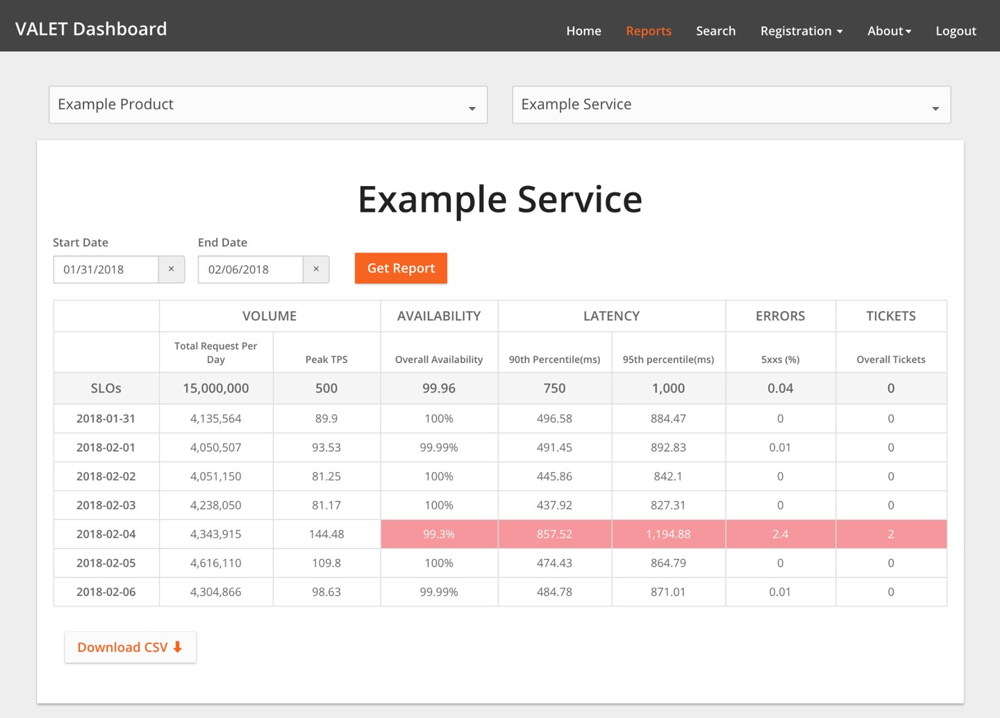

# **第3章**

### **SLO工程案例研究**

 

***本·麦考马克(Evernote)和***

***威廉·邦纳尔(家得宝)与加勒特·普拉斯基(Evernote)，亚历克斯·希达戈，贝茜·拜尔和戴夫·雷辛***

 
 

尽管SRE的许多宗旨是在Google的大门内塑造的，但其原则却长期存在于我们的门外。并行发现了许多标准的Google SRE惯例，或者以其他方式被业内其他许多组织所采用。

SLO是SRE模型的基础。自从我们启动客户可靠性工程(CRE)团队(一组经验丰富的SRE来帮助Google Cloud Platform(GCP)客户构建更可靠的服务)以来，几乎每个客户互动都始于SLO。

在这里，我们介绍了两个不同的公司讲述的两个故事，概述了他们与Google CRE团队一起采用基于SLO和错误预算的方法的过程。有关SLO和错误预算的更一般性讨论，请参见本书的第2章和第一本书的[第3章](http://bit.ly/2so6uOc)。

## **Evernote的SLO故事**

*由Evernote的Ben McCormack提供*

Evernote是一个跨平台的应用程序，可帮助个人和团队创建，组合和共享信息。该平台在全球拥有超过2.2亿用户，我们存储了超过120亿条信息-包括基于文本的便笺，文件和附件/图像。在幕后，Evernote服务由750多个MySQL实例支持。

我们在Evernote中引入了SLO的概念，这是更广泛的技术改造的一部分，旨在提高工程设计速度，同时保持服务质量。我们的目标包括:

- 将工程重点从数据中心毫无区别的繁重工作转移到客户真正关心的产品工程工作上。为此，我们停止了运行物理数据中心，并转移到公共云。

- 修改运营和软件工程师的工作模型，以支持功能速度的提高，同时保持整体服务质量。

- 改进我们对SLA的看法，以确保我们更加关注故障如何影响我们庞大的全球客户群。

对于许多行业的组织来说，这些目标可能看起来很熟悉。尽管没有一种单一的方法可以全面进行这些类型的更改，但我们希望分享我们的经验将为面临类似挑战的其他人提供有价值的见解。

**为什么Evernote采用SRE模型？**

过渡开始时，Evernote的特点是传统的运维分离:运维团队保护生产环境的神圣性，而开发团队则负责为客户开发新产品功能。这些目标通常是冲突的:开发团队受到冗长的运维需求的束缚，而运维团队则因新规范在生产中引入新问题而感到沮丧。当我们在这两个目标之间疯狂转换时，运维和开发团队之间建立了沮丧而紧张的关系。我们希望找到一个更快乐的媒介，以更好地平衡参与团队的需求变化。

在过去的五年多的时间里，我们试图以各种方式解决传统二分法中的空白。在尝试了"您编写，你运行它"(开发)模型和"您编写后，我们为您运行"模型(操作)之后，我们转向了以SLO为中心的SRE方法。

那么什么促使Evernote朝这个方向发展呢？

在Evernote，我们将运维和开发的核心学科视为工程师可以专门研究的独立专业领域。一种途径是与客户近24/7的持续交付服务有关。另一个与服务的扩展和发展有关，以满足将来客户的需求。近年来，随着诸如SRE和DevOps之类的运动强调将软件开发应用于运营，这两个学科已经相互接近。(随着数据中心自动化的发展和公共云的发展，这种融合得到了进一步的发展，这两者都为我们提供了一个可以完全由软件控制的数据中心。)另一方面，全栈所有权和持续部署越来越多地应用于软件开发。

我们之所以被SRE模型吸引，是因为它完全拥抱并接受了运营与开发之间的差异，同时鼓励团队朝着一个共同的目标努力。它不会尝试将运维工程师转变为应用程序开发人员，反之亦然。而是提供了共同的参考框架。根据我们的经验，错误预算/SLO方法导致两个团队在陈述相同事实时做出相似的决定，因为它消除了对话中的很多主观性。

**SLO的介绍:进行中的旅程**

我们旅程的第一部分是从物理数据中心到Google Cloud Platform的迁移。[^30] Evernote服务在GCP上启动并运行并稳定后，便引入了SLO。我们的目标是双重的:

- 围绕Evernote SLO内部调整团队，确保所有团队都在新框架内工作。

- 将Evernote的SLO纳入我们与Google Cloud团队的合作方式，该团队现在负责我们的基础架构。由于我们现在在整体模型中有了新的合作伙伴，因此我们需要确保迁移到GCP不会稀释或掩盖我们对用户的承诺。

在活跃使用SLO大约9个月之后，Evernote已经在其SLO实践的第3版中使用！

在了解SLO的技术细节之前，从客户的角度开始对话非常重要:您要坚持哪些承诺？与大多数服务类似，Evernote具有许多功能和选项，可供我们的用户以各种创造性方式使用。我们想确保我们最初专注于最重要和最常见的客户需求:*Evernote服务的可用性，供用户跨多个客户端访问和同步其内容。*我们的SLO旅程就是从这个目标开始的。通过专注于正常运行时间，我们使第一个SLO变得简单。使用这种简单的第一种方法，我们可以清楚地说明我们正在测量的内容以及如何进行测量。

我们的第一份SLO文件包含以下内容:

*SLO的定义*

> 这是正常运行时间的尺度:为某些服务和方法设置的按月窗口正常运行时间为99.95％。我们根据与内部客户支持和产品团队的讨论以及(更重要的是)用户反馈的讨论选择了这个数字。我们特意选择将我们的SLO绑定到一个日历月而不是一个滚动期，以使我们在进行服务审核时保持专注和有条理。

*测量什么，以及如何测量*

> *测量内容*

>> 我们指定了可以调用的服务端点，以测试服务是否按预期运行。在我们的例子中，我们的服务内置了一个状态页面，该页面可以执行大部分堆栈，如果一切正常，则返回200状态代码。

> *如何测量*

>> 我们需要一个探针来定期调用状态页面。我们希望该探针完全位于环境之外并且与我们的环境无关，以便我们可以测试我们的所有组件，包括负载平衡堆栈。我们的目标是确保我们正在测量GCP服务和Evernote应用程序的所有故障。但是，我们不希望随机的互联网问题触发误报。我们选择使用专门从事构建和运行此类探针的第三方公司。我们选择了[Pingdom](http://www.pingdom.com/)，但市场上还有很多其他产品。我们进行以下测量:

>> - **探针频率:** 我们每分钟都会轮询前端节点。

>> - **探针位置:** 此设置是可配置的。我们目前在北美和欧洲使用多个探针。

>> - **"停机"的定义:** 如果探针检查失败，则将该节点标记为"未确认关闭"，然后由第二个地理位置独立的探针执行检查。如果第二次检查失败，则将该节点标记为向下以用于SLO计算。只要连续的探测请求注册错误，该节点将继续被标记为已关闭。

*如何根据监控数据计算SLO*

> 最后，我们仔细记录了如何根据从Pingdom收到的原始数据计算SLO。例如，我们指定了如何维护窗口的方法:我们不能假设所有亿万用户都知道我们发布的维护窗口。因此，不知情的用户会将这些窗口视为无法解释的一般停机时间，因此我们的SLO计算将维护视为停机时间。

一旦定义了我们的SLO，就必须对它们进行一些处理。我们希望SLO推动软件和运维的变化，这将使我们的客户更加快乐并使他们满意。如何做到最好？

我们使用SLO/错误预算概念作为分配资源的方法。例如，如果我们错过了上个月的SLO，那么这种行为有助于我们优先考虑相关的修复，改进和错误修复。我们保持简单:Evernote和Google的团队每月对SLO的性能进行一次审查。在本次会议上，我们将回顾上个月的SLO绩效，并对任何中断进行深入分析。根据过去一个月的分析，我们设置了可能无法通过常规的"根本原因"分析过程获得的改进措施。

在整个过程中，我们的指导原则一直是"完美是良好的敌人"。即使SLO不够完善，它们也足以指导随着时间的推移进行改进。"完美"的SLO可以衡量用户与我们服务的所有可能互动，并考虑所有边缘情况。尽管这是一个好主意，但要花很多时间才能实现(如果可以实现完美)，这是我们可以用来改善服务的时间。取而代之的是，我们选择了一个初始SLO，该SLO涵盖了大多数(但不是全部)用户交互，这是服务质量的良好代理人。

自从我们开始以来，根据内部服务审查的信号以及对影响客户的停机的响应，我们对SLO进行了两次修订。因为我们一开始并不是针对完美的SLO，所以我们很乐意进行更改以更好地与业务保持一致。除了我们每月对Evernote/Google进行SLO绩效审查之外，我们还确定了六个月的SLO审查周期，该周期可以在过于频繁地更改SLO和使它们变得陈旧之间取得适当的平衡。在修订我们的SLO时，我们还了解到平衡要*想要*的测量和*可能*的测量很重要。

自引入SLO以来，我们的运维和开发团队之间的关系已经微妙但明显改善。团队现在拥有共同的成功衡量标准:消除对服务质量(QoS)的人为解释，可以使两个团队保持相同的观点和标准。仅举一个例子，当我们不得不在2017年的压缩时间表中促进多个版本发布时，SLO提供了一个共同点。当我们解决一个复杂的错误时，产品开发要求我们在多个单独的窗口中分配正常的每周发布时间，每个窗口都可能影响客户。通过对问题应用SLO计算并从场景中消除人类的主观性，我们能够更好地量化对客户的影响，并将我们的发布窗口从五个减少到两个，以最大程度地减少客户的痛苦。

**打破客户与云提供商之间的SLO墙**

客户和云提供商之间的虚拟墙似乎是自然的或不可避免的。Google在我们运行Evernote的GCP平台上拥有SLO和SLA(服务水平协议)，而Evernote拥有自己的SLO和SLA。不能总是期望两个这样的工程团队会被告知彼此的SLA。

Evernote从未想要过这样的隔离墙。当然，我们可以根据基础GCP指标将SLO和SLA建立在隔墙上。相反，从一开始，我们希望Google了解哪些性能特征对我们最重要，以及为什么。我们希望使Google的目标与我们的目标保持一致，并且两家公司都将Evernote的可靠性成功与失败视为共同的责任。为此，我们需要一种方法:

- 调整目标

- 确保我们的合作伙伴(在本例中为Google)确实了解对我们重要的事情

- 分享成功与失败

大多数服务提供商都针对其云服务管理发表的SLO/SLA。在这种情况下工作很重要，但是不能从整体上说明我们的服务在云提供商环境中的运行状况。

例如，给定的云提供商可能在全球范围内运行成千上万个虚拟机，它们可以管理这些虚拟机的正常运行时间和可用性。GCP承诺Compute Engine(即其虚拟机)的可用性为99.95％。即使GCP SLO图表为绿色(即高于99.95％)，Evernote对同一SLO的看法也可能有很大不同:因为我们的虚拟机覆盖区仅占全球GCP数量的一小部分，所以中断对我们区域是孤立的(或孤立的由于其他原因)可能会在整体汇总到全球范围内"丢失"。

为了纠正这种情况，我们与Google分享了SLO和SLO的实时性能。结果，Google CRE团队和Evernote都使用相同的性能仪表板。这似乎很简单，但是事实证明，这是驱动真正以客户为中心的行为的强大方法。因此，Google不会收到通用的"Service X运行缓慢"类型的通知，而是向我们提供了更特定于我们环境的通知。例如，除了通用的"GCP负载平衡环境今天运行缓慢"之外，我们还将被告知，此问题对Evernote的SLO造成了5％的影响。这种关系还可以帮助Google内部的团队了解他们的行为和决定如何影响客户。

这种双向关系也为我们提供了一个非常有效的框架来支持重大事件。在大多数情况下，P1-P5故障单和常规支持渠道的常规模型效果很好，可以使我们保持良好的服务并与Google建立良好的关系。但是我们都知道，有时候P1故障单("对我们业务的重大影响")还不够-您的整个服务都在网上，您将面临更大的业务影响。

在这样的时刻，我们共同的SLO和与CRE团队的关系得以实现。我们有一个共同的理解，即如果SLO的影响足够高，双方将把该问题视为经过特殊处理的P1故障单。通常，这意味着Evernote和Google的CRE团队使用共享会议迅速动员。Google CRE团队监控我们共同定义并达成的SLO，使我们能够在优先级划分和适当的响应方面保持同步。

**当前状态**

在积极使用SLO约9个月之后，Evernote已经在其SLO实践的第3版中使用。下一版本的SLO将在我们简单的正常运行时间SLO的基础上发展。我们计划开始探究单个API调用，并考虑客户端/客户端对度量/性能的看法，以便我们可以更好地表示用户QoS。

通过提供衡量QoS的标准和定义方式，SLO使Evernote可以更好地关注我们的服务运行方式。现在，我们可以在内部以及与Google进行数据驱动的对话，以讨论中断的影响，这使我们能够推动服务的改进，最终使支持团队更有效，客户更满意。

## **家得宝(Home Depot)的SLO故事**

*由Home Depot的William Bonnell提供*

家得宝(THD)是世界上最大的家居装饰零售商:我们在北美拥有2200多家商店，每个商店都拥有35,000多种独特产品(并在线提供了超过150万种产品)。我们的基础架构托管着各种软件应用程序，这些软件应用程序支持近40万名员工，每年处理超过15亿笔客户交易。这些商店与全球供应链和一个电子商务网站紧密集成，每年访问量超过20亿。

在最近一次旨在提高软件开发速度和质量的运营方法更新中，THD不仅转向敏捷软件开发，而且还改变了我们设计和管理软件的方式。我们从支持大型单片软件包的集中支持团队转变为由小型独立运维的软件开发团队领导的微服务架构。结果，我们的系统现在具有较小块的不断变化的软件，这些软件也需要在整个堆栈中进行集成。

我们向微服务的迁移得到了全栈所有权的新"自由和责任文化"的补充。这种方法使开发人员可以在需要时自由地推送代码，还可以使他们共同负责服务的操作。为了使这种共有制的工作模式，运维和开发团队需要说一种通用的语言，这种语言可以促进问责制并跨越复杂性:服务水平目标(SLO)。相互依赖的服务需要了解以下信息:

- 您的服务有多可靠？它是为三个9，三个半9或四个9(或更高级)而构建的？有计划的停机时间吗？

- 我可以期望达到什么样的延迟？

- 您能处理我要发送的请求量吗？您如何处理过载？您的服务是否已逐步达到其SLO？

如果每个服务都可以为这些问题提供透明且一致的答案，那么团队将对他们的依存关系有清晰的了解，从而可以更好地进行沟通，并提高团队之间的信任度和责任感。

**SLO文化项目**

在我们开始转变服务模式之前，Home Depot没有SLO的文化。监控工具和仪表板数量很多，但分布在各处，并且不会随时间推移跟踪数据。我们并非总是能够将服务定位在出现中断的根源。通常，我们开始在用户界面服务处进行故障排除，然后进行反向工作，直到发现问题为止，这浪费了无数小时。如果某项服务需要计划内停机，则其相关服务会感到惊讶。如果团队需要构建3个半9的服务，那么他们将不知道他们所依赖的服务是否可以为他们提供更好的正常运行时间(四个9)。这些脱节导致了我们的软件开发和运营团队之间的困惑和失望。

我们需要通过建立SLO的共同文化来解决这些脱节问题。这样做需要一种总体策略来影响人员，流程和技术。我们的工作涵盖了四个大致领域:

*普通白话*

> 在THD上下文中定义SLO。定义如何以一致的方式测量它们。

*布道*

> 在整个公司范围内传播信息。

> - 制作培训材料以销售SLO为何重要，公司各处路演，内部博客以及T恤和贴纸等促销材料。

> - 招募一些早期采用者来实施SLO，并向其他人展示其价值。

> - 建立醒目的缩写(VALET；稍后讨论)，以帮助传播该想法。

> - 创建培训计划(FiRE学院:可靠性工程的基础), 对开发人员进行SLO和其他可靠性概念的培训。[^31]

*自动化*

> 为减少采用过程中的摩擦，请实施一个指标收集平台，以自动收集部署到生产中的任何服务的服务水平指标。这些SLI以后可以更容易地转换为SLO。

*奖励*

> 为所有发展经理制定年度目标，以设置和衡量其服务的SLO。

建立一个通用的语言对于使每个人意见统一至关重要。我们还希望保持此框架尽可能简单，以帮助该想法更快地传播。首先，我们仔细研究了跨各种服务监控的指标并发现了一些模式。每个服务都监控其"流量"，"等待时间"，"错误"和"利用率"的某种形式-与Google SRE的[四个黄金信号](http://bit.ly/2LSLpDQ)密切相关的指标。此外，许多服务对*正常运行时间或可用性*的监控明显不同于错误。不幸的是，所有指标的整体监控都不一致，名称不同或数据不足。

我们的服务都没有SLO。我们的生产系统最接近面向客户SLO的指标是支持故障单。我们衡量部署到商店的应用程序的可靠性的主要(也是唯一的)方法是跟踪内部支持部门收到的支持电话数量。

### **我们的第一批SLO**

我们无法为系统中可以衡量的每个方面创建SLO，因此我们必须决定哪些指标或SLI也应具有SLO。

**API调用的可用性和延迟**

我们决定，每个微服务必须具有由*其他*微服务调用的API调用可用性和延迟的SLO。例如，购物车微服务调用库存微服务。对于这些API调用，库存微服务发布了SLO，购物车微服务(以及其他需要库存的微服务)可以咨询SLO，以确定库存微服务是否可以满足其可靠性要求。

**基础设施利用率**

THD的团队以不同的方式衡量基础架构的利用率，但是最典型的衡量标准是一分钟粒度的实时基础架构利用率。由于某些原因，我们决定不设置利用率SLO。首先，微服务并不需要过分关注此指标-您只要使用可处理的流量，微服务启动，快速响应，不会引发错误，您的用户就不会真正在意利用率。您不会有容量不足的危险。此外，我们即将迁移到云意味着利用率将不再是问题，因此成本规划将使容量规划显得逊色。(我们仍然需要监控利用率和执行容量规划，但是我们不需要将其包含在我们的SLO框架中。)

**流量**

由于THD尚未具备容量规划的文化，因此我们需要一种机制，供软件和运维团队交流其服务可以处理的容量。流量很容易定义为对服务的请求，但是我们需要确定是否应该跟踪每秒的平均请求，每秒的峰值请求或在报告时间段内的请求量。我们决定跟踪所有这三个指标，并让每个服务选择最合适的指标。我们辩论是否要为流量设置SLO，因为该指标取决于用户行为，而不是我们可以控制的内部因素。最终，我们决定作为零售商，我们需要针对黑色星期五之类的高峰确定服务规模，因此我们根据预期的高峰容量设置了SLO。

**潜伏**

我们让每个服务定义其SLO的延迟，并确定在哪里对其进行最佳测量。我们唯一的要求是，服务应该用黑盒监控来补充我们常见的白盒性能监控，以捕获由网络或其他层(如微服务外部发生故障的缓存和代理)引起的问题。我们还认为，百分数比算术平均值更合适。至少，服务需要达到90％的目标；面向用户的服务的首选目标是95％和/或99％。

**错误**

错误的解释有些复杂。由于我们主要处理Web服务，因此我们必须标准化什么构成错误以及如何返回错误。如果Web服务遇到错误，我们自然会在HTTP响应代码上进行标准化:

- 服务不应在2xx响应的正文中指示错误；而是应该抛出4xx或5xx。

- 由服务问题(例如，内存不足)引起的错误应引发5xx错误。

- 由客户端引起的错误(例如，发送格式错误的请求)应引发4xx错误。

经过深思熟虑，我们决定同时跟踪4xx和5xx错误，但仅将5xx错误用于设置SLO。与我们针对其他SLO相关元素的方法类似，我们将此维度保持通用，以便不同的应用程序可以在不同的上下文中利用它。例如，除HTTP错误外，批处理服务的错误可能是无法处理的记录数。

**故障单**

如前所述，故障单最初是我们评估大多数生产软件的主要方式。由于历史原因，我们决定继续与其他SLO一起跟踪故障单。您可以将此指标视为类似于"软件操作级别"之类的指标。

**VALET**

我们将新的SLO总结为一个方便的缩写:VALET

*容量(流量)*

> 我的服务可以处理多少业务量？

*可用性*

> 我需要时可以启动服务吗？

*延迟*

> 使用该服务时，服务是否快速响应？

*错误*

> 使用该服务时是否抛出错误？

*故障单*

服务是否需要人工干预才能完成我的请求？

**宣传SLO**

带着易于记忆的首字母缩写，我们着手向企业宣传SLO:

- 为什么SLO很重要

- SLO如何支持我们的"自由与责任"文化

- 应该测量什么

- 做什么去处理结果

由于开发人员现在要负责其软件的运行，因此他们需要建立SLO，以展示其构建和支持可靠软件的能力，还需要与服务的消费者和面向客户服务的产品经理进行沟通。但是，大多数受众不熟悉SLA和SLO之类的概念，因此需要对他们进行新的VALET框架教育。

由于我们需要获得高级管理层的支持才能加入SLO，因此我们的教育运动始于高级领导层。然后，我们与开发团队一对一会晤，以拥护SLO的价值。我们鼓励团队从其自定义的指标跟踪机制(通常是手动的)过渡到VALET框架。为了保持发展势头，我们每周以VALET格式发送SLO报告，并与有关高级可靠性概念和从内部事件中学到的经验教训一起进行评论。这也有助于制定业务指标，例如，根据VALET创建的采购订单(容量)或未能处理的采购订单(错误)。

我们还通过多种方式扩大了宣传的范围:

- 我们建立了一个内部WordPress网站来托管有关VALET和可靠性的博客，并链接到有用的资源。

- 我们进行了内部技术讲座(包括Google SRE演讲嘉宾)，讨论了一般的可靠性概念以及如何使用VALET进行测量。

- 我们举办了一系列VALET培训讲习班(以后将演变为FiRE学院)，并向想要参加的任何人开放了邀请。这些讲习班的出席人数持续了几个月。

- 我们甚至创建了VALET笔记本电脑贴纸和T恤，以支持全面的内部营销活动。

很快，公司中的每个人都了解了VALET，我们的SLO新文化开始流行起来。SLO的实施甚至开始正式纳入THD对开发经理的年度绩效评估中。虽然每周大约有50个服务定期按其SLO进行捕获和报告，但我们仍将临时指标存储在电子表格中。尽管VALET的想法像野火一样流行，但我们需要使数据收集自动化以促进广泛采用。

### **自动VALET数据收集**

现在，我们的SLO文化已经站稳脚跟，但自动化VALET数据收集将加速SLO的采用。

**TPS报告**

我们建立了一个框架来自动捕获已部署到我们新GCP环境中的任何服务的VALET数据。我们称此框架为*TPS报告*，是我们用来进行容量和性能测试(每秒事务处理)的术语的玩法，当然，[幽默](http://bit.ly/2J4bGkL)[^32]的解释是多个管理者可能希望查看此数据。我们在GCP的BigQuery数据库平台上构建了TPS报告框架。我们的网络服务前端生成的所有日志均被馈入BigQuery中，以供TPS报告进行处理。最终，我们还纳入了其他各种监控系统的指标，例如Stackdriver的可用性探针。

TPS报告将这些数据转换为任何人都可以查询的每小时VALET指标。新创建的服务会自动注册到TPS报告中，因此可以立即查询。由于数据全部存储在BigQuery中，因此我们可以跨时间段有效地报告VALET指标。我们使用这些数据来构建各种自动报告和警报。最有趣的集成是一个聊天机器人，它使我们可以直接在商业聊天平台中报告服务的价值。例如，任何服务都可以显示最后一小时的VALET，VALET与前一周的对比，SLO之外的服务以及聊天频道中的各种其他有趣数据。

**VALET服务**

我们的下一步是创建一个VALET应用程序，以存储和报告SLO数据。由于SLO可以最好地用作趋势工具，因此该服务每天，每周和每月对SLO进行跟踪。请注意，我们的SLO是一种趋势分析工具，可用于错误预算，但未直接连接到我们的监控系统。相反，我们有各种不同的监控平台，每个监控平台都有自己的警报。这些监控系统每天汇总其SLO，并发布到VALET服务以进行趋势分析。这种设置的缺点是，监控系统中设置的警报阈值未与SLO集成在一起。但是，我们可以根据需要灵活地更改监控系统。

考虑到需要将VALET与不在GCP中运行的其他应用程序集成，我们创建了一个VALET集成层，该层提供了一个API，用于每天收集服务的汇总VALET数据。TPS报告是第一个与VALET服务集成的系统，我们最终与各种本地应用程序平台(在VALET中注册的服务的一半以上)集成。

**VALET仪表板**

VALET仪表板(如图3-1所示)是我们的UI，用于可视化和报告此数据，并且相对简单。它允许用户:

- 注册新服务。这通常意味着将服务分配给一个或多个URL，这些URL可能已经收集了VALET数据。

- 为五个VALET类别中的任何一个设定SLO目标。

- 在每个VALET类别下添加新的指标类型。例如，一项服务可以跟踪99%的延迟，而另一项服务可以跟踪90%(或两者)的延迟。或者，后端处理系统可以跟踪每天的交易量(一天创建的购买订单)，而客户服务前端可以跟踪每秒的高峰交易。

VALET仪表板使用户可以立即报告许多服务的SLO，并以多种方式对数据进行切片和切块。例如，一个团队可以查看过去一周不满足SLO的所有服务的统计信息。寻求查看服务性能的团队可以查看所有服务及其所依赖服务的延迟。VALET仪表板将数据存储在简单的Cloud SQL数据库中，开发人员使用流行的商业报告工具来构建报告。

这些报告成为开发人员采取新的最佳实践的基础:定期对其服务进行SLO审核(通常是每周或每月)。基于这些审查，开发人员可以创建操作项以将服务返回到其SLO，或者可以决定需要调整不切实际的SLO。

### SLO扩散

一旦将SLO牢牢地扎根于组织，并且有了有效的自动化和报告功能，新的SLO就会迅速扩散。在年初跟踪了大约50种服务的SLO之后，到今年年底，我们跟踪了800种服务的SLO，每月大约有50种新服务在VALET注册。

由于VALET允许我们在THD上扩展SLO的使用，因此开发自动化所需的时间非常值得。但是，如果其他公司不能开发类似复杂的自动化技术，则不应害怕采用基于SLO的方法。尽管自动化为THD提供了额外的好处，但首先编写SLO还是有好处的。

**将VALET应用于批处理应用**

当我们围绕SLO开发可靠的报告时，我们发现VALET有其他用途。稍作调整，批处理应用程序就可以适合此框架，如下所示:

*容量*

> 处理的记录量

*可用性*

> 在一定时间内完成工作的频率(以百分比为单位)

*延迟*

> 作业运行所需的时间

*错误*

> 无法处理的记录

*故障单*

> 操作员必须手动修复数据并重新处理作业的次数

**在测试中使用VALET**

由于我们同时在开发SRE文化，因此我们发现VALET支持在演示环境中进行破坏性测试(混沌工程)自动化。有了TPS报告框架，我们可以自动运行破坏性测试并记录对服务的VALET数据的影响(或希望没有影响)。

**未来的愿望**

随着800项服务(并且还在不断增长)收集VALET数据，我们可以使用许多有用的运营数据。我们对未来有几个愿望。

现在，我们正在有效地收集SLO，我们希望使用此数据来采取行动。我们的下一步是建立类似于Google的错误预算文化，即当服务超出SLO时，团队将停止推出新功能(可靠性方面的改进除外)。为了保护我们的业务发展的速度要求，我们必须努力在SLO报告时间范围(每周或每月)与SLO违反频率之间找到良好的平衡。就像许多采用错误预算的公司一样，我们正在权衡滚动窗口与固定窗口的优缺点。

我们希望进一步完善VALET以跟踪详细的端点和服务的使用者。当前，即使特定服务具有多个端点，我们也仅在整个服务中跟踪VALET。结果，很难区分不同的操作(例如，对目录的写入与对目录的读取；虽然我们分别监控和警告这些操作，但不跟踪SLO)。同样，我们也希望针对服务的不同使用者区分VALET结果。

尽管我们目前在Web服务层跟踪延迟SLO，但我们也希望为最终用户跟踪延迟SLO。此度量将捕获第三方标记，Internet延迟和CDN缓存等因素如何影响页面开始渲染和完成渲染所需的时间。

我们还希望将VALET数据扩展到应用程序部署。具体来说，我们希望在将更改推出到下一个服务器，区域或区域之前，使用自动化功能来验证VALET是否在允许范围内。

我们已经开始收集有关服务依赖项的信息，并已制作了可视化图表的原型，该图表显示了在调用树上未达到VALET指标的位置。随着新兴的服务网格平台，这种类型的分析将变得更加容易。

最后，我们坚信，服务的SLO应该由服务的业务所有者(通常称为产品经理)根据其对业务的重要性来设置。至少，我们希望企业所有者为服务的正常运行时间设置要求，并将SLO用作产品管理和开发之间的共同目标。尽管技术人员发现VALET很直观，但是对于产品经理来说，这个概念并不是那么直观。我们正在努力使用与之相关的术语来简化VALET的概念:我们既简化了正常运行时间的选择数量，又提供了示例指标。我们还强调了从一个级别升级到另一个级别所需的大量投资。以下是我们可能提供的简化的VALET指标示例:

- 99.5％: 商店助理或新服务的MVP未使用的应用程序

- 99.9％: 适用于THD的大多数非销售系统

- 99.95％: 销售系统(或支持销售系统的服务)

- 99.99％: 共享基础设施服务

以业务术语转换指标并在产品和开发之间共享可见的目标(SLO！)，将减少在大型公司中经常看到的对可靠性的错位期望。

### **摘要**

向一家大公司引入新流程，这需要一个好的策略，高管接受度，强大的宣传，易于采用的模式以及(最重要的是)耐心等待等等，更不用说新文化了。像SLO一样的重大变革可能要几年才能在公司中牢固确立。我们想强调一下，Home Depot是一家传统企业；如果我们能够成功引入如此大的变化，您也可以。您也不必一次完成所有任务。在我们逐步实施SLO的同时，制定了全面的宣传战略和明确的激励结构促进了快速的转变:我们在不到一年的时间内将SLO支持的服务从0升级到800。

## **结论**

SLO和错误预算是功能强大的概念，可帮助解决许多不同的问题集。Evernote和Home Depot的这些案例研究提供了非常真实的示例，说明了实施SLO文化如何使产品开发和运维更紧密地联系在一起。这样做可以促进沟通并更好地为开发决策提供依据。最终，它将为您的客户带来更好的体验-无论这些客户是内部，外部，人工还是其他服务。

这两个案例研究突显了SLO文化是一个持续的过程，而不是一次性解决方案或解决方案。尽管它们具有相同的哲学基础，但THD和Evernote的度量方式，SLI，SLO和实现细节却截然不同。通过证明SLO实施不必特定于Google，这两个故事补充了Google对SLO的看法。正如这些公司为自己的独特环境定制SLO一样，其他公司和组织也可以。

 
 

[^30]: 但这是另一本书的故事---在[*http: //bit.ly/2spqgcl*](http://bit.ly/2spqgcl)上查看更多详细信息。

[^31]: 培训选择范围从一个小时的入门到半天的工作坊，再到与成熟的SRE团队进行为期四周的沉浸式学习，并附有毕业典礼和FiRE徽章。

[^32]: 如在1999年的电影[*Office Space*](http://www.imdb.com/title/tt0151804/)中出名。