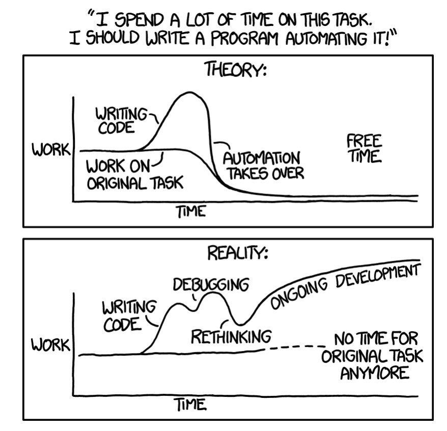
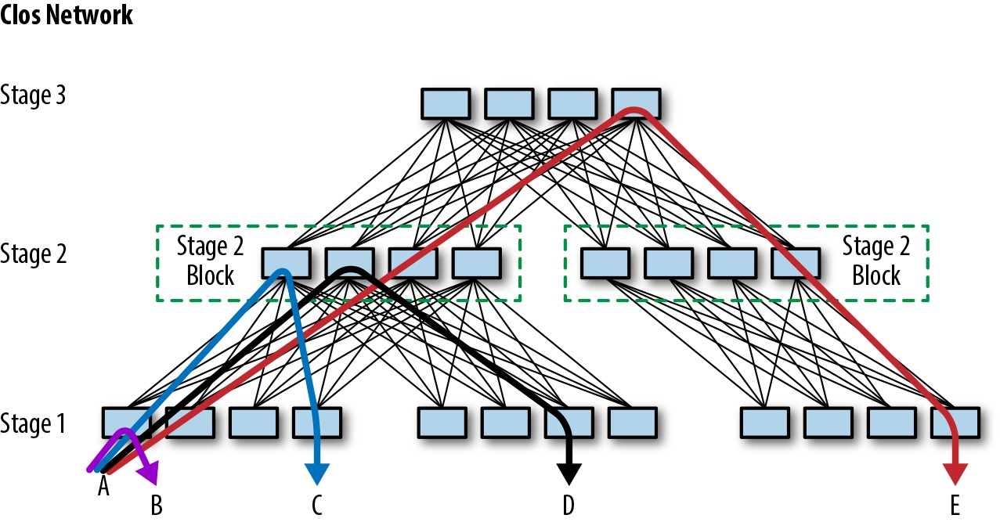
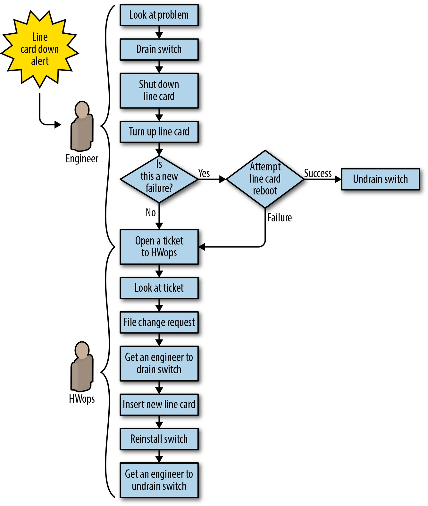
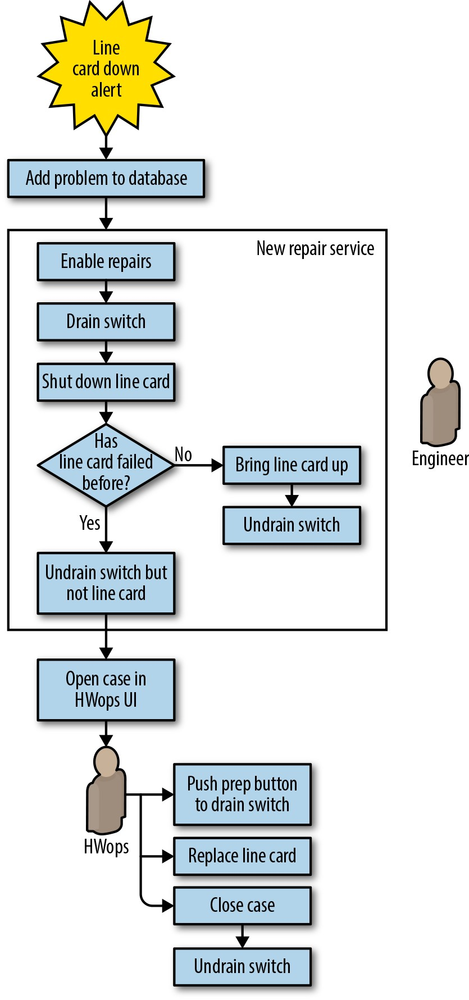
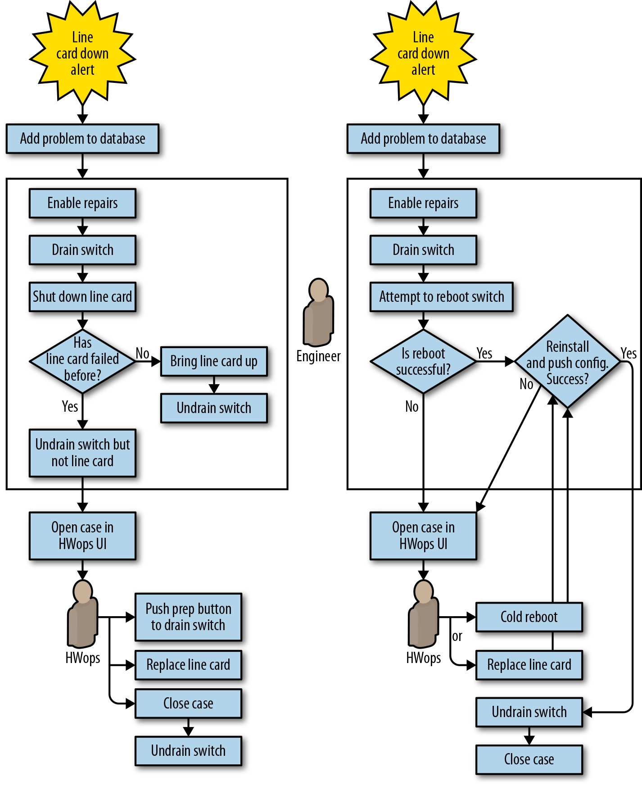
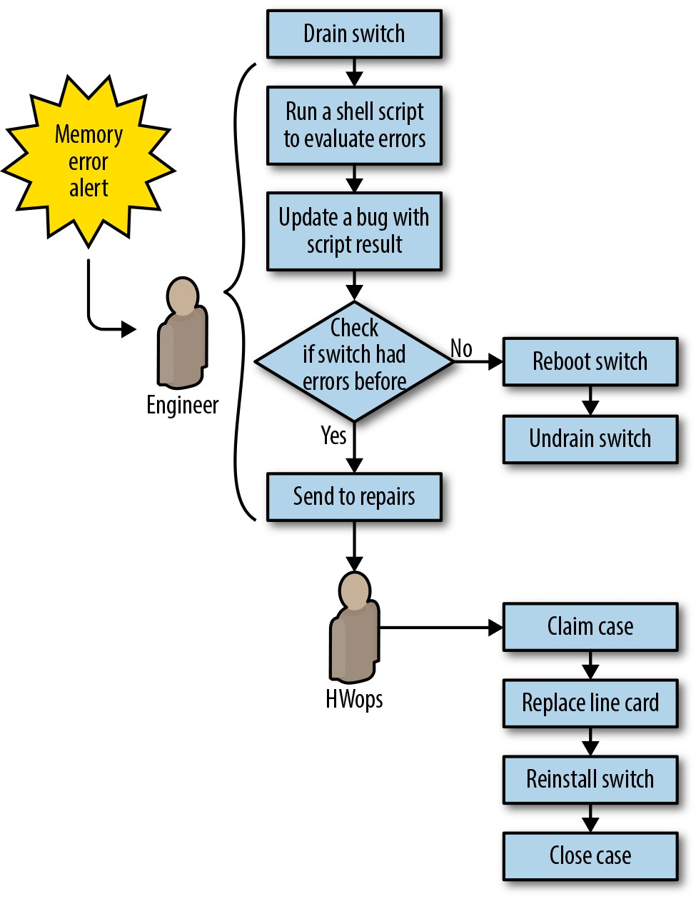
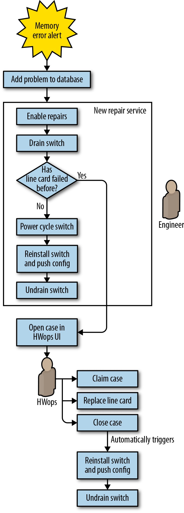
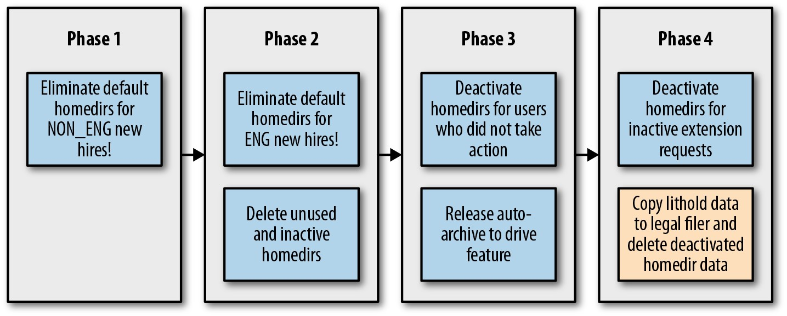
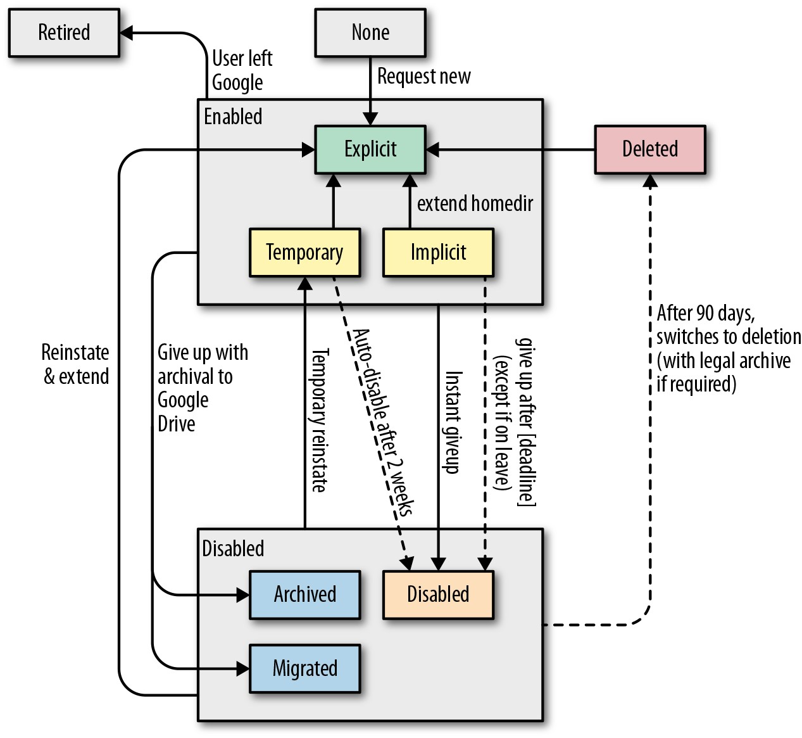

# **第6章**

### **消除琐事**

 

***由David Challoner，Joanna Wijntjes，David Huska***

***马修·萨特威尔，克里斯·科肯德尔，克里斯·谢里尔***

***约翰·鲁尼和维维克·劳***

***与Betsy Beyer，Max Luebbe，Alex Perry和Murali Suriar撰写***

 
 

Google SRE花费大量时间进行优化-通过项目工作和开发人员协作，从系统中获取每一点性能。但是优化的范围不仅限于计算资源: SRE优化他们如何度过时间也很重要。首先，我们要避免执行归类为*琐事*的任务。有关琐事的全面讨论，请参阅《站点可靠性工程》中的[第5章](http://bit.ly/2Lg1TEN)。在本章中，我们将"琐事"定义为与维护服务有关的重复，可预测，恒定的任务流。

对于任何管理生产服务的团队来说，琐事似乎都是不可避免的。系统维护不可避免地需要一定数量的部署，升级，重新启动，警报分类等。如果不加检查和不加考虑，这些活动会很快消耗团队。Google将SRE团队在运维工作(包括劳动密集型和非劳动密集型工作)上花费的时间限制为50％(有关原因的更多信息，请参见我们的第一本书中的[第5章](http://bit.ly/2Lg1TEN))。尽管此目标可能不适合您的组织，但将琐事设置为上限仍然是一个优势，因为识别和量化辛勤工作是优化团队时间的第一步。

## **什么是琐事？**

劳动趋于落在通过以下特征度量的范围上，这些特征在我们的第一本书中有所描述。在此，我们为每种琐事特性提供一个具体示例: 

*手动*

> 当Web服务器上的*tmp*目录达到95％的利用率时，工程师Anne登录到服务器并搜索文件系统以删除多余的日志文件。

*重复*

> 完整的*tmp*目录不太可能是一次性事件，因此修复该目录的任务是重复的。

*可自动*[^43]

> 如果您的团队拥有包含诸如"登录X，执行此命令，检查输出，如果看到...，则重新启动Y"之类的内容的补救文档，这些说明实际上是具有软件开发技能的人的伪代码！在*tmp*目录示例中，该解决方案已部分自动化。通过不需要人工来运行脚本来完全自动化问题检测和补救，会更好。更妙的是，提交补丁，以使软件不再以此方式破坏。

*非战术/反应性*

> 当您收到过多的"磁盘已满"和"服务器关闭"警报时，它们会使工程师从高价值的工程设计中分散注意力，并可能掩盖其他更高严重性的警报。结果，服务的健康受到损害。

*缺乏持久价值*

> 完成任务通常会带来令人满意的成就感，但是从长远来看，这种重复的满足感不是积极的。例如，关闭该警报生成的故障单可确保用户查询继续进行，HTTP请求继续以状态代码\<400进行服务，这很好。但是，今天解决故障单并不能防止将来出现此问题，因此投资回报期很短。

*增长速度至少与其来源一样快*

> 许多类型的运维工作的增长速度(或快于基础架构的大小)。例如，您可以预期执行硬件维修所花费的时间会随着服务器机群的大小而逐步增加。物理维修工作可能会不可避免地随着机器数量的增加而扩展，但是辅助任务(例如，更改软件/配置)不一定必须如此。

琐事的来源可能并不总是符合所有这些标准，但请记住，琐事的形式多种多样。除上述特征外，还要考虑特定工作对团队士气的影响。人们是喜欢做某件事并发现它有回报吗？还是因为被认为是无聊或无聊的工作而经常被人们忽视的工作类型？[^44]琐事可以慢慢削弱团队士气。花在琐事工作上的时间通常不是花在批判性思考或表达创造力上的时间。减少琐事是承认工程师的努力在可能进行人类判断和表达的领域中得到了更好的利用。

> **例: 手动响应琐事** 

> *由Facebook生产工程经理John Looney撰写*

> *始终在一个SRE的心中* 

> 并非总是很清楚某些工作是琐事。有时，"创造性"的解决方案-编写临时解决方法-是不正确的选择。理想情况下，您的组织应该对根本原因修复给予奖励，而不是仅仅掩盖问题的修复。                                                                                                                                                                                                                                                              

> 加入Google之后(2005年4月)，我的第一个任务是登录损坏的计算机，调查其损坏的原因，然后进行修复或将其发送给硬件技术人员。这项任务似乎都很简单,直到我意识到任何时候都有超过20,000台损坏的机器！                                                                                                                                                                                                                          

> 我研究的第一台损坏的计算机的根文件系统已完全装有来自Google修补的网络驱动程序的数以十亿计的废话日志。我发现又有数千台损坏的机器存在相同的问题。我与队友分享了解决该问题的计划: 我会编写一个脚本ssh到所有损坏的机器中，并检查根文件系统是否已满。如果文件系统已满，脚本将截断*/var/log*中大于1MB的所有日志，然后重新启动syslog。

> 我的队友对我的计划的热情不足使我停下来。他指出，最好在可能的情况下解决根本原因。从中长期来看，编写掩盖问题严重性的脚本会浪费时间(通过不解决"实际"问题)，并可能在以后引起更多问题。                                                                                                                                                                            

> 分析表明，每台服务器每小时的成本约为1美元。根据我的思路，成本不应该是最重要的指标吗？我没有考虑过如果解决此症状，就没有动力解决根本原因: 内核团队的发布测试套件没有检查这些机器产生的日志量。
>
> 高级工程师将我引向内核源代码，以便我可以找到令人反感的代码行，并针对内核团队记录一个错误以改进他们的测试套件。我的客观成本/收益分析表明，该问题导致Google每小时损失1000日元，这使开发人员确信开发人员可以使用我的补丁程序解决此问题。
>
> 那天晚上，我的补丁程序变成了一个新的内核版本，第二天，我将其发布到了受影响的机器上。内核团队在下周晚些时候更新了他们的测试套件。现在，我不再感到每天早上都需要修复这些机器而短期内啡肽打击了，而是让我更加高兴地知道，我已经正确地解决了该问题。

## **测量琐事**

您如何知道您的琐事工作量是多少？一旦您决定采取行动减少劳力，您如何知道自己的努力成功还是合理？许多SRE团队结合经验和直觉来回答这些问题。尽管此类策略可能会产生结果，但我们可以对其进行改进。

*经验和直觉不是可重复的，客观的或可转移的*。同一团队或组织的成员通常会因为琐事而付出的工程努力量得出不同的结论，因此对补救工作的优先级不同。此外，减少琐事的工作可能长达数个季度甚至数年(如本章中的一些案例研究所示)，在此期间，团队的工作重点和人员可能会发生变化。为了长期保持关注并证明成本合理，您需要客观地衡量进度。通常，团队必须从几名候选人中选择一个减少琐事的项目。客观的工作量衡量方法使您的团队可以评估问题的严重性并确定优先级，以实现最大的工程投资回报。

在开始减少琐事的项目之前，重要的是分析成本与收益的关系，并确认通过消除琐事所节省的时间(至少)与在首先开发然后维护自动化解决方案所花费的时间成比例(图6-1)。通过将节省的小时数与投资的小时数进行简单的比较，看起来"无利可图"的项目可能仍然很值得进行，因为自动化有许多间接或无形的好处。潜在的好处可能包括: 

- 随着时间的推移，工程项目工作的增长，其中一些将进一步减少工作量

- 提高团队士气，减少团队损耗和倦怠

- 更少的中断上下文切换，提高了团队生产力

- 提高了流程的清晰度和标准化

- 增强团队成员的技术技能和职业发展

- 减少培训时间

-更少的人为失误造成的停机

- 提高了安全性

>

*图6-1.估算您将花费在减少琐事上的时间，并确保收益超过成本(来源: [xkcd.com/1319/](http://xkcd.com/1319/))*

那么，我们如何建议您测量琐事呢？

1.  识别它。第一本SRE书籍的[第5章](http://bit.ly/2Lg1TEN)提供了有关在操作中识别工作负担的指南。最能确定琐事工作的人员取决于您的组织。理想情况下，他们将是利益相关者，包括将执行实际工作的利益相关者。

2.  选择一个适当的度量单位，以表示应用于此琐事的"人力"总量。分钟和小时是自然的选择，因为它们是客观的并且得到普遍理解。确保考虑上下文切换的成本。对于分散的或分散的工作，可能需要使用其他易于理解的工作方式。度量单位的一些示例包括应用的补丁，完整的故障单，手动生产更改，可预测的电子邮件交换或硬件操作。只要该单位是客观，一致且广为人知的，它就可以用来衡量工作量。

3.  在减少琐事之前，期间和之后，持续跟踪这些测量结果。使用工具或脚本简化测量过程，以便收集这些测量结果不会造成额外的麻烦！

## **琐事分类法**

琐事都藏在一天一天乏味中，就像摇摇欲坠的桥梁或漏水的大坝一样。本节中的类别并不详尽，但代表了一些常见的辛苦类别。这些类别中的许多似乎都是"正常"的工程工作，而且确实如此。将琐事视为频谱而不是二分类会很有帮助。

### **业务流程**

这可能是最常见的琐事来源。也许您的团队会管理一些计算资源-计算，存储，网络，负载平衡器，数据库等等-以及提供该资源的硬件。您将与入职用户打交道，配置和保护他们的计算机，执行软件更新以及添加和删除服务器以达到中等容量。您还努力将成本或资源浪费降至最低。您的团队是机器的人机界面，通常与内部客户互动，后者根据需求为其提供故障单。您的组织甚至可能有多个故障单系统和工作摄取系统。

故障单琐事工作有点阴险，因为故障单驱动的业务流程通常可以实现其目标。用户得到了他们想要的东西，并且由于琐事工作通常分散在整个团队中，因此琐事工作不会很大声，显然需要进行补救。无论存在故障单驱动的过程如何，琐事工作都可能在附近悄悄积累。即使您没有明确计划自动化流程，您仍然可以执行诸如简化和精简流程之类的流程改进工作-这些流程以后将更易于自动化，同时也更易于管理。

### **生产中断**

中断是对时间敏感的护卫任务，可以使系统保持运行状态。例如，您可能需要通过手动释放磁盘空间或重新启动泄漏内存的应用程序来解决某些资源(磁盘，内存，I/O)的严重短缺问题。您可能正在提出更换硬盘驱动器的请求，"踢掉"无响应的系统或手动调整容量以满足当前或预期的负载。通常，中断会将注意力从更重要的工作上移开。

### **发布指导**

在许多组织中，部署工具会自动管理从开发到生产的发布。即使具有自动化，全面的代码覆盖范围，代码审查以及多种形式的自动化测试，此过程也并非总是能够顺利进行。根据工具和发布节奏，发布请求，回滚，紧急补丁以及重复或手动的配置更改，发布仍可能会产生麻烦。

### **迁移**

您可能会发现自己经常从一种技术迁移到另一种技术。您可以手动执行此工作，也可以使用有限的脚本执行此工作，因为希望您只从X移到Y。迁移有多种形式，但一些示例包括数据存储，云供应商，源代码控制系统，应用程序库和工具的更改。

如果您手动进行大规模迁移，则迁移很可能涉及琐事。您可能倾向于手动执行迁移，因为这是一次性的工作。尽管您甚至可能会将其视为"项目工作"而不是"琐事工作"，但迁移工作也可以满足许多琐事的条件。从技术上讲，修改备份工具以使一个数据库可以与另一个数据库一起工作是软件开发，但这项工作基本上只是重构代码以将一个接口替换为另一个接口。这项工作是重复的，并且在很大程度上，备份工具的业务价值与以前相同。

### **成本工程和产能计划**

无论您是拥有硬件还是使用基础架构提供商(云)，成本工程和容量规划通常都需要一些相关的工作。例如: 

- 确保跨计算，资源或IOPS(每秒输入/输出操作)等资源的未来需求具有成本效益的基准或可突发功能。这可能会转换为采购订单，AWS预留实例或云/基础架构即服务合同谈判。

- 为产品发布或假期之类的关键高流量事件做准备(并从中恢复)。

- 审查下游和上游服务水平/限制。

- 针对不同的占用空间配置优化工作负载。(您要购买一个大盒子还是四个小盒子？)

- 根据专有云服务产品(适用于AWS的DynamoDB或适用于GCP的云数据存储)的计费细节优化应用程序。

- 重构工具，以更好地利用便宜的"现货"或"可抢占"资源。

- 处理超额预订的资源，无论是在上游与基础架构提供商还是与下游客户。

### **不透明架构的故障排除**

分布式微服务体系结构现在很普遍，并且随着系统的分布越来越广泛，出现了新的故障模式。组织可能没有资源来构建复杂的分布式跟踪，高保真监控或详细的仪表板。即使企业确实拥有这些工具，它们也可能不适用于所有系统。故障诊断甚至可能需要登录到单个系统并使用脚本工具编写临时日志分析查询。

故障排除本身并不是天生的坏事，但您应该致力于将精力集中在新颖的故障模式上，而不是每周因系统结构脆弱而导致的同一类型的故障。对于可用性P的每个新的关键上游依赖性，由于故障的综合可能性，可用性降低了1 - P。现在，添加了9个关键的4个9依赖关系的应该具有4个9可用性的服务现在是3个9服务。[^45]

## **琐事管理策略**

我们发现，如果您正在运行任何规模的生产系统，那么执行人工管理至关重要。一旦确定并量化了琐事，就需要制定消除琐事的计划。这些工作可能要花几周或几个季度才能完成，因此制定一个可靠的总体策略很重要。

从根本上消除琐事是最佳的解决方案，但是如果无法做到这一点，那么您就必须通过其他方式来处理琐事。在我们深入研究两个深入案例研究的细节之前，本节提供了一些一般策略，供您在计划减少工作量时考虑。正如您将在这两个故事中观察到的那样，每个团队(以及每个公司)的琐事之处都各不相同，但是不管具体情况如何，某些大小或口味的组织都可以采用某些通用策略。在至少一个后续案例研究中以具体方式说明了以下每种模式。

### **鉴别与衡量琐事**

我们建议您采用一种数据驱动的方法来识别和比较琐事的来源，做出客观的补救决策，并量化减少琐事项目所节省的时间(投资回报)。如果您的团队遇到劳力超负荷的情况，请将减少劳力作为自己的项目。Google SRE团队经常跟踪bug中的琐事工作，并根据修复问题的成本和这样做所节省的时间来对琐事工作进行排名。有关技术和指导，请参见第96页上的"测量琐事"部分。

### **工程师从系统中解放出来**

处理琐事的最佳策略是从源头上消除它。在投入精力管理现有系统和流程产生的琐事工作之前，请检查是否可以通过更改系统来减少或消除琐事工作。

在生产环境中运行系统的团队对于该系统的工作方式具有宝贵的经验。他们知道导致最多琐事的杂项和乏味的事情。SRE团队应通过与产品开发团队合作来应用此知识，以开发易于操作的软件，该软件不仅费力，而且可扩展性，安全性和灵活性更高。

### **拒绝琐事**

被琐事拖累的团队应根据数据决定如何最佳地利用他们的时间和工程工作。根据我们的经验，虽然看起来似乎适得其反，但您应该考虑拒绝琐事的工作。对于给定的琐事工作，分析对琐事做出响应与不做出响应的成本。另一种策略是故意延迟琐事，以便为批处理或并行处理积累任务。以更大的总量使用琐事工作可以减少中断，并帮助您确定琐事模式，然后您可以将其消除。

### **使用SLO减少琐事**

如第2章所述，服务应具有[文档化的服务水平目标(SLO)](http://bit.ly/2LL02ch)。定义明确的SLO使工程师能够做出明智的决定。例如，如果您执行某些操作任务不会消耗或超过服务的错误预算，则可能会忽略它们。随着服务的增长，关注整体服务健康状况而不是单个设备的SLO更加灵活和可持续。有关编写有效SLO的指导，请参见第2章。

### **从人为支持的接口开始**

如果您在许多极端情况或类型的请求中遇到特别复杂的业务问题，请考虑将部分自动化的方法作为迈向完全自动化的过渡步骤。通过这种方法，您的服务通常通过已定义的API接收结构化数据，但是工程师仍然可以处理一些结果操作。即使仍然需要一些人工工作，这种"幕后工程师"方法也使您可以逐步实现完全自动化。利用客户的意见，以更统一的方式收集这些数据；通过减少自由格式的请求，您可以更进一步以编程方式处理所有请求。这种方法可以与客户(现在可以清楚地指示所需的信息)来回节省，并避免您在完全映射和了解域之前过度设计大型解决方案。

### **提供自助服务方法**

通过类型化的接口定义了服务产品之后(请参阅第102页的"以人为支持的界面开始")，转向为用户提供自助服务方法。您可以提供Web表单，二进制文件或脚本，API，甚至可以提供文档，告诉用户如何向服务的配置文件发出拉取请求。例如，与其要求工程师提交故障单以为其开发工作提供新的虚拟机，不如给他们提供触发提供的简单Web表单或脚本。允许该脚本优雅地降级为用于特殊请求或发生故障的故障单。[^46]人为支持的接口是与琐事斗争的良好开端，但服务所有者应始终致力于使自己的产品尽可能的成为自助服务。

### **获得管理层和同事的支持**

在短期内，减少琐事的项目会减少可用于解决功能需求，性能改进和其他运维任务的人员。但是，如果成功地减少了工作量，从长远来看，团队将更健康，更快乐，并且有更多的时间进行工程改进。

对于组织中的每个人来说，重要的是要同意减少琐事是一个值得的目标。经理的支持对于保护员工免受新需求打扰至关重要。使用有关琐事劳动的客观指标来进行推论。

### **把减少琐事劳动提升为一个新的功能点**

要创建减少琐事的强大业务案例，请寻找将您的策略与其他理想功能或业务目标结合在一起的机会。如果补充性目标(例如安全性，可扩展性或可靠性)对您的客户具有吸引力，那么他们将更愿意为不产生琐事的新目标放弃其现有的产生琐事系统。然后，减少琐事工作只是帮助用户的一个不错的副作用！

### **从小处着手然后改进**

不要试图设计出消除所有琐事的完美系统。首先将一些高优先级的项目自动化，然后利用消除这种琐事的过程中所学到的经验教训，利用节省的时间改进解决方案。选择诸如MTTR(平均修复时间)之类的明确指标来衡量您的成功。

### **提高一致性**

从规模上讲，多样化的生产环境变得难以管理。特殊设备需要耗时且容易出错的持续管理和事件响应。您可以使用"宠物与牛"的方法[^47]添加冗余并在您的环境中增强一致性。选择什么场景去考虑使用牛取决于组织的需求和规模。将网络链接，交换机，机器，机器机架乃至整个集群视为可互换单元可能是合理的。

将设备转换为牛的方法可能会有很高的初始成本，但可以在中长期内降低维护，灾难恢复和资源利用的成本。为多个设备配备相同的接口意味着它们具有一致的配置，可互换且需要较少的维护。各种设备的一致接口(用于转移流量，还原流量，执行关闭等)可实现更灵活，可扩展的自动化。

Google调整了商业激励措施，以鼓励工程团队在我们不断发展的内部技术和工具套件中实现统一。团队可以自由选择自己的方法，但是他们必须拥有由不受支持的工具或旧系统产生的琐事。

### **评估自动化范围内的风险**

自动化可以节省大量的人力，但在错误的情况下，它也可能导致中断。通常，防御性软件始终是一个好主意。当自动化发挥管理员级别的权力时，防御性软件至关重要。在执行之前，应对每个动作的安全性进行评估。这包括可能会减少服务容量或冗余的更改。在实现自动化时，我们建议您遵循以下做法: 

- 即使用户输入来自上游系统，也应谨慎处理用户输入-也就是说，请确保在上下文中仔细验证输入。

- 建立等同于人类操作员可能收到的间接警报类型的防护措施。防护措施可能像判断命令超时一样简单，也可能是对当前系统指标或当前中断次数的更复杂的检查。因此，机器和人工操作人员均应使用监控，警报和仪表系统。

- 请注意，即使是天真的实现的读取操作，也可能会增加设备负载并触发中断。随着自动化规模的扩大，这些安全检查最终可能会占据工作量。

- 最大限度地减少由于不完整的自动化安全检查而造成的停机影响。如果自动化在不安全的情况下运行，则应默认为人工操作。

### **自动完成琐事响应**

一旦确定琐事劳动是可自动化的，就值得考虑如何最好地反映软件中的人工工作流程。您很少希望将人工工作流程直接转换为机器工作流程。还要注意，自动化不应消除人类对出现的问题的理解。

一旦对过程进行了详细记录，请尝试将手动工作分解为可以单独实现的组件，并使用这些组件来创建可组合的软件库，其他自动化项目以后可以重用这些库。正如即将进行的数据中心维修案例研究所说明的那样，自动化通常为重新评估和简化人工工作流程提供了机会。

### **使用开源和第三方工具**

有时，您不必做所有工作来减少琐事。诸如一次性迁移之类的许多工作可能无法证明构建自己的定制工具是合理的，但是您可能不是第一个踏上这条路的组织。寻找机会使用或扩展第三方或开放源代码库以降低开发成本，或至少帮助您过渡到部分自动化。

### **使用反馈来改善**

积极寻求与您的工具，工作流和自动化进行交互的其他人的反馈很重要。您的用户将根据对基础系统的理解，对您的工具做出不同的假设。用户对这些系统的了解越少，主动寻求用户的反馈就越重要。利用调查，用户体验(UX)研究和其他机制来了解您的工具的使用方式，并集成此反馈以在将来产生更有效的自动化。

人为输入只是您应考虑的反馈的一个维度。还要根据延迟，错误率，返工率和节省的人工时间(跨过程中的所有组)来衡量自动化任务的有效性。理想情况下，找到在自动化或减少琐事工作之前和之后可以比较的高级措施。

> **遗留系统**
>
> 大多数负责SRE的工程师在工作中都遇到了至少一个遗留系统。这些较旧的系统通常会带来用户体验，安全性，可靠性或可伸缩性方面的问题。它们往往像一个神奇的黑匣子一样工作，因为它们"大部分工作"，但是很少有人了解他们的工作方式。它们令人恐惧且修改起来很昂贵，而且要使其保持运行通常需要大量繁琐的操作习惯。
>
> 脱离传统系统的旅程通常遵循以下路径: 

> 1.    **避免:** 直接解决这个问题的原因有很多: 您可能没有资源来替换此系统。您认为您的业务成本和风险不值得付出替换成本。商业上可能没有任何更好的解决方案。规避实际上是选择接受技术债务，并从SRE原则转向系统管理。

> 2.  **封装/增强:** 您可以带上SRE来构建围绕这些旧系统的抽象API，自动化，配置管理，监控和测试的外壳，这将使SA的工作分担。遗留系统仍然难以更改，但是现在您至少可以可靠地识别不良行为并在适当时回滚。这种策略仍然可以避免，但是有点像将高息技术债务转换为低息技术债务。通常，为逐步替换做准备是权宜之计。

> 3.  **替换/重构:** 更换旧系统可能需要大量的确定，耐心，沟通和记录。最好以增量方式进行。一种方法是定义一个公共接口，该接口位于旧系统的前面并对其进行抽象。此策略可帮助您使用诸如金丝雀或蓝绿色部署之类的发布工程技术[缓慢而安全地将用户迁移到替代方案](http://bit.ly/2HbyKbw)。通常，遗留系统的"规格"实际上仅由其历史用途来定义，因此，构建具有历史预期输入和输出的生产规模数据集有助于建立新系统不会偏离预期行为的信心(或以预期的方式出现分歧)。

> 4.  **退役/监护权:** 最终，大多数客户或功能迁移到一个或多个替代方案。为了调整业务激励措施，尚未迁移的散客可以承担对遗留系统残余物的保管所有权。

### **实例探究**

以下案例研究说明了刚才讨论的减少琐事的策略。每个故事都描述了Google基础架构的一个重要领域，该领域已经到了无法再通过人工工作来线性扩展的地步。随着时间的流逝，工程师工时的增加导致该投资的回报减少。您现在将大部分努力视为琐事。对于每个案例研究，我们都会详细介绍工程师如何识别，评估和缓解这种麻烦。我们还将讨论结果以及我们在此过程中学到的教训。

在第一个案例研究中，Google的数据中心网络存在扩展问题: 我们拥有大量Google设计的组件以及用于监控，缓解和修复的链接。我们需要一种策略来最大程度地减少数据中心技术人员这项工作的繁琐性。

第二个案例研究的重点是一个团队，他们运行自己的"异常"专用硬件，以支持在Google内部已根深蒂固的劳动密集型业务流程。该案例研究说明了重新评估和替换昂贵的业务流程的好处。它显示出，即使稍有坚持和毅力，即使在大型组织机构的惯性约束下，也有可能转向其他选择。

综合起来，这些案例研究提供了前面介绍的每种减少劳动量策略的具体示例。每个案例研究均以相关的减少琐事策略列表开头。

## **案例研究1: 通过自动化减少数据中心的工作量**

> 
> 案例研究1中强调的琐事减少策略: 

> - 工程师琐事离开系统

> - 从小开始，然后改善

> - 增加一致性

> - 使用SLO减少琐事

> - 评估自动化中的风险

> - 使用反馈来改善

> - 自动化琐事响应

### **背景**

该案例研究在Google的数据中心进行。与所有数据中心类似，Google的计算机连接到交换机，而交换机又连接到路由器。流量通过链接从这些路由器流入和流出，而这些链接又连接到Internet上的其他路由器。随着Google处理互联网流量的要求不断增长，为该流量提供服务所需的计算机数量急剧增加。由于我们想出了如何高效，经济地服务大量流量的数据中心，因此其数据中心的范围和复杂性也在不断增长。这种增长将数据中心手动维修的性质从偶尔的有趣更改为频繁而死板的-这是两个琐事的信号。

Google首次开始运行自己的数据中心时，每个数据中心的网络拓扑都以少量的网络设备为特征，这些设备管理着大量机器的流量。单个网络设备故障可能会严重影响网络性能，但是相对较小的工程师团队却可以对少量设备进行故障排除。在此早期阶段，工程师调试了问题，并手动将流量从出现故障的组件转移开了。

我们的下一代数据中心拥有更多的计算机，并引入了[具有折叠Clos拓扑的软件定义网络(SDN)](http://bit.ly/2LfbMCG)，这大大增加了交换机的数量。图6-2显示了小型数据中心Clos交换网络的业务流的复杂性。设备数量的按比例增加意味着大量组件现在可能发生故障。尽管每个单独的故障对网络性能的影响都比以前少，但大量的问题开始使工程人员不堪重负。

除了要调试大量新问题外，复杂的布局还使技术人员感到困惑: 哪些确切的链接需要检查？他们需要更换哪个线卡[^48]？什么是一层交换机，而不是二层或三层交换机？关闭交换机会给用户带来麻烦吗？

>

*图6-2.小型Clos网络，可支持第一层以下连接的480台机器*

修复出现故障的数据中心线卡是一个明显的工作积压，因此我们将这项任务作为创建数据中心网络修复自动化的第一步。此案例研究描述了我们如何为第一代线卡(名为Saturn)引入维修自动化。然后，我们讨论下一代Jupiter fabrics线卡引入的改进。

如图6-3所示，在执行自动化项目之前，数据中心线卡修复工作流程中的每个修复都需要工程师执行以下操作: 

1.  检查从受影响的交换机移出流量是否安全。

2.  将流量从故障设备移开("引流"操作)。

3.  执行重新引导或修复(例如更换线卡)。

4.  将流量转移回设备("引入"操作)。

排水，排水和修理设备的这项不变而重复的工作是琐事的教科书示例。这项工作的重复性质带来了它自己的问题-例如，工程师可能需要在处理线卡时进行多任务处理，同时还要调试更具挑战性的问题。结果，分心的工程师可能会意外地将未配置的交换机引入网络。

>

*图6-3.自动化之前的数据中心(Saturn)线卡维修工作流程: 所有步骤都需要人工操作*

### **问题陈述**

数据中心维修问题空间具有以下维度: 

- 我们无法以足够快的速度发展团队，以跟上失败的数量，我们也不能足够快地解决问题，以防止对架构造成负面影响。

- 重复执行相同的步骤，经常会引入过多的人为错误。

- 并非所有的线卡故障都有相同的影响。我们没有办法确定更严重的故障的优先级。

- 有些故障是暂时的。我们希望可以选择重新启动线卡或重新安装交换机，作为维修时的第一步。理想情况下，如果问题再次发生，我们可以以编程方式捕获该问题，并标记设备以进行替换

- 新拓扑要求我们在采取行动之前手动评估隔离能力的风险。每次手动风险评估都是人为错误的机会，可能会导致中断。地板上的工程师和技术人员没有很好的方法来评估计划的维修会影响多少设备和链接。

### **我们决定要做的**

我们没有将每个问题分配给工程师进行风险评估，流失，取消和确认，而是决定创建一个自动化框架，在适当时与现场技术人员配合使用，可以以编程方式支持这些操作。

### **设计第一次尝试: Saturn线卡维修**

我们的高级目标是构建一个系统，以响应网络设备上检测到的问题，而不是依靠工程师对这些问题进行分类和修复。我们没有向工程师发送"线路卡已关闭"警报，而是编写了该软件来请求排空(以消除流量)并为技术人员创建案例。新系统具有一些值得注意的功能: 

- 我们尽可能利用了现有工具。如图6-3所示，我们的警报已经可以检测到结构线路卡上的问题；请参阅第11页的"警报"。我们将警报重新用于触发自动修复。新的工作流程还重新调整了我们的故障单系统的用途，以支持网络维修。

- 我们内置了自动风险评估功能，以防止在排水期间意外隔离设备，并在需要时触发安全机制。这消除了人为错误的巨大根源。

- 我们采用了由软件跟踪的警告政策: 第一次失败(或警告)仅重新启动了卡并重新安装了软件。第二次故障触发了卡的更换，并完全退还给了供应商。

### **实施**

新的自动化工作流程(如图6-4所示)进行如下: 

1.  检测到有问题的线卡，并将症状添加到数据库中的特定组件。

2.  维修服务发现问题并启用交换机维修。该服务执行风险评估以确认操作不会隔离任何容量，然后: 

    a. 排空整个交换机的流量。

    b. 关闭线卡。

    c. 如果这是第一次失败，请重新引导卡并拔下交换机的电源，将服务恢复到交换机。至此，工作流程完成。

    d. 如果这是第二次失败，则工作流程进入步骤3。

3.  工作流管理器检测到新案例并将其发送到维修案例库，以供技术人员提出索赔。

4.  技术人员声明了这种情况，在用户界面中看到一个红色的"停止"(表明在开始维修之前需要先排空交换机)，并分三步执行维修: 

    a. 通过技术人员UI中的"预备组件"按钮启动机箱排水。

    b. 等待红色的"停止"清除，表明排水已完成且箱体可操作。

    c. 装回卡并合上机箱。

5.  自动维修系统使线卡再次启动。稍等片刻，让卡有时间进行初始化之后，工作流管理器触发一项操作，以恢复到交换机的流量并关闭维修案例。

>

*图6-4.具有自动化功能的Saturn线卡维修工作流程: 只需按一下按钮并更换线卡即可进行手动操作*

新系统使工程团队摆脱了繁重的工作，使他们有更多时间从事其他地方的生产性项目: 研究下一代Clos拓扑Jupiter。

### **设计第二效能: Saturn线卡维修与Jupiter线卡维修**

数据中心的容量需求几乎每12个月就翻一番。结果，我们的下一代数据中心架构Jupiter比以前的任何Google架构大六倍以上。问题的数量也增加了六倍。Jupiter提出了维修自动化的扩展挑战，因为每层中数千个光纤链路和数百个线卡可能会发生故障。幸运的是，潜在故障点的增加伴随着更大的冗余度，这意味着我们可以实施更具雄心的自动化。如图6-5所示，我们保留了Saturn的一些常规工作流程，并添加了一些重要的修改: 

- 在自动排水/重新启动周期确定我们要更换硬件后，我们将硬件发送给了技术人员。但是，我们并不需要技术人员通过"按下准备按钮以排放开关"来启动排放，而是在发生故障时自动排放掉整个开关。

- 我们增加了自动化功能，用于安装和推送在更换组件后启用的配置。

- 我们启用了自动化功能，以在不卸下交换机电源之前验证维修是否成功。

- 除非绝对必要，否则我们将精力集中在恢复交换机上，而无需技术人员参与。

>

*图6-5.Saturn线卡自动化下线(左)与Jupiter自动化(右)*

### **实施**

对于Jupiter交换机上的每个线路卡问题，我们采用了一种简单统一的工作流程: 断开交换机的电源，将其排空并开始维修。

自动化执行以下操作: 

1.  检测到问题关闭，并将症状添加到数据库。

2.  维修服务解决了问题并启用了交换机的维修服务: 耗尽整个交换机，并增加耗尽原因。

    a. 如果这是六个月内第二次失败，请继续执行步骤4。

    b. 否则，请继续执行步骤3。

3.  尝试(通过两种不同的方法)对交换机重新通电。

    a. 如果重启成功，请运行自动验证，然后安装和配置交换机。删除修复原因，从数据库中清除问题，然后拔出交换机电源。

    b. 如果之前的健全性检查操作失败，请通过说明消息将案件发送给技术人员。

4.  如果这是第二次失败，则将案例直接发送给技术人员，要求提供新的硬件。发生硬件更改后，请运行自动验证，然后安装和配置交换机。删除修复原因，从数据库中清除问题，然后拔出交换机电源。

这种新的工作流程管理是对先前维修系统的完全重写。同样，我们尽可能利用现有工具: 

- 配置新交换机的操作(安装和验证)与验证交换机已被替换所需的操作相同。

- 快速部署新结构需要以编程方式对BERT[^49]和电缆审核[^50]的能力。在恢复流量之前，我们重用了该功能，以在已经修复的链路上自动运行测试模式。这些测试通过识别故障链接进一步提高了性能。

下一步的逻辑改进是自动减轻和修复Jupiter交换线路卡上的内存错误。如图6-6所示，在自动化之前，此工作流程在很大程度上取决于工程师来确定故障是硬件还是软件相关的，然后排空并重启交换机，或者安排适当的维修。

>

*图6-6.自动化之前的Jupiter内存错误修复工作流程*

我们的自动化不再需要尝试对内存错误进行故障排除，从而简化了维修工作流程(请参阅第119页的"有时不完美的自动化就足够好了"，以了解为什么这样做很有意义)。相反，我们以与处理故障线卡相同的方式来处理内存错误。为了将自动化扩展到内存错误，我们仅需在配置文件中添加另一种症状，以使其对新的问题类型起作用。

图6-7描述了内存错误的自动工作流程。

>

*图6-7.具有自动化功能的Jupiter内存错误修复工作流程*

### **经验教训**

在我们致力于网络修复自动化的几年中，我们学到了很多有关如何有效减少劳力的一般课程。

**UI不应引入过度开销或复杂性**

对于基于Saturn的线卡，更换线卡需要排干整个交换机。在维修过程中尽早排空整个交换机意味着在等待更换零件和技术人员的同时会丢失交换机上所有线卡的工作能力。我们在用户界面中引入了一个称为"Prep组件"的按钮，该按钮使技术人员可以在准备更换卡之前就从整个交换机中抽出流量，从而消除了其余交换机的不必要的停机时间(请参阅"将准备按钮按下排水开关"(图6-5)。

UI和修复工作流的这一方面引入了许多意外问题: 

- 按下按钮后，技术人员没有获得有关排水进度的反馈，而只是需要等待许可才能继续进行。

- 按钮未与开关的实际状态可靠地同步。结果，有时排水的交换机得不到维修，或者技术人员通过不排水的交换机来中断流量。

- 出现问题时，未启用自动化功能的组件返回通用的"联系工程"消息。较新的技术人员不知道与可以帮助的人联系的最佳方法。可以联系的工程师并不总是立即空闲。

为了响应用户报告以及功能复杂性导致的回归问题，我们设计了未来的工作流程，以确保在技术人员到达交换机之前，交换机是安全的并且可以维修。

**不要依赖人类的专业知识**

我们过于依赖经验丰富的数据中心技术人员来确定我们系统中的错误(例如，当软件指示可以安全进行维修但实际上不费力地进行更换时)。这些技术人员还必须手动执行多项任务，而不会受到自动化的提示。

经验很难复制。在一个影响特别大的事件中，技术人员决定通过在等待数据中心维修的每个线卡上启动并发消耗来加快"按下按钮并等待结果"的体验，从而导致网络拥塞和用户可见的数据包丢失。我们的软件没有预料到并阻止此操作，因为我们没有与新技术人员一起测试自动化。

**设计可重复使用的组件**

尽可能避免一体化设计。从可分离的组件构建复杂的自动化工作流，每个组件处理一个明确的任务。我们可以轻松地为每个连续的织物世代重复使用或适应早期Jupiter自动化的关键组件，并且当我们可以基于已经存在的自动化进行构建时，添加新功能会更加容易。Jupiter型网络的连续变化可以利用早期迭代中完成的工作。

**不要想太多问题**

我们对Jupiter线卡的内存错误问题进行了过度分析。在我们进行精确诊断的尝试中，我们试图将软件错误(可通过重新启动修复)与硬件错误(需要更换卡)区别开来，并确定影响流量的错误与未影响流量的错误。我们花了近三年的时间(2012--2015)收集了有关650多个离散内存错误问题的数据，然后才意识到此练习可能是过大的，或者至少不应该阻止我们的维修自动化项目。

一旦决定对发现的任何错误采取行动，就可以使用我们现有的维修自动化程序来实施简单的策略，以响应内存错误而耗尽，重新引导和重新安装交换机。如果问题再次发生，我们得出的结论是该故障很可能是基于硬件的，因此需要更换组件。我们在四分之一的过程中收集了数据，发现大多数错误是暂时的-多数交换机在重新引导和重新安装后都已恢复。我们不需要额外的数据来执行修复，因此延迟三年实施自动化是不必要的。

**有时不完美的自动化就足够好了**

虽然可以在不断开BERT的情况下验证链接的能力很方便，但是BERT工具不支持网络管理链接。我们将这些链接添加到现有的链接修复自动化中，并进行了检查，以使它们可以跳过验证。我们很乐意绕过验证，因为这些链接不会承载客户流量，如果验证很重要，我们可以稍后添加此功能。

**维修自动化并非一劳永逸**

自动化的寿命可能很长，因此请确保在人们离开并加入团队时计划项目的连续性。新工程师应在旧系统上接受培训，以便他们可以修复错误。由于Jupiter的零件短缺，基于Saturn的网络在最初预定的寿命终止日期后仍存在很长时间，因此要求我们在Saturn的整个使用寿命中进行一些改进。

一旦被采用，自动化可能会在很长一段时间内根深蒂固，带来积极和消极的后果。尽可能将自动化设计为以灵活的方式发展。依靠灵活的自动化使系统难以更改。基于策略的自动化可以通过将意图与通用实现引擎明确分开来提供帮助，从而使自动化能够更加透明地发展。

**建立深入的风险评估和防御机制**

在为Jupiter构建了新工具之后，我们决定了执行排水操作的风险之后，遇到的复杂性使我们引入了深度防御的二次检查。第二次检查为受影响的链接数设置了上限，为受影响的设备设置了另一个限制。如果我们超过了两个阈值，则会自动打开一个跟踪错误，要求进一步调查。我们随着时间的推移调整了这些限制，以减少误报。虽然我们最初认为这是暂时的措施，直到主要风险评估稳定下来，但事实证明，辅助检查对于确定由于断电和软件错误而引起的非典型维修率很有用(例如，请参见[《站点可靠性工程》中的自动化: "大规模启用失败"](http://bit.ly/2LfMKDh)。

**获得错误预算和经理支持**

维修自动化有时会失败，尤其是在首次引入时。管理支持对于保护项目和增强团队的毅力至关重要。我们建议为反琐事自动化建立错误预算。您还应该向外部利益相关者解释，尽管存在故障风险，但是自动化是必不可少的，并且自动化可以不断提高可靠性和效率。

**全面思考**

最终，要实现自动化的方案的复杂性是要克服的真正障碍。在进行自动化之前重新检查系统-可以先简化系统或者工作流程吗？

请注意您要自动化的工作流程的所有方面，而不仅是那些会亲自为您造成麻烦的方面。与直接参与工作的人员进行测试，并积极寻求他们的反馈和帮助。如果他们犯了错误，请找出如何使您的UI更加清晰，或需要进行哪些其他安全检查。确保您的自动化不会造成新的麻烦-例如，通过打开需要人注意的不必要的故障单。为其他团队创造问题将增加对未来自动化工作的抵制。

## **案例研究2: 停运由Filer支持的主页**

**目录**

>
> 案例研究2中强调的琐事减少策略: 

>- 考虑停用旧系统

> - 促进减少琐事作为主要特点

> - 获得管理层和同事的支持

> - 拒绝琐事

> - 从人为支持的接口开始

> - 提供自助服务方式

> - 从小开始，然后改善

> - 使用反馈来改善

### **背景**

在Google成立初期，公司数据存储(CDS)SRE团队向所有Google员工提供了主目录。与企业IT中常见的Active Directory漫游配置文件相似，Google员工可以在工作站和平台之间使用相同的主目录。CDS团队还为共享存储空间中的跨团队协作提供了"团队共享"。我们通过NFS/CIFS(或"文件管理器")上的Netapp存储设备提供了主目录和团队共享。此存储在操作上非常昂贵，但为Google员工提供了急需的服务。

### **问题陈述**

随着时间的流逝，这些文件管理器解决方案大多被其他更好的存储解决方案所淘汰: 我们的版本控制系统(Piper [^51] / Git-on-borg [^52])，Google Drive，Google Team Drive，Google Cloud Storage ，以及一个内部的，共享的，全局分布的文件系统x20。这些替代方案之所以优越，有以下几个原因: 

- NFS/CIFS协议从未设计为可以在WAN上运行，因此用户体验会迅速下降，甚至只有几十毫秒的延迟。这给远程工作人员或遍布全球的团队带来了问题，因为数据只能存在于一个位置。

- 与替代产品相比，这些设备的运行和扩展成本很高。

- 要使NFS/CIFS协议与Google的Beyond Corp [^53]网络安全模型兼容，将花费大量工作。

与本章最相关的是，主目录和团队共享需要大量的琐事工作。存储供应的许多方面都是凭故障单驱动的。尽管这些工作流程通常是部分编写脚本的，但它们代表了CDS团队的大量工作。我们花了很多时间来创建和配置共享，修改访问权限，对最终用户问题进行故障排除以及执行开和关来管理容量。除配置，更新和备份外，CDS还管理该专用硬件的设置，机架和电缆连接过程。由于延迟的要求，我们经常不得不在远程办公室而不是Google数据中心进行部署-有时这需要团队成员走很长一段距离才能管理部署。

### **我们决定要做什么**

首先，我们收集数据: CDS创建了一个名为Moonwalk的工具，用于分析员工如何使用我们的服务。我们收集了传统的商业智能指标，例如每日活跃用户(DAU)和每月活跃用户(MAU)，并提出了以下问题: "哪些工作族实际上使用他们的主目录？"和"每天使用文件管理器的用户中，他们最多访问哪种文件？"Moonwalk与用户调查相结合，证实了归档者当前所满足的业务需求可以通过具有较低运营开销和成本的替代解决方案得到更好的满足。另一个引人入胜的商业原因导致我们离开了文件管理器: 如果我们可以将大多数文件管理器用例迁移到G Suite/GCP，那么我们可以利用我们学到的经验教训来改进这些产品，从而使其他大型企业也可以迁移到G Suite/ GCP。

没有哪个替代方案可以满足当前所有文件管理器用例。但是，通过将问题分解为较小的可寻址组件，我们发现总体而言，少数替代方案可以覆盖我们的所有用例。替代解决方案更加专业，但是与通用文件管理器解决方案相比，每种解决方案都提供了更好的用户体验。例如: 

*x20*[^54]

> 是团队在全球范围内共享二进制等静态工件的绝佳方式

[*G Suite Team Drive*](http://bit.ly/2soMbjQ)

> 可以很好地用于Office文档协作，并且比NFS更能容忍用户延迟

*Google的Colossus文件系统*

> 允许团队比NFS更安全，更可扩展地共享大型数据文件

*Piper/Git-on-Borg*

> 更好地同步点文件(工程师的个性化工具首选项)

*一种新的历史即服务工具*

> 可以托管跨工作站的命令行历史记录

当我们对用例进行分类并找到替代方案时，退役计划就形成了。

### **设计与实现**

远离文件编档员是一项持续不断的，反复的，多年的努力，需要多个内部项目: 

*Moira*

> 主目录退役

*Tekmor*

> 迁移主目录用户的长尾巴

*Migra*

> 团队共享停运

*Azog*

> 淘汰主目录/共享基础结构和关联的硬件

本案例研究的重点是第一个项目Moira。随后的项目建立在我们从Moira那里学到的东西上并为Moira创建的。

如图6-8所示，Moira由四个阶段组成。

>

*图6-8.Moira项目的四个阶段*

淘汰旧系统的第一步是停止或(通常更现实地)减慢或阻止新的采用。从用户那里拿走某些东西比一开始从未提供它要痛苦得多。Moonwalk数据显示，非工程学的Google员工使用共享主目录的次数最少，因此我们的初始阶段针对的是这些用户。随着阶段范围的扩大，我们对替代存储解决方案以及我们的迁移过程和工具的信心也随之增强。项目的每个阶段都有一个相关的设计文档，该文档按照安全性，可伸缩性，测试和启动等维度检查了提案。我们还特别注意了用户体验，期望和沟通。我们的目标是确保受每个阶段影响的用户了解退役项目的原因以及最简单的归档或迁移数据的方法。

### **关键部件**

**Moonwalk**

虽然我们掌握了有关用户份额的基本统计信息(例如，共享数量)，但我们需要了解用户的工作流程，以帮助推动围绕弃用的业务决策。我们建立了一个名为Moonwalk的系统来收集和报告此信息。

Moonwalk在BigQuery中存储了有关谁正在访问哪些文件以及何时访问的数据，这使我们能够创建报告并执行临时查询以更好地了解我们的用户。使用BigQuery，我们总结了使用300 TB磁盘空间的25亿个文件的访问模式。该数据归全球60个地理位置的124个NAS设备上400个磁盘卷中的60,000名POSIX用户所有。

**Moira Portal**

我们庞大的用户群使基于主故障单的手动流程无法管理主目录退役工作。我们需要使整个过程-尽可能地降低接触程度-对用户进行调查，交流退役项目的原因，并逐步浏览归档其数据或迁移至其他方法。我们的最终要求是: 

- 能描述项目的登录页面

- 持续更新的FAQ

- 与当前用户份额相关联的状态和使用情况信息

- 请求，停用，存档，删除，扩展或重新激活共享的选项

我们的业务逻辑变得相当复杂，因为我们不得不考虑许多用户方案。例如，用户可能离开Google，暂时休假或处于诉讼保留状态。图6-9提供了一个示例设计文档状态图，说明了这种复杂性。

>

*图6-9.基于用户场景的业务逻辑*

支持门户的技术相对简单。它使用Flask框架用Python编写，可以对Bigtable进行读写，并使用了许多后台作业和调度程序来管理其工作。

**归档和迁移自动化**

我们需要大量辅助工具来将门户和配置管理粘合在一起，并与用户进行查询和沟通。我们还需要确保我们为正确的通信确定了正确的用户。错误肯定(需要错误地报告操作)或错误否定(未能通知用户您正在取走某件东西)都是不可接受的，并且此处的错误将意味着丧失信誉和客户服务的形式进行额外的工作。

我们与其他存储系统所有者合作，将功能添加到其路线图中。结果，随着项目的进行，不太成熟的替代方案变得更适合文件使用案例。我们还可以使用和扩展其他团队的工具。例如，作为门户网站自动存档功能的一部分，我们使用了另一个团队内部开发的工具将数据从Google Cloud Storage迁移到Google Drive。

这项工作需要在项目的整个生命周期内进行大量的软件开发。为了响应下一阶段的需求和用户反馈，我们构建并迭代了每个组件-Moonwalk报告管道，门户和自动化，以更好地管理退出和归档份额-。我们仅在第三阶段(将近两年)才达到特征完成状态；即使这样，我们仍需要其他工具来处理大约800个用户的"长尾巴"。这种缓慢而缓慢的方法具有明显的好处。它使我们能够: 

- 维持精益团队(平均三个CDS团队成员)

- 减少对用户工作流程的干扰

- 限制Techstop(Google内部技术支持组织)的琐事

- 在需要的基础上构建工具，以避免浪费工程精力

与所有工程决策一样，也要权衡取舍: 该项目将长期存在，因此，在设计这些解决方案时，团队必须忍受与文件管理器相关的操作繁琐。

该计划于2016年正式完成。在撰写本文时，我们已经将主目录从65,000减少到了50。(当前的Azog项目旨在淘汰这些最后的用户并完全停用文档编纂硬件。)我们的用户体验得到了改善，CDS已淘汰了运营成本高昂的硬件和流程。

### **经验教训**

虽然没有人能替代Googlers使用超过14年的文件支持的存储，但我们并不一定需要批发替代。通过有效地将堆栈从通用但受限的文件系统级解决方案上移到多个特定于应用程序的解决方案，我们交易了灵活性以提高可伸缩性，延迟容忍度和安全性。Moira团队必须预测各种用户旅程，并在成熟的各个阶段考虑替代方案。我们必须围绕这些替代方案来管理期望: 总体而言，它们可以提供更好的用户体验，但是实现目标并非易事。我们学习了以下有关沿途有效减少琐事的课程。

**挑战性假设并淘汰昂贵的业务流程**

业务需求日新月异，新的解决方案不断涌现，因此值得定期质疑劳动密集型业务流程。正如我们在第101页的"琐事管理策略"中所讨论的那样，拒绝琐事(决定不执行繁琐的任务)通常是消除此问题的最简单方法，即使这种方法并不总是那么快捷或容易。用户分析和业务依据不仅可以减少劳力，还可以为您提供支持。取消文件管理器的主要业务依据归结为Beyond Corp安全模型的好处。因此，虽然Moira是减少CDS团队辛苦工作的好方法，但它强调了退役申报人的许多安全益处，使商业案例更具吸引力。

**构建自助服务界面**

我们为Moira构建了一个自定义门户(这成本相对高)，但是通常有更容易的选择。Google的许多团队都使用版本控制来管理和配置其服务，并以拉取请求的形式处理组织的请求(称为*变更列表*或CL)。这种方法几乎不需要服务团队的参与，但是却为我们提供了代码检查和持续部署过程的优势，以验证，测试和部署内部服务配置变化。

**从人工支持的接口开始**

Moira团队在某些方面采用了"幕后工程师"方法，将自动化与工程师的手工工作结合在一起。例如，共享请求打开了正在跟踪bug，我们自动化更新这个bug为我们处理过这些请求。系统还分配了最终用户错误，以提醒他们解决其共享问题。故障单可以作为一个快速且肮脏的GUI为自动化服务: 它们可以记录工作日志，更新涉众并在自动化出现问题时提供简单的人工后备机制。在我们的案例中，如果用户在迁移方面需要帮助，或者自动化无法处理其请求，则该错误会自动路由到SRE手动处理的队列。

**融化的雪花**

自动化渴望符合标准。Moira的工程师选择重新配置我们的自动化工具，以专门处理份额边缘情况，或者删除/修改不合格份额以符合工具期望。这使我们能够在许多迁移过程中实现零接触自动化。

>
>
> *有趣的事实:* 在Google，这种改变现实以适应代码而不是相反的做法被称为"购买侏儒"。这句话引用了有关Froogle的传说，这是公司成立之初的购物搜索引擎。
>
> 在Froogle生命的早期，一个严重的搜索质量错误导致对\[跑鞋\]的搜索返回了一个花园侏儒(穿着跑鞋)作为高等级结果。在尝试修复该错误几次失败之后，有人注意到该侏儒不是大量生产的物品，而是一个带有"立即购买"选项的eBay清单。他们购买了侏儒(图6-10)。
>
> 

> *图6-10.不会消失的花园侏儒*

**聘请组织机构**

寻找吸引新用户以采用更好的(可能希望减少琐事劳动强度)替代方案的方法。出于这种考虑，Moira要求对新的份额或配额请求进行升级，并认识能退役他们的分享的用户。提供有关服务设置，最佳做法以及何时使用服务的良好文档也很重要。Google团队经常采用代码实验室或食谱来教用户如何针对常见用例设置和使用其服务。结果，大多数用户入职不需要拥有该服务的团队的帮助。

## **结论**

至少，与运行生产服务相关的工作量随其复杂性和规模呈线性增长。自动化通常是消除琐事的黄金标准，并且可以与许多其他策略结合使用。即使不值得花全力以赴的精力，您也可以通过部分自动化或更改业务流程等策略来减少工程和运维工作量。

本章中描述的消除琐事的模式和方法可以推广到各种其他大规模生产服务。消除琐事，可以节省工程时间来专注于服务的更持久方面，并且随着现代服务体系结构的复杂性和规模的不断增加，团队可以将人工任务保持在最低限度。

重要的是要注意，消除琐事并非总是最好的解决方案。如本章通篇所述，您应考虑与确定，设计和实施琐事相关的流程或自动化解决方案相关的可衡量成本。一旦确定了琐事工作，就必须使用指标，投资回报率(ROI)分析，风险评估和迭代开发来确定何时应减少琐事工作。

琐事通常从小事开始，并且会迅速成长以消耗整个团队。SRE团队必须坚持不懈地消除琐事，因为即使任务看起来艰巨，收益通常也超过成本。我们描述的每个项目都需要各自团队的毅力和奉献精神，有时他们会与怀疑论或机构抵制作斗争，并且总是面临着相互竞争的高度优先事项。我们希望这些故事能够鼓励您识别自己的琐事，对其进行量化，然后努力消除它。即使您今天不能投资大型项目，也可以从一个小的概念证明入手，这可以帮助您的团队改变工作的意愿。

 
 

[^43]: 这里列出的最主观的特征是是否可以自动化。通过自动完成工作来积累经验，您的观点将不断发展。一旦您习惯了"让机器人来完成工作"，那么一个看起来难以解决(或过于冒险)的问题空间将变得可行。

[^44]: 一些工程师不介意长时间工作-并非每个人的劳动容忍阈值都相同。从长远来看，琐事会导致职业停滞，同时促进职业倦怠引起的离职。一定程度的琐事是不可避免的，但我们建议在可行的情况下减少辛勤工作，以维护团队，服务和个人的健康。

[^45]: 换句话说，如果一项服务及其九个依赖项各自具有99.99％的可用性，则该服务的总可用性将为0.9999^10 = 99.9％。有关依赖关系如何影响服务可用性的更多信息，请参阅["服务可用性计算"](http://queue.acm.org/detail.cfm?id=3096459)。

[^46]: 当然，您将无法通过自助服务来处理一些一次性的情况("您想让一个VM具有*多少*个RAM?")，但旨在涵盖大多数用例。将80--90％的请求转移到自助服务上仍然大大减少了工作量！

[^47]: 简而言之，从单个专用设备向具有公共接口的设备群过渡。请参阅"案例研究1: 有关对此类比的详细说明，请参见第107页的"通过自动化减少数据中心中的工作量"。

[^48]: 线卡是一个模块化组件，通常为网络提供多个接口。它与其他线卡和组件一起位于机箱的底板中。模块化网络交换机由一个机箱组成，该机箱包括一个背板，电源输入模块，控制卡模块以及一个或多个线卡。每个线卡都支持到计算机或其他线卡(在其他交换机中)的网络连接。与USB网络接口适配器一样，您可以在不关闭整个交换机电源的情况下更换任何线卡，前提是线卡已"排空"，这意味着已告知其他接口停止向其发送流量。

[^49]: 误码率测试: 在恢复服务之前检查链路是否不正常。

[^50]: 检查连接错误的端口。

[^51]: Piper是Google的内部版本控制系统。有关更多信息，请参阅Rachel Potvin和Josh Levenberg, "Google为什么要在单个存储库中存储数十亿行代码"，*ACM通讯* 59，第1页。 7(2016): 78--87，[*http: //bit.ly/2J4jgMi*](http://bit.ly/2J4jgMi)。

[^52]: Google还具有可扩展的自助式Git托管，用于托管Piper中不存在的代码。

[^53]: [Beyond Corp](https://cloud.google.com/beyondcorp/)是一项计划，旨在从传统的基于边界的安全性模型转变为基于密码身份的模型。当Google笔记本电脑连接到内部Google服务时，该服务通过识别笔记本电脑的加密证书，用户拥有的第二个因素(例如USB安全密钥)，客户端设备的配置/状态和用户的凭证。

[^54]: x20是一个内部全局共享的，高度可用的文件系统，具有类似POSIX的文件系统语义。
