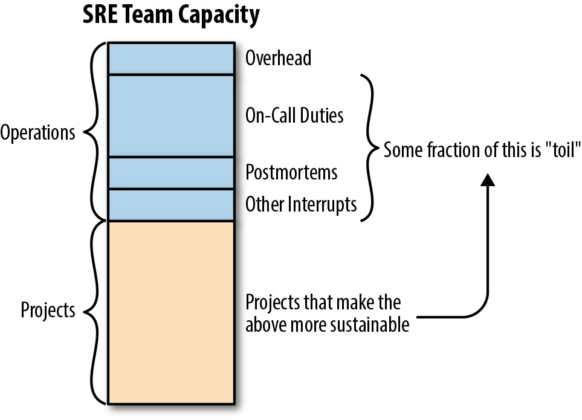

# **PART II 实践**

在第一部分所涵盖的SRE原则的坚实基础上，第二部分深入探讨了如何开展Google认为对于大规模运维至关重要的SRE相关活动。

其中一些主题(例如数据处理管道和管理负载)并不适用于所有组织。其他主题，例如通过配置和金丝雀发布安全地处理变更，On-Call的实践以及出现问题时的处理方式，对于任何SRE团队都包含了宝贵的经验教训。

本部分还介绍了一项重要的SRE技能-非抽象大型系统设计(NALSD)，并提供了有关如何实践此设计过程的详细示例。

当我们从SRE基础转向实践时，我们想提供更多有关运维职责与项目工作之间的关系的背景信息，以及从战略上完成这两项工作所需的工程技术。

> **定义运维工作(相对于项目工作和开销)** 

> 在我们从基础转到实践之前，我们想介绍一下运维和项目工作之间的区别，以及这两种类型的工作如何相互影响。该主题是SRE社区中哲学辩论的一个领域，因此本插曲介绍了我们如何在本书的上下文中定义两种类型的工作。                                                                                                                                                                                                                     
> 
> SRE实践将软件工程解决方案应用于运维问题。由于我们的SRE团队负责我们支持的系统的日常运行，因此我们的工程工作通常专注于可能在其他地方进行操作的任务:我们使发布流程自动化，而不是手动执行；我们实施分片，以使我们的服务更加可靠，并减少了对人类注意力的要求；我们利用算法方法进行容量规划，因此工程师不必执行容易出错的手动计算。
> 尽管工程和运维工作确实可以相互告知，但我们可以将任何给定的SRE团队执行的工作概念化为两个单独的类别，如图II-1所示。多年来，我们一直在努力使每个工作桶的效率和可扩展性最大化。

> 

> *图II-1。SRE工作的两个类别* 
> 
> 我们可以将运维工作分为四大类:                                                                                                                                                                                                                                                                                                                                                                                                                                                                                               
> 
> - 值班工作

> - 客户请求(最常见的是故障单)

> - 事件响应

> - 事后总结

> 在我们的第一本书中([第11章](http://bit.ly/2JgUBU7); [第14章](http://bit.ly/2J7G0qt); [第15章](http://bit.ly/2J2Po2W))和这本书(第6章；第8章；第9章；第10章), 每个类别都具有自己的详细处理方法。在这里，我们展示了这四个方面是如何相互联系的，以及将这些类型的工作视为紧密相关的重要性。

> 运维工作中不包括哪些类型的工作？如图II-1所示，项目工作是SRE工作的另一个主要任务。如果团队的中断工作得到良好的管理，他们就有时间进行长期的工程工作，以实现稳定性，可靠性和可用性目标。这可能包括旨在提高服务可靠性的软件工程项目，也可能包括诸如将新功能安全地推出到全球复制的服务之类的系统工程项目。
>
> 如图II-1所示，"日常开销"是在公司必需的行政管理工作:会议，培训，回复电子邮件，跟踪您的绩效，填写文书工作等等。日常开销对于手头的讨论并不立即重要，但是所有团队成员都花时间在上面。
>
> 您可能会注意到，我们没有专门将文档工作作为单独的活动。这是因为我们认为，健康的文档记录程序已融入您的所有工作中。您无需考虑将代码，剧本和服务功能文档化-甚至无需确保故障单和bug包含其应有的所有信息-与项目或操作任务无关。这只是这些任务的另一个方面。
>
> 在Google，我们指定SRE应该将至少50％的时间用于项目工作；少做任何事情都会导致不可持续的工程化和过度消耗，疲惫不堪的团队。尽管每个团队和组织都需要找到自己的健康平衡，但我们发现，大约三分之一的时间花在了运维任务上，而三分之二的时间花在了项目工作上是正确的(这个比例也说明了轮流值班的规模，您的工程师只有三分之一的时间在On-Call中。
>
> 我们鼓励团队进行定期审查，以跟踪您是否在工作类型之间取得适当的平衡。在Google，我们会定期进行卓越生产(ProdEx)审核，这些审核使SRE的高级领导者可以使用明确定义的规则来查看每个SRE团队的状态。您需要根据自己的限制和组织成熟度来确定适当的时间间隔和标题，但是这里的关键是生成可以随时间跟踪的有关团队健康的指标。
>
> 当找到理想的平衡点时，请记住一个警告:一个团队在运维任务上花费的时间太少，可能会导致运维不足。在这种情况下，工程师可能会开始忘记他们所负责的服务的关键方面。您可以承担更多的风险和更快的行动来应对运维不足，例如，缩短发布周期，为每个发布推送更多功能或执行更多灾难恢复测试。如果您的团队永远负载不足，请考虑加入相关服务或将不再需要SRE支持的服务交还给开发团队(有关团队规模的更多讨论，请参见第8章)。

> **运维工作与项目工作之间的关系** 
>
> 尽管它们是不同的工作类别，但运维和项目工作并非完全分开。实际上，前者中提出的问题应纳入后者:SRE项目工作应该是使系统更加高效，可扩展和可靠，这意味着减少运维负荷和琐事工作量。如图II-1所示，在运维负荷源头与项目工作之间应该存在一个连续的反馈回路，以系统地提高产量。这项较长期的工作可能涉及迁移到更强大的存储系统，重新设计框架以减少脆弱性或维护负担，或解决系统中断和事件的源头。这些举措是通过*项目*开发和实施的，这些项目被定义为实现特定目标或可交付成果的临时性工作(具有明确的起点和终点)。

 
 

# **第8章**

### **值班**

 

***由Ollie Cook，Sara Smollett，Andrea Spadaccini，***

***Cara Donnelly，Jian Ma和Garrett Plasky(Evernote)与Stephen Thorne和Jessie Yang撰写***

 
 

值班意味着可以在规定的时间内有空，并准备在紧急时间内响应生产事件。经常需要*站点可靠性工程师*(SRE)参与轮班。在值班期间，SRE可根据需要诊断，缓解，修复或升级事件。此外，SRE定期负责非紧急生产职责。

在Google，值班是SRE的定义特征之一。SRE团队可以减轻事故，修复生产问题并自动化操作任务。由于我们的大多数SRE团队尚未将其所有操作任务完全自动化，因此故障升级需要人员的直接联系，即值班工程师。根据所支持系统的关键程度或系统所处的开发状态，可能并非所有SRE团队都需要值班。根据我们的经验，大多数SRE团队都会安排值班时间。

值班是一个庞大而复杂的主题，受许多限制和反复试验的限制。[我们的第一本书(* Site Reliability Engineering *)，"On-Call轮值"的[第11章](http://bit.ly/2JgUBU7)已经探讨了这个主题。本章介绍了有关该章的具体反馈和问题。其中包括:

- "我们不是Google；我们要小得多。我们轮换的人不多，而且我们在不同时区的没有站点。你在第一本书中描述的与我无关。"

- "我们将开发人员和DevOps混合在一起，可以随时轮值。最好的组织方式是什么？分担责任？"

- "我们的值班工程师通常在24小时轮班中被寻呼一百次。很多页面都被忽略了，所以真正的问题却被埋没了。我们应该从哪里开始？"

- "我们的电话轮换率很高。您如何解决团队内部的知识鸿沟？"

- "我们希望将DevOps团队重组为SRE。[^60] SRE值班，DevOps值班和开发人员值班之间有什么区别？请具体说明，因为DevOps团队对此非常关注。"

我们针对这些情况提供实用建议。Google是一家拥有成熟的SRE组织的大公司，但是我们多年来所学到的许多知识都可以应用于任何公司或组织，无论其规模或成熟度如何。Google跨各种规模的服务提供了数百个on-call轮值，以及从简单到复杂的各种值班设置。值班不仅是SRE功能:许多开发人员团队都直接为他们的服务进行值班。每个值班设置都可以满足特定服务的需求。

本章介绍了Google内部和Google外部的值班设置。尽管您的设置和情况可能与我们的特定示例有所不同，但是我们涵盖的基本概念是广泛适用的。

然后，我们深入研究呼叫负载的结构，解释导致呼叫负载的原因。我们建议优化值班设置并最大程度地减少负载的策略。

最后，我们分享了Google内部实践的两个示例:值班灵活性和值班团队动态。这些实践表明，无论从数学上讲值班设置的听起来如何，您都不能仅依靠值班设置作为后勤保障。激励和人性起着重要作用，也应予以考虑。

## **第一本SRE图书"On-Call轮值"章节的回顾**

[*Site Reliability Engineering*]中的["Be-on-Call"](http://bit.ly/2JgUBU7)中，解释了Google进行值班轮换的原理。本节讨论该章的要点。

在Google，值班的总体目标是提供关键服务的覆盖范围，同时确保我们永远不会以牺牲值班工程师的健康为代价来实现可靠性。结果就是，SRE团队努力实现"平衡"。SRE工作应该是职责的健康组合:值班和项目工作。指定SRE在项目工作上花费至少50％的时间，意味着团队有时间解决战略上解决生产中发现的任何问题所需的项目。团队人员必须足够确保项目时间。

我们的目标是每个值班班次最多发生两次事故，[^61]以确保有足够的时间进行跟进。如果值班负载过高，则必须采取纠正措施。(我们将在本章后面探讨值班的负载。)

*心理安全* [^62]对于有效的通话轮换至关重要。由于随时待命可能会令人生畏且压力很大，因此应通过一系列程序和逐步升级途径为值班工程师提供全面支持，以使他们的生活更轻松。

值班通常意味着一定数量的非工作时间。我们认为这项工作应得到补偿。虽然不同的公司可能选择以不同的方式处理此问题，但Google提供了休假或现金补偿，但不超过总工资的一定比例。补偿方案提供了参与值班的动机，并确保工程师出于经济原因不会进行过多的值班班次。

## **在Google内部和外部进行值班设置的示例**

### **谷歌**

本部分描述了Google和Evernote(加利福尼亚州一家公司，开发跨平台应用程序，可帮助个人和团队创建，组合和共享信息)中值班设置的真实示例。对于每家公司，我们都会探讨值班设置，通用值班哲学和值班惯例背后的原因。

#### **谷歌:组建新团队**

**初始方案**

几年前，Google Mountain View的SRE萨拉(Sara)成立了一个新的SRE团队，该团队需要在三个月内开始值班。从这个角度来看，Google的大多数SRE团队都不希望新员工在三到九个月之前就可以随时待命。新的Google Mountain View SRE团队将支持三项Google Apps服务，以前由华盛顿州柯克兰的SRE团队提供支持(距离Google Mountain View只有两个小时的飞行时间)。Kirkland团队在伦敦拥有一个姐妹SRE团队，该团队将继续与新的Mountain View SRE团队以及分布式产品开发团队一起为这些服务提供支持。[^63]

新的Mountain View SRE团队迅速聚集在一起，聚集了七个人:

- SRE技术负责人Sara

- Mike，来自另一个SRE团队的经验丰富的SRE

- 来自SRE的新产品开发团队的转移

- 四名新员工("Nooglers")

即使团队已经成熟，为新服务值班总是很困难的，新的Mountain View SRE团队是一个相对较小的团队。尽管如此，新团队仍能够在不牺牲服务质量或项目速度的情况下启动服务。他们立即对服务进行了改进，包括将机器成本降低了40％，并通过金丝雀和其他安全检查使发布发布完全自动化。新团队还继续提供可靠的服务，目标是99.98％的可用性，或者每个季度大约26分钟的停机时间。

新的SRE团队如何引导自己完成这么多任务？通过入门项目，指导和培训。

**培训路线图**

尽管新的SRE团队对他们的服务并不了解，但是Sara和Mike熟悉Google的生产环境和SRE。当四个Nooglers完成公司定位后，Sara和Mike编制了一份清单，列出了两打重点领域，供人们在值班前进行练习，例如:

- 管理生产工作

- 了解调试信息

- 从集群中"引流"流量

- 回滚不良的软件推送

- 阻止或限制不必要的流量

- 提高服务能力

- 使用监控系统(用于警报和仪表板)

- 描述服务的体系结构，各种组件和依赖性

Nooglers通过研究现有的文档和*codelabs*(指导，动手编码教程)，自己找到了一些信息，并通过从事其入门项目来获得对相关主题的理解。当团队成员了解了与Nooglers入门项目有关的特定主题时，该人主持了一个简短的即席会议，与团队的其他成员分享该信息。萨拉和迈克介绍了其余主题。该团队还举行了实验会议，以执行常见的调试和缓解任务，以帮助每个人建立肌肉记忆并增强对其能力的信心。

除了清单之外，新的SRE团队还进行了一系列"深潜"以深入研究其服务。该团队浏览了监控控制台，确定了正在运行的作业，并尝试调试最近的页面。萨拉(Sara)和迈克(Mike)解释说，工程师*并不需要*多年的专业知识来使每项服务都变得相当熟练。他们指导团队从最初的原则探索服务，并鼓励Nooglers熟悉服务。他们对知识的局限持开放态度，并教别人何时寻求帮助。

在整个升级过程中，新的SRE团队并不孤单。Sara和Mike前往与其他SRE团队和产品开发人员会面，并向他们学习。新的SRE团队通过举行视频会议，交换电子邮件和通过IRC聊天与Kirkland和London团队会面。此外，该团队参加了每周的生产会议，阅读每日的值班交接和事故报告，并浏览了现有的服务文档。对Kirkland SRE进行了访问，以进行演讲和回答问题。伦敦SRE整理了一套完整的灾难场景，并在Google的灾难恢复培训周期间进行了测试(请参阅*Site Reliability Engineering*中的第33章["Preparedness and Disaster Testing"](http://bit.ly/2JiPfaV))。

团队还通过"轮盘赌"培训练习进行了值班训练(请参阅《站点可靠性工程》第28章中的["灾难角色扮演"](http://bit.ly/2Hb8ONg)部分，其中他们扮演了最近发生的事件的角色，以练习调试生产问题。在这些会议期间，鼓励所有SRE提供有关如何解决模拟生产故障的建议。每个人都准备好之后，团队仍然举行这些会议，轮流在每个团队成员中担任会议负责人。团队记录了这些内容，以备将来参考。

在进行呼叫之前，该团队检查了有关值班工程师职责的精确指南。例如:

- 在每个班次开始时，值班工程师都会读取上一个班次的切换。

- 值班工程师首先将对用户的影响降到最低，然后确保问题得到完全解决。

- 在轮班结束时，值班工程师将越区切换电子邮件发送给下一个工程师值班。

该准则还规定了何时升级给他人，以及如何为大事件写事故报告。

最后，团队阅读并更新了值班中的*剧本*。剧本包含有关如何响应自动警报的高级说明。它们解释了警报的严重性和影响，并包括调试建议以及为减轻影响并完全解决警报而可能采取的措施。在SRE中，每当创建警报时，通常都会创建一个相应的剧本条目。这些指南可减少压力，平均修复时间(MTTR)和人为错误的风险。

> **维护剧本**
>
> 剧本中的详细信息以与生产环境变化相同的速度过时。对于日常发行，剧本可能需要在任何一天进行更新。像任何形式的交流一样，编写良好的文档非常困难。那么，您如何维护剧本？
>
> Google的一些SRE主张保持剧本条目的一般性，以使它们变化缓慢。例如，对于所有"RPC Errors High"警报，它们可能只有一个条目，供受过训练的值班工程师阅读，并结合当前警报服务的体系结构图。其他SRE提倡逐步编写手册，以减少人为变异并降低MTTR。如果您的团队对剧本内容有不同的看法，则剧本可能会在许多方面被拉扯。
>
> 这是一个有争议的话题。如果您没有其他意见，请至少与您的团队一起决定您的剧本必须包含哪些最小的结构化细节，并尝试注意何时您的剧本积累了许多超出这些结构化细节的信息。参与一个项目，将来之不易的新生产知识转化为自动化或监控控制台。如果您的剧本是每次特定警报触发时应召唤工程师运行的确定性命令列表，建议您实施自动化。

两个月后，Sara，Mike和SRE调动掩盖了即将离任的Kirkland SRE团队的值班班次。在三个月的时间里，它们成为了主要的值班服务，而Kirkland SRE作为备份。这样，如果需要，他们可以轻松升级到Kirkland SRE。接下来，Nooglers屏蔽了经验更丰富的本地SRE，并加入了轮换。

良好的文档资料和前面讨论的各种策略都帮助团队奠定了坚实的基础并迅速成长。尽管随叫随到可能会带来压力，但车队的信心已增长到足以采取行动，而不必再事后批评自己了。知道他们的反应是基于团队的集体知识，并且即使他们逐步升级，仍可以将值班工程师视为合格的工程师，这在心理上是安全的。

**后记**

在Mountain View SRE不断增加的同时，他们了解到他们经验丰富的姐妹SRE在伦敦的团队将继续进行新项目，并且正在苏黎世组建新的团队以支持以前由SRE伦敦团队提供的服务。对于第二次转换，Mountain View SRE使用的相同基本方法被证明是成功的。Mountain View SRE先前的投资是用于开发入门和培训材料，这有助于苏黎世SRE新团队的建立。

虽然当一群SRE组成团队时，Mountain View SRE所使用的方法很有意义，但是当在指定时间只有一个人加入团队时，他们需要一种更轻量级的方法。为了预期将来的营业额，SRE创建了服务架构图，并将基本培训清单正式化为一系列练习，这些练习可以半独立地完成，而导师的参与则很少。这些练习包括描述存储层，执行容量增加以及检查如何路由HTTP请求。

#### **Evernote: 在云端找到我们的双脚**

**将我们的本地基础架构迁移到云中**

我们没有打算重新设计我们的通话流程，但是就像生活中的许多事情一样，必要性是发明之母。在2016年12月之前，Evernote仅在为支持我们的整体应用程序而构建的本地数据中心上运行。我们的网络和服务器在设计时考虑了特定的体系结构和数据流。再加上许多其他限制，意味着我们缺乏支持水平架构所需的灵活性。Google Cloud Platform(GCP)为我们的问题提供了具体的解决方案。但是，我们仍然要克服一个主要障碍:将我们所有的生产和支持基础架构迁移到GCP。快进70天。通过艰苦的努力和许多非凡的壮举(例如，移动了数千台服务器和3.5 PB的数据)，我们很高兴地安家落户。但是，在这一点上，我们的工作还没有完成:我们将如何监控，警报并(最重要的是)如何应对新环境中的问题？

**调整我们的值班政策和流程**

向云的迁移释放了我们的基础设施快速增长的潜力，但是我们尚未建立值班的政策和流程来应对这种增长。迁移结束后，我们便着手解决问题。在我们以前的物理数据中心中，我们几乎在每个组件中都内置了冗余。这意味着，尽管考虑到我们的规模，组件故障很常见，但通常没有单个组件能够对用户产生负面影响。因为我们控制了基础架构，所以基础架构非常稳定-任何小小的碰撞都不可避免地是由于系统某处的故障引起的。我们在构造警报策略时考虑到了这一点:丢弃了一些数据包，导致JDBC(Java数据库连接)连接异常，始终意味着VM(虚拟机)主机处于故障边缘，或者开关控制平面处于故障状态。甚至在我们进入云的第一天之前，我们就意识到这种类型的警报/响应系统今后将难以为继。在实时迁移和网络延迟的世界中，我们需要采取更加全面的方法进行监控。

根据第一原则来重新定义寻呼事件，并将这些原则写下为我们的显式SLO(服务级别目标)，有助于使团队明确警告的重要内容并允许我们减少监控基础结构中的负担。我们专注于API响应度等较高级别的指标，而不是MySQL中InnoDB行锁等待之类的较低级基础结构，这意味着我们可以将更多的时间集中在用户在中断期间所遭受的实际痛苦。对于我们的团队来说，这意味着更少的时间花费在寻找瞬态问题上。

这转化为更多的睡眠，有效性以及最终的工作满意度。

**重组我们的监控和指标**

我们的主要值班轮换人员由一小组但零散的工程师组成，他们负责我们的生产基础架构和少数其他业务系统(例如，暂存和构建管道基础架构)。我们有一个每周24/7的时间表，其中安排了良好的交接程序，并且每天早上都会对事故进行每日回顾。我们的团队规模较小，责任范围相对较大，因此我们必须尽一切努力保持流程负担轻，并着重于尽快关闭警报/分类/补救/分析循环。我们实现这一目标的方法之一是通过维护简单但有效的警报SLA(服务水平协议)来保持低信噪比。我们将由指标或监控基础结构生成的任何事件分为三类:

*P1:立即处理*

- 应立即采取行动

- 呼叫值班人员

- 指挥事件分类

- 影响SLO

*P2:在下一个工作日处理*

- 通常不面向客户，或范围非常有限

- 向团队发送电子邮件并通知事件流频道

*P3:活动仅供参考*

- 信息收集在仪表板，被动电子邮件等中

- 包括容量规划相关信息

任何P1或P2事件都附加有事件凭单。该故障单用于明显的任务，例如事件分类和跟踪补救措施，以及SLO的影响，出现的次数和事后报告文档链接(如果适用)。

当事件(类别P1)出现时，值班人员的任务是评估对用户的影响。将事件分为1至3级。对于严重性为1(严重性为1)的事件，我们维护了一组有限的标准，以使对响应者的升级决策尽可能简单。一旦事件升级，我们将组建一个事件团队并开始我们的事件管理流程。寻找这个事故经理，选择一名记录员和一名沟通负责人，并打开我们的沟通渠道。解决此事件后，我们会进行自动事故报告并在公司内部和全世界共享结果。对于等级为2或3的事件，值班响应者将处理事件生命周期，包括简短的事后回顾以进行事件审查。

保持流程轻量化的好处之一是，我们可以明确地将值班从项目工作的任何期望中解放出来。这将授权并鼓励待命人员立即采取后续行动，并在完成事后审查后确定工具或过程中的主要缺陷。通过这种方式，我们在每次通话时都实现了一个持续不断的改进和灵活性循环，与环境的快速变化保持同步。目标是使每次值班时的班次都比上次班好。

**随着时间的推移跟踪我们的表现**

随着SLO的引入，我们希望跟踪一段时间内的绩效，并与公司内的利益相关者共享该信息。我们实施了每月一次的服务审查会议，向有兴趣的任何人开放，以审查和讨论服务的前一个月。我们还使用此论坛来审查我们的通话负担，以此作为团队健康的晴雨表，并讨论超出值班预算时的补救措施。该论坛的双重目的是在公司内部传播SLO的重要性，并使技术组织对维护我们的服务和团队的健康负责。

**与CRE合作**

用SLO表示我们的目标，为与Google客户可靠性工程(CRE)团队互动打下了基础。在我们与CRE讨论了SLO以了解它们是否现实和可衡量之后，两个团队都决定将CRE与我们自己的工程师一起分入进行影响SLO的活动。查明隐藏在云抽象层背后的根本原因可能很困难，因此让我们的Googler帮您摆脱黑匣子事件分类的猜测是很有帮助的。更重要的是，此练习进一步降低了我们的MTTR，这最终是我们用户所关心的。

**保持自我延续的周期**

现在，我们没有更多的时间花在分类/根本原因分析/事后分析周期中，而是有更多的团队时间来思考如何推动业务发展。具体而言，这转化为诸如改善我们的微服务平台和为我们的产品开发团队建立生产准备标准的项目。后者包含了我们在调整值班结构时遵循的许多原则，这对于第一个"搭载传呼机"牛仔竞技表演的团队特别有用。因此，我们使每个人都可以改善值班时间。

## **实际实施细节**

到目前为止，我们已经讨论了Google内部和Google外部有关值班设置的详细信息。但是关于值班的具体考虑呢？以下各节将更深入地讨论这些实现细节:

- 值班负载-它是什么，它如何工作以及如何对其进行管理

- 如何在值班安排中考虑灵活性，以为SRE建立更健康的工作/生活平衡

- 在给定的SRE团队内部以及与合作伙伴团队一起改善团队动力的策略

**值班负载的剖析**

您的传呼机很吵，这使您的团队不高兴。您已经阅读了*Site Reliability Engineering*中的[第31章](http://bit.ly/2sqRwad)，并与您的团队和所支持的开发人员团队举行了定期的生产会议。现在，每个人都*知道*您的值班工程师不满意。接下来是什么？

*呼叫负载*是值班工程师在典型的轮班时间内(例如每天或每周)收到的寻呼事件数。一个事件可能涉及多个页面。在这里，我们将逐步了解各种因素对值班负载的影响，并提出最小化未来值班负载的技术。

> **适当的响应时间**
>
> 除非有充分的理由，否则工程师不必在接到呼叫后的几分钟内就使用计算机处理问题。虽然完全停止面向客户的创收服务通常需要立即做出响应，但是您可以在几个小时内处理不太严重的问题(例如，备份失败)。
>
> 我们建议您检查当前的呼叫设置，以查看是否*实际*应该*页面当前触发呼叫的所有内容。您可能正在寻找可以通过自动修复更好地解决的问题(因为通常，计算机解决问题要比要求人工解决问题更好)或故障单(如果实际上不是高优先级)。表8-1显示了一些示例事件和适当的响应。

*表8-1.实际响应时间示例*

|  **事件描述** | **响应时间** | **SRE影响** |
|  --- | --- | --- |
| 影响收入的网络中断| 5分钟|SRE必须始终保持在经过充电且经过身份验证且可以访问网络的笔记本电脑的范围内；不能旅行；在任何时候都必须与副手密切协调|
| 客户订单批处理系统卡住| 30分钟| SRE可以离开家进行快速差事或短途通勤；副手无需在此期间提供掩护|
| 用于启动前服务的数据库备份失败|工单(工作时间内的回复)|无|

**场景: 团队超负荷**

(假设的)Connection SRE团队负责前端负载平衡和终止最终用户连接，发现自己处于高值班负载的位置。他们已经确立了每班两次呼叫事件的值班预算，但是在过去的一年中，他们经常每班接收五次呼叫事件。分析显示，三分之一的班次超出了其值班的预算。团队成员英勇地回应了每天的页面攻击，但无法跟上。一天中根本没有足够的时间来找到根本原因并正确解决即将出现的问题。一些工程师离开了团队，加入了较少运维负担的团队。高质量的事件跟踪很罕见，因为应召唤的工程师只有时间来缓解眼前的问题。

团队的视野并不完全黯淡:他们拥有遵循SRE最佳实践的成熟监控基础架构。警报阈值设置为与其SLO相符，并且寻呼警报本质上是基于症状的，这意味着它们仅在客户受到影响时才触发。当与高级管理层取得所有这些信息时，他们同意团队处于运营超负荷状态，并审查了项目计划以使团队恢复健康状态。

不太乐观的是，随着时间的流逝，Connection团队已经从10多个开发人员团队获得了软件组件的运维所有权，并且对Google面向客户的边缘网络和骨干网络非常依赖。大量的团体间关系是复杂的，并且已经变得难以管理。尽管团队遵循了构建监控的最佳实践，但是他们所面临的许多呼叫都不在他们的直接控制之下。例如，黑匣子探针可能由于网络拥塞而失败，从而导致数据包丢失。团队可以采取的缓解骨干网拥塞的唯一措施是升级到直接负责该网络的团队。

除了运维负担之外，团队还需要向前端系统交付新功能，所有Google服务都将使用这些新功能。更糟的是，他们的基础架构已从拥有10年历史的旧框架和群集管理系统迁移到支持更好的替代品。团队的服务发生了前所未有的变化，变化本身造成了很大的值班负担。

团队显然需要使用多种技术来应对这种过多的值班负载。团队的技术项目经理和人员经理与高级管理人员提出了项目建议，高级管理人员对此项目进行了审查和批准。团队全神贯注于减少值班负荷，并在此过程中吸取了一些宝贵的经验教训。

**呼叫负载输入**

解决高值班负载的第一步是确定是什么原因造成的。值班负载受三个主要因素影响:生产，警报和人工流程中的错误[^64]。这些因素中的每一个都有几个输入，我们将在本节中更详细地讨论其中的一些输入。生产:

- 生产中现有错误的数量

- 将新的错误引入生产

- 识别新引入的错误的速度

- 漏洞消除和从生产中删除的速度

警报:

- 触发寻呼警报的警报阈值

- 引入了新的呼叫警报

- 服务的SLO与它所依赖的服务的SLO的对齐

对于人工流程:

- 严格的修复和错误的跟进

- 收集有关呼叫警报的数据的质量

- 注意传呼机负载趋势

- 人为改变生产

**先前存在的错误。**没有系统是完美的。生产中总会有bug:在您自己的代码，构建的软件和库或它们之间的接口中。这些错误可能暂时不会引起呼叫警报，但是肯定存在。您可以使用一些技术来识别或阻止尚未引起页面警报的错误:

- 确保系统尽可能复杂，不要再复杂了(请参阅第7章)。

- 定期更新构建系统所基于的软件或库，以利用错误修复(但是，请参阅下一节有关新错误的信息)。

- 进行定期的破坏性测试或模糊测试(例如，使用Netflix的[Chaos Monkey](https://github.com/Netflix/chaosmonkey))。

- 除了集成和单元测试外，还执行常规的负载测试。

**新错误.**理想情况下，SRE团队及其合作伙伴开发团队应该在甚至将其投入生产之前就检测出新的错误。实际上，自动化测试会遗漏许多错误，然后将其发布到生产环境中。

软件测试是一个在其他地方(例如[Martin Fowler on Testing](https://martinfowler.com/tags/testing.html)上广泛涉及的主题。但是，软件测试技术对于减少到达生产环境的错误数量以及在生产中保留的时间特别有用:

- 随着时间的推移改进测试。特别是，对于在生产中发现的每个错误，请询问"我们如何检测到该错误的预生产？"确保进行必要的工程跟进(请参阅第164页的"跟进工作")。

- 不要忽略负载测试，负载测试通常比功能测试的优先级低。许多错误仅在特定的负载条件下或在特定的请求混合下才会显现。

- 在类似生产的环境中运行场景(使用类似生产的但综合的流量进行测试)。在本书的第5章中，我们简要讨论了生成综合流量。

- 在生产环境中执行金丝雀(第16章)。

- 对新错误的容忍度较低。遵循"检测，回滚，修复和前滚"策略，而不要遵循"检测，识别出错误，修复并再次前滚但继续向前滚"策略。(有关更多详细信息，请参见第162页的"缓解延迟"。)

这种回滚策略需要可预测且频繁的发行，因此回滚任何一个发行的成本很小。我们在*站点可靠性工程*中讨论了此主题和相关主题。[《站点可靠性工程》](http://bit.ly/2xyT9aK)

某些错误可能仅是由于更改客户端行为引起的。例如:

- 仅在特定负载水平下才会显示的错误-例如，9月返校流量，黑色星期五，网络星期一或夏令时表示欧洲和北美距离一小时的一年中的那一周，意味着您的更多用户同时处于清醒状态和在线状态。

- 仅在特定的请求混合中出现的错误-例如，由于亚洲字符集的语言编码，距离亚洲较近的服务器的通信量比较昂贵。

- 仅当用户以意外方式使用系统时才会出现的错误-例如，航空公司预订系统正在使用日历！因此，重要的是扩展您的测试方案以测试每天都不会发生的行为。

当生产系统遇到多个并发错误时，要确定给定页面是用于"现有"还是"新"错误会更加困难。最大限度地减少生产中的错误数量不仅减少了值班的负担，而且还使识别和分类新的错误变得更加容易。因此，至关重要的是尽快从系统中删除生产错误。在提供新功能之前优先解决现有的错误；如果这需要跨团队合作，请参阅第18章。

诸如自动化运行状况检查，自我修复和减载之类的架构或程序问题可能需要大量的工程工作才能解决。请记住，为简单起见，即使这些问题的大小，复杂性或解决这些问题所需的工作非常重要，我们也将它们视为"错误"。

[Site Reliability Engineering]的[第3章](http://bit.ly/2so6uOc)描述了错误预算如何有效地管理将新错误发布到生产中的速率。例如，当一项服务的SLO违规超出其季度总错误预算的某个比例时(通常是开发人员和SRE团队之间事先达成的协议)，可以暂时停止新功能的开发和与功能相关的部署，以专注于稳定化系统并减少页面的频率。

我们示例中的Connection团队采用了严格的策略，要求每次中断都必须具有跟踪错误。这使团队的技术项目经理可以检查其新错误的根本原因。这些数据表明，人为错误是生产中新错误的第二大最常见原因。

因为人是容易出错的，所以最好对生产系统进行的所有更改都是由(人为开发的)意图配置提供的自动化来完成的。在更改生产之前，自动化可以执行人类无法执行的其他测试。Connection团队正在半手动进行生产的复杂更改。毫不奇怪，团队的手动更改有时会出错。团队引入了新错误，这些错误导致了页面的出现。进行相同更改的自动化系统将确定，更改在进入生产并成为呼叫事件之前是不安全的。技术项目经理将这些数据带给团队，并说服他们确定自动化项目的优先级。

**识别延迟。**及时识别警报的原因很重要，因为识别页面的根本原因花费的时间越长，重复出现和再次被呼叫的机会就越大。例如，给定一个仅在高负载下显示的页面，例如在每天的峰值下，如果在下一个每天的峰值之前未识别出有问题的代码或配置，则该问题很可能会再次发生。您可以使用多种技术来减少识别延迟:

*使用良好的警报和控制台*

> 确保页面链接到相关的监控控制台，并且该控制台会突出显示系统超出规范运行的位置。在控制台中，将黑盒和白盒呼叫警报关联在一起，并对其关联的图形执行相同的操作。确保剧本是最新的，并且具有响应每种警报的建议。当相应页面触发时，值班工程师应使用最新信息更新剧本。

*实践应急响应*

> 运行["轮盘赌"练习](http://bit.ly/2JnX5Qp)(在*Site Reliability Engineering*中进行了描述)，与您的同事共享常规的和特定于服务的调试技术。

*执行小发布*

> 如果您执行频繁，较小的发布，而不是进行罕见的整体更改，则将错误与引入错误的相应更改关联起来会更容易。第16章中描述的金丝雀版本强烈地表明了新错误是否是由于新版本引起的。

*日志更改*

> 将变更信息汇总到可搜索的时间轴中，可以更轻松(并且希望更快)将新错误与引入它们的相应变更相关联。诸如[Jenkins的Slack插件](http://bit.ly/2sAgzqJ)之类的工具可能会有所帮助。

*请求帮忙*

> 在*Site Reliability Engineering* *(站点可靠性工程)* ["Managing Incidents"](http://bit.ly/2J7G0qt)中，我们讨论了共同管理大型停机的问题。值班工程师永远不会孤单；鼓励您的团队在寻求帮助时感到安全。

**缓解延迟** 一旦发现漏洞，缓解漏洞所需的时间越长，再次出现和再次呼叫的机会就越大。考虑以下减少缓解延迟的技术:*回滚更改*

-如果错误是在最近的代码或配置首次发布中引入的，请在安全且适当的情况下立即通过回滚从生产中删除该错误(例如，仅进行回滚可能是必要的，但如果该错误导致数据损坏，则不足够)。请记住，即使是"快速修复"也需要时间进行测试，构建和推出。测试对于确保快速修复程序能够真正修复该错误，并且不会引入其他错误或其他意外后果至关重要。通常，最好是"后退，修复和前滚"而不是"前滚，修复和前滚"。

- 如果您希望99.99％的可用性，则每个季度大约有15分钟的错误预算。前滚的构建步骤可能需要15分钟以上的时间，因此回滚对用户的影响要小得多。

> (99.999％的可用性提供了每季度80秒的错误预算。此时，系统可能需要自我修复属性，这超出了本章的范围。)

- 尽可能避免使用无法回滚的更改，例如与API不兼容的更改和锁步发布。

*使用功能隔离*

- 设计系统，以便如果功能X出了问题，您可以通过例如功能标记将其禁用，而不会影响功能Y。此策略还可以提高发布速度，并使禁用功能X变得更加简单，您可以-无需检查您的产品经理是否也可以禁用功能Y。

*排空请求*

- 将请求(即重定向客户请求)从显示错误的系统元素中删除。例如，如果该错误是代码或配置推出的结果，并且您逐步将其投入生产，则您可能有机会删除已经收到更新的基础结构元素。这使您可以在几秒钟内减轻对客户的影响，而无需回滚，因为回滚可能需要几分钟或更长时间。

**警报** Google SRE每12小时轮班最多发生两次不同的事件，这鼓励我们对如何配置呼叫警报以及如何引入新警报保持谨慎和谨慎的态度。*Site Reliability Engineering*，["监控分布式系统"](http://bit.ly/2KNCD9F)描述了Google定义呼叫警报阈值的方法。严格遵守这些准则对于保持健康的轮班至关重要。值得强调本章讨论的一些关键元素:

- 所有警报应立即可操作。我们希望人们在收到系统无法自行处理的页面后立即采取措施。信噪比应该很高，以确保几乎没有误报。低信噪比会增加值班工程师产生警报疲劳的风险。

- 如果团队完全订阅基于SLO的警报，或仅在消耗错误预算后才进行呼叫(请参阅*站点可靠性工程中的["黑盒子与白盒子"](http://bit.ly/2J4YrjR)*)，至关重要的是，所有参与开发和运维服务的团队都必须同意满足SLO的重要性，并据此确定其工作的优先级。

- 如果团队完全订阅基于SLO和基于症状的警报，则放松警报阈值未必是对呼叫的适当响应。

- 就像新的代码一样，新的警报也应该得到彻底和认真的审查。每个警报应具有一个对应的剧本条目。

接收呼叫会产生负面的心理影响。为了最大程度地减少这种影响，请仅在确实需要时才引入新的呼叫警报。团队中的任何人都可以编写新的警报，但是整个团队都会审查建议的警报添加内容并可以提出其他建议。全面测试生产中的新警报，以检查误报，然后再将其升级为呼叫警报。例如，您可以在警报触发时通过电子邮件向警报的作者发送电子邮件，而不是呼叫工程师。

新警报可能会发现您不知道的生产问题。解决了这些生产错误之后，警报将仅在*新*错误上呼叫，其功能类似于回归测试。

确保在测试模式下运行新警报的时间足够长，以经历典型的定期生产条件，例如常规软件推出，云提供商的维护事件，每周负载高峰等。一周的测试大概是正确的。但是，此适当的窗口取决于警报和系统。

最后，在测试期间使用警报的触发率来预测由于新警报而导致的值班预算的预期消耗。明确批准或禁止以团队为单位的新警报。如果引入新的寻呼警报导致您的服务超出其寻呼预算，则需要特别注意系统的稳定性。

**后续措施。** 旨在确定每个页面的根本原因。"根本原因"从机器延伸到团队的流程。中断是由单元测试所捕获的错误引起的吗？根本原因可能不是代码中的错误，而是团队中围绕代码审查的过程中的错误。

如果您知道根本原因，则可以修复并防止它再次困扰您或您的同事。如果您的团队无法找出根本原因，请添加监控和/或日志记录，这将帮助您在下次出现该页面时找到该根本原因。如果您没有足够的信息来确定该错误，则可以随时做一些事情来帮助下次进一步调试该呼叫。您应该不常断定呼叫是由"原因未知"触发的。请记住，作为一名随时待命的工程师，您并不孤单，因此请同事检查您的发现，看看是否有任何遗漏。通常，最容易在触发警报并获得新证据后立即找到警报的根本原因。

将页面解释为"瞬态"，或者因为系统"自行修复"或错误莫名其妙地"消失"而没有采取任何措施，导致错误再次发生并导致另一个呼叫，这给下一位值班的工程师带来了麻烦。

简单地修复即时错误(或进行"点"修复)会错过千载难逢的机会，以防止将来出现类似的警报。使用呼叫警报作为表面工程工作的机会，以改善系统并消除整个类别的未来可能的错误。为此，请在团队的生产组件中提交项目错误，并主张通过收集有关该项目将删除多少个单独的错误和呼叫的数据来确定其实现的优先级。如果您的提案需要3个工作周或120个工作小时来实施，而一个呼叫的平均处理时间为4个工时，则30个呼叫后会有一个明显的收支平衡点。

例如，假设出现以下情况:同一故障域上的服务器过多，例如数据中心中的交换机，导致经常发生多个同时发生的故障:

*点修复*

> 在更多故障域上重新平衡当前的覆盖范围，并在此处停止。

*系统修复*

> 使用自动化来确保此类服务器和所有其他类似服务器始终分布在足够的故障域中，并在必要时自动重新平衡。

*监控(或预防)修复*

> 当故障域多样性低于预期水平但尚未影响服务时，会先发警报。理想情况下，该警报将是故障单警报，而不是呼叫警报，因为它不需要立即响应。尽管冗余程度较低，该系统仍可以幸福地服务。

为了确保您对呼叫警报的后续工作彻底，请考虑以下问题:

- 如何防止再次发生此特定错误？

- 如何防止此错误再次在此系统和我负责的其他系统中再次发生？

- 哪些测试可以阻止此错误发布到生产环境？

- 哪些故障单警报可能已触发操作，以防止错误在呼叫之前变得很严重？

- 在控制台上的bug变得严重之前，哪些信息警报可能已经在控制台上暴露了该bug？

- 我是否已最大限度地发挥修复作用？

当然，值班工程师仅记录与相关的呼叫警报是不够的。快速处理SRE团队发现的错误，以减少它们再次发生的可能性，这一点非常重要。确保SRE和开发人员团队的资源规划都考虑到响应错误所需的工作。

我们建议您保留一小部分SRE和开发人员时间，以应对生产错误。例如，一个Google值班工程师通常在值班期间不处理项目。相反，他们致力于改善系统运行状况的错误。确保您的团队例行地将生产错误排在其他项目工作之上。SRE经理和技术负责人应确保及时处理生产错误，并在必要时上报给开发团队决策者。

当呼叫事件严重到需要进行事后检查时，采用这种方法对后续行动项目进行分类和跟踪就显得尤为重要。(有关更多详细信息，请参见第10章。)

**数据质量** 一旦确定了导致呼叫的系统错误，自然就会产生许多问题:

- 您怎么知道首先要修复哪个错误？

- 您怎么知道系统中的哪个组件导致了大多数呼叫？

- 您如何确定呼叫工程师采取哪些重复的手动操作来解决呼叫？

- 您如何知道还有多少原因不明的警报？

- 如何判断哪些错误是"真正的"错误，而不仅仅是轶事，或者更严重的事件？

答案很简单: 收集数据！

在建立数据收集流程时，您可能会跟踪和监控呼叫负载中的模式，但是这种努力无法扩展。为您的错误跟踪系统(例如，Jira，[IssueTracker](http://bit.ly/2syxEBq))中的每个寻呼警报提交占位符错误，并且由值班工程师创建链接，这种做法更具可持续性当监控系统的呼叫警报和错误跟踪系统中的相关错误意识到每个警报都是预先存在的问题的症状时，就会在此之间进行切换。最后，您将在一列中列出一个尚未理解的错误，并在下一列中列出每个错误被认为导致的所有呼叫。

一旦构造了有关呼叫原因的数据，就可以开始分析该数据并生成报告。这些报告可以回答以下问题:

- 哪些错误导致最多的呼叫？理想情况下，我们会立即回滚并修复错误，但是有时，找到根本原因并部署修复程序会花费很长时间，并且有时使关键警报静默不是一个合理的选择。例如，前面提到的Connection SRE团队可能会遇到持续的网络拥塞，这种拥塞无法立即解决，但仍需要跟踪。收集导致生产问题最多的页面上的数据，并给团队带来压力，这有助于以数据为驱动力的对话，系统地优先安排工程工作。

- 导致大多数呼叫警报(付款网关，身份验证微服务等)的原因是系统的哪个组件？

- 当与您的其他监控数据关联时，特定呼叫是否对应于其他信号(请求率峰值，同时进行的客户会话次数，注册次数，提款次数等)？

将结构化数据绑定到错误和页面的根本原因还有其他好处:

- 您可以自动填充现有错误(即已知问题)的列表，这可能对您的支持团队有用。

- 您可以根据每个错误导致的呼叫数自动确定修复错误的优先级。

您收集的数据的质量将决定人或自动机可以做出的决策的质量。为了确保高质量的数据，请考虑以下技术:

- 定义并记录您的团队对页面数据收集的政策和期望。

- 从监控系统设置非呼叫警报，以突出显示未根据那些期望处理呼叫的位置。经理和技术负责人应确保满足期望。

- 当交接不符合预期时，队友应互相跟进。积极评论，例如"可能与错误123有关"，"我已将您的发现与错误一并提交，以便我们进行更详细的跟进"或"这很像上周三我上班时发生的情况:\<link to page, bug\>"有力地强化了预期的行为，并确保您最大限度地提高改进机会。没有人愿意为被上次轮班中的队友呼叫的相同的问题再次呼叫。

**警觉.** 很多时候，团队因削减一千次而陷入运维超负荷状态。为了避免使[温水煮青蛙](http://bit.ly/2kFMYIL)，重要的是要注意随时间推移的值班工程师的健康状况，并确保SRE和开发人员团队。

以下技术可以帮助团队密切关注值班的负载:

- 在生产会议上(请参阅["*Site Reliability Engineering*，第31章中的"沟通: 生产会议"](http://bit.ly/2LNbtjs)，定期根据收集的结构化数据讨论值班负载的趋势。我们发现21天的追踪平均水平很有用。

- 设置故障单警报，可能针对技术主管或经理，以使传呼机负载超过您的团队事先同意的"警告"阈值。

- 在SRE团队和开发人员团队之间举行定期会议，讨论生产的当前状态以及呼叫了SRE的突出生产错误。

### **值班灵活性**

> **班次长度**
>
> 每天必须处理一次或多于一次呼叫的值班轮换必须以可持续的方式进行:我们建议将轮班时间限制为12小时。换班时间越短，对工程师的心理健康越好。团队成员长时间轮班时会感到精疲力尽，而当人们感到疲倦时，他们会犯错。如果不断有人值班，大多数人根本无法生产出高质量的作品。许多国家/地区都有关于最长工作时间，休息时间和工作条件的法律。
>
> 虽然在团队的白天分散值班轮换时间是理想的选择，但12小时的轮班系统并不需要在全球范围内分布团队。夜间值守12小时的值班时间比24小时或更长时间的值班时间更可取。您甚至可以在一个地点进行12小时轮班工作。例如，与其让单个工程师在整个整整一周的轮班中每天24小时待命，不如让两个工程师在一周的待命时间内安排一个人白天待命，一个夜间待命。
>
> 根据我们的经验，24小时值班不是可持续的设置。虽然不理想，但偶尔隔夜12小时轮班至少可以确保工程师休息。另一种选择是将轮班时间缩短到不到一周-大约3天，4天休息。

**场景: 个人情况的改变**

想象一下，您是一个大型服务的值班团队的成员，该服务在两个站点之间分布有一个24/7的全天候式的服务。该安排对您来说效果很好。尽管您对每早晨6点的呼叫的可能性并不感到激动，但您和您的团队为保持可管理的工作负荷同时提高服务可靠性所做的工作感到满意。

一切都很好...直到有一天，您意识到值班时间安排和您个人生活的需求开始发生冲突。原因有很多潜在的原因-例如，成为父母，需要在短时间内出差并请假或生病。

您需要自己的值班职责与新的个人日程安排共存。

随着成熟，许多团队和组织都面临着这一挑战。人们的需求会随着时间的推移而变化，保持不同队友背景的健康平衡会导致以各种需求为特征的值班轮换。保持值班工作和个人生活之间健康，公平和公正的平衡的关键是灵活性。

您可以通过多种方式将灵活性应用于值班轮换，以满足团队成员的需求，同时仍然确保覆盖服务或产品。不可能写下一套全面，适合所有人的准则。我们鼓励将灵活性作为"原则"，而不是简单地采用此处列出的示例。

**自动安排值班时间。**随着团队的成长，考虑到日程安排的限制-假期计划，平日与周末的值班时间分配，个人喜好，宗教信仰等等-变得越来越困难。您无法手动管理此任务；根本找不到任何解决方案，更不用说公平的解决方案了。"公平"并不意味着团队成员中每种轮班的分配完全均匀。不同的人有不同的需求和不同的偏好。因此，团队共享这些偏好并尝试以一种明智的方式满足他们，这一点很重要。团队的组成和偏好决定了您的团队是希望采用统一分布还是更个性化的方式来满足计划偏好。

使用自动化工具安排值班班次将使这项任务变得更加容易。该工具应具有一些基本特征:

- 应该重新安排值班时间，以适应团队成员不断变化的需求。

- 它应响应任何更改自动重新平衡通话中的负载。

- 它应该通过考虑个人喜好(例如" 4月的周末不上课")以及历史信息(例如每个工程师的最新值班负荷)来尽力确保公平。

- 为了让值班工程师能够计划他们的值班时间，绝不能更改已经生成的时间表。

日程安排生成可以是完全自动化的，也可以是人工安排的。同样，有些团队希望让成员明确按时退出计划，而另一些团队则对完全自动化的过程感到满意。如果您的需求很复杂，则可以选择内部开发自己的工具，但是有许多商业和开源软件包可以帮助自动安排值班时间。

**计划进行短期互换。**对值班时间表进行短期更改的请求经常发生。没有人可以保证星期一不会感染流感。否则，您可能需要在值班期间进行一些不可预见的紧急任务。

出于非紧急原因，您可能还希望促进值班调换，例如，允许值班者参加运动训练课程。在这种情况下，团队成员可以交换部分值班时间(例如，周日的一半)。非紧急交换通常是最大的努力。

具有严格值班响应SLO的团队需要考虑通勤范围。如果您的值班响应SLO为5分钟，而通勤时间为30分钟，则您需要确保上班时其他人可以响应紧急情况。

为了灵活地实现这些目标，我们建议使团队成员能够更新值班轮换。另外，应有成文的政策来描述交换的工作方式。权力下放的选择范围从完全集中的策略(只有经理可以更改计划)到完全分散的策略(任何团队成员都可以独立更改策略)。根据我们的经验，对更改进行同行评审可以在安全性和灵活性之间取得良好的平衡。

**计划长期休假。**有时，由于个人情况的变化或精疲力尽，团队成员需要停止按轮换上任。重要的是，团队的结构应允许值班者暂时离开轮换。理想情况下，团队规模应允许减少(临时)人员，而不会导致团队的其他成员承担过多的运营负担。根据我们的经验，在多站点24/7配置中，每个站点至少需要五个人来维持值班，而在24/7配置中的单站点中则需要八个人。因此，可以安全地假设每个站点将需要一名额外的工程师来防止人员减少，从而使最少的人员配备达到每个站点六名工程师(多站点)或每个站点九名工程师(单站点)。

**计划兼职工作时间表。**兼职与值班安排似乎不兼容，但我们发现如果采取某些预防措施，则值班和兼职工作安排可以*兼容*。以下讨论假定，如果您的轮班值班人员兼职工作，那么他们将无法在其兼职工作之外进行轮班。兼职工作有两种主要模式:

- 每周减少全天工作量，例如每周工作8小时，而不是5天

- 每天减少工作时间-例如每天6小时，而不是每天8小时

两种模型都可以与值班中的工作兼容，但是需要对值班安排进行不同的调整。

第一个模型很容易与值班中的工作共存，特别是在非工作日数随时间变化的情况下。作为响应，您可以采用每周少于7天(例如，周一至周四或周五至周日)的值班时间，并配置自动调度程序从而不将兼职工程师安排在他们不工作的时候值班。第二种模型有两种可能:

- 与另一位工程师一起分配值班时间，这样就不会有人在值班时间不在。例如，如果值班工程师需要从上午9点到下午4点工作，则可以将轮班的前半部分(从上午9点到下午3点)分配给他们。轮值团队中的下半场(下午3点至晚上9点)，方法与其他轮换值班的方法相同。

- 兼职工程师可以在上班日全职工作，如果值班轮换不太频繁，这可能是可行的。

如*Site Reliability Engineering*的[第十一章](http://bit.ly/2JgUBU7)所述，根据当地劳动法和其他法规，Google SRE通过简化的小时的报酬或休假率来补偿正常工作时间以外的支持。确定值班补偿时，请考虑兼职工程师的简化时间表。

为了在项目时间和值班时间之间保持适当的平衡，减少工作时间的工程师应按比例分配较少的值班时间。规模较大的团队比规模较小的团队更容易吸收额外的值班负载。

### **值班团队动态**

我们的第一本书探讨了诸如高值班负载和时间压力之类的压力因素如何迫使值班工程师采用基于直觉和启发法而非基于原因和数据的决策策略(请参阅第11章"感觉安全"部分(http ://bit.ly/2JgUBU7)。通过对团队心理学的讨论，您如何建立具有积极动力的团队？考虑一个具有以下假设问题的值班团队。

**场景: "生存一周"的文化**

公司始于几个创始人和少数员工，全部都是功能开发人员。每个人都认识其他人，每个人都呼叫。

公司发展壮大。值班人员仅限于经验较少的，对系统有更好了解的一小部分经验丰富的功能开发人员。

公司发展壮大。他们添加了运维角色来解决可靠性。这个团队负责生产健康，工作角色集中在运维上，而不是编码上。值班成为功能开发人员和运维人员之间的联合轮换。功能开发人员在维护服务方面拥有最终决定权，而运维的输入仅限于操作任务。到此时，有30名工程师处于值班轮换状态:25个功能开发人员和5个运维人员都位于同一地点。

大量的值班困扰着该团队。尽管遵循了本章前面介绍的建议以最大程度地减少值班负荷，但是该团队的士气低落。由于功能开发人员优先开发新功能，因此后续值班需要很长时间才能实施。

更糟的是，功能开发人员担心自己子系统的健康状况。尽管团队中其他人对此有所抱怨，但一个功能开发人员坚持基于错误率呼叫而不是只对其关键任务模块的错误率。这些警报嘈杂，并返回许多误报或无法操作的呼叫。

值班轮换的其他成员不会因高值班量而特别烦恼。当然，有很呼叫，但是大多数呼叫不需要花费很多时间来解决。正如一位值班工程师所说:"我快速浏览了呼叫主题，并知道它们是重复的。所以我只是无视它们。"听起来有点熟？

一些Google团队在成立初期就遇到了类似的问题。如果处理不当，这些问题可能会使功能开发人员和运维团队分崩离析，并阻碍呼叫操作。没有解决这些问题的灵丹妙药，但是我们发现了一些特别有用的方法。尽管您使用的方法可能有所不同，但您的总体目标应该是相同的:建立积极的团队动力，并谨慎避免陷入困境。

**提案一:授权您的运维工程师。**您可以根据本书和*Site Reliability Engineering*(站点可靠性工程)中概述的准则来重塑运维组织，甚至可以包括名称更改(SRE或类似名称)以指示角色更改。简单地解除运维组织并不是万能的灵丹妙药，但是它可以帮助您摆脱以运维中心为中心的旧模式，从而传达责任的"实际"变化。向团队和整个公司清楚，SRE负责站点运营。这包括为可靠性定义共享的路线图，推动问题的全面解决，维护监控规则等。功能开发人员是必要的协作者，但并不掌控这些工作。

对我们假设的团队来说，此公告带来了以下运维变化:

- 操作项仅分配给五位DevOps工程师-他们现在是SRE。SRE与主体专家(其中许多具有开发人员)一起工作以完成这些任务。SRE通过与功能开发人员协商警报更改来承担前面提到的"错误率与错误率"的争论。

- 如果可能，鼓励SRE深入研究代码以自行进行更改。他们将代码检查发送给主体专家。这样做的好处是，可以在SRE之间建立主人翁意识，并提高他们的技能和权威，以备将来之需。

通过这种安排，功能开发人员将成为可靠性功能的明确合作者，而SRE则有责任把控和改善站点。

**提案二:改善团队关系。**另一个可能的解决方案是在团队成员之间建立更牢固的团队联系。Google指定了一个"娱乐预算"，专门用于组织场外活动以加强团队联系。

我们发现，更稳固的团队关系营造了增进队友之间理解和协作的精神。结果，工程师更有可能修复错误，完成操作项并帮助同事。例如，假设您关闭了每晚的管道作业，但是却忘记了关闭检查管道是否成功运行的监控。结果，您不小心在凌晨3点呼叫了一位同事。如果您与该同事共度了一段时间，您会对所发生的事情感到更糟，并通过日后的谨慎努力来变得体贴。"我保护我的同事"的心态转化为更具生产力的工作氛围。

我们还发现，无论职位名称和职能领域如何，让所有值班轮换成员坐在一起，都可以极大地改善团队关系。鼓励团队彼此一起吃午餐。不要低估此类相对简单的更改的功能。它直接影响团队动态。

## **结论**

SRE值班与传统运维角色不同。SRE不仅完全专注于日常运维，还完全掌控生产环境，并通过定义适当的可靠性阈值，开发自动化并执行战略工程项目来寻求改善。值班对站点运维至关重要，正确处理对公司的底线至关重要。

值班是造成个人和集体紧张的根源。但是，如果您凝视怪物的眼睛足够长的时间，就会看到智慧的一面。本章说明了我们通过艰苦学习所学到的有关值班的一些教训。我们希望我们的经验可以帮助其他人避免或解决类似问题。

如果您的值班团队淹没在无尽的警报中，我们建议您退后一步，从更高层次观察情况。与其他SRE和合作伙伴团队比较笔记。收集必要的信息后，请系统地解决问题。为值班工程师，值班团队和整个公司花费大量时间进行周到的组织。

 
 

[^60]: 请注意，对于实际上没有实践DevOps的组织，此示例通常是一个危险信号，在这种情况下，更名不会解决更多的结构性问题。

[^61]: 一个"事件"被定义为一个"问题"，无论针对同一"问题"发出了多少警报。一班是12个小时。

[^62]: David Blank-Edelman(O'Reilly)的[*Seeking SRE*](https://oreil.ly/2kIawNe)中有关于此主题的更多信息。

[^63]: Google的SRE团队在各个时区配对，以确保服务的连续性。

[^64]: 在这种情况下，"错误"是指由软件或配置错误引起的任何不良系统行为。代码中的逻辑错误，二进制文件的错误配置，不正确的容量计划，错误配置的负载平衡器或新发现的漏洞都是造成值班负载的"生产错误"的有效示例。