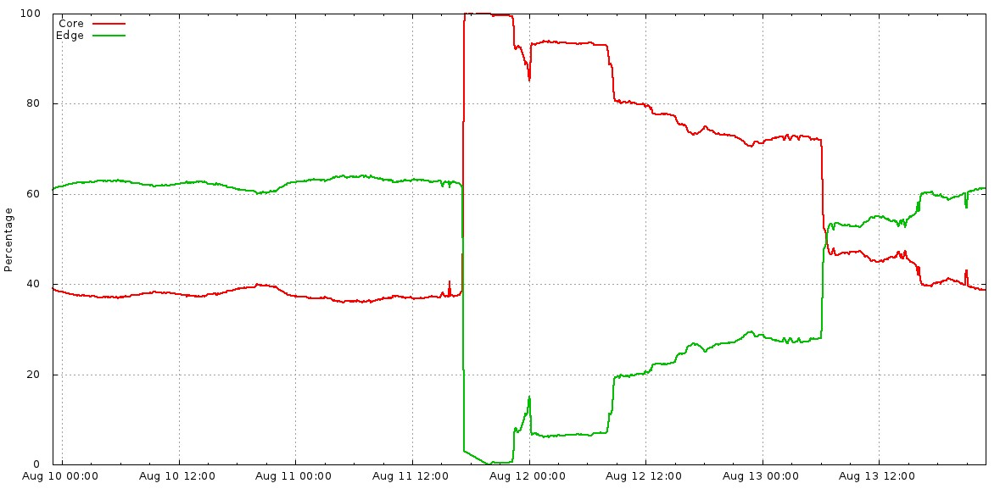
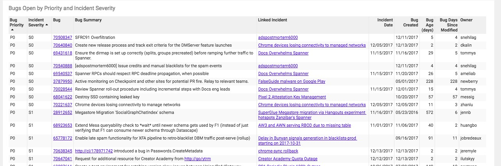
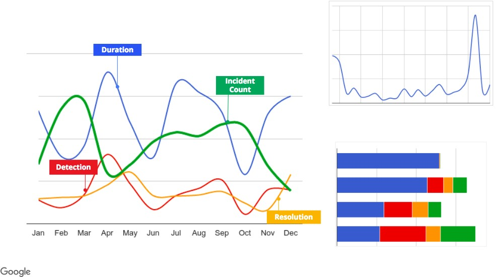

# **第10章**

### **事后文化: 从失败中学习**

<br/>

***由丹尼尔·罗杰斯(Daniel Rogers)，穆拉里·苏里尔(Murali Suriar)，苏·路德(Sue Lueder)***

***Pranjal Deo和Divya Sudhakar以及Gary O'Connor和Dave Rensin撰写***


<br/>
<br/>

我们的经验表明，真正对事不对人的事后总结文化可以产生更可靠的系统-这就是为什么我们认为这种做法对创建和维护成功的SRE组织很重要。

将事后总结引入组织既是一种文化变革，又是技术变革。做出这样的转变似乎令人生畏。本章的主要结论是，进行此更改是可能的，并且似乎不是一个无法克服的挑战。不要因为希望您的系统最终能够自我修复而发生事故。您可以通过引入一个非常基本的事后总结程序开始，然后反思和调整您的过程以使其最适合您的组织-从很多方面来说，没有一种方法可以适合所有情况。

如果编写得当，采取行动并广为分享，则事后总结可以是驱动积极的组织变革并防止重复停机的非常有效的工具。为了说明良好的事后撰写原则，本章介绍了有关Google发生的实际停机的案例研究。事后总结笔迹不佳的一个例子突出了"不良"事后总结习惯对试图创建健康的事后总结文化的组织造成损害的原因。然后，我们将不良的事后总结与事件发生后写的真实的事后总结进行比较，突出显示高质量事后总结的原理和最佳实践。

本章的第二部分分享了我们所学到的有关创建激励机制来培育强大的事后总结文化的知识，以及如何识别(和补救)该文化正在崩溃的早期迹象。

最后，我们提供了可用于引导事后文化的工具和模板。

有关对事不对人的事后总结哲学的全面讨论，请参阅第一本书*Site Reliability Engineering*中的[第15章](http://bit.ly/2J2Po2W)。

## **案例分析**

此案例研究具有例行的机架退役功能，导致我们的用户的服务延迟增加。我们维护自动化中的一个错误，再加上速率限制不足，导致承载生产流量的数千台服务器同时脱机。

虽然Google的大多数服务器都位于我们专有的数据中心中，但我们在托管设备(或"托管服务器")中也有许多代理/缓存计算机。包含我们的代理服务器的colos机架被称为*卫星*。由于卫星需要定期维护和升级，因此在任何时间点都会安装或停用许多卫星机架。在Google，这些维护流程在很大程度上是自动化的。

停用过程使用称为"磁盘擦除*"的过程覆盖机架中所有驱动器的全部内容。一旦将机器发送到磁盘擦除，它曾经存储的数据将不再可检索。典型的机架停用步骤如下:

```
# Get all active machines in "satellite"
    machines = GetMachines(satellite)
# Send all candidate machines matching "filter" to decom
    SendToDecom(candidates=GetAllSatelliteMachines(),
                filter=machines)
```

我们的案例研究从标记为退役的卫星机架开始。停用过程的磁盘擦除步骤已成功完成，但是负责其余机器停用的自动化操作却失败了。为了调试故障，我们重试了退役过程。第二次停用运行为如下:

```
# Get all active machines in "satellite"
    machines = GetMachines(satellite)
# "machines" is an empty list, because the decom flow has already run.
# API bug: an empty list is treated as "no filter", rather than "act on no # machines"
    # Send all candidate machines matching "filter" to decom
    SendToDecom(candidates=GetAllSatelliteMachines(),
filter=machines)
# Send all machines in "candidates" to diskerase.
```

几分钟之内，全球所有卫星机器的磁盘都被擦除。这些机器呈惰性状态，无法再接受用户的连接，因此后续的用户连接被直接路由到我们的数据中心。结果，用户的等待时间略有增加。由于进行了良好的容量规划，在为时两天的时间内，我们很少有用户注意到此问题，因此我们在受影响的colo机架中重新安装了机器。事件发生后，我们花费了数周的时间进行审核，并在自动化系统中添加了更多的健全性检查，以使退役工作流成为幂等。

断电三年后，我们遇到了类似的事件:大量卫星被排空，导致用户延迟增加。从最初的事后总结中实施的行动项目极大地降低了冲击半径和第二次事件的发生率。

假设您是负责编写此案例研究的事后分析的人。您想知道什么，以及您打算采取什么行动来防止再次发生这种中断？

让我们从这次事后总结还不算大的问题开始。

## **不良事后总结**

> **事后总结: 所有发送给卫星机器磁盘擦除**
>
> **2014年8月11日**
>
> **所有者:** maxone@，logantwo@，sydneythree@，dylanfour@
> **与以下人员共享:** Satellite-infra-team@
> **状态:** 终结
> **事件发生日期:** 2014年8月11日
> **发布日期:** 2014年12月30日
>
> **执行摘要**
>
> **影响:** 所有的卫星机器都被发送到磁盘擦除，而后者实际上清除了Google Edge。
> **根本原因:** dylanfour@忽略了自动化设置，并手动运行了群集启动逻辑，从而触发了一个现有的错误。
>
> **问题摘要**
>
> **问题持续时间:** 40分钟
> **受影响的产品:** 卫星基础设施团队

> **受影响的产品百分比:** 所有卫星集群。
  
> **用户影响:** 正常情况下，所有向卫星发送的查询都由核心提供，导致延迟增加。
> **收益影响:** 由于丢失了查询，因此无法投放某些广告。目前尚不清楚确切的收入影响。
> **侦测:** 监控警报。
> **解决方案:** 将流量转移到核心，然后手动修复边缘群集。

> **背景(可选)**
>
> **影响**
>
> *对用户的影响*
>
> > 通常会从核心服务所有通常用于卫星的查询，这会增加用户流量的延迟。
>
> *收入影响*
>
> > 由于查询丢失，某些广告无法投放。
>
> **根本原因和触发因素**
>
> 集群开启/关闭自动化并不是幂等的。该工具具有安全措施，可确保某些步骤不能多次运行。不幸的是，没有什么可以阻止某人手动运行他们想要的次数。没有文档提到此陷阱。结果，大多数团队成员认为，如果该过程不起作用，则可以多次运行该过程。
>
> 这就是在常规停用机架期间发生的事情。机架已被新的基于Iota的卫星所取代。 dylanfour@完全忽略了该周转已经执行一次并被卡在第一次尝试中的事实。由于粗心大意的无知，他们引发了糟糕的互动，将所有卫星机器分配给了磁盘擦除团队。
>
> **恢复工作**
>
> **经验教训**
>
> 正常运行

> - 警报立即发现了问题。

> - 事件管理进展顺利。

> 非正常运行

> - 团队(尤其是maxone@，logantwo@)从未编写任何文档来告诉SRE不要多次运行自动化，这很荒谬。

> - 值班人员中行动不足以阻止大多数卫星机器被删除。这不是值班中未能及时做出反应的第一次。

> 幸运的地方

> - Core能够处理通常会到达Edge的所有流量。我简直不敢相信我们幸免于难！！！
> 
> **动作项** 
>
> | **动作项** | **类型** | **优先级** | **所有者** | **跟踪错误** | 
> | --- | --- | --- | --- | --- |
> | 使自动化更好。|缓解|P2 | logantwo@ | |
> | 改进呼叫和警报|发现|P2 | | | |
> | sydneythree@需要学习正确的跨站点切换协议，因此没有人需要处理重复的问题。|缓解|P2 | | BUG6789 | |
> | 培训人员不要执行不安全的命令。                                                                  |预防|P2 | | | |


> **词汇表** 


### **为什么此事后分析不好？**

示例"不良"事后总结包含许多我们试图避免的常见故障模式。以下各节说明如何改进此事后总结。

**缺少上下文**

从一开始，我们的示例事后总结介绍了专门针对流量服务的术语(例如，"卫星")和Google较低级别的机器管理自动化(例如，"磁盘擦除")。如果您需要在事后提供其他上下文，请使用"背景"和/或"词汇表"部分(可以链接到更长的文档)。在这个实例下，两个部分均为空白。

如果您在撰写事后总结报告时没有正确地对内容进行上下文化，则文档可能会被误解甚至被忽略。重要的是要记住，您的听众不仅限于直属团队。

**省略关键细节**

多个部分包含高级摘要，但缺少重要的细节。例如:

*问题摘要*

> 对于影响多种服务的中断，您应该提供数字以一致地表示影响。我们的示例提供的唯一数值数据是问题的持续时间。没有足够的细节来估计中断的规模或影响。即使没有具体数据，一个有根据的估计也比没有数据要好。毕竟，如果您不知道如何测量它，那么您将不知道它是被修复的！

*根本原因和触发因素*

> 查明根本原因和触发因素是撰写事后总结报告的最重要原因之一。我们的示例包含一小段描述了根本原因和触发因素，但是并未探讨该问题的底层细节。

*恢复工作*

> 事后记录为其读者记录事件。一个好的事后总结报告将使读者知道发生了什么事情，如何缓解该问题以及如何影响用户。这些问题的答案通常可以在"Recovery Efforts"部分找到，在我们的示例中为空。

如果停机需要进行事后分析，则您还应该花时间准确捕获并记录必要的详细信息。读者应全面了解停机情况，更重要的是，要学习新的知识。

**缺少关键行动项目特征**

我们的示例的"操作项"部分缺少可操作的计划以防止再次发生的核心方面。例如:

- 操作项大多是缓解措施。为了最大程度地减少停电再次发生的可能性，您应该包括一些预防措施和解决方案。一个"预防"行动建议表明我们"使人类减少了容易出错的事件"。通常，尝试更改人类行为并不如更改自动化系统和流程可靠。(或者像丹·米尔斯坦[曾经打过电话:](http://bit.ly/2syrmBF)"就像我们今天很愚蠢一样来为我们未来制定计划。")

- 所有动作项均具有与之相等的优先级标记。无法确定首先要采取的行动。

- 列表中的前两个操作项使用了模棱两可的词组，例如"改进"和"变得更好"。这些术语含糊且不易于解释。使用不清楚的语言会使衡量和理解成功标准变得困难。

- 仅向一个操作项分配了跟踪错误。如果没有正式的跟踪流程，事后总结后的行动项目通常会被遗忘，从而导致停运。

>用Google 24/7运维副总裁Ben Treynor Sloss的话来说:"对于我们的用户，没有后续行动的事后总结与没有事后总结是一样的。因此，在影响用户的停机之后进行的所有事后事后总结必须至少具有一个与之关联的P\[01\]错误。我亲自审查例外情况。很少有例外。"

**适得其反的指责**

每个事后剖析都有可能陷入怪异的叙述中。让我们看一些例子:

*情况不佳*

> 当两名成员被征召的时候(maxone@和logantwo@),整个团队都应该因为这个故障受到谴责。

*行动项目*

> 列表中的最后一项使sydneythree@被压力压垮，对跨站点切换疏于管理。

*根本原因和触发因素* 
> dylanfour@对中断负责。

在事后总结中突出个人似乎是一个好主意。相反，这种做法会导致团队成员规避风险，因为他们害怕被公众羞辱。他们可能有动机掩盖对理解和防止再次发生至关重要的事实。

**情绪化的语言**

事后总结是一种事实物品，应该没有个人判断和主观语言。它应该考虑多种观点，并尊重他人。我们的示例事后分析包含多个不良语言示例:

*根本原因和触发因素*

> 多余的语言(例如"粗心的无知")

*情况不佳*

> 情绪化的文字(例如，"荒谬")

*幸运的地方*

> 令人难以置信的感叹(例如，"我不敢相信我们能幸免于难！")

情绪化的语言和事件的戏剧性描述分散了关键信息的注意力，削弱了心理安全性。取而代之的，要提供可验证的数据来证明语句的严重性。

**缺少所有权**

宣布指挥此行动的官方所有权的所有者用来建立问责机制。我们的示例事后总结包含缺少所有权的几个示例:

- 事后总结列出了四个所有者。理想情况下，所有者是负责事后检查，跟进和完成的单一联系人。

- "操作项"部分的条目几乎没有所有权。没有明确所有者的操作项目不太可能被分辨。

最好有一个所有者和多个合作者。

**限量受众**

我们的示例事后总结仅在团队成员之间共享。默认情况下，公司中的每个人都应该可以访问该文档。我们建议您尽可能广泛地主动分享您的事后信息，甚至与您的客户分享。事后总结的价值与其创造的学习成正比。从过去的事件中学到的东西越多，重复发生的可能性就越小。进行深思熟虑的诚实事后总结也是恢复动摇的信任的关键工具。

随着经验和舒适度的提高，您也有可能将"受众"扩展到非人类。成熟的事后总结文化通常会添加机器可读的标签(和其他元数据)以启用下游分析。

**延迟发表**

我们的事后总结示例在事件发生四个月后才发表。在此期间，如果事件再次发生(实际上确实发生了)，团队成员可能会忘记及时的事后调查本应捕获的关键细节。

## **好的事后总结**

这是实际的事后总结。在某些情况下，我们将个人和团队的名称虚构。我们还用占位符替换了实际值，以保护敏感的容量信息。在为内部消费创建的事后总结中，绝对应包括特定数字！


> **事后总结: 已将所有卫星机器发送给磁盘擦除** 
> 
> **2014年8月11日** 
>
> **所有者:**  
> 事后总结:maxone@，logantwo@ 
> 数据中心自动化:sydneythree@ 
> 网络:dylanfour@ 
> 服务器管理:finfive@ 
>
> **分享:** *all_engineering_employees@google.com*
>
> **状态:** 最终
>
> **事件发生日期:** 2014年8月11日，星期一，17:10至17:50 PST8PDT 
> **发布时间:** 2014年8月15日，星期五
>
> **执行摘要** 
>
> **影响:** 
> 前端查询下降
> 一些广告未投放
> 将近两天通常由卫星提供的所有服务的延迟都增加了
> 
> **根本原因:** 一个停止自动化并会导致所有卫星计算机被擦除的错误，相反只有一机架卫星计算机并被擦除。这导致所有卫星计算机进入分解工作流程，从而擦除了磁盘。结果是全球卫星前端中断。
>
> **问题摘要** 
>
> **问题持续时间:** 主要中断: PST8PDT，8月11日星期一，17:10至17:50, 通过PST8PDT，8月13日，星期三，进行重建工作和残留的痛苦，然后事件被关闭。
> 
> **受影响产品:** 前端基础结构，尤其是所有卫星位置。
>
> **受影响产品百分比:** 全球-通常由卫星提供的所有流量(通常占全球查询的60％)。                                                                                                                                                                                    
>
> **用户影响:** \[可编辑的值\]前端查询在40分钟的时间内下降(\[可编辑的值\]这段时间内的平均QPS，占总流量的\[可编辑的值\]％)。通常由卫星提供的所有服务的延迟都会增加近两天。
>
> **收益影响:** 目前尚不清楚确切的收入影响。
> **检测:** 黑盒警报:世界上的每颗卫星都向"流量小组"报告"satellite a12bcd34 failing too many HTTP requests"。
> **解决方案:** 通过将Google的所有存在额外用户流量的延迟开销的前端流量移至核心群集，可以快速缓解故障本身.
>
> **背景(可选)**
>
> 如果您不熟悉Google的前端流量服务和较低层的服务自动化，请先阅读词汇表，然后再继续。
>
> **影响**
>
> 对用户的影响

> - \[可编辑的值\]前端查询在\[可编辑的值\]分钟内删除。\[可编辑的值\]此期间的QPS平均值，占全球流量的\[可编辑的值\]％。我们的监测表明，火山口更大。但是，由于停止监控仍在运行的卫星，并认为它们已关闭，因此数据不可靠。附录描述了如何估算上述数字。

> - 将近两天通常由卫星提供的所有服务的延迟都增加了:

>   --- \[可编辑的值\] ms RTT峰值，用于靠近核心集群的国家
>
>   --- 对于更严重依赖卫星的位置(例如，澳大利亚，新西兰，印度)，最多+\[可编辑的值\] ms
>
> 收入影响
>
> 由于查询丢失，某些广告无法投放。目前尚不清楚确切的收入影响:

> - 显示和视频:由于每天的波动，数据具有非常宽的误差线，但我们估计停运当天收入损失的\[可编辑的值\]％和\[可编辑的值\]％之间。

> - 搜索:\[可编辑的值\]％到\[可编辑的值\]％的损失在17:00到18:00之间，同样带有宽误差条。

> 团队影响

> - 沟通小组花了大约48小时的时间，全力以赴地重建卫星。

> - NST的中断/值班负载高于正常水平，因为它们需要对过载的对等链接进行流量工程设计。

> - 由于GFE中的缓存命中率降低，某些服务可能在其前端提供了更多的响应。

>   --- 例如，关于\[与缓存相关的服务\]，请参见此思路\[link\]。
>
>   --- \[依赖于缓存的服务\]看到它们在GFE上的缓存命中率从\[可编辑的值\]％下降到\[可编辑的值\]％，然后才慢慢恢复。
>
> 事件文档
>
> \[指向我们的事件跟踪文档的链接已被编辑。\]
>
> **根本原因和触发因素**
>
>手动重新执行工作流程以停用a12bcd34卫星，触发了Traffic Admin服务器中长期存在的输入验证错误。该错误消除了对decom动作的机器限制，从而使所有卫星机器退役。
>
>从那里开始，数据中心自动化执行了decom工作流程，在停止该操作之前先擦除大多数卫星计算机的硬盘驱动器。
>
> Traffic Admin服务器提供ReleaseSatelliteMachines RPC。该处理程序使用三个MDB API调用启动卫星退役:

> - 查找与边缘节点关联的机架名称(例如a12bcd34 -\> \<rack name\>)。

> - 查找与机架关联的机器名称(\<rack\> -\> \<machine 1\>, \<machine 2\>等)。

> - 将这些计算机重新分配给磁盘擦除，从而间接触发停用工作流程。

>由于MDB API的已知行为以及缺少安全性检查，因此该过程不是幂等的。如果先前已成功将卫星节点成功发送给decom，则上面的步骤2将返回一个空列表，该列表在步骤3中被解释为对机器主机名没有约束。
>
>这种危险的行为已经存在了一段时间，但是被调用不安全操作的工作流所掩盖:调用RPC的工作流步骤被标记为"运行一次"，这意味着一旦成功，工作流引擎将不会重新执行RPC。 。
>
>但是，"运行一次"语义不适用于工作流的多个实例。当"集群启动"团队手动启动a12bcd34的工作流的另一次运行时，此操作触发了admin_server错误。
>
> **时间表/恢复工作**
>
> \[因为图书的出版,指向我们的时间轴日志的链接已删除。在真实的事后总结中，始终会包含此信息。\]
>
> **经验教训**
>
> 表现良好的

> - 疏散边缘。核心中的GFE进行了明确的容量规划，以允许这种情况发生，生产主干网也是如此(除了对等链接；请参阅下一节的停机列表)。这种边缘疏散使沟通团队得以迅速缓解而无所畏惧。

> - 自动减轻灾难性卫星故障。备份路线会自动将流量从发生故障的卫星拉回到核心集群，并且在检测到异常流失时，卫星会自动引流。

> - 卫星decom/磁盘擦除的运作非常有效且迅速，尽管它是[糊涂的代理人](http://bit.ly/2syHumz)。

> - 中断通过OMG触发了IMAG快速响应，并且该工具被证明可用于持续的事件跟踪。跨团队的响应非常出色，OMG进一步帮助保持了彼此之间的交流。

> 表现不佳的事情
>
> 停机

> - Traffic Admin服务器缺少对发送到MDB的命令的适当检查。所有命令都应该是幂等的，或者至少在重复调用时具有故障保护功能。

> - MDB没有反对所有权更改请求中缺少主机名约束。

> - 分解工作流程不会与其他数据源(例如计划中的机架分解)交叉检查分解请求。结果，没有人反对丢弃(许多)地理上不同的机器的请求。

> - Decom工作流程不受速率限制。机器进入反解析后，磁盘擦除和其他反分解步骤将以最大速度进行。

> - 当卫星停止服务时，出口流量转移到其他位置，导致Google与世界之间的某些对等链接超载，而其查询却是从核心服务的。这导致拥挤的短暂爆发，直到选择了对等方，直到恢复卫星为止，NST的缓解工作也得以实现。

> 恢复

> - 卫星机器的重新安装缓慢且不可靠。重新安装使用TFTP传输数据，当在高延迟链路末端将数据传输到卫星时，该数据将无法正常工作。

> - 停电时，Autoreplacer基础设施无法处理GFE的同时安装。要使自动设置的速度与之匹敌，需要并行执行手动设置的许多SRE的工作量。以下因素导致了自动化初期的缓慢:

>   --- 过于严格的SSH超时阻止了在非常远程的卫星上可靠的Autoreplacer操作。
>
>   --- 无论计算机是否具有正确的版本，都会执行缓慢的内核升级过程。
>
>   --- Autoreplacer中的并发恢复阻止了每台工作计算机运行两个以上的计算机设置任务。
>
>   --- 关于Autoreplacer行为的困惑浪费了时间和精力。

> - 删除23％的目标时，不会触发监控配置增量安全检查(更改25％)，但是当读取相同的内容(剩余量的29％)时，触发监控配置增量安全检查。这导致重新启用对卫星的监控要延迟30分钟。

> - "安装程序"的人员有限。结果，进行更改既困难又缓慢。

> - 使用超级用户的权限将机器从磁盘擦除收回，从而留下了很多僵尸状态，从而导致持续的清理痛苦。

> 我们幸运的地方

> - 核心集群中的GFE的管理与卫星GFE的管理非常不同。结果，它们不受横冲直撞的的分解的影响。

> - 同样，YouTube的CDN作为不同的基础架构运行，因此YouTube视频投放不受影响。如果此操作失败，则中断将更加严重且持续时间更长。

> **动作项**
>
> 由于此事件的广泛性，我们将行动项目分为五个主题:
> 
> 1.  预防/风险教育

> 2.  紧急应变

> 3.  监控/报警

> 4.  卫星/边缘配置

> 5.  清理/杂项

> *表10-1。预防/风险教育*
> 
> | **动作项** | **类型** | **优先级** | **所有者** | **跟踪错误** |
> | --- | --- | --- | --- | --- |
| 审核所有能够将实时服务器转换为废机箱的系统(即，不仅是维修和磁盘擦除工作流程)。                                                        |调查|P1 | sydneythree@ | BUG1234 |
| 文件记录错误，以跟踪对BUG1234中标识的所有系统的错误输入拒绝的实现。                                                                              |预防|P1 | sydneythree@ | BUG1235 |
| 禁止任何单个操作影响跨越namespace/class边界的服务器。                                                                                   |减轻|P1 | maxone@ | BUG1236 |
| 流量管理服务器需要进行安全检查，以确保不能在超过\[可编辑的值\]个节点上进行操作。                                                                   |减轻|P1 | dylanfour@ | BUG1237 |
| 流量管理服务器应询问\<安全检查服务\>批准破坏性的工作。                                                                                       |预防|P0 | logantwo@ | BUG1238 |
| MDB应该拒绝不提供预期约束条件值的操作。                                                                                 |预防|P0 | louseven@ | BUG1239 |

> *表10-2。紧急响应* 
> 
> | **动作项** |  **类型** |  **优先级** |  **所有者** | **跟踪错误** |
| --- | --- | --- | --- | --- |
| 确保从核心服务不会使出口网络链接过载。|维修| P2 | rileysix@ | BUG1240|
| 确保在\[紧急链接文档的链接已被删除\]和\[升级联系页面的链接已被删除\]下注明了decom工作流问题。|减轻| P2 | logantwo@ | BUG1241 |
| 添加一个大红色按钮^a 禁用分解工作流的方法。                                                                                                                |减轻|P0 | maxone@ | BUG1242 |

> ^a 灾难性情况下使用的关闭开关(例如，紧急关闭按钮)的总称，以避免进一步的损坏。


> *表10-3。监控/警报*
> 
> | **动作项** | **类型** | **优先级** | **所有者** | **跟踪错误** |
| --- | --- | --- | --- | --- |
| 监控目标安全检查不应允许您推送无法回滚的更改。                                                                                                | 缓解|  P2 |  dylanfour@ |  BUG1243 |
| 当我们的机器中有超过\[可编辑值\]％的机器被影响时，添加警报。机器是在16:38从卫星上取走的，而世界仅在17:10左右才开始呼叫。| 发现|  P1 |  rileysix@ |  BUG1244 |

> *表10-4。卫星/边缘配置* 


> | **动作项** | **类型** | **优先级** | **所有者** | **跟踪错误** |
| --- | --- | --- | --- | --- |
| 使用iPXE使用HTTPS使重新安装更加可靠/更快。                                                                                                                                  |缓解|P2 | dylanfour@ | BUG1245 |


> *表10-5。清理/杂项*

> | **动作项** | **类型** | **优先级** | **所有者** | **跟踪错误** |
| --- | --- | --- | --- | --- |
| 在我们的工具中查看与MDB相关的代码，并用管理服务器备份恢复正常。                                                                                             | 维修| P2 | rileysix@ | BUG1246 |
| 安排DiRT测试: <br/> - 磁盘擦除后回归卫星。<br/>  - 对YouTube CDN执行相同操作。| 缓解| P2 | louseven@ | BUG1247 |


>
> **词汇表**
>
> *管理服务器*
>
> > RPC服务器，该服务器使自动化能够为前端服务基础结构执行特权操作。自动化服务器最明显地参与了PCR和群集开/关的实施。
>
> *自动替换*
>
> > 一种将不在Borg管理的服务器在计算机之间移动的系统。它用于在遇到机器故障时保持服务运行，还用于支持forklifts和colo重新配置。
>
> *Borg*
> > 
>集群管理系统，旨在大规模管理任务和机器资源。Borg拥有Borg单元中的所有计算机，并将任务分配给具有可用资源的计算机。
>
> *分解(Decom)*
>
> > *分解(decommissioning)*的缩写。设备分解是与许多运营团队相关的过程。
>
> *磁盘擦除*
>
> > 在生产硬盘离开Google数据中心之前安全擦除其过程(以及相关的硬件/软件系统)。磁盘擦除是decom工作流程中的一个步骤。
>
> *GFE(Google前端)*
>
> > 外部连接到的服务器(几乎)用于所有Google服务。
>
> *IMAG(Google事件管理)*
>
> > 一个程序，该程序建立了一种标准的，一致的方式来处理所有类型的事件-从系统中断到自然灾害-并组织有效的响应。
>
> *MDB(机器数据库)*
>
> > 一种存储有关Google机器清单状态的各种信息的系统。
>
> *OMG(Google的停机管理)*
>
> > 事件管理仪表板/工具，可作为集中位置来跟踪和管理Google上所有正在进行的事件。
>
> *卫星*
>
> > 小型廉价的机器机架，仅可服务来自Google网络边缘的非视频前端流量。卫星几乎没有传统的生产集群基础设施。卫星与CDN截然不同，CDN从Google的网络边缘以及更广泛的互联网上的其他地方提供YouTube视频内容。YouTube CDN不受此事件影响。
>  
> **附录**
>
> *为什么* 释放卫星系统服务器 *不幂等？*
>
> > \[对这个问题的回答已被忽略。\]
>
> *在Admin Server将所有卫星分配给磁盘擦除团队之后发生了什么？*
>
> > \[对这个问题的回答已被忽略。\]

> *中断期间真正的[QPS](http://bit.ly/2JksYtc)损失是什么？*
>
> > \[对这个问题的回答已被忽略。\]
>
> *IRC日志*
>
> > \[IRC日志已被删除。\]
>
> **图表**
>
> *更快的延迟统计---卫星为我们做了什么？*
>
> > 从这次中断的经验来看，卫星使核心集群附近的许多位置的\[可编辑值\] ms延迟减少了，并且距骨干网的位置减少了[可编辑值\] ms延迟:
>
> \[省略了图形的解释。\]
>
> *核心与边缘服务负载*
>
> > 很好地说明了重建工作。能够再次从50％的边缘流量提供服务大约需要36个小时，而恢复正常流量平衡则需要额外的12个小时(请参见图10-1和图10-2)。
> 
> *流量变化带来的压力*
>
> > \[图表消失。\]
>
> > 该图显示了按网络区域汇总的数据包丢失情况。事件本身出现了一些短暂的峰值，但是损失的大部分是由于各个地区进入高峰期而几乎没有/完全没有卫星覆盖而发生的。
> 
> *《人与机器》，GFE版*
>
> > [省去了对人机对自动机器设置率的图示说明。]
>
>

> *图10-1。核心与边缘QPS细分*
>
> 

> *图10-2*


### **为什么这个事后总结更好？**

此事后总结示例了几种良好的写作习惯。

**明晰**

事后组织良好，并详细解释了关键术语。例如:

*词汇表*

> 精心编写的词汇表使广泛的读者可以方便地理解和理解事后记录。

*行动项目*

> 这是一个重大事件，涉及许多行动项目。按主题对操作项进行分组可以更轻松地分配所有者和优先级。

*量化指标*

> 事后分析会显示有关事件的有用数据，例如缓存命中率，流量级别和影响持续时间。数据的相关部分带有指向原始源的链接。这种数据透明性消除了歧义，并为读者提供了上下文。

**具体行动项目**

没有操作项的事后总结是无效的。这些操作项具有一些显着特征:

*所有权*

> 所有操作项都有所有者和跟踪号。

*优先级*

> 为所有操作项目分配了优先级。

*可衡量性*

> 操作项具有可验证的最终状态(例如，"当我们从我们手中夺走X％以上的机器时，添加警报")。

*预防措施*

> 每个操作项目"主题"都有"预防/减轻"操作项目，这些操作项目有助于避免中断再次发生(例如，"禁止任何单个操作影响跨越名称namespace/class边界的服务器")。

**无瑕疵**

作者专注于系统设计的空白，这些空白允许出现不希望的故障模式。例如:

*情况不佳*

> 没有人或团队对此事件负责。

*根本原因和触发*

> 关注"什么"出了问题，而不是"谁"引起了事件。

*动作项*

> 旨在改善系统，而不是改善人员。

**深度**

事后调查不仅研究了系统故障的最主要方面，还探索了多个团队的影响和系统缺陷。特别说明:

*影响*

> 本节从各个角度包含许多细节，使之具有平衡性和客观性。

*根本原因和触发*

> 本节深入分析该事件，并找出根本原因和触发因素。

*以数据为依据的结论*

> 提出的所有结论均基于事实和数据。用于得出结论的任何数据均与文档链接。

*其他资源*

> 这些以图表的形式提供了更多有用的信息。解释了图以向不熟悉系统的读者提供上下文。

**及时性**

事件发生后不到一周的时间，便已撰写并分发了事后总结报告。即时事后总结往往更准确，因为信息在贡献者的脑海中是新鲜的。受故障影响的人们正在等待解释和证明您的事情得到控制的证明。您等待的时间越长，他们将用他们的想象力填补更多空白。这很少能帮到您！

**简明**

该事件是全球性事件，影响了多个系统。结果，事后记录并随后解析了许多数据。提取了冗长的数据源，例如聊天记录和系统日志，并从主文档链接了未编辑的版本。总体而言，事后分析在详细程度和可读性之间取得了平衡。

## **组织奖励**

理想情况下，高层领导应该支持和鼓励有效的事后总结。本节介绍组织如何激励健康的事后总结文化。我们着重指出文化失败的警告信号，并提供一些解决方案。我们还提供工具和模板，以简化和自动化事后总结过程。

### **示范并执行无责行为**

为了适当地支持事后文化，工程主管应一如既往地以对事不对人行为为榜样，并在事后的各个方面鼓励不责怪他人

事后总结讨论。您可以使用一些具体策略来强制组织中的对事不对人行为。

**不使用指责型的语言**

指责型的语言扼杀了团队之间的协作。请考虑以下情形:

> Sandy错过了Foo服务培训，并且不确定如何运行特定的更新命令。延迟最终延长了停机时间。
>
> SRE杰西\[Sandy的经理\]说:"你是经理；为什么不确保每个人都完成培训？"

这个回应的主要问题将立即使对方处于自卫状态。更加优雅的回应是:

> SRE杰西\[Sandy的经理\]说:"阅读事后总结后，我发现求职者错过了一项重要的培训，该培训会使他们更快地解决中断问题。也许应该要求团队成员完成此培训，然后才能加入轮班安排？或者，我们可以提醒他们，如果他们陷入困境，请迅速升级。毕竟，升级并不是罪过-尤其是如果它有助于减轻客户的痛苦！从长远来看，我们不应该真的太依赖培训，因为很容易在问题发生时忘记。"

**包括事后创作中的所有事件参与者**

当停机的事后报告由单个人或由单个团队撰写时，很容易忽略造成停机的关键因素。

**收集反馈**

清晰的事后总结流程和沟通计划可帮助防止指责性语言和观点在组织内传播。有关建议的结构化检查过程，请参阅第221页的"事后检查清单"部分。

### **奖励事后总结结果**

事后总结记录撰写得当，行之有效并得到广泛分享时，是推动积极的组织变革和防止重复停机的有效工具。

考虑以下激励事后总结文化的策略。

**依据操作项目奖励**

如果您奖励撰写事后报告的工程师，而不是奖励完成相关的操作项的工程师，则您可能会面临未完成事后报告的无情循环。确保在撰写事后报告和成功执行其行动计划之间保持动力平衡。

**奖励积极的组织变革**

通过将事后总结报告作为在整个组织范围内扩大影响的机会，可以激励事后总结课的广泛实施。通过适当的奖金，积极的绩效评估，晋升等方法实施奖励。

**突出显示可靠性的提升**

随着时间的流逝，有效的事后总结文化将带来更少的停机时间和更可靠的系统。因此，团队可以专注于功能而不是基础架构修补。从本质上讲，要在报告，演示文稿和绩效评估中强调这些改进。

**让事后报告所有者担任领导者**

通过电子邮件或会议来庆祝事后总结完成，或者通过给作者一个向听众介绍所学课程的机会，可以吸引欣赏公众赞誉的个人。将所有者设置为故障类型的"专家"并避免故障的发生，对于寻求同行认可的许多工程师而言，都是有益的。例如，您可能会听到有人说:"与Sara对话，她现在是专家。她与他人共同撰写了一份事后总结报告，报告里面她指出了解决该问题的方法！"

**游戏化**

某些人会因成就感和朝着更大的目标的进步(例如，解决系统缺陷和提高可靠性)而受到激励。对于这些人，记分板或完成事后行动项可能是一种诱因。在Google，我们每年两次举行"FixIt"活动。完成事后行动项目最多的SRE会获得少量赞赏和(当然)吹牛的权利。图10-3显示了事后排行榜的示例。


为了在组织内维持健康的事后总结文化，重要的是尽可能广泛地共享事后总结。即使采用以下策略之一也可以提供帮助。

### **在整个组织中分享公告**

在您的内部沟通渠道，电子邮件，Slack等上宣布事后总结报告的可用性。如果您拥有一家正规公司，那么请实践一下分享近期的事后调查利益。

**进行跨团队审核**

对事后总结进行跨团队审查。在这些评论中，一个团队走过他们的事件，而其他团队则提出问题并进行替代学习。在Google，有几个办公室设有非正式的事后读书俱乐部，向所有员工开放。

此外，由跨职能的开发人员，SRE和组织负责人组成的小组审查了整个事后评估过程。这些人每月开会，审查事后总结程序和模板的有效性。

**进行训练**

培训新工程师时，请使用[不幸之轮](http://bit.ly/2JiOazR):一组工程师会重演以前的事后总结，并假定事后总结中规定的角色。最初的事件指挥官出席会议是为了使体验尽可能"真实"。

**每周报告一次事件和中断**

创建每周停机报告，其中包含过去7天的事件和停机。与尽可能多的受众共享报告。从每周中断中，编制并共享定期的最大点击率报告。

### **应对事后文化故障**

事后文化的崩溃可能并不总是显而易见的。以下是一些常见的故障模式和建议的解决方案。

**避免形成联盟**

脱离事后总结程序表明组织的事后总结文化正在失败。例如，假设SRE总监Parker听到了以下对话:

> SWE山姆:哇，您听说过这么大的爆发吗？
>
> SWE莱利:是的，这太可怕了。他们现在必须写一个事后总结报告。
>
> SWE山姆:Oh，不！我很高兴我没有参与。
>
> SWE莱利:是的，我真的不想参加讨论该会议的会议。

确保对高可见度的事后总结进行审查，可以帮助避免这种回避。此外，分享高质量的例子并讨论如何奖励参与其中的人可以帮助重新吸引个人。

**未能加强文化**

当高级管理人员使用指责性语言时做出回应可能具有挑战性。考虑一下高级领导在一次会议上关于停电的以下声明:

> VP Ash:我知道我们应该无罪，但这是一个安全的空间。一定有人事先知道这是个坏主意，那么为什么不听那个人呢？

通过向更具建设性的方向发展叙事来减轻损害。例如:

> SRE Dana:嗯，我敢肯定，每个人的意图都是最好的，所以都是无罪的，也许我们一般地问是否有任何我们可能会注意的警告信号，以及为什么我们会忽略它们。

个人以真诚的态度行事，并根据可获得的最佳信息做出决定。调查误导性信息的来源对组织而言比指责更为有益。(如果您遇到了敏捷原则，则应该[熟悉](http://bit.ly/2sthid8)。)

**没有时间写事后总结**

优质的事后总结报告需要花费时间。当团队负担过多其他任务时，事后总结的质量会受到影响。行动项不完整的不合格事后总结更容易复发。事后总结是您写给未来团队成员的信:保持一致的质量水准非常重要，以免您无意间给未来的队友们上了一个不好的教训。优先安排事后总结工作，跟踪事后总结完成和审查，并留出足够的时间来实施相关的行动计划。我们在第220页的"工具和模板"部分中讨论的工具可以帮助完成这些活动。

**重复事件**

如果团队遇到的错误反映出以前的事件，那么该是更深入地研究了。考虑问以下问题:

- 动作项目需要太长时间才能关闭吗？

- 新功能的速度胜过可靠性吗？

- 首先要捕捉正确的行动项目吗？

- 错误的服务是否应该进行重构？

- 人们是否将创可贴放在一个更严重的问题上？

如果您发现了系统性过程或技术问题，就该退后一步，考虑一下整个服务的运行状况。将每个类似事件的事后协作者聚集在一起，讨论防止重复的最佳行动方案。

## **工具和模板**

一组工具和模板可以通过简化事后编写和管理关联数据的工作来引导事后文化。在这个领域，您可以利用Google和其他公司提供的许多资源。

**事后总结模板**

使用模板，可以更轻松地编写完整的事后总结并在整个组织中共享。使用标准格式可以使域外的读者更容易使用事后总结。您可以自定义模板以满足您的需求。例如，捕获特定于团队的元数据(如数据中心团队的硬件品牌/型号或受移动团队影响的Android版本)可能很有用。然后，随着团队的成熟和执行更复杂的事后分析，您可以添加自定义项。

**Google的模板**

Google已在[*http://g.co/SiteReliabilityWorkbookMaterials*](http://g.co/SiteReliabilityWorkbookMaterials)上共享了Google文档格式的事后总结模板版本。在内部，我们主要使用Docs来编写事后总结，因为它可以通过共享的编辑权限和注释促进协作。我们的一些内部工具会使用元数据预先填充此模板，以使事后编写更容易。我们利用[Google Apps脚本](https://developers.google.com/apps-script/)来自动化部分创作，并将大量数据捕获到特定的部分和表格中，以简化事后存储库解析数据进行分析。

**其他行业模板**

其他几家公司和个人也共享了他们的事后分析模板:

- [Pager Duty](http://bit.ly/2J6FaP7)

- [An adaptation of the original Google Site Reliability Engineering book template](http://bit.ly/2kIhFNC)

- [GitHub上托管的四个模板的列表](http://bit.ly/2svJA7R)

- [GitHub用户Julian Dunn](http://bit.ly/2LcOzRy)

- [Server Fault](http://bit.ly/2spHl5P)

### **事后总结工具**

在撰写本文时，Google的事后管理工具尚未对外提供(请查看我们的[blog](https://cloudplatform.googleblog.com/)了解最新更新)。但是，我们可以解释我们的工具如何促进事后文化。

**事后总结制作**

我们的事件管理工具收集并存储了大量有关事件的有用数据，并将这些数据自动推送到事后分析中。我们推送的数据示例包括:

- 事件指挥官和其他角色

- 详细的事件时间表和IRC日志

- 受影响的服务和根本原因服务

- 事件严重性

- 事件检测机制

**事后检查清单**

为了帮助作者确保正确完成事后总结，我们提供了事后总结清单，以指导所有者完成关键步骤。这只是列表中的一些示例检查:

- 对事件影响进行全面评估。

- 进行足够详细的根本原因分析，以推动行动计划的制定。

- 确保操作项目由服务的技术负责人审核和批准。

- 与更广泛的组织共享事后总结报告。

完整的核对清单可在[*http://g.co/SiteReliabilityWorkbookMaterials*](http://g.co/SiteReliabilityWorkbookMaterials)中找到。

**事后总结保存**

我们将事后总结存储在一个名为Requiem的工具中，因此任何Google员工都可以轻松找到它们。我们的事件管理工具会自动将所有事后总结信息推送至Requiem，组织中的任何人都可以发布其事后总结信息，以供所有人查看。自2009年以来，我们已经存储了成千上万的事后总结。Requiem从各个事后分析中解析出元数据，并将其用于搜索，分析和报告。

**工具和模板**

**事后追踪**

我们的事后总结信息存储在Requiem的数据库中。任何产生的操作项都会作为错误提交到我们的集中式错误跟踪系统中。因此，我们可以监控每个事后行动项的关闭情况。通过这种级别的跟踪，我们可以确保操作项不会漏掉间隙，导致服务变得越来越不稳定。图10-4显示了我们的工具启用的事后行动项目监控的模型。

>

*图10-4.事后行动项目监控*

**事后分析**

我们的事后管理工具将其信息存储在数据库中进行分析。团队可以使用该数据编写有关其事后趋势的报告，并确定其最易受攻击的系统。这有助于我们发现潜在的不稳定性或事件管理功能障碍的根本原因，而这些原因否则可能不会引起注意。例如，图10-5显示了使用我们的分析工具构建的图表。这些图表向我们显示了趋势，例如每个组织每个月有多少个事后调查，事件平均持续时间，检测时间，解决时间以及冲击半径。



以下是一些第三方工具，可以帮助您创建，组织和分析事后总结:

- [Pager Duty Postmortems](http://bit.ly/2xvrCqK)

- [Morgue by Etsy](https://github.com/etsy/morgue)

- [VictorOps](http://bit.ly/2J87dcR)

尽管不可能完全自动化编写事后总结的每个步骤，但是我们发现事后总结模板和工具可以使过程运行更加流畅。这些工具可以节省时间，使作者可以集中精力进行事后分析的关键方面，例如根本原因分析和行动项计划。

## **结论**

持续进行的培养事后文化的投资以减少中断，为用户提供更好的整体体验以及来自依赖您的人们的更多信任的形式带来了回报。始终如一地应用这些实践可以带来更好的系统设计，更少的停机时间以及更有效，更快乐的工程师。如果确实发生了最坏的情况并且事件再次发生，您将遭受的损失更少，恢复得更快，并且拥有更多的数据来继续加强生产。
