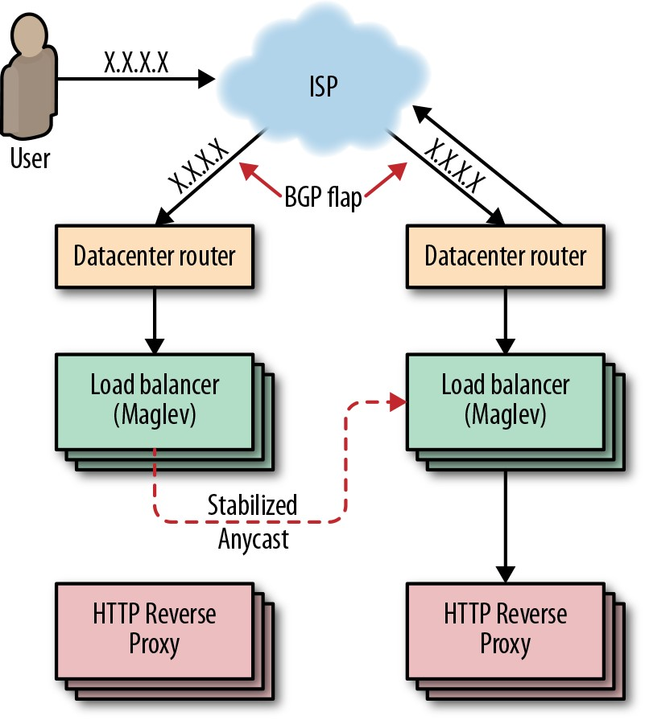
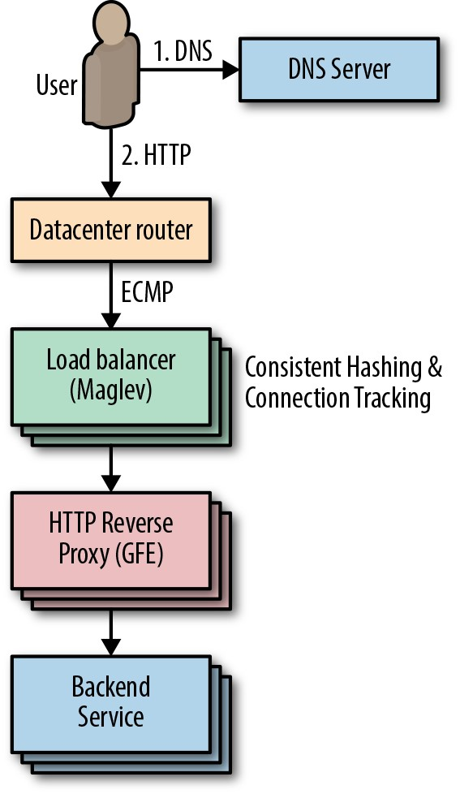
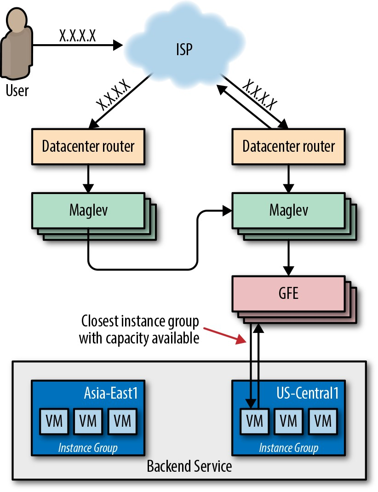
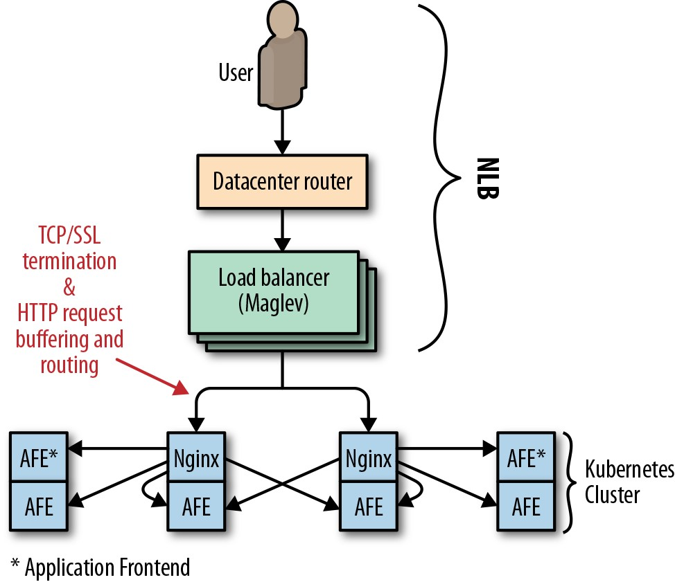
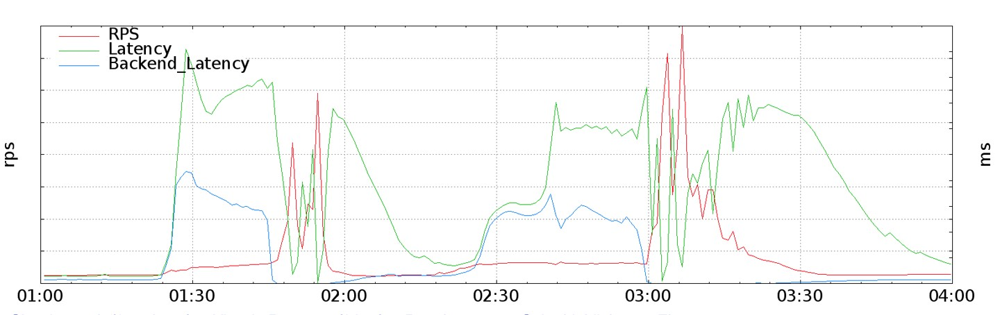
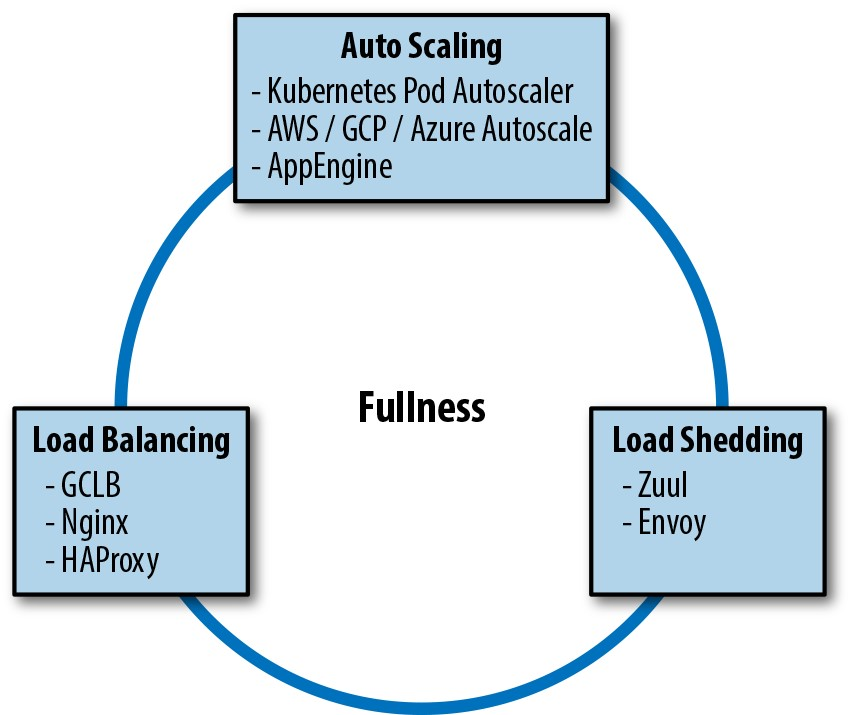
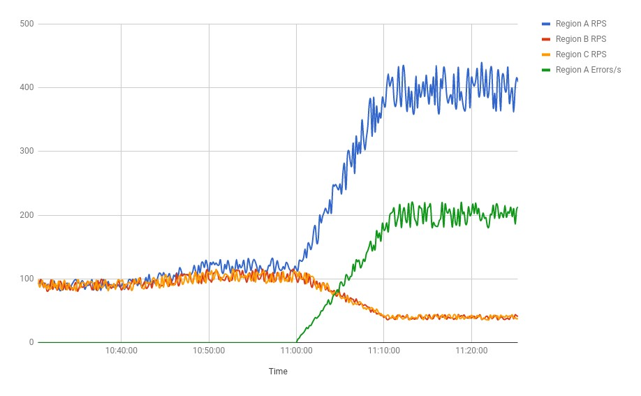

# **第11章**

### **管理负载**
 
  
 
***库珀·贝塞(Cooper Bethea)，格林·希林(GráinneSheerin)，珍妮弗·梅斯(Jennifer Mace)和露丝·金(Ruth King)以及加里·罗(Gary Luo)和加里·奥康纳(Gary O'Connor)撰写***

 
 

没有服务会在100％的时间内100％可用:客户可能会考虑不足，需求可能会增长50倍，服务可能会因流量高峰而崩溃，或者锚可能会拉跨大西洋电缆。有些人依赖您的服务，作为服务所有者，我们关心用户。当面对这些中断触发因素时，我们如何使我们的基础架构尽可能地自适应和可靠？

本章介绍了Google的流量管理方法，希望您可以使用这些最佳实践来提高服务的效率，可靠性和可用性。多年以来，我们发现没有均衡和稳定网络负载的单一解决方案。取而代之的是，我们结合使用多种工具，技术和策略，这些工具，技术和策略可以协同工作，以确保我们的服务可靠。

在进入本章之前，我们建议您阅读第19章(["前端的负载平衡"](http://bit.ly/2LQ6TRQ)和20(["数据中心的负载平衡")](http://bit.ly/2J4faDU)。

## **Google Cloud负载平衡**

如今，大多数公司不再开发和维护自己的全局负载平衡解决方案，而是选择使用大型公共云提供商的负载平衡服务。我们将讨论Google Cloud Load Balancer(GCLB)作为大规模负载平衡的具体示例，但是我们介绍的几乎所有最佳实践也适用于其他云提供商的负载平衡器。

Google在过去的18年中一直在建立基础架构，以使我们的服务快速可靠。今天，我们使用这些系统来提供YouTube，地图，Gmail，搜索以及许多其他产品和服务。GCLB是我们的公共消耗性全局负载平衡解决方案，是我们内部开发的全局负载平衡系统之一的外部化。

本节描述了GCLB的组件以及它们如何协同工作来满足用户请求。我们跟踪从创建到到达目的地的典型用户请求。NianticPokémonGO案例研究提供了真实世界中GCLB的具体实现。

我们的第一本SRE书中的[第19章](http://bit.ly/2LQ6TRQ)描述了基于DNS的负载平衡是如何在用户开始连接之前平衡负载的最简单，最有效的方法。我们还讨论了这种方法的地域性的问题:它依赖于客户端的合作才能正确到期并重新获取DNS记录。因此，GCLB不使用DNS负载平衡。

相反，我们使用*anycast*，这是一种将客户端发送到最近的群集而不依赖DNS地理位置的方法。Google的全球负载平衡器知道客户端的位置，并将数据包定向到最近的Web服务，从而在使用单个[虚拟IP(VIP)]时为用户提供低延迟。(http://bit.ly/2kFchKX)使用单个VIP意味着我们可以增加DNS记录的生存时间(TTL)，从而进一步减少延迟。

**Anycast**

Anycast是一种网络寻址和路由方法。它将数据报从单个发送方路由到一组潜在接收方中拓扑最近的节点，这些接收方都由同一目标IP地址标识。Google通过[边界网关协议(BGP)](http://bit.ly/2J5GyBi)从我们网络中的多个点播报IP。我们依靠BGP路由网格将数据包从用户传递到可以终止传输控制协议(TCP)会话的最近的前端位置。这种部署消除了单播IP扩散的问题，并为用户找到了最接近的前端。仍然存在两个主要问题:

- 太多附近的用户会淹没前端站点。

- BGP路由计算可能会重置连接。

考虑一个ISP，它经常重新计算其BGP路由，以使其用户之一偏爱两个前端站点之一。每次BGP路由"震荡"时，所有进行中的TCP流都会重置，因为不幸的用户数据包将被定向到没有TCP会话状态的新前端。为了解决这些问题，我们利用了连接级负载平衡器Maglev(稍后将进行介绍)来协调TCP流，即使路由发生振荡也是如此。我们将此技术称为"稳定的Anycast"。

**稳定的Anycast**

如图11-1所示，Google使用我们的自定义负载平衡器Maglev实现了稳定的Anycast。为了稳定的Anycast，我们为每台Maglev机器提供了一种将客户端IP映射到最近的Google前端站点的方法。有时，Maglev(Maglev)会处理发往与另一个前端站点更近的客户端的Anycast VIP的数据包。在这种情况下，Maglev将数据包转发到位于最接近的前端站点的计算机上的另一个Maglev以进行传送。然后，最靠近前端站点的Maglev机器就像对待其他任何数据包一样简单地对待数据包，然后将其路由到本地后端。

[Maglev](http://bit.ly/2LcdhBw)，如图11-2所示，是Google的自定义分布式数据包级负载均衡器。Maglev机器是我们云架构不可或缺的一部分，它管理进入集群的流量。它们在我们的前端服务器之间提供有状态的TCP级负载平衡。Maglev在一些关键方面与其他传统的硬件负载平衡器不同:

- 通过[等价多路径(ECMP)转发](http://bit.ly/2H9vYDr)，可以将目的地为给定IP地址的所有数据包平均分配到Maglev计算机池中。这使我们能够通过简单地将服务器添加到池中来提高Maglev的容量。均匀地扩展数据包还可以使Maglev冗余模型化为 *N* + 1，与传统的负载平衡系统(通常依靠主动/被动对来提供1 + 1冗余)相比，提高了可用性和可靠性。

- Maglev是Google的自定义解决方案。我们端到端地控制系统，这使我们能够进行实验和快速迭代。

- Maglev在我们数据中心的商用硬件上运行，从而大大简化了部署。

*图11-2.Maglev*

Maglev数据包传递使用*一致性哈希*和*连接跟踪*。这些技术在终止TCP会话的HTTP反向代理(也称为*Google Front Ends*，或* GFEs)中合并TCP流。一致的哈希和连接跟踪是Maglev能够按数据包而不是按连接数进行扩展的能力的关键。当路由器收到发往Maglev托管的VIP的数据包时，路由器会通过ECMP将数据包转发到群集中的任何Maglev机器。Maglev接收到数据包时，将计算该数据包的5元组hash[^67]，并在其连接跟踪表中查找哈希值，该表中包含最近连接的路由结果。如果Maglev找到一个匹配项，并且所选的后端服务仍然正常，则它将重新使用该连接。否则，Maglev会退回到一致的散列来选择后端。这些技术的结合消除了在各个Maglev机器之间共享连接状态的需要。

**全球软件负载平衡器**

GSLB是Google的全球软件负载平衡器。它使我们能够平衡集群之间的实时用户流量，从而使用户需求与可用服务容量相匹配，从而可以以对用户透明的方式处理服务故障。如图11-3所示，GSLB控制与GFE的连接分配以及对后端服务的请求分配。GSLB允许我们从运行在不同集群中的后端和GFE服务用户。除了前端和后端之间的负载平衡外，GSLB还了解后端服务的运行状况，并且可以自动将流量从出现故障的群集中转移出去。

如图11-4所示，GFE位于外界和各种Google服务(网络搜索，图像搜索，Gmail等)之间，并且通常是客户端HTTP(S)请求遇到的第一个Google服务器。GFE终止客户端的TCP和SSL会话，并检查HTTP标头和URL路径，以确定哪个后端服务应处理该请求。GFE决定将请求发送到何处后，它将重新加密数据并转发请求。有关此加密过程如何工作的更多信息，请参见我们的白皮书["Google Cloud传输中的加密"。](http://bit.ly/2snyOR0)

GFE还负责对其后端进行健康检查。如果后端服务器返回*否定确认*("NACKs"请求)或使运行状况检查超时，则GFE会停止向失败的后端发送流量。我们使用此信号更新GFE后端，而不会影响正常运行时间。通过将GFE后端置于一种模式，使它们在继续运行中请求时仍无法通过运行状况检查，我们可以在不中断任何用户请求的情况下从服务中正常删除GFE后端。我们称之为"蹩脚鸭"模式，我们将在第一本SRE书的[第20章](http://bit.ly/2J4faDU)中对其进行详细讨论。

*图11-4.GFE*

GFE还维护与其最近活动的所有后端的持久会话，以便在请求到达时就可以使用连接。此策略有助于减少用户的延迟，尤其是在我们使用SSL来保护GFE与后端之间的连接的情况下。

**GCLB:低延迟**

我们的网络供应策略旨在减少最终用户对我们服务的延迟。由于要通过HTTPS协商安全连接，需要在客户端和服务器之间进行两次网络往返，因此特别重要的是，我们应尽量减少这部分请求时间的延迟。为此，我们扩展了网络的边缘以托管Maglev和GFE。这些组件会在尽可能接近用户的位置终止SSL，然后通过长期存在的加密连接将请求转发到我们网络内更深的后端服务。

我们在该Maglev/GFE组合边缘网络的顶部构建了GCLB。当客户创建负载均衡器时，我们将提供一个Anyast VIP，并对Maglev进行编程，以在我们网络边缘的GFE上对其进行全局负载均衡。GFE的作用是终止SSL，接受和缓冲HTTP请求，将这些请求转发到客户的后端服务，然后将响应代理回用户。GSLB在每一层之间提供了glue:它使Maglev能够找到具有可用容量的最近的GFE位置，并使GFE能够将请求路由到具有可用容量的最近的VM实例组。

**GCLB:高可用性**

为了向我们的客户提供高可用性，GCLB提供了99.99％的可用性SLA[^68]。此外，GCLB还提供支持工具，使我们的客户可以改善和管理自己的应用程序的可用性。将负载平衡系统视为一种流量管理器很有用。在正常运行期间，GCLB将流量路由到具有可用容量的最近后端。当您的一个服务实例发生故障时，GCLB会代表您检测到故障，并将流量路由到正常的实例。

金丝雀渐进式和逐步发布可帮助GCLB保持高可用性。金丝雀是我们的标准发布程序之一。如第16章所述，此过程涉及将新应用程序部署到数量很少的服务器上，然后逐渐增加流量并仔细观察系统行为以验证是否没有恢复。这种做法通过在金丝雀阶段的早期捕获它们来减少任何恢复的影响。如果新版本崩溃或以其他方式使运行状况检查失败，则负载平衡器将绕过它。如果您检测到非致命的回归，则可以从负载均衡器中删除实例组，而无需接触应用程序的主版本。

**案例研究1: GCLB上的PokémonGO**

Niantic在2016年夏天推出了PokémonGO。这是多年来第一款新的神奇宝贝游戏，第一款官方的神奇宝贝智能手机游戏，也是Niantic与一家大型娱乐公司合作的第一个项目。这款游戏大受欢迎，而且比任何人都想像的更受欢迎-那个夏天，您经常会看到玩家在虚拟世界中的神奇宝贝体育馆周围地标对决。

神奇宝贝GO的成功大大超出了Niantic工程团队的期望。在发布之前，他们对软件堆栈进行了负载测试，以处理最乐观的流量估算值的5倍。实际的每秒启动请求(RPS)速率是估计值的近50倍-足以对几乎所有软件堆栈提出扩展挑战。使事情变得更加复杂的是，《PokémonGO》的世界是高度互动的，并且在其用户之间全球共享。给定区域中的所有玩家都可以看到游戏世界的相同视图，并在该世界中彼此互动。这就要求游戏产生并向所有参与者共享的状态分发近乎实时的更新。

将游戏扩展到50倍以上的用户需要Niantic工程团队做出真正令人印象深刻的努力。此外，Google的许多工程师都在协助扩展服务以成功启动方面提供了帮助。在迁移到GCLB的两天之内，Pokemon GO应用成为了最大的GCLB服务，轻松与其他前十名GCLB服务相提并论。

如图11-5所示，PokémonGO在启动时使用Google的区域性[Network Load Balancer(NLB)](http://bit.ly/2J87EUx)来平衡[Kubernetes](http: //bit.ly/2vgpMsX)群集。每个群集包含[Nginx](https://www.nginx.com/)实例的容器，这些实例用作第7层反向代理，可终止SSL，缓冲HTTP请求并在应用程序服务器后端的容器之间执行路由和负载平衡。

*图11-5.神奇宝贝GO(GCLB之前的版本)*

NLB负责IP层的负载平衡，因此有效使用NLB的服务将成为Maglev的后端。在这种情况下，依靠NLB对Niantic有以下影响:

- Nginx后端负责终止客户端的SSL，这需要从客户端设备到Niantic的前端代理进行两次往返。

- 需要缓冲来自客户端的导致代理层上的资源耗尽的HTTP请求，尤其是当客户端只能缓慢发送字节时。

- 数据包级代理无法有效地缓解低级网络攻击，例如[SYN Flood](http://bit.ly/2J7NKgw)。

为了适当地扩展，Niantic需要在大型边缘网络上运行的高级代理。NLB无法解决此问题。

**迁移到GCLB **

大型SYN洪水攻击使将PokémonGO迁移到GCLB成为优先事项。此次迁移是Niantic与Google客户可靠性工程(CRE)和SRE团队的共同努力。最初的过渡发生在流量低谷期间，当时并不明显。但是，随着流量增加到高峰，Niantic和Google都出现了无法预料的问题。Google和Niantic都发现，真正的客户对PokémonGO流量的需求比以前观察到的高200％。Niantic前端代理收到了如此多的请求，以致他们无法跟上所有入站连接的速度。以这种方式拒绝的任何连接都不会在入站请求的监控中浮出水面。后端从来没有机会。

这种流量激增导致了典型的级联故障情况。大量的API支持服务-Cloud Datastore，PokémonGO后端和API服务器以及负载平衡系统本身-超出了Niantic的云项目可用的容量。过载导致Niantic的后端变得非常慢(而不是拒绝请求)，表现为请求超时到负载均衡层。在这种情况下，负载均衡器将重试GET请求，从而增加系统负载。极高的请求量和增加的重试功能相结合，使GFE中的SSL客户端代码达到前所未有的水平，因为它试图重新连接到无响应的后端。这导致GFE的性能严重下降，从而使GCLB的全球产能实际上降低了50％。

由于后端失败，PokémonGO应用程序尝试代理用户重试失败的请求。当时，该应用程序的重试策略是一次立即重试，然后不断退避。随着中断的继续，服务有时会返回大量快速错误-例如，当重新启动共享后端时。这些错误响应可有效地使客户端重试同步，从而产生"雷群"问题，在该问题中，许多客户端请求实际上是在同一时间发出的。如图11-6所示，这些同步的请求峰值极大地增加到了以前的全局RPS峰值的20倍。

*图11-6.同步客户端重试导致的流量高峰*

**解决问题**

这些请求高峰，再加上GFE容量回归，导致所有GCLB服务的排队和高延迟。Google的流量值班SRE通过执行以下操作来减少对其他GCLB用户的附带损害:

1.  从负载均衡器主池中隔离可以为PokémonGO流量提供服务的GFE。

2.  扩大隔离的PokémonGO池，直到尽管性能下降也可以处理高峰流量。此操作将容量瓶颈从GFE移到了Niantic堆栈，在该堆栈中服务器仍在超时，特别是在客户端重试开始同步和高峰时。

3.  在Niantic的祝福下，流量SRE实施了管理覆盖，以限制负载平衡器代表PokémonGO接受的流量。该策略包含的客户需求足以使Niantic重新建立正常运营并开始扩大规模。

最终的网络配置如图11-7所示。

在此事件之后，Google和Niantic都对其系统进行了重大更改。Niantic向其客户端引入了抖动，截去了指数级重试[^69]，从而抑制了级联失败期间经历的大量同步重试峰值。Google学会了将GFE后端视为潜在的重要负载来源，并制定了资格鉴定和负载测试实践，以检测由于后端缓慢或行为异常而导致的GFE性能下降。最终，两家公司都意识到他们应该尽可能地靠近客户端测量负载。如果Niantic和Google CRE能够准确预测客户的RPS需求，那么我们将比切换到GCLB之前抢先分配给Niantic的资源更多。

**自动缩放**

GCLB之类的工具可以帮助您有效地平衡整个机队的负载，使您的服务更加稳定和可靠。有时，您根本没有足够的资源来管理现有流量。您可以使用[自动扩展](http://bit.ly/2xBvgzu)从战略上扩展您的舰队。无论您是增加每台计算机的资源(垂直扩展)还是增加池中的计算机总数(水平扩展)，自动扩展都是一个功能强大的工具，如果使用正确，它可以提高服务的可用性和利用率。相反，如果配置错误或使用不当，自动缩放可能会对您的服务产生负面影响。本节介绍了一些最佳实践，常见的故障模式以及自动缩放的当前限制。

**处理不健康的机器**

自动缩放通常会将所有实例的利用率平均化，而不管其状态如何，并假定实例在请求处理效率方面是同质的。当计算机不服务(称为*运行不正常的实例*)但仍计入利用率平均值时，自动缩放会遇到问题。在这种情况下，根本就不会发生自动缩放。各种问题均可触发此故障模式，包括:

- 需要很长时间才能准备服务的实例(例如，加载二进制文件或进行预热时)

- 卡在非服务状态的实例(即僵尸)

我们可以使用多种策略来改善这种情况。您可以组合或单独进行以下改进:

*负载均衡*

> 使用负载均衡器观察到的容量度量标准进行自动缩放。这将自动从不正常的实例中扣除不正常的实例。

*请等待新实例稳定后再收集指标*

> 您可以配置自动缩放器以仅在新实例运行状况良好时收集有关新实例的信息(GCE将该非活动时间段称为"冷却时间段")。

*自动缩放和自动修复*

> 自动修复会监控您的实例，并在实例不正常时尝试重新启动它们。通常，您将自动修复程序配置为监控实例公开的运行状况指标。如果自动修复程序检测到实例已关闭或运行不正常，它将尝试重新启动。在配置您的自动修复器时，
>
> 重要的是要确保您有足够的时间让实例在重新启动后恢复健康。

结合使用这些解决方案，您可以优化水平自动缩放比例，以仅跟踪运行状况良好的机器。请记住，在运行服务时，自动缩放器会不断调整您的设备规模。创建新实例从来都不是即时的。

**使用状态系统**

有状态系统将用户会话中的所有请求一致地发送到同一后端服务器。如果这些途径不堪重负，则添加更多实例(即水平缩放)将无济于事。对于状态系统而言，分散负载的智能任务级路由(例如，使用一致的哈希[^70])是一种更好的策略。

垂直自动缩放在有状态系统中很有用。当与任务级平衡结合使用以均衡系统负载时，垂直自动缩放可以帮助吸收短期热点。请谨慎使用此策略:由于垂直自动缩放通常在所有实例之间是一致的，因此，低流量实例可能会不必要地变大。

**保守地配置**

与自动缩小相比，使用自动缩放进行放大更重要且风险更低，因为缩小错误再放大会导致过载和流量下降。通过设计，大多数自动缩放器实现对流量的跃迁比对流量的下降更敏感。扩大规模时，自动缩放器倾向于快速增加额外的服务容量。进行缩减时，它们会更加谨慎，并等待更长的时间才能满足缩放条件，然后再慢慢减少资源。

随着服务远离瓶颈，您可以吸收的负载峰值会增加。我们建议配置自动缩放器，以使服务远离关键的系统瓶颈(例如CPU)。自动缩放器还需要足够的时间来做出反应，尤其是在新实例无法启动并无法立即使用时。我们建议面向用户的服务保留足够的备用容量，以用于过载保护和冗余。[^71]

**设置约束**

自动定标器是一个强大的工具。如果配置错误，它可能会失控。您可能会因引入错误或更改设置而无意中引发严重后果。例如，请考虑以下情形:

- 您已配置自动缩放以根据CPU利用率进行缩放。您发布了系统的新版本，其中包含一个错误，该错误导致服务器消耗CPU而不进行任何工作。自动缩放器会通过不断放大该作业来作出反应，直到浪费所有可用的[配额](http://bit.ly/2sqo0RO)。

- 您的服务没有任何改变，但是依赖项失败了。此故障会导致所有请求都卡在您的服务器上，并且永远无法完成，从而始终消耗资源。自动扩展器将扩大工作量，导致越来越多的流量被阻塞。失败的依赖项上增加的负载可能会阻止依赖项恢复。

限制允许自动缩放器执行的工作非常有用。设置扩展的最小和最大界限，确保您有足够的配额来扩展到设置的限制。这样做可以防止您耗尽配额并提供帮助

进行容量规划。

**包括终止开关和手动优先**

最好包括终止开关，以防自动缩放出现问题。确保您的值班工程师了解如何禁用自动缩放以及在必要时如何手动缩放。您的自动缩放终止开关功能应该简单，明显，快速并且有据可查。

**避免后端过载**

正确配置的自动缩放器将根据流量的增加而扩展。流量增加将对堆栈产生影响。后端服务(例如数据库)需要承担服务器可能创建的任何其他负载。因此，在部署自动缩放器之前，最好对后端服务进行详细的依赖性分析，特别是因为某些服务可能比其他服务线性地扩展。确保您的后端有足够的额外容量来服务增加的流量，并在过载时能够正常降解。使用分析数据来通知自动缩放器配置的限制。

服务部署通常运行共享配额的各种微服务。如果微服务因应流量高峰而扩大规模，则可能会使用大部分配额。如果单个微服务上的流量增加意味着其他微服务上的流量增加，则将没有可用的配额来扩展其余微服务。在这种情况下，依赖关系分析可以帮助您引导您先行实施有限的扩展。或者，您可以为每个微服务实现单独的配额(这可能需要将服务拆分为单独的项目)。

**避免流量不平衡**

某些自动缩放器(例如AWS EC2，GCP)可以在区域实例组([RMiGs](http://bit.ly/2J7NNJe))之间平衡实例。除了常规自动缩放外，这些自动缩放器还运行单独的作业，该作业不断尝试使区域中每个区域的大小均匀。以这种方式重新平衡流量避免了一个大区域。如果您使用的系统按区域分配配额，则此策略会使您的配额使用量均匀化。此外，跨区域的自动缩放可为故障域提供更多多样性。

## 组合策略来管理负载

如果您的系统变得足够复杂，则可能需要使用多种负载管理。例如，您可能会运行几个托管实例组，这些实例组会随负载扩展，但会在多个区域中进行克隆以提高容量；因此，您还需要平衡区域之间的流量。在这种情况下，您的系统需要同时使用*负载均衡器*和*基于负载的自动缩放*。

或者，也许您在遍布全球的三个托管设施中运行一个网站。您希望在本地提供缩小延迟服务，但是由于部署更多计算机需要花费数周的时间，因此溢出容量需要溢出到其他位置。如果您的网站在社交媒体上受到欢迎，并且流量突然增加了五倍，那么您希望能够满足您的要求。因此，您可以实施减载以减少多余的流量。在这种情况下，您的系统需要同时使用*负载均衡器*和*负载削减*。

或者，您的数据处理管道位于一个云区域中的Kubernetes集群中。当数据处理速度大大降低时，它会提供更多的Pod来处理工作。但是，当数据输入速度如此之快以至于读取数据导致您用尽内存或减慢垃圾收集速度时，您的Pod可能需要暂时或永久释放负载。在这种情况下，您的系统需要同时使用基于负载的自动缩放和基于负载减少的技术。

负载平衡，负载减少和自动缩放都是针对相同目标设计的:均衡和稳定系统负载。由于这三个系统通常是分别实现，安装和配置的，因此它们似乎是独立的。但是，如图11-8所示，它们并不完全独立。以下案例研究说明了这些系统如何相互作用。

**结合策略来管理负载**

*图11-8.完整的交通管理系统*

**案例研究2:减载攻击时**

想象一个虚构的公司Dressy，该公司通过应用程序在线销售礼服。由于这是一项流量驱动的服务，因此Dressy的开发团队在三个区域中部署了他们的应用程序。通过这种部署，他们的应用可以快速响应用户请求并应对单区域故障-或他们想这么做。

Dressy的客户服务团队开始收到客户无法访问该应用程序的投诉。Dressy的开发团队正在调查并注意到一个问题:他们的负载平衡正在莫名其妙地将所有用户流量吸引到区域A，即使该区域已满到溢出并且B和C都是空的(并且都很大)。事件的时间表(见图11-9)如下:

1.  一天开始时，流量图显示所有三个群集稳定在90 RPS。

2.  上午10:46，这三个地区的流量开始增加，因为渴望购物的人开始寻找便宜货。

3.  上午11:00，区域A在区域B和C之前达到了120 RPS。

4.  在上午11:10，区域A继续增长到400 RPS，而区域B和C下降到40 RPS。

5.  负载均衡器稳定在此状态。

6.  命中区域A的大多数请求都返回503错误。

7.  请求到达此群集的用户开始抱怨。

*图11-9.区域交通*

如果开发团队参考了他们的负载均衡器的完全图，他们会发现一些非常奇怪的东西。负载平衡器可感知利用率:它正在从Dressy的容器中读取CPU利用率，并使用此信息来估计填充度。据其所知，区域A中每个请求的CPU利用率比区域B或区域C低10倍。负载均衡器确定所有区域均等地负载，并且其工作已完成。

**发生了什么事？**

在本周早些时候，为了防止级联过载，该团队启用了减载功能。只要CPU利用率达到某个阈值，服务器就会针对收到的任何新请求返回错误，而不是尝试处理它们。在这一天，区域A达到该阈值，稍稍超过其他区域。每个服务器开始拒绝接收到的请求的10％，然后拒绝20％的请求，然后拒绝50％。在此时间段内，CPU使用率保持不变。

就负载均衡器系统而言，每个连续的丢弃请求都减少了每个请求的CPU成本。区域A的效率远远高于区域B和C。在80％的CPU(脱落上限)下，区域A的服务速度为240 RPS，而区域B和C的管理速度仅为120 RPS。从逻辑上讲，它决定向A发送更多请求。

**结合策略来管理负载**

**什么地方出了错？**

简而言之，负载均衡器不知道"有效"请求是错误的，因为负载削减和负载均衡系统没有通信。每个系统可能是由不同的工程师分别添加和启用的。没有人将它们作为一个统一的负载管理系统进行检查。

**经验教训**

为了有效地管理系统负载，我们需要认真设计-既要配置各个负载管理工具，又要管理它们之间的交互。例如，在Dressy案例研究中，向负载均衡器逻辑中添加错误处理将解决此问题。假设每个"错误"请求计为120％的CPU利用率(任何超过100的数字都可以使用)。现在，区域A看起来超载。请求将传播到B和C，并且系统将均衡。

您可以使用类似的逻辑将该示例推断为负载管理策略的任意组合。在采用新的负载管理工具时，请仔细检查它如何与系统已在使用的其他工具进行交互，并检测它们的交集。添加监控以检测反馈循环。确保可以在整个负载管理系统中协调紧急关闭触发器，并在这些系统严重失控的情况下考虑添加自动关闭触发器。如果您没有事先采取适当的预防措施，则可能在事后事后总结时必须这样做。

容易说"采取预防措施"。更具体地说，根据部署的负载管理类型，您可能会考虑以下预防措施:

*负载均衡*

> 负载平衡通过路由到距离用户最近的位置来最大程度地减少延迟。自动缩放可以与负载均衡一起使用，以增加靠近用户的位置的大小，然后将更多的流量路由到那里，从而形成积极的反馈回路。
>
> 如果需求主要是最接近某个位置，则该位置的大小将不断增加，直到所有服务容量都集中在一个位置。如果此位置下降，其余位置将变得超载，流量可能会下降。扩大这些位置将不是立即的。您可以通过为每个位置设置最小实例数来保留故障转移的备用容量，从而避免这种情况。

*减载*

> 设置阈值是一个好主意，以使系统在负载剥落开始之前自动扩展。否则，您的系统可能会开始减少如果首先扩展就可以满足的流量。

*使用RPC管理负载*

> 处理正确的请求对于提高效率很重要:您不希望自动扩展以服务那些对用户无益的请求，或者因为处理不重要的请求而不必要地减轻了负载。同时使用自动缩放和减载时，重要的是为RPC请求设置截止日期。
>
> 进程为所有进行中的请求保留资源，并在请求完成后释放这些资源。在没有特定截止日期的情况下，系统将为所有进行中的请求保留资源，最大可能的限制。默认情况下，该截止日期非常长(取决于语言的实现方式-某些语言API的工作时间是固定的，而其他语言API的工作时间是持续的)。此行为导致客户端，最终用户，经历更高的延迟。该服务还存在耗尽资源(如内存)和崩溃的风险。
>
> 要优雅地处理此情况，我们建议服务器终止耗时太长的请求，并且客户端取消对他们不再有用的请求。例如，如果客户端已经向用户返回错误，则服务器不应启动昂贵的搜索操作。要设置服务的行为期望，您只需在API的*.proto*文件中提供注释即可建议默认截止日期。另外，设置客户端的故意期限(例如，请参阅我们的博客文章["gRPC和Deadlines"](http://bit.ly/2xwpwXL))。

## **结论**

根据Google的经验，没有完善的流量管理配置。自动缩放是一个功能强大的工具，但很容易出错。除非进行了仔细的配置，否则自动缩放会导致灾难性的后果，例如，在隔离配置这些工具时，负载平衡，减载和自动缩放之间可能存在灾难性的反馈循环。正如《PokémonGO》案例研究所说明的那样，当流量管理基于系统之间交互的整体视图时，其效果最佳。

我们一次又一次地看到，当服务全部同步失败时，没有任何负载减少，自动扩展或节流将节省我们的服务。例如，在《PokémonGO》案例研究中，同步客户端重试与负载平衡器(等待后端服务器无响应)的结合产生了"雷鸣般的冲击"。要使服务正常运行，您需要提前计划以减轻潜在的问题。您的缓解策略可能涉及设置标志，更改默认行为，启用昂贵的日志记录或公开流量管理系统用于决策的参数的当前值。

我们希望本章中提供的策略和见解可以帮助您管理自己服务的流量并保持用户满意。

 
 

[^67]: 5元组包括以下内容: 源地址，目标地址，源端口，目标端口和传输协议类型。

[^68]: 有关SLO和SLA之间差异的说明，请参见Google Cloud Platform博客文章["SLO，SLI，SLA，哦，我的CRE生活课程"](http://bit.ly/2LL02ch)。

[^69]: 有关此主题的更多信息，请参见第一本SRE书的[第22章](http://bit.ly/2Hbpl3z)。

[^70]: 参见*《站点可靠性工程》*，[第19章](http://bit.ly/2LQ6TRQ)

[^71]: 有关容量规划中冗余的更多信息，请参见*《站点可靠性工程》*，[附录B](http://bit.ly/2syqM76)。