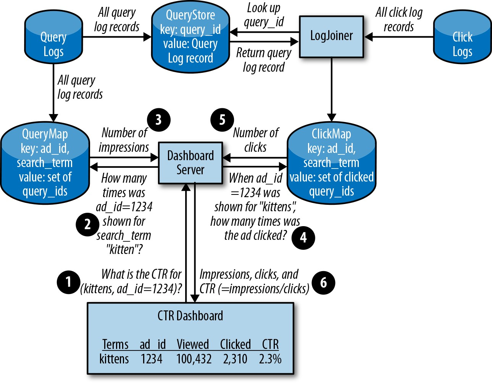
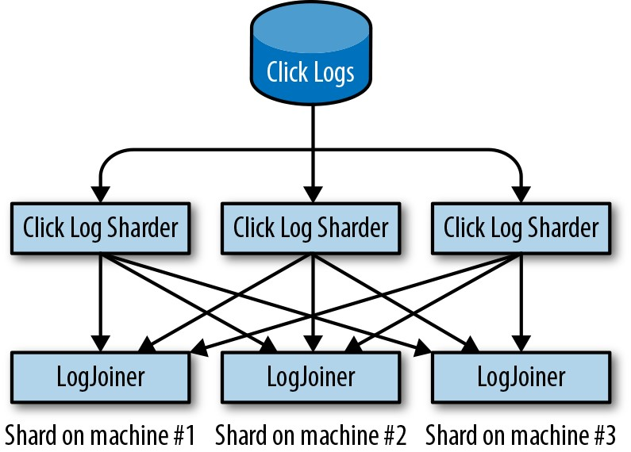
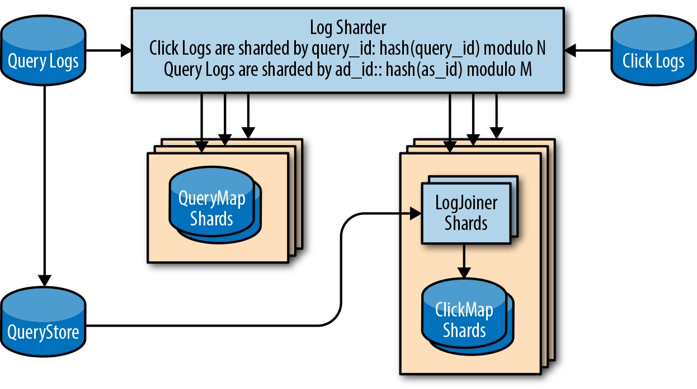

# **第12章**

### **介绍非抽象的大型系统设计**

 

***由Salim Virji，James Youngman，Henry Robertson***

***斯蒂芬·索恩(Stephen Thorne)，戴夫·雷恩(Dave Rensin)和佐尔坦·埃吉(Zoltan Egyed)与理查德·邦迪(Richard Bondi)撰写***

 
 

SRE担负着跨生产运营和产品工程的职责，在调整业务案例要求和运营成本方面处于独特的位置。产品工程团队可能没有意识到他们设计的系统的维护成本，特别是如果该产品团队正在构建一个将更大的生产生态系统纳入考虑范围的组件时，尤其如此。

根据Google在开发系统方面的经验，我们认为可靠性是任何生产系统中最关键的功能。我们发现推迟设计过程中的可靠性问题等同于以更高的成本接受更少的功能。通过遵循系统设计和实现的迭代方式，我们以较低的运维成本实现了强大且可扩展的设计。我们称这种风格为*非抽象大型系统设计(NALSD)*。

## **什么是NALSD？**

本章介绍了NALSD方法:我们从问题陈述开始，收集需求，并遍历越来越复杂的设计，直到找到可行的解决方案。最终，我们得到了一个可以抵御多种故障模式的系统，该系统既满足初始要求，又满足了我们反复提出的更多细节。

NALSD描述了SRE的一项关键技能:评估，设计和评估大型系统的能力。实际上，NALSD结合了容量规划，组件隔离和正常系统降级的要素，这些要素对于高可用性生产系统至关重要。期望Google SRE能够从系统的基本白板图开始资源规划，仔细考虑各种扩展和故障域，并将其设计集中于具体的资源建议。由于这些系统会随时间而变化，因此SRE能够分析和评估系统设计的关键方面至关重要。

**为什么要使用"非抽象"？**

所有系统最终都将必须使用真实网络在真实数据中心的真实计算机上运行。Google已经了解到(艰难的方式)，设计分布式系统的人员需要开发并不断锻炼，以将白板设计转化为过程中多个步骤的具体资源估算。如果没有这种严格性，那么创建在现实世界中无法完全转换的系统就太诱人了。

前期的额外工作通常会减少最后一刻对系统设计的更改，从而解决一些无法预料的物理限制。

请注意，虽然我们将这些练习推向离散的结果(例如，机器数量)，但声音推理和假设制定的示例比任何最终值都重要。早期的假设会严重影响计算结果，而完美的假设并非NALSD的要求。这项工作的价值在于将许多不完美但合理的结果结合在一起，从而更好地理解设计。

**AdWords示例**

Google AdWords服务在Google Web搜索上显示文字广告。"点击率"(CTR)指标可告诉广告客户其广告效果如何。点击率是广告点击次数与广告点击次数之比。

这个AdWords范例旨在设计一个能够衡量和报告每个AdWords广告准确点击率的系统。我们计算点击率所需的数据记录在搜索和广告投放系统的日志中。这些日志分别记录为每个搜索查询显示的广告和被单击的广告。

**设计过程**

Google使用迭代方法来设计符合我们目标的系统。每次迭代都会定义一个潜在的设计并检查其优缺点。该分析要么进入下一次迭代，要么表明设计何时足以推荐。

概括地说，NALSD过程分为两个阶段，每个阶段都有两到三个问题。

在基本设计阶段，我们尝试发明一种"原理上可行"的设计。我们问两个问题:

*可能吗？*

> 设计是否可行？如果我们不必担心足够的RAM，CPU，网络带宽等等，那么我们将如何设计以满足需求？

*我们可以做得更好吗？*

> 对于任何此类设计，我们都会问:"我们可以做得更好吗？"例如，我们可以使系统有意义地更快，更小，更高效吗？如果设计在[O(*N*)时间内解决了问题，](http://bit.ly/2LPpixO)我们可以更快地解决它吗？-例如，O(ln(*N*))？

在下一阶段，我们*尝试扩大*我们的基本设计-例如，通过大幅增加需求。我们问三个问题:

*可行吗？*

> 考虑到资金，硬件等方面的限制，是否可以扩展此设计？如有必要，哪种分布式设计可以满足要求？

*弹性吗？*

设计可以优雅地失败吗？该组件发生故障时会发生什么？当整个数据中心发生故障时，系统如何工作？*我们可以做得更好吗？*

虽然我们通常以大致的顺序涵盖这些阶段和问题，但实际上，我们会在问题和阶段之间跳来跳去。例如，在基本设计阶段，我们常常会不断增长和扩展。

然后我们进行迭代。一种设计可能成功地通过了大多数阶段，直到后来陷入困境。发生这种情况时，我们将重新开始，修改或更换组件。最终的设计是一个曲折故事的结尾。

考虑到这些概念，让我们逐步进行NALSD迭代过程。

**初始要求**

每个广告商可以具有多个广告。每个广告均由ad_id键控，并与广告商选择的搜索字词列表相关联。

向广告客户显示仪表板时，我们需要了解每个广告和搜索字词的以下内容:

- 此搜索字词触发该广告展示的频率

- 看过广告的人点击了广告多少次

利用这些信息，我们可以计算出点击率:点击次数除以展示次数。

我们知道，广告客户关心的是两件事:仪表板快速显示，并且数据是最新的。因此，在进行设计迭代时，我们将根据SLO来考虑我们的要求(有关更多详细信息，请参见第2章):

- 99.9％的仪表板查询在\<1秒内完成。

- 99.9％的时间显示5分钟内的点击率数据。

这些SLO提供了我们应该能够持续实现的合理目标。它们还提供了一个错误预算(请参阅*Site Reliability Engineering *中的[第4章](http://bit.ly/2szBKsK))，我们将在设计的每次迭代中将我们的解决方案与之进行比较。

我们旨在创建一个既可以满足我们的SLO要求，又可以支持数百万希望在信息中心上查看其点击率的广告客户的系统。对于事务处理速率，我们假设每秒500,000个搜索查询和每秒10,000次广告点击。

**一台机器**

最简单的起点是考虑在单个计算机上运行我们的整个应用程序。

对于每个网络搜索查询，我们记录:

time

> 查询发生的时间

query_id

> 唯一查询标识符(查询ID)

search_term
> 查询内容

ad_id
> 为搜索显示的所有AdWords广告的广告ID

这些信息一起构成了"查询日志"。每次用户点击广告时，我们会将点击时间，查询ID和广告ID记录在*点击日志*中。

您可能想知道为什么我们不只是将search_term添加到点击日志中以降低复杂性。在我们示例的任意缩小范围内，这是可行的。但是，实际上，点击率实际上只是从这些日志计算得出的许多洞察中的一种。单击日志是从URL派生的，URL具有固有的大小限制，这使单独的查询日志成为更具可伸缩性的解决方案。与其通过在练习中添加类似CTR的额外要求来证明这一点，我们将只是承认这一假设并继续前进。

显示仪表板需要两个日志中的数据。我们需要证明我们可以实现我们的SLO，即在一秒钟内在仪表板上显示新数据。要达到此SLO，系统会处理大量的点击和查询，因此，计算CTR的速度必须保持恒定。

为了满足我们在一秒钟内显示仪表板的SLO，我们需要快速查找给定ad_id的每个search_term点击和显示的query_id数量。我们可以从查询日志中提取每个search_term *显示* query_id和ad_id的细目分类。点击率仪表板需要ad_ids的查询日志和点击日志中的所有记录。

如果我们有多个广告客户，则扫描查询日志和单击日志以生成仪表板将非常低效。因此，我们的设计要求我们的一台计算机创建适当的数据结构，以便在接收日志时进行快速的点击率计算。在单台计算机上，使用在query_id和search_term上具有索引的SQL数据库应该能够在一秒钟内提供答案。

通过将这些日志加入query_id并按search_term分组，我们可以报告每次搜索的点击率。

**计算**

我们需要计算需要多少资源来解析所有这些日志。为了确定我们的扩展限制，我们需要做一些假设，从查询日志的大小开始:

time
> 64位整数，8字节

query_id
> 64位整数，8字节

ad_id
> 三个64位整数，8个字节

search_term
> 长字符串，最多500个字节

*其他元数据*

> 500--1,000字节的信息，例如投放广告的机器，搜索所用的语言以及搜索项返回的结果数

为了确保我们不会过早达到限制，我们积极地将每条查询日志条目视为2 KB。点击日志量应大大小于查询日志量:由于平均点击率是2％(10,000次点击/ 500,000次查询)，因此点击日志的记录数将是查询日志的2％。请记住，我们选择了大量的数字来说明这些原理可以扩展到任意大型实现。这些估计值似乎很大，因为它们应该是。

最后，我们可以使用科学计数法来限制由不一致单元上的算术引起的错误。24小时内生成的查询日志的数量为:

> (5×10^5 查询/秒)×(8.64×10^4 秒/天)×(2×10^3 字节)= 86.4 TB/天

因为我们获得的点击次数是查询的2％，并且我们知道数据库索引会增加一些合理的开销，所以我们可以将每天86.4 TB的空间四舍五入到存储一天的日志数据所需的100 TB空间。

由于总存储需求为\〜100 TB，我们需要做出一些新的假设。这种设计是否仍可以在单台机器上使用？虽然可以将100 TB的磁盘连接到一台计算机，但是我们很可能会受到该计算机读取和写入磁盘的能力的限制。

例如，一个普通的4 TB HDD可能每秒能够维持200个输入/输出操作(IOPS)。如果每个日志条目可以平均每个日志条目存储一个磁盘并为其建立索引，那么我们会发现IOPS是查询日志的限制因素:

> (5×10^5 查询/秒)/(200 IOPS/磁盘)= 2.5×10^3 磁盘或2,500磁盘

即使我们可以以10:1的比例批量查询以限制操作，在最佳情况下，我们也需要数百个HDD。考虑到查询日志写入只是设计IO要求的一个组成部分，我们需要使用一种比传统HDD更好地处理高IOPS的解决方案。

为简单起见，我们将直接评估RAM，而跳过对其他存储介质(如固态磁盘(SSD))的评估。一台机器无法完全在RAM中处理100 TB的占用空间:假设我们拥有16核，64 GB RAM和1 Gbps网络吞吐量的标准机器占用空间，则需要:

> (100 TB)/(64 GB RAM/计算机)= 1,563台计算机

**评估**

暂时忽略我们的计算，并想象我们可以将这种设计安装在一台机器上，我们真的想要吗？如果我们通过询问"该组件发生故障时会发生什么情况"来测试我们的设计，我们会确定一长串单点故障(例如，CPU，内存，存储，电源，网络，散热)。如果这些组件之一发生故障，我们是否可以合理地支持我们的SLO？几乎可以肯定，即使是简单的电源重启也会严重影响我们的用户。

回到我们的计算中，我们的单机设计再次显得不可行，但是这一步并没有浪费时间。我们发现了关于如何合理解释系统约束及其初始要求的宝贵信息。我们需要改进设计以使用多台机器。

**分布式系统**

我们需要的search_terms在查询日志中，而ad_ids在点击日志中。既然我们知道我们将需要多台机器，那么加入它们的最佳设计是什么？

**MapReduce**

我们可以使用[MapReduce](http://bit.ly/2kELxue)处理和连接日志。我们可以定期获取累积的查询日志和单击日志，然后MapReduce将产生一个由ad_id整理的数据集，该数据集显示每个search_term收到的点击次数。

MapReduce用作批处理程序:其输入是一个大型数据集，它可以使用许多计算机通过工作程序处理该数据并产生结果。所有机器处理完数据后，就可以将其输出进行合并-MapReduce可以直接为每个AdWords广告和搜索词创建每个点击率的摘要。我们可以使用这些数据来创建所需的仪表板。

**评估** MapReduce是一种广泛使用的计算模型，我们相信它将水平扩展。无论我们的查询日志和单击日志输入有多大，添加更多计算机都将始终使该过程成功完成，而不会耗尽磁盘空间或RAM。

不幸的是，这种类型的批处理无法在收到日志后的5分钟内达到我们的SLO加入日志可用性。为了在5分钟内提供结果，我们需要小批量运行MapReduce作业-一次只需记录几分钟。批次的任意性和非重叠性使小批量不切实际。如果一个记录的查询在批次1中，并且其单击在批次2中，则该单击和查询将永远不会合并。虽然MapReduce可以很好地处理独立的批次，但并未针对此类问题进行优化。此时，我们可以尝试使用MapReduce找出潜在的解决方法。但是，为简单起见，我们将继续研究另一种解决方案。

**LogJoiner**

用户点击的广告数量明显少于投放的广告数量。直观地讲，我们需要专注于扩展两者中的较大者:查询日志。为此，我们引入了一个新的分布式系统组件。

与其像MapReduce设计中那样小批量查找query_id，如果我们创建了所有查询的存储库，可以按需通过query_id查找该查询，该怎么办？我们将其称为*QueryStore*。它包含查询日志的完整内容，并以query_id为关键字。为避免重复，我们将假设单机设计中的计算将应用于QueryStore，并将对QueryStore的审查限于我们已经介绍的内容。有关此类组件如何工作的更深入讨论，建议阅读有关Bigtable的文章。[^72]

由于点击日志也具有query_id，因此我们的处理循环的规模现在要小得多:它只需要遍历点击日志并拉入引用的特定查询。我们将此组件称为*LogJoiner*。

LogJoiner从点击日志中获取连续的数据流，将其与QueryStore中的数据结合起来，然后存储该信息(按ad_id进行组织)。一旦点击的查询被ad_id存储并建立索引，我们就拥有生成点击率信息中心所需数据的一半。我们将其称为*ClickMap*，因为它是从ad_id映射到点击次数的。

如果找不到点击的查询(接收查询日志可能会变慢)，我们将其搁置一段时间，然后重试，直到时限。如果在该时间限制之前找不到查询，我们将放弃该点击。

对于每个ad_id和search_term对，CTR仪表板都需要两个组件:展现数和点击广告数。ClickMap需要一个合作伙伴来保存按ad_id进行组织的查询。我们将其称为*QueryMap*。QueryMap直接从查询日志中获取所有数据，并通过ad_id为条目建立索引。

图12-1描述了数据如何流经系统。

LogJoiner设计引入了几个新组件:LogJoiner，QueryStore，ClickMap和QueryMap。我们需要确保这些组件可以扩展。

*图12-1.基本的LogJoiner设计；点击数据得到处理和存储，以便仪表板可以检索它*

**计算** 根据我们在先前迭代中执行的计算，我们知道QueryStore在一天的日志中将有大约100 TB的数据。我们可以删除太旧而没有价值的数据。

LogJoiner应该在单击时处理单击，并从QueryStore检索相应的查询日志。

LogJoiner处理日志所需的网络吞吐量取决于我们日志中每秒的点击次数，再乘以2 KB记录大小:

> (10^4 点击/秒)×(2×10^3 字节)= 2×10^7 = 20 Mb/秒 = 160 Mbps

QueryStore查找会导致额外的网络使用情况。对于每个点击日志记录，我们查找query_id并返回完整的日志记录:

- (10^4 点击/秒)×(8字节) = 8×10^4 = 80 Kb/秒 = 640 Kbps

- (10^4 单击/秒) * (2×10^3 字节) = 2×10^7 = 20 Mb/秒 = 160 Mbps

LogJoiner还将结果发送到ClickMap。我们需要存储query_id，ad_id和时间。搜索词。 time和query_id均为64位整数，因此数据将小于1 KB:

> (10^4 点击/秒)×(10^3 字节) = 10^7 = 10 Mb/秒 = 80 Mbps

总计〜400 Mbps是我们机器的可控制数据传输速率。

ClickMap必须存储每次单击的时间和query_id，但不需要任何其他元数据。我们将忽略ad_id和search_term，因为它们是很小的线性因子(例如，广告商数量×广告数量×8字节)。即使是1000万个广告客户，每个广告有10个，也只有\〜800 MB。一天的ClickMap价值为:

> (10^4 次点击/秒)×(8.64×10^4 秒/天)×(8字节 + 8字节)= 1.4×10^10 = 14 GB/天

我们会将ClickMap的舍入额提高到每天20 GB，以解决所有开销和我们的ad_id。

填写QueryMap时，我们需要为显示的每个广告存储query_id。我们的存储需求有所增加，因为每个搜索查询都可能会点击三个ad_id，因此我们最多需要在三个条目中记录query_id:

> 3×(5×10^5 查询/秒)×(8.64×10^4 秒/天)×(8字节 + 8字节) = 2×10^1 [^73] = 2 TB/天用于QueryMap

2 TB足够小，可以在使用HDD的单台计算机上托管，但是从单机迭代中我们知道，单个小写操作太频繁而无法存储在硬盘驱动器上。虽然我们可以计算使用更高IOPS驱动器(例如SSD)的影响，但我们的练习重点是演示系统可以扩展到任意大的尺寸。在这种情况下，我们需要围绕一台计算机的IO限制进行设计。因此，扩展设计的下一步是"分片"输入和输出:将传入的查询日志和单击日志分成多个流。

**分片的LogJoiner**

我们在此迭代中的目标是运行多个LogJoiner实例，每个实例都在不同的数据分片上。^2 为此，我们需要考虑以下几个因素:

*数据管理*

> 要加入查询日志和单击日志，我们必须将每个单击日志记录与其在query_id上的相应查询日志记录进行匹配。该设计应防止网络和磁盘吞吐量随扩展规模而限制我们的设计。

*可靠性*

> 我们知道机器随时可能发生故障。当运行LogJoiner的计算机发生故障时，我们如何确保我们不会丢失正在进行的工作？

*效率*

> 我们可以在没有浪费的情况下扩大规模吗？我们需要使用最少的资源来满足我们对数据管理和可靠性的关注。

我们的LogJoiner设计表明，我们可以连接我们的查询日志和单击日志，但是生成的数据量非常大。如果我们根据query_id将工作划分为多个分片，则可以并行运行多个LogJoiners。

如果提供了合理数量的LogJoiner实例，则如果我们平均分配日志，则每个实例只能通过网络接收一小部分信息。随着点击流量的增加，我们通过添加更多LogJoiner实例来水平扩展，而不是通过使用更多的CPU和RAM来垂直扩展。

如图12-2所示，为了使LogJoiners接收正确的消息，我们引入了一个称为*log sharder*的组件，该组件会将每个日志条目定向到正确的目的地。对于每条记录，我们的点击日志分片都将执行以下操作:

1.  散列记录的query_id。

2.  用*N*(分片数)对结果取模，然后加1以得到1到* N *之间的数字。

3.  将记录发送到步骤2中的分片号。

*图12-2.分片应如何工作？*

现在，每个LogJoiner都将获得由query_id分解的传入日志的一致子集，而不是完整单击日志。

QueryMap也需要分片。我们知道，要维持QueryMap所需的IOPS，将需要许多硬盘驱动器，而且一天的QueryMap(2 TB)的大小对于我们的64 GB计算机而言无法存储在RAM中。但是，我们不像LogJoiner那样通过query_id进行分片，而是对ad_id进行分片。ad_id在任何读取或写入之前就已知道，因此使用与LogJoiner和CTR仪表板相同的哈希方法将提供一致的数据视图。

为了使实现保持一致，我们可以将ClickMap的日志分片设计与QueryMap重复使用，因为ClickMap小于QueryMap。

现在我们知道我们的系统可以扩展，我们可以继续解决系统的可靠性。我们的设计必须能够抵抗LogJoiner故障。如果LogJoiner在收到日志消息之后但在加入日志消息之前失败，则必须重做其所有工作。这会延迟准确数据到达仪表板的时间，这将影响我们的SLO。如果我们的日志分片程序将重复的日志条目发送到两个分片，则即使LogJoiner发生故障(可能是因为其所在的计算机发生故障)，系统仍可以继续全速运行并处理准确的结果。

通过以这种方式复制工作，我们减少(但不消除)丢失那些合并日志的机会。两个碎片可能会同时断裂并丢失连接的日志。通过分配工作量以确保没有重复的碎片落在同一台计算机上，我们可以减轻很多这种风险。如果两台机器同时发生故障，并且我们丢失了这两个分片的副本，则系统的错误预算(请参阅第一本SRE手册中的[第4章](http://bit.ly/2szBKsK))可以弥补其余的风险。确实发生灾难时，我们可以重新处理日志。在短暂的时间范围内，仪表板只会显示比5分钟还早的数据。

图12-3显示了我们对分片及其副本的设计，其中LogJoiner，ClickMap和QueryMap都建立在这两个分片上。

从连接的日志中，我们可以在每个LogJoiner计算机上构造一个ClickMap。为了显示我们的用户仪表板，所有ClickMap都需要组合和查询。

**评估**将分片组件托管在一个数据中心中会造成单点故障:如果恰巧不幸机器对或数据中心断开连接，我们将失去所有ClickMap的工作，并且用户仪表板将完全停止工作！我们需要改进设计以使用多个数据中心。

*图12-3.具有相同query_id的日志分片以复制分片*

**多数据中心**

在不同地理位置的数据中心之间复制数据使我们的服务基础架构能够承受灾难性的故障。如果一个数据中心宕机(例如，由于一天的停电或网络中断)，我们可以故障转移到另一个数据中心。为使故障转移正常工作，ClickMap数据必须在部署系统的所有数据中心中都可用。

这样的ClickMap可能吗？我们不想将计算需求乘以数据中心的数量，但是如何才能有效地同步站点之间的工作以确保足够的复制而又不产生不必要的重复？

我们刚刚描述了分布式系统工程中众所周知的[consensus](http://bit.ly/2J2erD7)问题的示例。有许多解决此问题的复杂算法，但是基本思想是:

1.  制作三个或五个您要共享的服务的副本(如ClickMap)。

2.  让副本使用共识算法，例如[Paxos](http://bit.ly/1X2NFew)，以确保如果发生数据中心大小的故障，我们可以可靠地存储计算状态。

3.  在参与节点之间实现至少一个网络往返时间以接受写操作。此要求限制了系统的顺序吞吐量。我们仍然可以并行处理对分布式基于共识的映射的某些写操作。

按照上面列出的步骤，现在原则上看来多数据中心设计是可行的。它也可以在实践中起作用吗？我们需要什么类型的资源，我们需要多少？

**计算** 使用故障隔离的数据中心执行Paxos算法的等待时间意味着完成每个操作大约需要25毫秒。这种延迟假设是基于至少相距数百公里的数据中心。因此，就顺序处理而言，我们每个操作只能执行一个操作

25毫秒或每秒40次操作。如果我们需要每秒执行10^4 次的连续处理(单击日志)，则每个数据中心至少需要250个处理，并由ad_id进行分拣，以进行Paxos操作。实际上，我们希望添加更多的流程来提高并行度-在任何停机时间或流量高峰后处理累积的积压。

基于我们先前对ClickMap和QueryMap的计算，并使用每秒40次连续操作的估计，我们的多数据中心设计需要多少台新机器？

因为我们经过分派的LogJoiner设计为每个日志记录引入了一个副本，所以我们将每秒事务数增加了一倍，以创建ClickMap和QueryMap:每秒20,000次点击和每秒1,000,000次查询。

我们可以通过将每秒的总查询数除以每秒的最大操作数来计算所需的最小进程数或*"任务"*数:(1.02×10^6 查询/秒)/(40操作/秒)= 25,500个任务

每个任务的内存量(2 TB QueryMap的两个副本):

> (4×10^12 字节)/(25,500个任务) = 157 MB/任务

每台计算机的任务:

> (6.4×10^10 字节)/(1.57×10^8 字节) = 408个任务/机器

我们知道我们可以在一台计算机上完成许多任务，但是我们需要确保不会出现IO瓶颈。ClickMap和QueryMap的总网络吞吐量(使用每个条目2 KB的高估算值):

> (1.02×10^6 查询/秒)×(2×10^3 字节) = 2.04 Gb/秒 = 16 Gbps

每个任务的吞吐量:

> 16 Gbps / 25,500个任务 = 80 KB/秒= 640 Kbps/任务

每台机器的吞吐量:

> 408个任务×640 Kbps/任务 = 256 Mbps

157 MB内存和640 Kbps每个任务的组合是可管理的。每个数据中心大约需要4 TB RAM，以托管分片的ClickMap和QueryMap。如果每台计算机有64 GB的RAM，那么我们只能从64台计算机提供数据，并且将仅使用每台计算机25％的网络带宽。

**评估**现在我们已经设计了一个多数据中心系统，让我们回顾一下数据流是否有意义。

图12-4显示了整个系统设计。您可以查看如何将每个搜索查询和广告点击传达给服务器，以及如何收集日志并将其推送到每个组件中。

我们可以根据我们的要求检查该系统:

*每秒10,000次广告点击*

> LogJoiner可以水平缩放以处理所有日志单击，并将结果存储在ClickMap中。

*每秒500,000个搜索查询*

> QueryStore和QueryMap被设计为以这种速率处理一整天的数据。

* 99.9％的仪表板查询在\<1秒内完成*

> CTR仪表板从QueryMap和ClickMap中获取数据，这些数据以ad_id为键，从而使该事务变得快速而简单。

* 99.9％的时间显示的点击率数据不到5分钟*

> 每个组件均设计为水平扩展，这意味着如果流水线速度太慢，则添加更多计算机将减少端到端流水线延迟。

我们相信这种系统架构可以扩展以满足我们对吞吐量，性能和可靠性的要求。

## 总结

NALSD描述了Google用于生产系统的系统设计的迭代过程。通过将软件分解为逻辑组件，并将这些组件放入具有可靠基础架构的生产生态系统中，我们得到了为数据一致性，系统可用性和资源效率提供合理和适当目标的系统。NALSD的实践使我们能够改进设计，而不必在各种各样的设计迭代中为每次迭代重新开始。

本章介绍的内容满足了我们最初的问题陈述，每次迭代都揭示了新的要求，可以通过扩展以前的工作来满足这些要求。

在整个过程中，我们根据对系统增长的期望来分离软件组件。这种策略使我们能够独立扩展系统的不同部分，并消除了对单个硬件或单个软件实例的依赖，从而产生了一个更可靠的系统。

在整个设计过程中，我们继续通过询问NALSD的四个关键问题来改进每次迭代:

*可能吗？*

> 我们能在没有"魔法"的情况下建造它吗？

*我们可以做得更好吗？*

> 它是否尽我们所能地简单？

*可行吗？*

> 是否符合我们的实际限制(预算，时间等)？

*弹性吗？*

> 它会在偶尔但不可避免的中断中生存吗？

NALSD是一项博学的技能。与任何技能一样，您需要定期练习以保持您的熟练程度。Google的经验表明，从抽象需求到具体资源近似的推理能力对于构建健康且寿命长的系统至关重要。

 
 

[^72]: Fay Chang等人，"大表: 一种用于结构化数据的分布式存储系统，"*《计算机系统上的ACM事务处理》(TOCS)*26，第2号(2008)，[*http: //bit.ly/2J22BZv*](http://bit.ly/2J22BZv)。

[^73]: 本部分基于Rajagopal Ananthanarayanan等人的"光子: 连续数据流的容错和可伸缩联接"，在SIGMOD '13中: *2013 ACM SIGMOD国际数据管理国际会议论文集*(纽约: ACM，2013年)，[*http: //bit.ly/2Jse3Ns*](http://bit.ly/2Jse3Ns)。