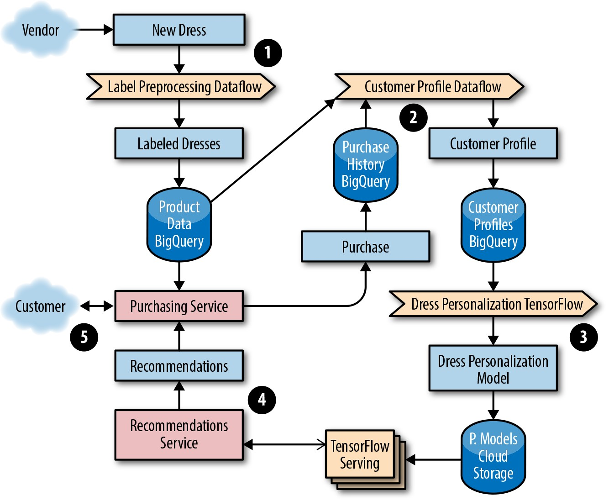
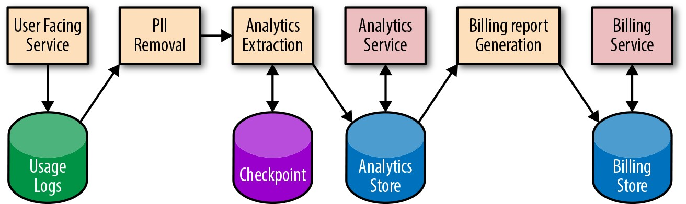
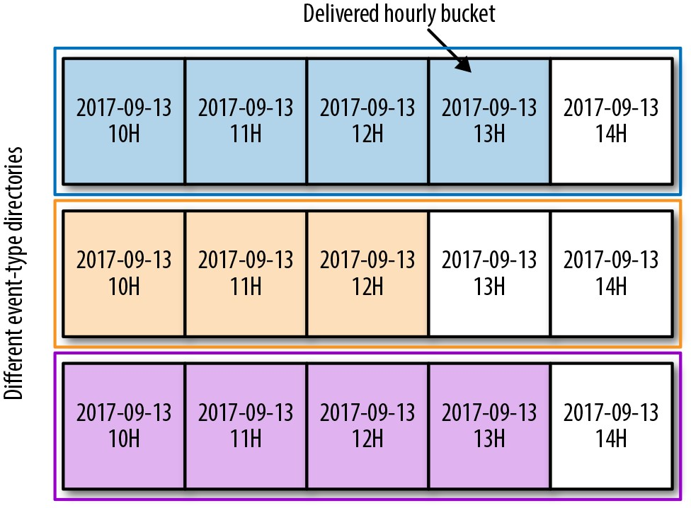
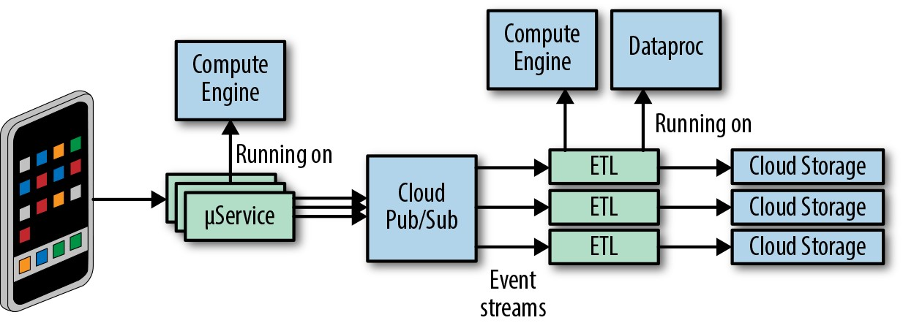
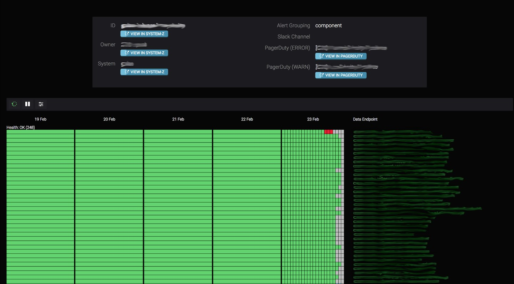
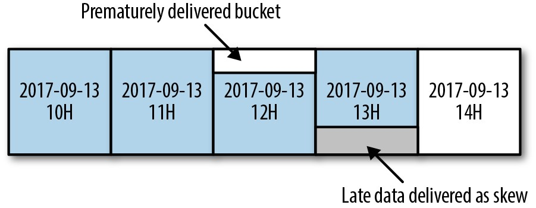
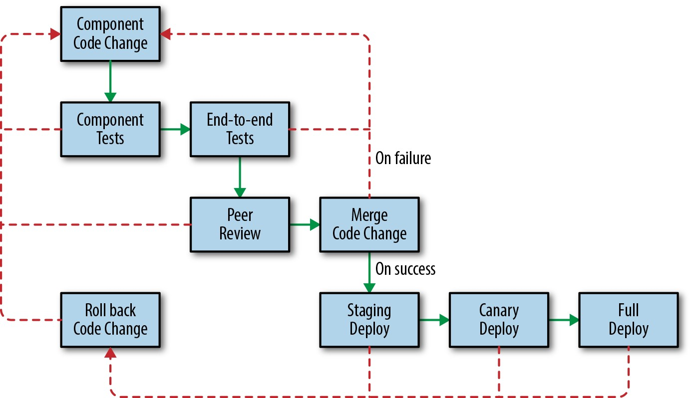

# **第13章**

### **数据处理管道**

<br/>

***由Rita Sodt和IgorMaravić(Spotify)与Gary Luo，Gary O'Connor和Kate Ward合作撰写***

<br/>
<br/>

数据处理是一个复杂的领域，它不断发展以满足更大的数据集，大量的数据转换以及对快速，可靠和廉价的结果的需求。当前的格局具有从各种来源生成和收集的数据集-从移动使用情况统计信息到集成的传感器网络再到Web应用程序日志，等等。数据处理管道可以将这些通常无限制，无序的全球规模的数据集转变为结构化的索引存储，可以帮助您确定重要的业务决策或解锁新产品功能。除了提供对系统和用户行为的洞察力之外，数据处理通常还对业务至关重要。管道中的数据延迟或不正确可能会显示在用户界面上，这些问题既昂贵，费力又费时，而且修复起来很费时间。本章从使用产品示例开始，以研究大数据处理管道的一些常见应用程序类型。然后，我们探索如何确定管道需求和设计模式，并列举一些在整个开发生命周期中管理数据处理管道的最佳实践。我们将介绍您可以进行的权衡，以优化管道以及测量管道运行状况重要信号的技术。为了使服务在部署后保持健康和可靠，SRE(以及开发人员)应该能够浏览所有这些任务。理想情况下，SRE应该从早期开始就参与这项工作:Google的SRE小组会定期与开发数据处理管道的小组进行磋商，以确保可以轻松发布，修改和运行该管道而不会对客户引起任何问题。


最后，Spotify案例研究概述了其事件传递处理管道，该管道使用内部，Google Cloud和其他第三方解决方案的组合来管理复杂的，对业务至关重要的数据处理管道。无论您是直接掌控管道，还是掌控其他依赖于管道产生的数据的服务，我们都希望您可以使用本章中的信息来帮助使管道(和服务)更加可靠。

有关Google关于数据处理管道的哲学的全面讨论，请参阅我们的第一本SRE书的[第25章](http://bit.ly/2JiPeDI)。

## **管道应用**

管道应用程序种类繁多，每种都有其自身的优势和用例。流水线可以涉及多个阶段。每个阶段都是一个独立的过程，依赖于其他阶段。一个管道可能包含多个阶段，这些阶段通过一个高级规范被抽象出来。例如，在Cloud Dataflow中:用户使用相对高级的API编写业务逻辑，[管道技术](http://bit.ly/2LRmU9P)本身将这些数据转换为一系列步骤，或者一个人的输出是另一个人的输入的阶段。为了让您大致了解管道应用程序的广度，接下来我们介绍几种管道应用程序及其推荐用途。我们使用两家具有不同管道和实施要求的示例公司来演示满足其各自数据需求的不同方法。这些示例说明您的特定用例如何定义项目目标，以及如何使用这些目标就哪种数据管道最适合您做出明智的决定。


**订单或结构数据的事件处理/数据转换**

提取转换加载(ETL)模型是数据处理中的常见范例:从源中提取数据，对其进行转换并可能进行非规范化，然后"重新加载"为专用格式。在更现代的应用程序中，这可能看起来像一个认知过程:从某种传感器(实时或回放)中获取数据以及选择和编组阶段，然后"训练"专用数据结构(例如机器学习网络)。

ETL管道以类似的方式工作。从单个(或多个)源中提取数据，进行转换，然后将其加载(或写入)到另一个数据源中。转换阶段可以满足各种用例，例如:

- 更改数据格式以添加或删除字段

- 跨数据源聚合计算功能

- 将索引应用于数据，以便为使用数据的作业提供更好的特性

通常，ETL管道会准备数据以进行进一步分析或提供服务。如果使用正确，ETL管道可以执行复杂的数据操作，并最终提高系统效率。ETL管道的一些示例包括:

- 机器学习或商业智能用例的预处理步骤

- 计算，例如计算给定事件类型在特定时间间隔内发生了多少次

- 计算和准备帐单报告

- 为Google的网络搜索提供支持的索引管道

**数据分析**

*商业智能*是指用于收集，集成，分析和呈现大量信息以做出更好决策的技术，工具和做法。[^74]无论您是零售产品，手机游戏还是[物联网传感器](http://bit.ly/2HboyQc)跨多个用户或设备汇总数据，可以帮助您确定发生故障或运行良好的位置。

为了说明数据分析用例，让我们研究一个虚构的公司及其最近发布的手机和网络游戏*Shave the Yak*。拥有者想知道他们的用户如何在他们的移动设备和网络上与游戏进行交互。第一步，他们生成游戏的数据分析报告，以处理有关玩家事件的数据。该公司的业务负责人要求提供有关该游戏最常用功能的每月报告，以便他们可以计划新功能开发并进行市场分析。游戏的移动分析和网络分析存储在Google Cloud [BigQuery](https://cloud.google.com/bigquery/)表中，该表每天由[Google Analytics](http://bit.ly/2JmC8oT)更新三次。团队设置了一个作业，每当将新数据添加到这些表时，该作业便会运行。完成后，该作业将在公司的每日汇总表中输入。

**机器学习**

机器学习(ML)应用程序用于多种目的，例如帮助预测癌症，对垃圾邮件进行分类以及为用户提供个性化的产品推荐。通常，ML系统具有以下阶段:

1.  数据特征及其[标签](http://bit.ly/2J8ZbQX)从较大的数据集中提取。

2.  ML算法在提取的特征上训练模型。

3.  在测试数据集上评估模型。

4.  该模型可用于(服务)其他服务。

5.  其他系统使用模型提供的响应来做出决策。

为了演示实际操作中的ML管道，让我们考虑一个虚构的公司Dressy的示例，该公司在线销售礼服。该公司希望通过向用户提供有针对性的建议来增加收入。当新产品上载到网站时，Dressy希望他们的系统在12小时内开始将该产品纳入用户推荐中。最终，Dressy希望向用户提供与网站互动并为着装评分的近实时建议。作为他们推荐系统的第一步，Dressy研究以下方法:

*协作*

> 显示彼此相似的产品。

*分类*

> 显示相似用户喜欢的产品。

*基于内容*

> 显示与用户浏览或喜欢的其他产品相似的产品。

作为在线商店，Dressy具有用户配置文件信息和评论的数据集，因此他们选择使用聚类过滤器。上载到系统中的新产品没有结构化数据或一致的标签(例如，某些供应商可能会使用不同的类别和格式提供有关衣服的颜色，尺寸和功能的额外信息)。因此，他们需要实施管道以将数据预处理为与[TensorFlow](https://www.tensorflow.org/)兼容的格式，该格式将产品信息和用户个人资料数据连接在一起。ML系统包括用于预处理训练模型所需的多个来源的数据的管道。Dressy的开发团队使用培训数据创建TensorFlow模型，以向客户提供适当的建议。图13-1显示了完整的ML解决方案。之后，我们将详细说明每个步骤。

>


*图13-1.ML数据处理管道*

1.  开发团队选择使用流数据流管道Google Cloud Dataflow，通过将图像发送到返回特征列表的图像分类服务，将数据预处理为带标签的连衣裙格式。

2.  团队对来自多个来源的数据进行预处理，这些数据将用于训练一个模型，该模型返回前五名最相似的服饰。他们的工作流程根据服装产品数据和来自BigQuery中存储的客户资料的购买历史记录生成ML模型。

3.  他们选择使用流数据流管道将数据预处理为客户个性化配置文件的格式。这些配置文件用作训练TensorFlow模型的输入。经过训练的TensorFlow模型二进制文件存储在[Google Cloud Storage(GCS)存储桶](https://cloud.google.com/storage/)中。在推广到生产之前，该团队确保针对用于模型评估的预处理数据的测试集进行评估时，模型可以通过准确性检查。

4.  服务为网络和移动前端使用的给定客户提供建议。团队将TensorFlow与[Cloud ML](https://cloud.google.com/ml-engine/)在线预测服务一起使用。


5.  用于购买的面向客户的前端服务根据来自预测服务的最新着装建议为用户数据提供服务。

Dressy已注意到，新模型偶尔会在24小时内不会发布，并且建议会触发间歇性错误。首次部署新模型时，这是一个常见问题。但是，您可以采取一些简单的步骤来解决此问题。如果您开始发现决策，分类或建议没有浮出水面，陈旧或不正确，请问自己:

- 在对数据进行预处理以训练模型之前，数据是否一直进入管道？

- 我们是否由于软件错误而导致ML模型不佳？有很多垃圾邮件吗？用于训练模型的功能选择不正确吗？

- 最近是否生成了ML模型的新版本，或者该模型的过时版本正在生产中运行？

幸运的是，Dressy有一套工具可以在客户遇到任何问题之前对其进行监控和检测。如果发生中断，这些工具可以帮助他们快速修复或回滚任何有问题的代码。有关实施监控和警报的更多详细信息，请参阅第4章。

**管道最佳实践**

以下管道最佳实践适用于作为服务运行的管道(即负责及时正确处理数据以供其他系统使用的管道)。要正确地将管道作为服务部署，需要执行多个步骤。这些步骤包括从使用SLO定义和评估客户需求到从容应对降级和故障，编写文档并创建开发生命周期以在问题到达生产之前就发现问题，这些步骤就可以了。

**定义和衡量服务水平目标**

自动检测管道何时不正常以及是否无法满足客户需求非常重要。当您有可能超出错误预算的危险时接收通知(有关错误预算的更多详细信息，请参阅第2章)有助于最大程度地减少对客户的影响。同时，重要的是要在可靠性和功能发布之间取得舒适的平衡-您的客户关心这两者。本节的其余部分提供了管道SLO的示例以及如何维护它们。

**数据新鲜度**

大多数管道数据新鲜度SLO均采用以下格式之一:

- *X*％的数据以*Y*\[秒,天,分钟\]处理。

- 最旧的数据不超过*Y*\[秒,天,分钟\]。

- 管道作业已在*Y*\[秒,天,分钟\]内成功完成。

例如，*Shave the Yak*手机游戏可以选择以SLO为目标，要求在30分钟内将影响用户分数的所有影响用户分数的用户动作的99％反映在记分板上。

**数据正确性**

创建SLO以确保数据正确性可确保在管道中收到有关潜在数据错误的警报。例如，计费管道中的正确性错误可能导致向客户收取过多或过少的费用。正确性目标可能很难衡量，尤其是在没有预定义的正确输出的情况下。如果您无权访问此类数据，则可以生成它。例如，使用测试帐户来计算预期的输出。一旦有了这些"黄金数据"，就可以比较预期和实际输出。从那里，您可以创建对错误/差异的监控，并在测试数据流经实际生产系统时实施基于阈值的警报。

另一个数据正确性SLO涉及向后分析。例如，您可以设置一个目标，即每季度不超过0.1％的发票不正确。您可以为从管道输出数据提供错误数据或错误的小时/天数设置另一个SLO目标。数据正确性的概念因产品和应用程序而异。

**数据隔离/负载平衡**

有时，您将拥有优先级较高的数据段或需要更多资源来处理的数据段。如果您承诺在高优先级数据上采用更严格的SLO，则很重要的一点是，如果资源受到限制，则必须先处理此数据，然后再处理低优先级数据。此实现因管道而异，但通常表现为基于任务的系统中的不同队列或不同的作业。可以将管道worker配置为承担最高优先级的任务。也就是有多个使用不同资源配置(例如内存，CPU或[网络层]-](https://cloud.google.com/network-tiers)运行的管道应用程序和管道工作程序在配置较低的worker上无法成功，则可以使用配置较高的worker重试。在资源或系统受限的情况下，当不可能快速处理所有数据时，这种分离使您可以优先处理优先级较高的项目，而不是优先级较高的项目。

**端到端测量**

如果您的管道有一系列阶段，则可能很想测量每个阶段或每个组件的SLO。但是，以这种方式测量SLO并不能捕获客户的经验或系统的端到端运行状况。例如，假设您有一个基于事件的管道，例如Google Analytics(分析)。端到端SLO包括日志输入收集以及在数据达到服务状态之前发生的任何数量的管道步骤。您可以单独监控每个阶段并在每个阶段提供一个SLO，但是客户只关心SLO的所有阶段之和。如果要测量每个阶段的SLO，则将不得不加强每个组件的警报，这可能会导致出现更多无法模拟用户体验的警报。

此外，如果仅按每个阶段衡量数据的正确性，则可能会错过端到端数据损坏错误。例如，管道中的每个阶段都可以报告一切正常，但是一个阶段会引入一个字段，期望下游作业可以处理。此上游阶段假定多余的数据已被处理并用于向用户提供请求。下游作业不需要附加字段，因此会删除数据。两项工作都认为它们是正确的，但是用户看不到数据。

**依赖失败计划**

定义SLO后，优良作法是确认您不会过分依赖于其他无法满足其承诺的产品的SLO/SLA。许多产品(例如Google Cloud Platform)都在其网站上列出了其[SLA承诺](https://cloud.google.com/terms/sla)。一旦确定了任何第三方依存关系，就至少应针对其公布的SLA中说明的最大故障进行设计。例如，在定义SLO时，向Cloud Storage读取或写入数据的管道的所有者将确保[广告发布的正常运行时间和保证](https://cloud.google.com/storage/sla)合适。如果单区域正常运行时间保证少于管道满足其SLO的数据处理时间要求，则管道所有者可以选择跨区域复制数据以获得更高的可用性。

当服务提供商的基础架构中断其SLA时，结果可能会对依赖的管道产生负面影响。如果您的管道依赖于比服务提供商更严格的保证，则即使服务提供商仍在其SLA中，您的服务也可能会失败。有时，切实地为依赖项失败进行计划可能意味着接受较低级别的可靠性并为您的客户提供更宽松的SLA。[^75]

在Google，为了鼓励考虑到依赖失败的管道开发，我们安排了计划内的中断。例如，Google的许多管道取决于它们运行所在的数据中心的可用性。我们的灾难恢复测试(DiRT)经常针对这些系统，以模拟区域中断。发生区域中断时，计划进行故障处理的管道会自动故障转移到另一个区域。其他管道将延迟，直到发生故障的管道的操作员受到监控警报并手动进行故障转移为止。成功的手动故障转移假定管道可以获取足够的资源以在另一个区域启动生产堆栈。在最佳情况下，不成功的手动故障转移会延长中断时间。在最坏的情况下，处理作业可能会继续处理过时的数据，这会在任何下游管道中引入过时或不正确的数据。此类事件的恢复策略因您的设置而异。例如，如果正确的数据被错误的数据覆盖，则可能必须从以前的备份版本还原数据并重新处理所有丢失的数据。

总而言之，良好的做法是为您所依赖的系统不可用的那一天做好准备。即使是最好的产品也会失败，并遭受停运。定期练习灾难恢复方案，以确保您的系统能够应对常见和罕见的故障。评估您的依赖关系并尽可能自动执行系统响应。

**创建和维护管道文档**

如果编写和维护得当，系统文档可以帮助工程师可视化数据管道及其依赖项，了解复杂的系统任务，并有可能缩短停机时间。我们建议您的管道使用三类文档。

**系统图**

系统图类似于图13-2，可以帮助值班工程师快速找到潜在的故障点。在Google，我们鼓励团队绘制系统图来显示每个组件(管道应用程序和数据存储)，以及每个步骤发生的转换。图表中显示的每个组件和转换都可能卡住，从而导致数据停止流经系统。每个组件还可能引入影响数据正确性的软件或应用程序配置错误。

系统图应包含指向不同管道阶段的其他监控和调试信息的快速链接。理想情况下，这些链接应从实时监控信息中提取，以显示每个阶段的当前状态(例如，等待相关作业完成/处理/完成)。显示历史运行时信息还可以指示管道阶段花费的时间是否比预期的长。这种延迟可能预示性能下降或中断。

最后，即使在复杂的系统中，系统图也使开发人员可以更轻松地分析功能启动期间应了解的数据依赖性。




*图13-2.管道系统图(PII = 个人身份信息)*

**过程文档**

重要的是记录如何执行常见任务，例如发布新版本的管道或对数据格式进行更改。理想情况下，您还应该记录一些不太常见(通常是手动)的任务，例如在新区域中进行初始服务启动或最终服务关闭。记录完任务后，请调查将所有手动工作自动化的可能性。如果任务和系统是自动化的，请考虑直接从源代码生成文档，以便使两者保持同步。

**剧本条目**

系统中的每个警报条件都应具有一个相应的剧本条目，该条目描述了恢复步骤。在Google，我们发现将本文档链接到发送给值班工程师的任何警报消息中非常有用。在[我们的第一本书的第11章](http://bit.ly/2JgUBU7)中详细讨论了剧本条目。

**映射您的开发生命周期**

如图13-3所示，管道的开发生命周期(或对管道的更改)与其他系统的开发生命周期没有太大差异。本节遵循管道开发各个阶段的典型发布流程生命周期。


*图13-3.带有发布工作流程的管道开发生命周期*

**原型**

开发的第一阶段涉及对管道进行原型设计并验证语义。原型设计可确保您表达执行管道所需的业务逻辑。您可能会发现一种编程语言可以使您更好地表达业务逻辑，或者一种特定的语言可以更轻松地与现有库集成。特定的编程模型可能适合您的特定用例(例如，数据流与MapReduce，批处理与流传输)。有关完整的编程模型比较的示例，请参见我们的博客文章["Dataflow/Beam＆Spark:编程模型比较"](http://bit.ly/2Jj0VdA)。如果要将功能添加到现有管道中，建议在原型阶段添加代码并运行单元测试。

**以1％的演习进行测试**

完成原型后，使用生产数据在整个堆栈上运行一个小的设置会很有帮助。例如，使用实验集运行管道，或者在非生产环境中使用1％的生产数据空运行。逐步扩大规模，跟踪您的管道性能，以确保您不会遇到任何瓶颈。产品发布给客户后，请运行性能测试。这些测试是不可或缺的开发步骤，有助于防止因推出新功能而造成停机。

**演练**

在部署到生产之前，在预生产(或演练)环境中运行系统很有用。演练环境中的数据应尽可能接近实际生产数据。我们建议保留生产数据的完整副本或至少有代表性的子集。单元测试不能解决所有管道问题，因此让数据端到端流经系统以解决集成问题非常重要。

集成测试还可以识别错误。使用单元测试和集成测试，对新生成的数据与先前生成的已知正常数据进行A/B比较。例如，在对发行版进行认证并将其标记为可以投入生产之前，请检查您的先前发行版是否存在预期或意外的差异。

**金丝雀**

与无状态作业相比，管道测试和验证需要更多的时间和精力-数据得以保留，并且转换通常很复杂。如果生产版本中出现问题，请务必尽早发现问题，这样可以限制影响。修改您的管道会有所帮助！金丝雀是一个过程，通过该过程可以部分部署服务(在本例中为管道应用程序)并监控结果。有关金丝雀的详细讨论，请参见第16章。金丝雀绑定到整个管道，而不是单个进程。在金丝雀阶段，您可以选择处理与实时管道相同的实际生产数据，但是跳过对生产存储的写入。两阶段突变等技术可以提供帮助(请参见第279页的"幂等和两阶段突变"一节)。通常，您必须等待整个处理过程完成才能发现任何影响客户的问题。试运行(或两阶段突变)后，将金丝雀管道的结果与实时管道的结果进行比较，以确认其运行状况并检查数据差异。

有时可以通过逐步更新作业的任务或先在一个区域中然后在另一个区域中进行更新来在金丝雀中前进，但这并不总是通过管道实现。使用复制数据的管道(例如Dataproc[^76]和Dataflow,[^77])支持区域终结点[^78]，并防止这种金丝雀般的进展-您无法隔离地重新加载一个单元。如果您运行多宿主管道，则可能无法像执行服务工作一样将其部署到单个区域(或一定百分比的服务器)。而是先对一小部分数据执行转储，或者如前所述，先在空运行模式下转储。

在验证金丝雀或生产前环境期间，重要的是评估管道的运行状况。通常，您可以使用与跟踪SLO相同的指标。验证金丝雀是一项很适合自动化的任务。

**执行部分部署**

除了取消更改之外，您可能还希望执行部分部署，尤其是在存在主要功能启动或更改会影响系统性能和资源使用的情况下。如果不先对实际流量的子集测试更改，就很难预测这些发布的影响。您可以在接受允许的数据子集的管道中将部分部署实现为标志或配置选项。考虑首先处理一个或两个帐户的新功能，然后逐渐增加数据量(例如，样本数据的〜1％，〜10％，〜50％，最后是100％)。

部分部署可能会以多种方式出错:输入数据可能不正确或被延迟，数据处理可能存在错误，或者最终存储可能存在错误。这些问题中的任何一个都可能导致中断。避免将一组损坏的数据推广到您的低延迟前端。力争在用户遇到问题之前尽早发现这些类型的问题。

**部署到生产**

在将新的管道二进制文件和/或配置完全推广到生产环境之后，您应该有足够的信心确信您已经审查了任何潜在的问题(如果确实发生了问题，则监控将警报您)。如果您的部署出错，则能够从已知的良好状态快速还原(例如，回滚二进制文件)，并将任何可能损坏的数据标记为不良数据(例如，将不良数据替换为先前备份版本中的数据，请确保没有作业读取受影响的数据，和/或在必要时重新处理数据)。

**减少热点和工作负荷模式**

当资源由于过多的访问而变得超载而导致操作失败时，就会发生热点。管道容易受到工作负载模式的影响(包括通过读取和写入)，这会导致隔离的数据区域出现延迟。热点的一些常见示例包括:

- 由于多个管道工人正在访问一个服务任务而引发错误，从而导致过载。

- 由于并发访问仅在一台计算机上可用的一条数据，导致CPU耗尽。通常，数据存储的内部组件具有最低级别的粒度，如果进行大量访问，粒度可能会变得不可用(例如，[Spanner数位板](http://bit.ly/2J9fnSj)可能由于有问题的数据段而变得超载)即使大多数数据存储都可以)。

- 由于数据库中行级锁争用而导致的延迟。

- 由于同时访问硬盘驱动器而导致的延迟，这超出了驱动器磁头足够快地移动以快速定位数据的物理能力。在这种情况下，请考虑使用固态驱动器。

- 需要大量资源的大型工作单位。

热点可以隔离到一部分数据。为了解决热点问题，您还可以阻止诸如单个记录之类的细粒度数据。如果该数据被阻止，则其他管道可以继续进行。通常，您的基础架构可以提供此功能。如果大量的处理工作消耗了不成比例的资源，则管道框架可以通过将工作分解为较小的部分来动态地重新平衡。为了安全起见，最好还是将紧急关机内置到客户端逻辑中，以允许您停止处理并隔离以大量资源使用或错误为特征的细粒度处理工作。例如，您应该能够快速设置一个标志或推送一个配置，以使您可以跳过与特定模式或有问题的用户匹配的输入数据。其他减少热点的策略包括:

- 重组数据或访问模式以平均分散负载

- 减少负载(例如，静态分配部分或全部数据)

- 减少锁粒度以避免数据锁争用

**实施自动缩放和资源规划**

工作负载峰值很常见，如果您不做好准备，可能会导致服务中断。自动缩放可以帮助您处理这些峰值。通过使用自动缩放，您不必在100％的时间内准备峰值负载(有关自动缩放的更多详细信息，请参见第11章)。不断运行峰值容量所需的worker数量是昂贵且效率低下的资源使用。自动缩放可减少空闲的工作节点，因此您无需为不需要的资源付费。该策略对于可变的流管道和工作负载特别重要。批处理管道可以同时运行，并且将消耗尽可能多的资源。

预测系统的未来增长并相应地分配容量可确保您的服务不会耗尽资源。权衡资源成本和使管道更高效所需的工程量也很重要。在进行资源规划并估算未来的增长时，请记住，成本可能不会仅仅与运行管道作业隔离开来。您还可能要支付数据存储和网络带宽成本，以便跨区域或跨区域的读写操作复制数据。另外，某些数据存储系统比其他系统昂贵。即使单位存储成本很低，这些成本也可以迅速增加，以用于非常大的数据集或使用存储服务器上大量计算资源的昂贵数据访问模式。优良作法是通过定期检查数据集并修剪未使用的内容来帮助降低成本。

尽管应根据其端到端SLO衡量一系列管道阶段的有效性，但应在每个单独阶段对管道效率和资源使用情况进行度量。例如，假设您有许多使用BigQuery的工作，并且注意到发布后BigQuery资源使用量显着增加。如果您可以快速确定哪些工作是负可靠的，则可以将工程重点放在这些工作上以降低成本。

**遵守访问控制和安全策略**

数据流经您的系统，并且通常会一路被持久化。在管理任何持久数据时，我们建议您遵循以下隐私，安全性和数据完整性原则:

- 避免将个人身份信息(PII)存储在临时存储区中。如果需要临时存储PII，请确保数据已正确加密。

- 限制对数据的访问。仅授予每个管道阶段所需的最小访问权限，以读取上一个阶段的输出数据。

- 对日志和PII设置生存时间(TTL)限制。

考虑一个与GCP项目绑定的BigQuery实例，该实例的访问权限可以使用Google Cloud Identity和访问管理来管理(例如，前面描述的Dressy示例)。为每个函数创建不同的项目和实例，可以进行更精细的作用域限制访问。表可以具有主项目，并可以在客户端项目之间交叉创建视图，以允许它们进行受控访问。例如，Dressy限制了对包含来自特定项目角色的工作的敏感客户信息的表的访问。**计划升级路径**

重要的是，将管道设计为具有弹性的，这样系统故障(例如计算机或区域中断)永远不会触发SLO违规页面。到您被呼叫时，由于所有自动化措施都已用尽，因此您需要手动进行干预。如果您拥有定义明确的SLO，可靠的指标和警报检测，则在客户注意到或报告问题之前会收到警报。违反SLO时，重要的是要迅速做出反应并向客户发送主动通信。

**管道需求和设计**

当今的市场提供了许多管道技术和框架选项，要确定哪种最适合您的用例可能会很困难。一些平台提供了完全托管的管道。其他给您更大的灵活性，但需要更多的动手管理。在SRE中，我们通常在设计阶段花费大量时间来评估哪种技术最合适。我们根据用户需求，产品要求和系统约束来比较和对比各种设计选项。本节讨论可用于评估管道技术选项和对现有管道进行改进的工具。

**您需要什么功能？**

表13-1提供了我们建议您在管理数据处理管道时优化的功能的列表。其中一些功能可能已存在于您现有的管道技术中(例如，通过托管管道平台，客户端应用程序逻辑或操作工具)。您的应用程序可能不需要其中一些功能-例如，如果您的工作单位是幂等的并且可以为相同的结果执行一次以上，则您不需要"精确地一次"语义。

*表13-1.推荐的数据管道功能*


| **管道项目** | **功能** |
| --- | --- |
|延迟|使用支持流传输，批处理或同时支持两者的API。在支持低延迟应用程序方面，流处理通常比批处理更好。如果选择批处理，但有时可能需要流传输，那么可互换的API可能会在以后降低迁移成本。|
|数据正确性|全局一次语义。您可以要求(最多)处理一次数据以获得正确的结果。 <br/>                                                                                                                                                                              两阶段突变。<br/>窗口功能用于事件处理和聚合。您可能希望使用固定的时间，会话或滑动窗口来划分数据(因为并非总是按接收顺序处理数据)<br/>您可能还需要有序保证。<br/>黑盒监控。<br/>控制多个作业或管道阶段的流程的能力。此控件应允许您门控一个作业，直到另一个作业完成为止，这样该作业就不会处理不完整的数据。|
|高可用性|多宿主。自动缩放。|
|解决数据处理中的(MTTR)事件的平均时间|将您的代码更改绑定到发行版，从而可以快速回滚。<br/>已测试数据备份和还原程序到位。<br/>如果发生中断，请确保您可以轻松耗尽某个区域的服务或处理能力。<br/>具有有用的警报消息，仪表板和日志以进行调试。特别是，您的监控应快速确定管道延迟和/或数据损坏的原因。<br/>使用数据检查点来帮助在管道中断时更快地恢复。|
|平均检测时间(MTTD)中断|确保已安装SLO监控。监控SLO外警报使您能够检测到影响客户的问题。在[症状(相对于原因)](http://bit.ly/2J5tPum)上发出警报可以减少监控差距。|
|生命周期以防止错误到达生产阶段|发展历程我们建议在部署到生产环境之前，在金丝雀环境中运行所有更改。此策略降低了更改影响生产中的SLO的可能性。|
|检查并预测资源使用或成本|创建(或使用现有的)资源账单仪表板。确保包括存储和网络等资源。<br/>创建一个指标，使您可以关联或预测增长。|
|易于发展|支持最适合您的用例的语言。通常，管道技术会将您的选择限制为一种或两种语言。<br/>使用简单的API定义数据转换并表达管道逻辑。考虑一下简单性和灵活性之间的权衡。<br/>重用基础库，指标和报告。创建新管道时，可重用资源使您可以将开发重点放在任何新业务逻辑上。|
| 易于操作|尽可能使用现有的自动化和操作工具。这样做可以降低运营成本，因为您不需要维护自己的工具。<br/>自动化尽可能多的操作任务。<br/>很少执行的较大任务，例如包括一系列依赖关系和先决条件，这些依赖关系和先决条件可能太多或太复杂，以至于人类无法及时进行评估(例如，将数据和管道堆栈从区域A移至区域B，然后调低区域A)。为了简化这样的过渡，请考虑投资自动化。在投入生产之前，可能会对区域B中的管道堆栈进行一些管道运行状况检查。|


**幂等和两阶段突变**

管道可以处理大量数据。当管道发生故障时，必须重新处理一些数据。您可以使用"幂等突变"设计模式来防止存储重复或不正确的数据。[幂等](http://bit.ly/2xyQqhP)突变是一种可以多次应用且具有相同结果的突变。实施此设计模式允许使用相同的输入数据单独执行管道，以始终产生相同的结果。

在测试或修复管道时，您需要根据预期的输出来知道所应用的突变是否对管道所有者是可接受的。"两阶段突变"设计模式可以为您提供帮助。通常，从源读取数据并进行转换，然后应用突变。对于两阶段突变，突变本身存储在一个临时位置。可以针对这些潜在突变运行单独的验证步骤(或管道)，以验证它们的正确性。后续流程步骤仅在突变通过验证后才应用已验证的突变。图13-4显示了两阶段突变的示例。


通常，管道是长时间运行的流程，可分析或变异大量数据。无需特殊考虑，提前终止的管道将丢失其状态，从而需要再次执行整个管道。对于创建AI模型的管道来说尤其如此，因为模型计算的每次迭代都依赖于先前的计算。*Checkpointing*是一项技术，它使诸如管道之类的长期运行的进程能够定期将部分状态保存到存储中，以便以后可以恢复该进程。

尽管检查点通常用于故障情况，但在需要抢占或重新安排作业(例如，更改CPU或RAM限制)时，它也很有用。可以完全关闭该作业，并且在重新计划之后，它可以检测到已经处理了哪些工作单元。Checkpointing的另一个优点是使管道可以跳过潜在的昂贵读取或计算，因为它已经知道工作已经完成。


### **代码模式**

一些常见的代码模式可以使您的管道更有效地管理并减少进行更改或更新所需的工作。

**重用代码**

如果您操作多个相似的管道并希望实施新的监控功能或度量标准，则必须对每个单独的系统进行检测。如果使用正确的策略，则这种通用的工作流程并不困难。实施可重用的代码库使您可以在一个位置添加用于监控的度量，并在多个管道或阶段之间共享它。共享库使您能够:

- 以标准方式获得对所有数据管道的洞察力。

- 为每个管道重用其他数据分析系统(例如，适用于所有管道的流量报告)。

- 针对多个作业在同一度量上发出警报，例如通用数据更新警报。

**使用微服务方法创建管道**

使用微服务时，让服务执行一项任务并做好它很重要。与使用许多核心服务相比，使用一组相同的核心库(仅在业务逻辑上有所不同)的微服务的操作要容易得多。类似的模式可以应用于管道。与其创建一个整体式管道应用程序，不如创建可以分别发布和监控的较小的管道。这样，您将获得与从微服务架构中获得的相同的收益。

**管道生产准备就绪**

正如第18章所讨论的那样，PRR(生产准备情况审查)是Google SRE团队用于推出新服务的过程。本着同样的精神，在咨询管道技术的选择或设计时，我们使用了"管道成熟度矩阵"。

**管道成熟度矩阵**

表13-2中的矩阵衡量了五个关键特征(但是您可以扩展矩阵以测量要优化或标准化的其他特征):

- 容错能力

- 可扩展性

- 监控和调试

- 透明和易于实施

- 单元和集成测试

成熟度矩阵代表了Google许多管道专家的集体知识。这些人负责跨多个Google产品运行管道并生产关联的系统。

每个特征的测量范围为1到5，其中1代表"混乱"(计划外，临时，有风险，完全手动)，而5代表"持续改进"。要对系统评分，请阅读以下每个特性的说明，然后选择最匹配的里程碑。如果应用了多个里程碑，则使用中间的分数(即2或4)。完整的评分表将为您清楚地说明您的系统需要改进的地方。

我们建议您花时间对矩阵确定的任何薄弱环节进行改进。矩阵建议的仪器监控，警报和其他工具可能会很耗时。进行改进时，您可以从寻找适合您需求的现有产品或开源工具开始，而不是创建自己的产品。在Google，我们鼓励团队使用现有的管道技术或工具来提供现成的管道支持和功能。可以重复使用的工具和流程越多越好。

*表13-2.管道成熟度矩阵，包括开始，中期和高级成熟度的示例里程碑*


---------------- ------------------- --------------- ----------------
|   |  **1.混乱** | **3。功能** | **5。持续的提升** |
| ---  |  --- | --- | --- |
| **容错能力**  |   |    |
|故障转移|不支持故障转移|重试工作单元的一些支持(即使是手动)|具有自动故障转移功能的多宿主
|全局工作调度|不支持全局工作调度，多宿主或故障转移|支持hot/hot/hot处理<br/>(在所有三个区域中处理相同的工作，<br/>因此，如果任何区域都不可用，<br/>则至少有一个仍在运行)<br/>|支持有效的warm/warm/warm处理<br/>(在所有三个区域中分配工作并集中存储工作以应对任何区域损失)|
|任务失败管理|不支持失败的工作单元| --- |自动重试失败的工作单元<br/>自动隔离不良工作单位|
| **可伸缩性** | | | |
|自动扩展可用工作池|无自动缩放；需要人工干预|自动缩放功能可通过使用其他手动工具来实现。|内置的自动化自动缩放支持，无需在第三方工具中进行配置|
|自动动态重新分片以在整个池中实现均衡负载|工作单元是固定的，无法进行更改|支持工作的手动重新分片，或者可以使用其他代码自动完成重新分片|对动态子分片的内置支持，以平衡可用工作节点池中的工作|
|减载/任务优先级|不存在工作单元优先级|工作单元优先排序的某些功能|存在一个易于使用的工作单元优先级排序功能<br/>内置的减载支持工作节点了解抢占通知，之后工人将进行清理(完成工作/减轻压力)|
| **监控和调试** | | | |
|调试工具和能力|无日志；没有办法功能识别或工作单元跟踪失败|有一种解决方案可以识别出故障的工作单元并提取相关日志|有一种解决方案允许用户在工作单元发生故障的时间访问日志。直接从失败的工作单元中检索此数据<br/>有一种解决方案可以自动隔离并重放发生故障的工作单元。| 
|仪表板和可视化|无仪表板或可视化方案支持管道信息展示|存在易于配置的可视化解决方案，支持显示以下信息: <br/>• 工作单元数<br/>• 每个阶段的延迟和老化信息|管道整个执行图的细粒度可视化视图<br/>延迟到每个阶段的可视化视图<br/>节流和回退的可视化以及基本原理<br/>由于资源使用而导致的限制因素的信息|
|**易于实施且透明** |  |   |
|可发现性 | 没有功能支持可发现性(正在运行的管道列表和他们的状态)|可发现性的一些支持;可发现性可能需要手动设置，否则并非所有管道都可被发现|内部支持自动发现；允许配置管道列表的全局数据注册服务|
|代码|使用该技术的大量安装成本|一些可用的可重用组件|可用的基础框架和最小化代码<br/>管道可配置为机器可读的格式<br/>零配置<br/>与相关团队大量使用的其他管道解决方案库文件相似|
|文档和最佳实践|文档和稀疏或过时的最佳实践文档|每个组件的最小化安装文档。|全面且及时更新的文档和为用户准备的培训示例 |
| **单元和集成测试** | |   |
|单元测试框架|没有支持或单元测试框架|测试需要很长时间才能运行，并且经常会超时。<br/>太多资源需求<br/>没有代码覆盖支持轻松切换数据源以测试资源|与[sanitizers](https://github.com/google/sanitizers)(ASAN，TSAN等)一起运行。尽可能小构建依赖关系图<br/>代码覆盖范围支持<br/>提供调试信息和结果<br/>没有外部依赖<br/>内置测试数据生成库|
| 易于配置(这与管道的可伸缩性方面直接相关)|除了了解管道本身以外，不支持测试配置或需要大量时间来学习测试-例如，测试使用的编程语言和API与管道|第一次集成测试需要大量的设置，但是后续测试要么是复制/粘贴，要么是对第一个扩展的扩展，具有最小的覆盖-例如，可以最小化调整测试数据生成器以支持为许多不同的管道应用程序收集测试数据|与生产配置脱钩，同时不阻止重用；更容易定义集成测试配置并重用产品配置的相关部分|
| 支持集成测试框架(这描述了管道应如何交互并支持各种集成测试方法，这些方法不一定是管道本身的一部分)|使用Cloud或第三方开源工具进行差异，监控，集成测试等<br/>可能难以实施和/或占用大量资源；需要内部工具或工具不存在|与管道结合使用的最少的文档以及集成测试工具和方法的示例，即使对于输入最少的数据集，也需要大量时间<br/>难以触发测试方案的按需执行很难将生产与非生产问题分开(例如，所有事件日志都转到生产日志服务中)|内置支持按比例缩小的输入数据<br/>支持差异化输出数据(例如，保留输出测试数据)<br/>可配置的监控以进行测试运行验证<br/>为管道构建的大量文档和集成测试示例|

## **管道故障: 预防和应对**

管道可能由于多种原因而失败，但是最常见的罪魁祸首是数据延迟和数据损坏。发生中断时，迅速发现并修复问题将大大减少其影响。在Google，如果发生中断或违反SLO的情况，我们会跟踪MTTD和MTTR的指标。跟踪这些指标表明我们在检测和修复问题方面的效率。在Google发生停电后的事后分析中，我们分析了停电的原因，以找出任何模式并解决操作上的麻烦。

本节介绍一些常见的故障模式，有效响应管道故障的方法，以及有助于您防止将来发生管道故障的策略。

### **潜在故障模式**

**数据延迟**

如果管道的输入或输出被延迟，则管道可能会失败。如果没有适当的预防措施，即使下游作业没有必要的数据，它也可能开始运行。陈旧的数据几乎总是比错误的数据要好。如果您的管道处理不完整或损坏的数据，则错误将传播到下游。恢复或重新处理不良数据需要花费时间，并且可能会延长中断时间。相反，如果您的管道停滞不前，等待数据，然后在数据可用后恢复运行，则数据将保持高质量。创建所有阶段都重视的数据依赖关系很重要。

根据管道的类型，延迟数据的影响范围可能从过时的应用程序数据到停滞的管道。在批处理管道中，每个阶段在开始之前都等待其前任完成。流系统更加灵活:使用事件时间处理(例如Dataflow)，下游阶段可以在相应的上游部分完成后立即开始工作的一部分，而不是等待所有部分都完成。

发生此类中断时，您可能需要通知任何相关服务。如果停机是用户可见的，则可能还必须通知客户。在调试管道中断时，查看当前和过去管道运行的进度以及直接链接到日志文件和数据流图非常有帮助。能够在分析系统的计数器和统计信息时跟踪整个系统的工作单元也很有用。

**数据损坏**

如果未检测到，损坏的管道数据(输入 和/或 输出)可能会导致面向用户的问题。您可以通过进行适当的测试来识别损坏的数据，并使用提醒您可能发生损坏的逻辑来规避许多面对用户的问题。例如，管道系统可以实施阻止策略和检测滥用/垃圾邮件，以自动或手动过滤掉不良数据源。

损坏的数据可能有多种原因:软件错误，数据不兼容，不可用的区域，配置错误等。修复损坏的数据涉及两个主要步骤:

1.  通过防止进一步的损坏数据进入系统来减轻影响。

2.  从以前的正确版本还原数据，或重新处理以修复数据。

如果单个区域正在提供损坏的数据，则可能需要从该区域中引流您的服务工作和/或数据处理。如果软件或配置错误有问题，则可能需要快速回滚相关的二进制文件。通常，数据损坏会导致数据窗口不正确，一旦解决了基本问题(例如，修复了管道二进制文件中的软件错误)，就需要重新处理这些数据。为了减少重新处理的成本，请考虑选择性地进行重新处理-读入并仅处理受数据损坏影响的用户或帐户信息。或者，您可以保留一些中间数据，这些数据可以用作检查点，以避免从头到尾重新处理管道。

如果管道的输出损坏，则下游作业可能会传播损坏的数据，或者正在服务的作业可能会提供不正确的数据。即使进行了最佳测试，开发

**管道故障:预防和应对**

修改和发布实践，软件或配置错误可能会导致数据损坏。我们建议您为这种情况做准备，并能够快速重新处理和还原数据。从这种数据损坏中恢复是劳动密集型的并且难以自动化。

### **潜在原因**

**管道依赖项**

当您尝试确定中断的原因时，调查管道依赖项(例如存储，网络系统或其他服务)很有用。这些依赖关系可能会限制您的请求/流量，或者，如果资源不足，它们会拒绝任何新数据。输入/输出的速率可能会由于多种原因而变慢:

- 输出接收器或存储设备可能拒绝写入数据。

- 可能存在无法完成的特定热点数据范围。

- 可能存在存储错误。

一些管道依赖问题无法解决。提交故障单或错误，并留出足够的时间来添加更多资源或解决流量模式，这一点很重要。实施负载均衡并删除低优先级数据可能有助于减轻影响。

**管道应用或配置**

管道故障可能是瓶颈，管道作业中的错误或配置本身中的错误(例如，CPU密集型处理，性能回归，内存不足故障，易于出现热点的滥用数据，或指向错误的输入/输出位置的配置)。根据原因，有几种可能的解决方案:

- 回退二进制文件/配置，选择修补程序，或修复任何权限问题。

- 考虑重组导致问题的数据。

应用程序或配置错误可能会导致数据不正确或导致数据延迟。这些类型的错误是最常见的中断原因。我们建议您花一些时间进行管道开发，并确保新的二进制文件和配置在非生产环境中正常运行，然后再进行全面部署。

**意外的资源增长**

系统负载的突然变化和计划外变化可能会导致管道发生故障。您可能需要其他计划外资源，以保持服务运行。自动缩放

您的应用程序作业可以帮助满足新负载的需求，但是您还应该意识到，增加的管道负载也会给下游依赖性带来压力-您可能还需要计划更多的存储和/或网络资源。

良好的资源规划和准确的增长预测可以在这些情况下提供帮助，但是这种预测可能并不总是正确的。我们建议您熟悉请求其他紧急资源的过程。根据管道部署的性质和所需的资源数量，获取这些资源所需的时间可能很长。因此，我们建议准备临时解决方案以保持您的服务正常运行-例如，通过管道优先处理不同类别的数据。

**区域级中断**

区域中断对所有管道都是不利的，但单归管道尤其容易受到影响。如果您的管道在突然变得不可用的单个区域中运行，则管道将停止直到该区域恢复正常。如果您拥有具有自动故障转移功能的多宿主管道，则响应可能很简单，例如引流处理或从受影响的区域进行服务，直到中断结束。当区域关闭时，数据可能会搁浅或延迟，从而导致管道输出不正确。结果，可能损害从任何相关作业或服务输出的数据的正确性。

## **案例分析:Spotify**

*由伊戈尔·马拉维奇(IgorMaravić)撰写*

Spotify是全球领先的音乐流媒体公司。每天，成千上万人使用Spotify收听自己喜欢的歌曲，与朋友分享音乐并发掘新的艺术家。

本案例研究描述了我们的事件传递系统，该系统负责可靠地收集从Spotify应用程序生成的检测数据。该系统产生的数据有助于我们更好地了解最终用户，并在适当的时间为他们提供适当的音乐。

>在此案例研究中，"客户"是指Spotify中使用事件传递系统中的数据的开发团队。"最终用户"是指使用Spotify服务收听音乐的个人。

**事件交付**

我们将最终用户交互称为"事件"。每当用户收听歌曲，点击广告或跟随播放列表时，我们都会记录一次事件。Spotify每天捕获并向我们的服务器发布数千亿个事件(多种类型)。这些事件在Spotify中有许多用途，从A/B测试分析到显示播放计数再到增强个性化发现播放列表。最重要的是，我们根据交付的事件向艺术家支付版税。[^79]我们必须拥有可靠的事件存储和交付方式。

在我们处理事件数据之前，需要收集该数据并将其传递到持久性存储中。我们使用事件传递系统来可靠地收集和保留所有已发布事件。事件传递系统是我们数据基础结构的核心支柱之一，因为我们几乎所有的数据处理(直接或间接)都依赖于它传递的数据。

所有传递的事件均按类型和发布时间进行划分。如图13-5所示，在任何给定小时内发布的事件都被分组在一起并存储在指定的目录中，该目录称为"已交付事件的每小时存储桶"。然后将这些存储桶分为事件类型目录。这种分区方案简化了Spotify的数据访问控制，所有权，保留和使用。




每小时存储桶是我们的数据作业与事件传递系统唯一的接口。因此，我们会根据每个事件类型的小时时段交付情况来衡量性能并为事件交付系统定义SLO。

**事件交付系统的设计和架构**

我们的每小时存储区位于Google Cloud Storage(GCS)上。在设计过程的早期，我们决定将数据收集与系统内的数据传递分离。为此，我们使用了一个全局分布的持久队列Google Cloud [Pub/Sub](https://cloud.google.com/pubsub/)作为中间层。分离后，数据收集和传递将充当独立的故障域，从而限制了任何生产问题的影响，并导致了更具弹性的系统。图13-6描述了我们的事件传递系统的体系结构。

>

*图13-6.事件交付系统架构*

**数据采集**

产生的事件[^80]按事件类型分组。每种事件类型都描述了Spotify应用程序中的用户操作。例如，一种事件类型可以指代订阅播放列表的用户，而另一种事件类型可以指代开始播放歌曲的用户。为了确保不同的事件类型不会互相影响，系统具有完全的事件类型隔离。来自不同事件类型的各个事件在Google Cloud Pub/Sub中发布到其[已分配的主题](http://bit.ly/2HcNruH)。发布是由我们的微服务执行的，这些微服务在Spotify数据中心和[Google Compute Engine(GCE)](http://bit.ly/2szT2Ga)上运行。为了进行交付，每个已发布的事件流都由ETL流程的专用实例处理。

**抽取变换加载(ETL)**

ETL流程负责将已发布的事件传递到GCS上正确的每小时时段。ETL过程包含三个步骤/组成部分:

1.  专用微服务使用事件流中的事件。

2.  另一个微服务将事件分配给它们的每小时分区。

3.  在Dataproc上运行的批处理数据作业会从其每小时的分区中删除事件的重复数据，并将其保留到GCS上的最终位置。

每个ETL组件都有一个责任，这使这些组件更易于开发，测试和操作。

**数据传送**

事件类型传递是由我们的客户(Spotify的其他工程团队)直接动态启用或禁用的。通过简单的配置即可控制投放。在配置中，客户定义应传递的事件类型。随着打开或关闭每种事件类型的传递，微服务会动态获取并释放运行ETL的Google GCE资源。以下代码显示了客户可以启用/禁用的示例事件类型:

```
events:
-CollectionUpdate 
-AddedToCollection 
-RemovedFromCollection
```

当客户启用新事件类型的交付时，我们事先并不知道需要多少资源来保证交付。因此，手动确定必要的资源非常昂贵。为了实现交付不同事件类型的最佳资源利用率，我们使用了GCE [Autoscaler](http://bit.ly/2kGlZN7)。

**事件传递系统运维**

为我们的事件传递系统定义和传达SLO可以通过三种方式提供帮助:

*设计和开发*

> 在开发我们的系统时，拥有明确的SLO可为我们朝着实现的目标迈进。这些目标可帮助我们做出务实的设计选择并优化系统以简化操作。

*确定性能问题*

> 一旦将系统部署到生产环境中，SLO将帮助我们确定系统的哪些部分运行不佳以及需要集中精力进行哪些工作。

*设定客户期望*

> SLO使我们能够管理客户的期望并避免不必要的支持请求。当客户清楚我们系统的局限性时，他们有权决定如何设计，构建和操作依赖于我们数据的自己的系统。

我们为客户提供用于事件传递系统的三种SLO类型:及时性，完整性和偏度(接下来讨论)。这些SLO基于GCS提供的每小时数据段。为了尽可能客观地避免与事件无关的事件传递，我们使用独立的外部系统(例如，Datamon，下一节介绍的数据可视化工具)对所有SLO进行了测量。

**及时性**

我们的及时性SLO定义为每小时传送一桶数据的最大延迟。输送延迟的计算方式为:输送铲斗的时间与铲斗可能被关闭的最早的理论时间之间的时间差。图13-7提供了此传递延迟的示例。该图显示了12、13和14小时的时段。如果第13小时的时段在14:53关闭，则可以说关闭延迟为53分钟。

>

*图13-7.事件时间分区*

数据传递的及时性是我们用来评估数据管道性能的指标。为了衡量和可视化及时性，我们使用了一个名为Datamon的工具，这是我们的内部数据监控工具，它是围绕小时桶的概念而构建的。图13-8显示了典型的Datamon UI。每个绿色矩形(在灰色图像中，绝大多数矩形)代表一个按小时计时的时段。灰色矩形(在此处群集在右侧)表示尚未交付的存储桶，而红色矩形(在最上面一行的3个黑色矩形)表示未在要求的SLO中交付的存储桶。成功交付所有小时数的天数显示为单个绿色矩形。

>

*图13-8.用于Spotify数据监控系统的Datamon*

下游数据作业要等到它们所依赖的每小时存储桶交付后才能开始处理。每个数据作业在处理数据之前都会定期检查其依赖项的传递状态。交货的任何延迟都会影响下游作业的及时性。我们的客户非常关心及时发送数据。为了帮助我们确定事件期间事件的优先级，我们的事件交付系统的及时性SLO分为三个优先级:高，正常和低。我们的客户为他们的事件类型配置了适当的层。

**偏度**

我们将偏度SLO定义为每天可放错位置的数据的最大百分比。偏斜(和完整性)是事件传递系统特有的概念，其他数据管道中不存在。在设计事件传递系统时，为这些概念定义SLO是一项关键要求，因为它可以处理(在其他事件类型中的)财务事件。对于所有其他事件，尽力而为的交付已经足够了，我们没有公开相应的SLO。事件是否具有财务能力取决于客户配置。

为了确定何时应每小时发送一次，我们的事件传递系统使用启发式方法。根据定义，启发式方法并不总是完全正确的。结果，先前交付的存储桶中的未交付事件可能会被传输到不正确的将来的每小时存储桶中。此放错位置的事件称为"偏斜"。偏斜可能会对作业产生负面影响，因为它们可能会先低估然后在某些时间段内高估价值。图13-9显示了偏斜数据传递的示例。




事件可以通过多种方式在分布式系统中丢失-例如，我们软件的新版本可能包含错误，云服务可能出现故障或开发人员可能意外删除了一些持久事件。为了确保我们收到有关数据丢失的警报，我们会评估完整性。我们将完整性定义为事件成功发布到系统后交付的百分比。

我们每天都会报告偏度和完整性。为了测量这些值，我们使用了内部审核系统，该系统比较所有已发布和已交付事件的计数。任何不匹配都会被报告，我们将采取适当的措施。

为了获得SLO的及时性，偏度和完整性，我们在服务器上收到事件时(而不是在客户端上生成事件时)将事件分配给我们的每小时存储桶。如果我们的用户处于离线模式，则所产生的事件在客户端上最多可以缓冲30天，然后再发布。此外，用户可以在其设备上修改系统时间，这可能导致带有时间戳的事件不正确。由于这些原因，我们使用来自Spotify服务器的时间戳。

我们不提供有关通过事件传递系统传递的事件的数据质量或准确性的任何SLO。我们观察到，在大多数情况下，质量取决于每个事件的内容，而这些事件的内容由客户的业务逻辑组成。为了使我们的系统能够随着客户数量的增长而扩展，我们将其始终专注于交付数据。在这方面，我们使用一个比喻，事件传递的行为应类似于邮政服务:您的邮件应按时，完整无缺地传递。我们有责任向拥有业务逻辑并因此了解数据内容的内部团队提供高质量的SLO。

**客户集成与支持**

许多Spotify团队每天都与事件传递系统进行交互。为了鼓励采用和减少学习曲线，我们采取了以下步骤来简化用户与事件传递系统的交互:

*事件交付作为完全托管的服务*

> 我们希望避免向客户暴露系统的复杂性，让他们专注于他们要解决的特定问题。我们努力将任何系统复杂性隐藏在定义明确且易于理解的API后面。

*有限的功能*

> 为了使我们的API简单，我们仅支持有限的功能集。事件只能以特定的内部格式发布，并且只能以单一序列化格式传递到每小时存储桶。这些简单的API涵盖了我们的大多数用例。

*每个事件的传递都需要明确启用*

> 当客户启用事件的交付时，他们定义事件是否具有财务责任及其相关的及时性要求。此外，事件所有权需要明确地定义为启用过程的一部分。我们坚信，让我们的内部团队对他们产生的事件负责，可以提高数据质量。事件的明确所有权也使我们在事件发生时有清晰的沟通渠道。

**文档化**

无论与系统的交互多么简单，都需要良好的文档来提供良好的客户体验。在诸如Spotify之类的快节奏公司中，低劣而过时的文档编制是一个常见问题。为了解决此问题，我们将文档与其他任何软件产品一样对待:收到我们团队的所有支持请求都将被视为文档问题或实际产品中的问题。大多数支持请求都与系统的公共API有关。我们在编写文档时尝试回答的一些问题示例包括:

- 如何启用事件类型的传递？

- 数据传递到哪里？

- 数据如何分区？

- 我们的SLO是什么？

- 事件期间我们的客户应该期望什么样的支持？

我们的目标是随着客户群的增长而减少收到的支持请求量。

**系统监控**

监控我们的SLO可提供对系统总体运行状况的高级洞察。我们可靠的全面监控解决方案可确保在出现问题时始终向我们发出警报。使用SLO违规作为监控标准的主要问题是，我们在我们的客户受到影响*之后*会收到警报。为避免这种情况，我们需要对系统进行足够的操作监控，以在SLO损坏之前解决或缓解问题。

我们从基本的系统指标开始，然后发展到更复杂的指标，分别监控系统的各个组成部分。例如，我们监控CPU使用情况作为实例运行状况的信号。CPU使用率并非始终是最关键的资源，但它可以作为基本信号正常运行。

当我们试图了解和解决生产问题时，有时系统监控还不够。为了补充我们的监控数据，我们还维护应用程序日志。这些日志包含与它们描述的组件的运行和运行状况相关的重要信息。我们非常注意确保仅收集正确数量的日志数据，因为无关的日志很容易淹没有用的日志。例如，错误的日志记录实现可能会记录处理传入请求的高容量组件的所有传入请求。假设大多数请求是相似的，则记录每个请求不会增加太多价值。此外，如果记录了太多请求，将很难找到其他日志条目，磁盘填充速度更快，并且我们的服务的整体性能开始下降。更好的方法是对记录的请求数量进行速率限制，或者仅记录感兴趣的请求(例如导致未处理异常的请求)。

通过阅读应用程序日志来调试生产中的组件具有挑战性，应该是最后的手段。

**容量规划**

事件传递系统的全天候可靠运行需要正确数量的已分配资源，尤其是因为组件已部署到单个GCP项目中，并且它们共享一个公共配额池。我们使用容量规划来确定每个系统组件需要多少资源。

对于我们大多数系统组件，容量规划是基于CPU使用率的。我们规定每个组件在高峰时段的CPU使用率为50％。此规定起到了安全边界的作用，使我们的系统能够处理突发的流量。当Spotify运行自己的数据中心时，我们为每个组件提供了静态资源。这导致在非高峰时段浪费资源，并且无法处理大量的流量突发事件。为了提高资源利用率，我们对某些无状态组件使用了GCE Autoscaler。

在实施Autoscaler的初期，我们有些痛苦。在某些情况下，Autoscaler可能会导致故障。例如，我们使用CPU使用率作为执行自动缩放的指标。自动缩放器本身取决于CPU使用率与每个组件实例执行的工作量之间的密切关系。如果这种关系被破坏了-通过向每个组件实例添加需要大量CPU的守护程序，或者由于组件实例在不做任何工作的情况下大量消耗了CPU的资源-Autoscaler将启动太多实例。

当Autoscaler呈现出不断增加的CPU使用率且与执行的工作量没有任何关系时，它将无限期扩展，直到使用它能找到的所有资源为止。为了防止Autoscaler耗尽我们的所有配额，我们实施了一些解决方法:

- 我们限制了Autoscaler可以使用的最大实例数。

- 我们严格限制了实例上运行的所有守护程序的CPU使用率。

- 一旦我们发现没有任何有用的工作在做，我们就会积极地限制组件的CPU使用率。

即使使用Autoscaler，我们也需要进行容量规划。我们需要确保有足够的配额，并且将Autoscaler可以使用的最大实例数设置得足够高，以在高峰期间为流量提供服务，但又要足够低，以限制"失控"自动缩放的影响。

**开发过程**

为了迅速发布新功能和改进，我们在[持续集成](http://bit.ly/2J9F19p)和[持续交付](http://bit.ly/2snAaey)之后开发了事件交付系统(如图13-10所示)(CI / CD)进程。根据此过程，将在进行有效，经过验证或审核的系统更改后立即对其进行部署。拥有足够的测试覆盖范围是成功进行每个更改而不会对我们的SLO造成负面影响的前提。

我们按照["测试金字塔"的哲学](http://bit.ly/2kEMSRM)编写测试。这意味着对于我们的每个组件，我们都有大量针对组件内部工作的单元测试，此外，还有少量针对组件公共API的集成测试。在测试金字塔的最高级别，我们进行了系统范围的端到端测试。在此端到端测试中，所有组件都被视为黑盒子，因此测试环境中的系统尽可能类似于生产环境中的系统。

初步开发后，每项更改都要经过同行评审。作为检查过程的一部分，所有测试都在共享的CI/CD服务器上执行，并将结果呈现给开发人员。只有在审阅者批准更改并成功通过所有测试之后，才能合并更改。合并更改后，将立即触发部署过程。

事件交付系统是Spotify基础架构中的关键组件。如果停止传送数据，Spotify中的所有数据处理将停止。因此，我们决定对部署进行更保守的评估，并分阶段部署每个变更。在部署可以从一个阶段转移到另一个阶段之前，我们需要人工批准。



*图13-10.开发过程*

在第一个部署阶段，将更改部署到演练环境。这种低风险的演练系统无法处理生产流量。出于测试目的，生产流量的代表部分被镜像到演练系统中，该系统是生产中运行的系统的副本。在第二个部署阶段，将更改部署到生产实例或金丝雀的一小部分。只有在确保一切都顺利进行之后，我们才执行完整的生产部署，无论是演练还是金丝雀(请参阅第16章)。

**故障处理**

处理事件时，我们的首要任务是减轻损害，并使系统恢复到稳定的先前状态。为了避免使情况变得更糟，我们在事件发生期间请勿对组件进行任何重大更改。该规则的例外是，如果我们得出的结论是事件是由最近部署的新代码引起的。在这种情况下，我们会立即将系统回滚到以前的工作版本。

今天，我们遇到的最常见的操作故障是由系统故障(例如，我们引入软件错误或性能下降)或我们所依赖的外部服务故障(例如，对服务API的更新不能向后兼容或服务打破了其SLO)。我们使用了许多经过考验的Google Cloud和内部Spotify服务，例如Cloud Pub/Sub和[Helios](https://github.com/spotify/helios)，以加快我们系统的开发速度并减轻我们的运维负担。如果因外部服务而导致故障，我们将有一个专职的值班团队[^81]提供支持。使用外部服务的缺点之一是我们无法自己缓解问题。此外，在发生事件期间，将问题传达给第三方需要花费宝贵的时间。不过，我们认为，把偶尔无力的感觉委派给第三方是值得的。

重负载下意外的系统行为是操作失败的另一个常见原因。在精确的生产条件下测试服务是不可能的，因此很难预测所有可能发生的情况。模仿我们的组件在生产中面临的负载也可能很困难。高负载加上无法预料的边缘情况可能会导致有趣的故障情况，例如前面在第295页的"容量规划"中描述的Autoscaler示例。

操作系统故障可能会导致我们的SLO中断。如果我们的数据新鲜的SLO损坏，则不希望客户采取任何措施；客户仅需等待数据到达即可。但是，如果违反了我们的偏斜或完整性SLO，由于数据质量受到影响，我们可能需要让客户参与。当我们检测到完整性或偏斜性问题时，受影响的事件需要正确地进行重新处理:

- 为了处理不完整性，需要从已知良好的最后一个检查点重新发送事件。

- 为了解决过度偏斜的问题，已交付的事件将重新安排并分配给其正确的每小时存储桶。

重新交付和重新安排事件都是手动完成的。修改已交付事件后，我们强烈建议客户对其进行重新处理以产生足够质量的数据。

**摘要**

多年来，Spotify的事件传递系统已经发展。由于以前的迭代远不够可靠，因此我们的工程师每隔几个晚上就被呼叫一次。我们将大多数开发冲刺花费在事件补救和事后总结上。在设计当前版本时，我们专注于构建一个模块化系统，该系统可以很好地完成一项核心任务:交付事件。此外，我们希望将事件交付作为产品提供给其余的Spotify。为此，我们需要定义并满足SLO，以便我们可以为客户设定明确的期望。

我们采用了各种策略来保持服务的正常运行-从有据可查的值班程序到使用经过验证的外部服务(例如Goo-

gle Cloud Pub/Sub)。此外，一个团队负责整个系统整个生命周期的开发和运行。这种开发结构使我们能够利用从维护系统中获得的团队经验来不断改进它。

由于这些努力，我们现在有了一个可靠的系统，使我们可以将时间集中在满足更雄心勃勃的完整性，偏斜度和及时性的SLO上。这导致更好的可用性和更好的整体客户体验。

## **结论**

将SRE最佳实践应用于管道可以帮助您做出明智的设计选择并开发自动化工具，从而使管道易于操作，更有效地扩展和更可靠。Spotify的事件传递系统就是一个管道的示例，该管道的建立和运维都牢记核心SRE原则，并使用多种技术(包括内部，Google Cloud和第三方)来满足客户对及时性的需求数据处理。如果没有适当地注意操作最佳实践，则管道可能更容易出现故障，并且需要大量的人工工作，尤其是在增长，迁移，功能启动或停运后清理期间。与任何复杂的系统设计一样，了解您的要求和选择要保留的SLO，评估可用技术并记录设计以及如何执行常见任务非常重要。

<br/>
<br/>


[^74]: 请参阅第12届国际扩展数据库技术会议的*会议记录中的Umeshwar Dayal等人的文章《商业智能的数据集成流程》: 数据库技术的进步*(纽约: ACM，2000)，1-1-1。


[^75]: 有关将依赖关系纳入服务可靠性的更多详细信息，请参阅Ben Treynor等人的"服务可用性计算"，*ACM队列* 15，否。 2(2017)，[*https: //queue.acm.org/detail.cfm?id=3096459*](https://queue.acm.org/detail.cfm?id=3096459)。

[^76]: [Cloud Dataproc](https://cloud.google.com/dataproc/)是用于运行Apache Spark和Apache Hadoop集群的完全托管的云服务。

[^77]: [Cloud Dataflow](https://cloud.google.com/dataflow/)是一种完全托管的云服务，用于以流模式和批处理模式转换数据，并且具有相同的可靠性和表现力。

[^78]: [区域端点](https://cloud.google.com/dataflow/docs/concepts/regional-endpoints)控制工作人员，并存储和处理Cloud Dataflow作业的元数据。

[^79]: 交付的事件是已交付到持久性存储并以事件交付系统的客户可以使用的方式公开的事件(例如，数据作业)。

[^80]: 产生的事件既是已传递的事件，也是当前流经事件传递系统的事件。

[^81]: 外部服务提供商保证SLA，并拥有自己的待命团队以确保产品满足这些SLA。