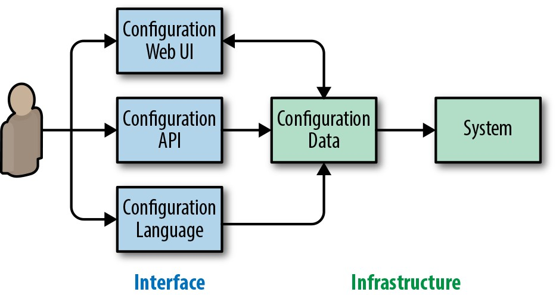

# **第14章**

### **配置设计和最佳实践**

 

***由ŠtěpánDavidovič***

***与Niall Richard Murphy，Christophe Kalt和Betsy Beyer撰写***

 
 

在任何地方，配置系统都是常见的SRE任务。这可能是一项令人厌烦且令人沮丧的细致的活动，尤其是如果工程师对他们正在配置的系统不太熟悉，或者在设计配置时没有考虑清楚性和可用性。最常见的情况是，您在以下两种情况之一中执行配置:在有足够时间的初始设置期间，或在需要处理事件的紧急重新配置期间。

本章从设计和维护基础结构系统的人员的角度检查配置。它描述了我们以安全和可持续的方式设计配置的经验和策略。

## **什么是配置？**

当我们部署软件系统时，我们并不认为它们是固定不变的。不断变化的业务需求，基础架构要求和其他因素意味着系统不断变化。当我们需要快速更改系统行为，并且更改过程需要昂贵，冗长的重建和重新部署过程时，代码更改就不够用。相反，配置(我们可以将其宽松定义为用于修改系统行为的人机界面)提供了一种低开销的方式来更改系统功能。在部署系统，调整其性能以及事件响应期间，SRE会定期利用此优势。

我们可以认为系统具有三个关键组成部分:

- 该软件

- 系统使用的数据集

- 系统配置

尽管我们可以直观地识别出每个组件，但它们之间通常相距很远。例如，许多系统使用编程语言进行配置，或者至少具有引用编程语言的能力。示例包括Apache和模块，例如[mod_lua](http://bit.ly/2HcOqen)及其请求挂钩，或窗口管理器XMonad及其[基于Haskell的配置](http://bit.ly/2JlpXJg)。同样，数据集可能包含代码，例如SQL存储过程，这些代码可能构成复杂的应用程序。

良好的配置界面可实现快速，可靠和可测试的配置更改。如果用户没有直接的方法来更新配置，则更容易出错。用户会经历增加的认知负荷和显着的学习曲线。

**配置和可靠性**

因为我们的系统最终由人管理，所以人负责配置。系统配置的人机界面的质量会影响组织可靠运行该系统的能力。精心设计(或不良设计)的配置界面的影响类似于代码质量随时间对系统可维护性的影响。

但是，配置往往在几个方面与代码有显着差异。通过代码更改系统的功能通常是一个漫长而复杂的过程，涉及小的增量更改，代码检查和测试。相比之下，更改单个配置选项可能会对功能产生重大变化-例如，一个错误的防火墙配置规则可能使您无法使用自己的系统。与代码不同，配置通常生活在未经测试(甚至无法测试)的环境中。

系统配置更改可能需要在很大的压力下进行。在发生事故期间，必须能够简单，安全地调整配置系统。考虑一下早期飞机的界面设计:混乱的控件和指示器导致事故。当时的研究表明，操作员经常发生故障，而与飞行员的技能或经验无关。[^82]可用性和可靠性之间的联系转化为计算系统。考虑一下如果我们为*.conf*文件和监控视图交换控制杆和拨号指示器会发生什么。

**分离哲学和技术性细节**

我们通常在设计新软件或使用现有软件组件组装新系统时讨论配置。我们将如何配置它？配置将如何加载？我们将配置的首要主题分为两部分:配置原理和配置机制。

配置哲学涉及完全独立于所选语言和其他机制的配置方面。我们对哲学的讨论包括如何构造配置，如何实现正确的抽象级别以及如何无缝支持各种用例。

我们对机制的讨论涵盖了诸如语言设计，部署策略以及与其他系统的交互之类的主题。本章将重点放在技术性细节上，部分原因是诸如语言选择之类的话题已经在整个行业中进行了讨论。另外，由于给定的组织可能已经具有强大的外部需求，例如预先存在的配置基础结构，因此配置机制不容易推广。下一章有关Jsonnet的示例提供了现有软件中的配置机制(特别是语言设计)的实际示例。

分别讨论哲学和技术性细节，可以使我们对配置进行更清晰的推理。实际上，配置是否需要大量难以理解的用户输入，诸如配置语言(XML或Lua)之类的实现细节并不重要。相反，即使最简单的配置输入也必须输入到非常繁琐的界面中，也会引起问题。考虑一下(非常)旧的Linux内核配置过程:必须通过命令行终端进行配置更新，该命令行终端需要一系列命令来设置每个参数。为了进行最简单的校正，用户必须从头开始配置过程。[^83]

**配置哲学**

本节讨论完全独立于实现的配置方面，因此这些主题适用于所有实现。

按照以下原则，我们理想的配置是完全没有配置。在这个理想的世界中，系统会根据部署，工作量或部署新系统时已经存在的配置片段，自动识别正确的配置。当然，对于许多系统来说，这种理想在实践中是不可能实现的。但是，它强调了理想的配置方向:远离大量的可调参数，而转向简单。

从历史上看，关键任务系统提供大量控制(相当于系统配置)，但也需要大量的操作员培训。考虑图14-1中NASA航天器控制中心中复杂的操作员控制阵列。在现代计算机系统中，这种培训对大多数行业而言不再可行。

*图14-1.NASA航天器控制中心的控制面板，说明了可能非常复杂的配置*

这种理想的做法减少了我们可以对系统执行的控制量，同时减少了错误的表面积和操作员的认知负担。随着系统复杂性的增加，操作员的认知负担变得越来越重要。

当我们将这些原理应用到Google的实际系统中时，它们通常会导致内部用户支持的便捷，广泛采用和低成本。

**配置询问用户问题**

无论您要配置什么以及如何配置，人机交互最终都归结为一个界面，该界面询问用户问题，要求输入有关系统应如何运行的信息。无论用户是在编辑XML文件还是使用配置GUI向导，这种概念化模型都适用。

在现代软件系统中，我们可以从两个不同的角度来处理此模型:

*以基础设施为中心的视图*

> 提供尽可能多的配置旋钮很有用。这样做使用户可以根据自己的实际需求调整系统。旋钮越多越好，因为可以将系统调整到完美。

*以用户为中心的视图*

> 配置询问有关基础结构的问题，用户必须先回答这些问题，然后他们才能恢复实际业务目标。旋钮越少越好，因为回答配置问题比较麻烦。

在我们最小化用户输入的最初理念的推动下，我们赞成以用户为中心的观点。

该软件设计决策的含义超出了配置范围。以用户为中心的配置意味着您的软件需要针对主要用户设计一套特定的用例。这需要用户研究。相反，以基础架构为中心的方法意味着您的软件有效地提供了基础架构，但是将其转变为实际的系统需要用户进行大量配置。这些模型并不存在严格的冲突，但是要调和它们可能非常困难。也许与直觉相反，与极其通用的软件相比，有限的配置选项可以导致更好的接受性-入门工作量大大降低，因为该软件通常是"开箱即用"的。通过以各种方式删除一些配置旋钮(其中一些将在后续部分中讨论)，随着系统的成熟，从以基础结构为中心的视图开始的系统可能会朝着以用户为中心的焦点移动。

**问题应该接近用户目标**

当我们遵循以用户为中心的配置理念时，我们希望确保用户可以轻松地与我们提出的问题联系起来。我们可以想到频谱上用户输入的性质:一方面，用户以自己的方式描述他们的需求(更少的配置选项)；另一方面，用户准确描述了系统应如何实现其需求(更多配置选项)。

让我们以制作茶为例来配置系统。使用较少的配置选项，用户可以要求"热的绿茶"并大致获得他们想要的东西。在频谱的另一端，用户可以指定整个过程:水量，沸腾温度，茶的品牌和风味，浸泡时间，茶杯类型和杯中的茶量。使用更多配置选项可能更接近完美，但坚持此类细节所需的努力可能要比接近完美饮料的边际收益花费更多。

这种类比对在配置系统上工作的用户和开发人员都有帮助。当用户指定确切步骤时，系统需要遵循这些步骤。但是，当用户改为描述其高级目标时，系统可以随着时间的推移而发展，并改善其实现这些目标的方式。在这里，对系统的用户目标有一个很好的预先了解是必要的第一步。

有关该频谱如何发挥作用的实际说明，请考虑作业调度。想象一下，您有一个一次性的分析过程要运行。像[Kubernetes](https://kubernetes.io/)或[Mesos](http://mesos.apache.org/)使您可以实现运行分析的"实际"目标，而不会像确定决定在哪个物理机上运行这样的细微细节给您带来负担。

**必填和可选问题**

给定的配置设置可能包含两种类型的问题:必填问题和可选问题。必须回答问题才能使配置完全提供任何功能。一个例子可能是谁来为一项操作收费。可选问题并不决定核心功能，但是回答它们可以提高功能的质量，例如，设置多个工作进程。

为了保持以用户为中心并易于采用，您的系统应尽量减少必填配置问题的数量。这不是一件容易的事，但是很重要。人们可能会争辩说，增加一个或两个小步骤所花费的成本很少，但工程师的生命往往是无穷无尽的单个小步骤链。原则上减少这些小步骤可以大大提高生产率。

最初的强制性问题集通常包括您在设计系统时考虑的问题。减少必填问题的最简单方法是将其转换为可选问题，这意味着提供默认答案，这些答案可以安全有效地应用于大多数(如果不是全部)用户。例如，我们不需要简单地默认执行空运行，而不是要求用户定义执行是否应为空运行。

尽管此默认值通常是静态的硬编码值，但不一定必须如此。可以根据系统的其他属性动态确定。利用动态确定可以进一步简化您的配置。

对于上下文，请考虑以下动态默认值示例。计算密集型系统通常可能会决定通过配置控件部署多少个计算线程。它的动态默认部署与系统(或容器)具有执行核心的线程数量一样多。在这种情况下，单个静态默认值将无用。动态默认意味着我们不需要让用户确定要在给定平台上部署的系统的正确线程数。同样，单独部署在容器中的Java二进制文件可以根据容器中可用的内存自动调整其堆限制。这两个动态默认值示例反映了常见的部署。如果您需要限制资源使用，则能够覆盖配置中的动态默认值很有用。

实施的动态默认值可能不适用于每个人。随着时间的流逝，用户可能会喜欢不同的方法，并要求对动态默认值进行更好的控制。如果很大一部分配置用户报告动态默认问题，则您的决策逻辑可能不再符合当前用户群的要求。考虑实施广泛的改进，使动态默认设置可以运行而无需其他配置旋钮。如果只有一小部分用户不满意，最好手动设置配置选项。在系统中实现更多复杂性将为用户带来更多工作(例如，增加阅读文档的认知负担)。

在为可选问题选择默认答案时，无论选择静态还是动态默认值，都应仔细考虑选择的影响。经验表明，大多数用户将使用默认值，因此这既是机会也是责任。您可以朝着正确的方向微妙地推动人，但是指定错误的默认值会造成很大的伤害。例如，考虑配置默认值及其对计算机科学以外的影响。器官捐赠者默认为选择加入的国家(如果愿意的话，个人可以选择退出)有比默认值选择不加入的国家[^84][更多的动器官捐献者动态比例](http://bit.ly/2kEGp9c)。 指定默认选项会对整个系统的医疗选择产生深远的影响。

一些可选问题在没有明确用例的情况下开始。您可能希望完全删除这些问题。大量的可选问题可能会使用户感到困惑，因此，只有在真正需要的情况下，才应添加配置旋钮。最后，如果您的配置语言恰好使用继承的概念，则对于叶配置中的任何可选问题，能够将其恢复为默认值很有用。

**逃避简单性**

到目前为止，我们已经讨论了将系统配置简化为最简单的形式。但是，配置系统可能还需要考虑高级用户。回到我们的茶类比，如果我们真的需要在特定时间内浸泡茶会怎样？

容纳高级用户的一种策略是找到普通用户和高级用户所需的最大公约数，并将默认复杂度定为该水平。不利的一面是，这一决定影响到所有人。即使是最简单的用例，现在也都需要从低级的角度来考虑。

通过根据默认行为的可选替代来考虑配置，用户可以配置"绿茶"，然后添加"将茶浸泡五分钟"。在此模型中，默认配置仍然是高级的并且接近用户的目标，但是用户可以微调低级方面。这种方法不是新颖的。我们可以与C++或Java之类的高级编程语言进行比较，这使程序员能够将机器(或VM)指令包含在用高级语言编写的代码中。在某些消费者软件中，我们看到带有高级选项的屏幕，这些屏幕可以提供比典型视图更多的细粒度控制。

考虑优化整个组织的配置时间是很有用的。不仅要考虑配置本身的行为，还要考虑用户在看到许多选项时可能会遇到的决策瘫痪，错误的转弯后纠正配置所花费的时间，由于置信度较低而导致的更改速度变慢等等。当您考虑配置设计替代方案时，如果可以简化对最常见用例的支持，那么以较少但难度较大的步骤完成复杂配置的选项可能更可取。

如果发现超过一小部分用户需要复杂的配置，则可能是错误地标识了常见的用例。如果是这样，请重新查看系统的初始产品假设并进行其他用户研究。

**配置机制**

至此，我们的讨论涵盖了配置哲学。本节将重点转移到用户如何与配置交互的机制上。

**单独的配置和结果数据**

用哪种语言存储配置是不可避免的问题。您可以选择具有纯数据，例如INI，YAML或XML文件中的数据。可替代地，可以以允许更加灵活的配置的高级语言来存储配置。

从根本上讲，所有询问用户的问题都归结为静态信息。这显然可以包括对诸如"应使用多少个线程？"之类问题的静态答案。但是，甚至"应该为每个请求使用什么功能？"只是对函数的静态引用。

为了回答配置是代码还是数据这一古老的问题，我们的经验表明，*同时*拥有代码和数据两者，但将两者分开是最佳选择。系统基础结构应在纯静态数据上运行，其格式可以为[Protocol Buffers](http://bit.ly/1HhFC5L)，[YAML](http://yaml.org/)或[JSON] (https://www.json.org/)。这种选择并不意味着用户实际上需要与纯数据进行交互。用户可以与生成此数据的更高级别的界面进行交互。但是，API可以使用此数据格式，以允许进一步堆叠系统和自动化。

这个高级界面几乎可以是任何东西。它可以是高级语言，例如基于Python的域特定语言(DSL)，Lua或专用语言，例如Jsonnet(我们将在第15章中进行详细讨论)。我们可以将这样的接口视为编译器，类似于我们对待C++代码的方式。[^85]高级接口也可能根本不是语言，并且Web UI会提取配置。

从故意与静态数据表示形式分离的配置UI开始，意味着系统具有部署的灵活性。各种组织可能有不同的文化规范或产品要求(例如使用公司内的特定语言或需要将配置外部化到最终用户)，并且这种通用的系统可以适应各种支持的配置要求。这样的系统还可以毫不费力地支持多种语言。[^86]见图14-2。

用户可以完全看不见这种分离。用户的通用路径可能是使用配置语言编辑文件，而其他所有事情都在幕后发生。例如，一旦用户向系统提交更改，新存储的配置就会自动编译为原始数据。[^87]

*图14-2.具有单独的配置界面和配置数据基础结构的配置流。请注意，Web UI通常还会显示当前配置，从而使关系成为双向。*

一旦获得静态配置数据，它也可以用于数据分析。例如，如果生成的配置数据为JSON格式，则可以将其[加载到PostgreSQL中并通过数据库查询进行分析](http://bit.ly/2szj3W3)。作为基础架构所有者，您可以快速轻松地查询正在使用哪些配置参数以及由谁使用。该查询对于识别可以删除的功能或评估故障选项的影响很有用。

使用最终配置数据时，您会发现还存储有关如何提取配置的元数据很有用。例如，如果您知道数据来自Jsonnet中的配置文件，或者在原始数据被编译为数据之前拥有完整路径，则可以跟踪配置作者。

配置语言也可以是静态数据。例如，您的基础架构和接口都可能使用纯JSON。但是，请避免在用作接口的数据格式与内部使用的数据格式之间紧密耦合。例如，您可以在内部使用一个数据结构，其中包含从配置中使用的数据结构。内部数据结构可能还包含完全特定于实现的数据，这些数据永远不需要在系统外部显示。

**工具的重要性**

工具可以使混乱的噩梦和可持续的可扩展系统之间产生差异，但是在设计配置系统时通常会忽略它。本节讨论最佳配置系统应使用的关键工具。

**语义验证**

尽管大多数语言都提供了开箱即用的语法验证，但是请不要忽略语义验证。即使您的配置在语法上有效，它也可能会做有用的事情？还是用户引用了一个不存在的目录(由于输入错误)，或者需要比其实际拥有的内存多一千倍的内存(因为单位不是用户期望的)？

在最大可能范围内验证配置在语义上的意义可以帮助防止中断并降低运营成本。对于每种可能的错误配置，我们应该问自己是否可以在用户提交配置时而不是在提交更改后阻止它。

**配置语法**

确保配置完成用户所需的关键是关键，但消除机械障碍也很重要。从语法角度来看，配置语言应提供以下内容:

*在编辑器中突出显示语法(在公司内部使用)*

> 通常，您已经通过重用现有语言来解决此问题。但是，特定于域的语言可能具有其他"语法糖"，可以从专门的突出显示中受益。

*Linter*

> 使用Linter来识别语言使用中的常见不一致的地方。[Pylint](https://www.pylint.org/)是一种流行的语言示例。

*自动语法格式化器*

> 内置的标准化可最大程度地减少相对不重要的格式化讨论，并减少贡献者切换项目时的认知负担。标准格式还可以简化自动编辑的过程，这在大型组织中广泛使用的系统中很有用。现有语言中自动格式化程序的示例包括clang-format[^88]和[autopep8](http://bit.ly/2LdJFDL)。

这些工具使用户能够确信自己的语法正确，从而可以编写和编辑配置。[^89]面向空白缩进的配置中的缩进不正确可能会带来严重的后果-其中一些是标准格式可以阻止。

**所有权和变更跟踪**

因为配置可能会影响公司和机构的关键系统，所以重要的是要确保良好的用户隔离，并了解系统中发生了什么变化。如第10章所述，有效的事后文化应避免责怪个人。但是，这在事件发生期间和进行事后分析时都很有用，它有助于了解谁更改了配置并了解配置更改如何影响系统。无论事件是由于事故还是恶意行为者，这都是正确的。

系统的每个配置摘要都应具有明确的所有者。例如，如果使用配置文件，则它们的目录可能归一个生产组所有。如果目录中的文件只能有一个所有者，那么跟踪谁进行更改要容易得多。

无论版本配置如何执行，版本控制配置都允许您及时返回以查看在任何给定时间点的配置情况。如今，将配置文件检入到Subversion或Git之类的版本控制系统中已成为一种常见的做法，但是这种做法对于Web UI或远程API提取的配置同样重要。您可能还希望在配置和正在配置的软件之间建立更紧密的联系。这样，您可以避免无意中配置了软件不可用或不再支持的功能。

与此相关的是，将对配置的更改以及由此产生的应用程序都记录到系统中很有用(有时是必需的)。提交配置的新版本的简单动作并不总是意味着可以直接应用配置(稍后会详细介绍)。如果在事件响应期间怀疑系统配置更改是罪魁祸首，则能够快速确定更改所涉及的整套配置集很有用。这可以实现可靠的回滚，并能够通知配置受到影响的各方。

**安全配置更改应用**

如前所述，配置是对系统功能进行重大更改的简便方法，但是它通常不是经过单元测试的，甚至不是易于测试的。由于我们希望避免发生可靠性事故，因此我们应该检查配置更改的安全应用意味着什么。

为了使配置更改安全，它必须具有三个主要属性:

- 逐步部署的能力，避免了全有或全无的变化

- 如果发现危险，则可以回滚更改

- 如果更改导致操作员失去控制，则自动回滚(或至少停止进度的能力)

部署新配置时，避免全局一次推送很重要。取而代之的是逐步推出新配置-这样做可以让您检测问题并在造成100％的停机之前中止有问题的推送。这就是为什么Kubernetes之类的工具使用滚动更新策略来更新软件或配置而不是一次更新每个Pod的原因之一。(有关讨论，请参见第16章。)

回滚的能力对于减少事件持续时间很重要。与尝试使用临时修复程序对其进行修补相比，回滚有问题的配置可以更快地缓解中断-人们对修补程序可以改善情况的信心较低。

>为了能够前滚和后滚配置，它必须是封闭的。需要外部资源可以在其封闭环境之外更改的配置可能很难回滚。例如，存储在引用网络文件系统上数据的版本控制系统中的配置不是封闭的。

最后但并非最不重要的一点是，在处理可能导致突然失去操作员控制的更改时，系统应格外小心。在台式机系统上，如果用户不确认更改，屏幕分辨率的更改通常会提示倒计时并重置。这是因为不正确的监控器设置可能会阻止用户还原更改。同样，系统管理员通常会将自己意外地用防火墙阻隔出他们当前正在设置的系统。

这些原理不是唯一的配置，并且适用于更改已部署系统的其他方法，例如升级二进制文件或推送新数据集。

## **结论**

微小的配置更改会以戏剧性的方式影响生产系统，因此我们需要刻意设计配置以减轻这些风险。配置设计包含API和UI设计两个方面，并且应该有目的性-不仅仅是系统实现的副作用。将配置分为原理和技术性细节两方面，有助于我们在设计内部系统时更加清晰，并使我们能够正确地进行讨论。

应用这些建议需要花费时间和精力。有关如何在实践中应用这些原理的示例，请参见[金丝雀 Analysis Service上的ACM队列文章](http://bit.ly/2xyjq9f)。在设计这个实用的内部系统时，我们花了大约一个月尝试减少必答问题并为可选问题找到良好答案。我们的努力创建了一个简单的配置系统。由于易于使用，因此在内部被广泛采用。我们几乎不需要用户支持，因为用户可以轻松了解系统，因此可以放心地进行更改。当然，我们还没有完全消除配置错误和用户支持，也从未期望过。

 
 

[^82]: Kim Vicente，《人为因素》(纽约: Routledge，2006)，71--6。

[^83]: 虽然显然是夸张的，但[有关最差音量控制接口的Reddit线程](http://bit.ly/2J6JA8F)可以洞悉回答同一问题"音量应为多少"的好坏机制之间的区别。 ?

[^84]: 全文: [*http: //www.dangoldstein.com/papers/DefaultsScience.pdf*](http://www.dangoldstein.com/papers/DefaultsScience.pdf)。

[^85]: Jsonnet用于编译为Kubernetes YAML，为该并行提供了真实示例。请参阅[* http: //ksonnet.heptio.com/*](http://ksonnet.heptio.com/)。

[^86]: 当组织执行向新技术的迁移，整合并购或专注于共享基础结构，但在其他方面具有不同的开发和系统管理实践时，这将非常有用。

[^87]: 有多种实用方法可以自动将新配置编译为原始数据。例如，如果将配置存储在版本控制系统中，则提交后挂钩可以简化此过程。可替代地，定期更新过程可以以一些延迟为代价来执行该操作。

[^88]: 尽管C ++不太可能用于配置，但是[clang-format](http://bit.ly/2swrrG0)很好地证明了，甚至比大多数用于配置的语言更复杂的语言也可以完全自动格式化。

[^89]: 在非常大型的组织中，能够注释已弃用的广泛复用的配置也很有用。当有可用的替代产品时，自动重写工具可促进集中式更改，从而有助于避免遗留问题。

