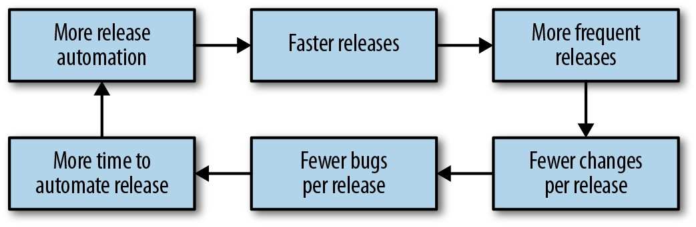
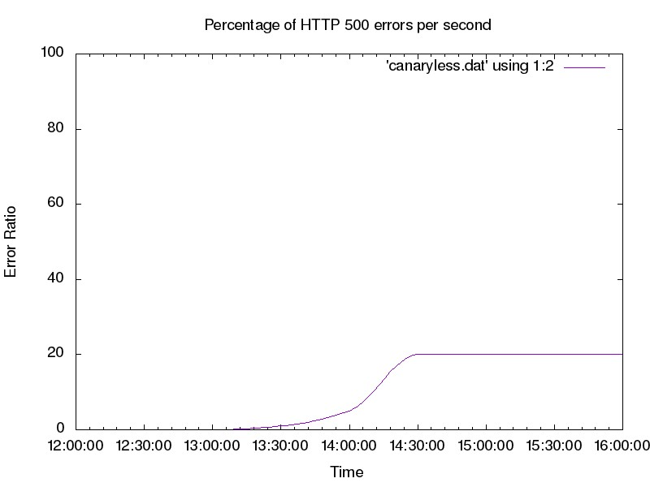
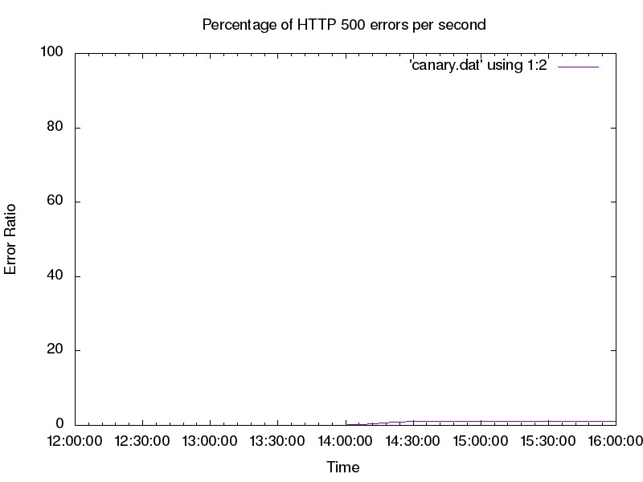
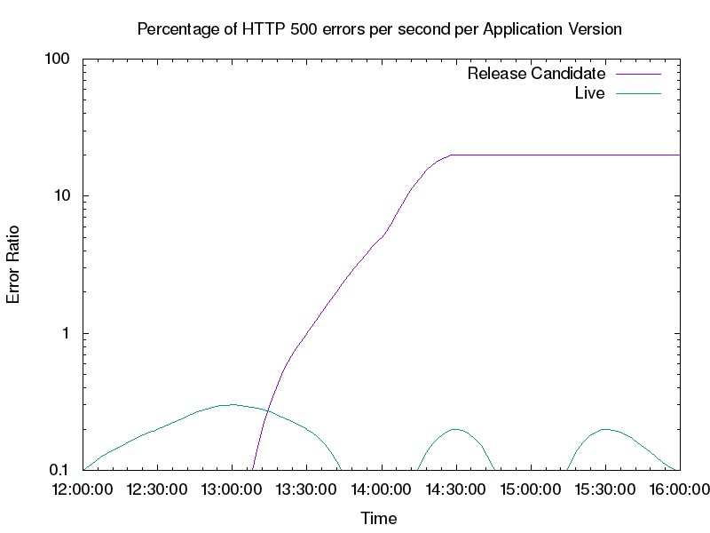

# **第16章**

### **金丝雀发布**

 

***由Alec Warner和ŠtěpánDavidovič***

***与Alex Hidalgo，Betsy Beyer，Kyle Smith和Matt Duftler撰写***

 
 

"发布工程"是一个术语，我们用来描述与将代码从存储库获取到正在运行的生产系统有关的所有过程和工件。自动化发布可以帮助避免与发布工程相关的许多传统陷阱:重复性和手动任务的繁琐工作，非自动化过程的不一致，无法知道发布的确切状态以及回滚的困难。发布工程的自动化在其他文献中也有很好的论述，例如，关于持续集成和持续交付(CI/CD)的书籍。[^95]

我们将*金丝雀*定义为部分或有限时间内的服务变更部署和评估该评估有助于我们确定是否继续进行推广。服务中接收更改的部分是"金丝雀"，而服务的其余部分是"对照组"。支持这种方法的逻辑是，通常在*较小*的生产子集上执行金丝雀部署，或者与控制部分相比，对用户群的影响要小得多。金丝雀实际上是A/B测试过程。

我们将首先介绍发布工程的基础知识以及将发布自动化以建立共享词汇表的好处。

## **发布工程原理**

发布工程的基本原理如下:

*可复制的版本*

> 构建系统应该能够获取构建输入(源代码，资产等)并产生可重复的工件。上周使用相同输入构建的代码本周应产生相同输出。

*自动构建*

> 检入代码后，自动化应产生构建工件并将其上载到存储系统。

*自动测试*

> 一旦自动构建系统构建了工件，则应使用某种测试套件确保其正常工作。

*自动部署*

> 部署应由计算机而非人员执行。

*小型部署*

构建工件应包含小的，独立的更改。这些原则为运维来了特殊的好处:

- 通过消除手动和重复操作来减轻工程师的操作负担

> 任务。

- 强对等审查和版本控制，因为自动化通常基于代码。

- 建立一致，可重复的自动化流程，减少错误。

- 启动发布管道的监控，通过解决以下问题来进行评估和持续改进:

    --- 发布需要多长时间才能投入生产？

    --- 发布多久成功一次？成功发布是指没有严重缺陷或违反SLO的客户可以使用的发布。

    --- 可以进行哪些更改以尽早在管道中发现缺陷？

    --- 哪些步骤可以并行化或进一步优化？

CI/CD与发布自动化相结合可以持续改进开发周期，如图16-1所示。自动发布时，您可以更频繁地发布。对于变更率不高的软件，发布频率更高意味着在任何给定的发布工件中捆绑的更改都更少。较小的，自包含的发布工件使在发生错误时回滚任何给定的发布工件变得成本更低，更容易。更快的发布节奏意味着漏洞修复可以更快地到达用户。

## **平衡发布速度和可靠性**

发布速度(以下称为"运输")和可靠性通常被视为相反的目标。该企业希望以100％的可靠性尽快交付新功能和产品改进！虽然这个目标是无法实现的(因为100％永远不是可靠性的正确目标；请参阅第2章)，但可以在满足给定产品特定可靠性目标的情况下尽快发货。

朝此目标迈出的第一步是了解运输对软件可靠性的影响。根据Google的经验，大多数事件是由二进制或配置推送触发的(请参阅附录C)。许多软件更改都可能导致系统故障-例如，基础组件的行为更改，依赖项(例如API)的行为更改或DNS之类的配置更改。

尽管更改软件存在固有的风险，但是这些更改(错误修复，安全补丁和新功能)对于业务成功而言是必不可少的。您可以使用SLO和错误预算的概念来衡量版本对可靠性的影响，而不是提倡更改。您的目标应该是在满足用户期望的可靠性目标的同时尽快交付软件。下一节讨论如何使用金丝雀过程来实现这些目标

目标。

> **以不同的速率分离变化的组件**
>
> 您的服务由变化率不同的多个组件组成:二进制或代码，JVM，内核/OS，库，服务配置或标志等环境，功能/实验配置以及用户配置。如果只有一种部署变更方式，实际上很难让这些组件独立更改。
>
> 功能标记或实验框架，例如[Gertrude](http://bit.ly/2H9ofW9)，[Feature](http://bit.ly/2LNpu0B)和[PlanOut](http://bit.ly/2kIx3JO)允许您将功能启动与二进制发布分开。如果二进制发行版包含多项功能，则可以通过更改实验配置来一次启用一项功能。这样，您不必将所有这些更改批量处理为一个大更改，也不必为每个功能执行单独的发行。更重要的是，如果只有一些新功能无法按预期运行，则可以有选择地禁用这些功能，直到下一个构建/发布周期可以部署新的二进制文件为止。
>
> 您可以将功能标记/实验的原理应用于服务的任何类型的更改，而不仅仅是软件版本。

## **什么是金丝雀发布？**

术语"金丝雀发布"是指[将金丝雀带入煤矿以确定煤矿对人类是否安全的做法](http://bit.ly/2kIwYWw)。由于鸟类比人类更小，呼吸速度更快，因此被危险气体中毒的速度比人类操作者更快。

即使您的发布管道是完全自动化的，您也将无法检测到所有与发布相关的缺陷，直到真正的流量到达服务为止。在准备好将发行版部署到生产中时，您的测试策略应灌输合理的信心使发行版安全并且可以按预期工作。但是，您的测试环境与生产环境并非100％相同，并且您的测试可能无法涵盖100％的可能情况。一些缺陷将达到生产。如果一个版本立即部署到任何地方，则任何缺陷都将以相同的方式部署。

如果您可以快速检测并解决缺陷，则这种情况是可以接受的。

但是，您有一个更安全的选择:最初使用金丝雀发布将您的部分生产流量暴露给新版本。通过金丝雀发布，部署管道可以尽快检测到缺陷，而对服务的影响则尽可能小。

## **发布工程和金丝雀发布**

在部署新版本的系统或其关键组件(例如配置或数据)时，我们会将更改捆绑在一起，这些更改通常是未公开给现实世界的输入，例如面向用户的流量或用户的批处理提供的数据。变更带来了新的特性和功能，但同时也带来了部署时暴露的风险。我们的目标是通过测试流量的一小部分变化来减轻这种风险，从而使人们确信它不会产生不良影响。我们将在本章后面讨论评估过程。

金丝雀过程还使我们对变化感到信心十足，因为我们面临着越来越多的流量。将更改引入实际生产流量还使我们能够识别在单元测试或负载测试之类的测试框架中可能看不到的问题，而这些问题通常是更人为的。

我们将通过一个实际的例子来研究金丝雀的创作过程及其评估，同时避免深入了解统计学。相反，我们专注于整个过程和典型的实际考虑。我们在App Engine上使用一个简单的应用程序来说明部署的各个方面。

**金丝雀过程的要求**

给一个确定的服务执行金丝雀发布需要特定功能:

- 一种将金丝雀变化部署到服务总体子集的方法。[^96]

- 评估过程，以评估标准变更是"好"还是"坏"。

- 将金丝雀评估整合到发布过程中。

最终，金丝雀过程会在金丝雀以高置信度检测到不良发布候选者，并识别出没有误报的良好发布时证明其价值。

**我们的示例设置**

我们将使用一个简单的前端Web服务应用程序来说明一些简单的概念。该应用程序提供了一个基于HTTP的API，消费者可以使用它来处理各种数据(诸如产品价格之类的简单信息)。该示例应用程序具有一些可调参数，我们可以使用它们来模拟各种生产症状，并由金丝雀过程对其进行评估。例如，我们可以使应用程序为20％的请求返回错误，或者我们可以规定5％的请求至少需要两秒钟。

我们使用部署在Google App Engine上的应用程序说明了金丝雀过程，但是原理适用于任何环境。尽管该示例应用程序确实是精心设计的，但在实际场景中，类似的应用程序与我们的示例共享共同的信号，这些信号可以在金丝雀过程中使用。

我们的示例服务有两个潜在的版本:*实时*和*发布候选*。实时版本是当前在生产环境中部署的版本，候选发布版本是新建版本。我们使用这些版本来说明各种推广概念，以及如何实现金丝雀发布以使上线过程更加安全。

## **前滚部署与简单的金丝雀部署相比**

首先让我们看一下没有执行金丝雀流程的部署，以便稍后可以将其与金丝雀部署进行比较，以节省错误预算和发生破损时的总体影响。我们的部署过程具有开发环境。一旦感觉到代码在开发环境中可以工作，就可以在生产环境中部署该版本。

部署后不久，我们的监控开始报告高错误率(请参见图16-2，在此我们故意将示例应用程序配置为20％的请求失败

用于模拟示例服务中的缺陷)。就本例而言，假设我们的部署过程没有向我们提供回滚到先前已知的良好配置的选项。修复错误的最佳选择是在生产版本中发现缺陷，修补缺陷并在中断期间部署新版本。这种做法几乎可以肯定会延长用户对该错误的影响。

>

*图16-2.部署后错误率高*

为了改进此初始部署过程，我们可以在部署策略中利用金丝雀来减少错误代码推送的影响。我们需要一种方法来创建一小部分可以运行我们的候选发布产品的产品，而不是一次全部部署到生产中。然后，我们可以将流量的一小部分发送到该生产部分(金丝雀)，并将其与其他部分(对照组)进行比较。使用这种方法，我们可以在影响所有产品之前发现候选版本中的缺陷。

我们的App Engine示例中的简单金丝雀部署可以在应用程序的特定标记版本之间[分割流量](http://bit.ly/2syNcVx)。您可以使用App Engine或任何其他方法(例如负载平衡器上的后端权重，代理配置或轮询DNS记录)分配流量。

图16-3显示，使用金丝雀时，变更的影响已大大降低；实际上，错误几乎看不见！这就提出了一个有趣的问题:与总体流量趋势相比，金丝雀的评价很难看到和跟踪。

*图16-3.金丝雀部署的错误率；由于金丝雀种群只占生产的一小部分，因此总体错误率降低了*

为了更清晰地了解我们需要以合理的规模进行跟踪的错误，我们可以按App Engine应用程序版本查看关键指标(HTTP响应代码)，如下所示:

如图16-4所示。当我们查看每个版本的细分时，我们可以清楚地看到新版本引入的错误。从图16-4我们还可以观察到实时版本提供的错误很少。

现在，我们可以调整部署，以根据App Engine版本的HTTP错误率自动做出反应。如果金丝雀度量标准的错误率与控制错误率相距太远，则表明金丝雀部署是"错误的"。作为响应，我们应该暂停并回滚部署，或者与人员联系以解决问题。如果错误率相似，我们可以照常进行部署。在图16-4的情况下，我们的金丝雀部署显然很糟糕，我们应该回退它。

*图16-4.HTTP响应代码(按App Engine版本)；候选版本可解决绝大多数错误，而实时版本在稳定状态下会产生少量错误(请注意:图表使用以10为底的对数刻度)*

## **金丝雀实现**

既然我们已经看到了相当简单的金丝雀部署实现，那么让我们更深入地研究成功的金丝雀流程需要了解的参数。

**最大程度地降低SLO和错误预算的风险**

第2章讨论了SLO如何反映围绕服务可用性的业务需求。这些要求也适用于金丝雀实现。金丝雀的生产过程仅会冒着我们错误预算的一小部分风险，这受时间和金丝雀种群数量的限制。

全局部署会很快使SLO面临风险。如果我们从琐碎的示例中部署候选人，我们将有可能失败20％的请求。如果我们改用5％的金丝雀种群，则为5％的流量提供20％的错误，导致总错误率为1％(如图16-3所示)。这种策略使我们可以节省错误预算-对预算的影响与存在缺陷的流量成正比。我们可以假定，朴素的部署和金丝雀部署的检测和回滚大约需要相同的时间，但是当我们将金丝雀流程集成到我们的部署中时，我们将以更低的成本获得有关新版本的有价值的信息。

这是一个非常简单的模型，假定负载均匀。它还假设我们可以将全部错误预算(超出我们已经包括在当前可用性的有机度量中的预算)花在金丝雀上。在这里，我们仅考虑新版本引入的不可用性，而不是"实际"可用性。我们的模型还假设故障率为100％，因为这是最坏的情况。[^97]金丝雀部署中的缺陷很可能不会影响100％的系统使用率。在金丝雀部署期间，我们还允许整体系统可用性低于SLO。[^98]

此模型有明显的缺陷，但是这是您可以调整以适应业务需求的坚实起点。[^99]我们建议使用满足您的技术和业务目标的最简单模型。根据我们的经验，专注于使模型在技术上尽可能正确通常会导致对模型的过度投资。对于具有高复杂度的服务，过于复杂的模型可能导致不断的模型调整，而没有真正的好处。

**选择金丝雀种群和持续时间**

选择合适的金丝雀持续时间时，您需要考虑开发速度。如果每天发布，则一次只能运行一个金丝雀部署时，您的金丝雀不能持续一周。如果每周部署一次，您将有时间执行相当长的金丝雀。如果连续部署(例如一天20次)，则金丝雀的持续时间必须大大缩短。值得一提的是，虽然我们可以同时运行多个金丝雀部署，但这样做会增加大量精力来跟踪系统状态。当快速推理系统状态很重要时，这在任何非标准情况下都可能会成为问题。如果金丝雀重叠，同时运行金丝雀也会增加信号污染的风险。我们强烈建议一次只运行一个金丝雀部署。

对于基本评估，我们不需要庞大的金丝雀种群即可检测关键的关键条件。[^100]但是，具有代表性的金丝雀过程需要跨多个维度的决策:

*大小和持续时间*

> 它应该足够大并且持续足够长的时间才能代表整个部署。仅收到少量查询后终止金丝雀部署，对于以功能多样的查询为特征的系统来说，并不是一个有用的信号。处理速率越高，获取代表性样本所需的时间就越少，以确保观察到的行为实际上归因于规范变化，而不仅仅是随机工件。

*流量*

> 我们需要在系统上接收足够的流量，以确保它已处理了代表性样本，并且系统有机会对输入做出负面反应。通常，请求越均匀，您需要的流量就越少。

*一天中的时间*

> 性能缺陷通常仅在高负载下才会显示，[^101]因此，在非高峰时间进行部署可能不会触发与性能相关的缺陷。

*评估指标*

> 金丝雀的代表性与我们选择评估的指标紧密相关(我们将在本章稍后讨论)。我们可以快速评估诸如查询成功之类的琐碎指标，但其他指标(例如队列深度)可能需要更多时间或大量金丝雀来提供清晰的信号。

令人沮丧的是，这些要求可能相互矛盾。通过对最坏情况的冷分析和系统过去的实际记录，金丝雀是一种平衡的行为。从过去的金丝雀收集指标后，您可以根据典型的金丝雀评估失败率而不是假设的最坏情况来选择金丝雀参数。

**选择和评估指标**

到目前为止，我们一直在研究成功率，这是金丝雀评估的一个非常明显的指标。但是从直觉上讲，我们知道对于一个有意义的金丝雀过程，这个单一的指标还不够。如果我们以10倍的延迟来处理所有请求，或者在使用10倍的内存时这样做，那么我们也可能会遇到问题。并非所有指标都适合评估金丝雀。指标的哪些属性最适合评估金丝雀的好坏？

**指标应表明问题**

首先，该指标必须能够指示服务中的问题。这很棘手，因为构成"问题"的原因并不总是客观的。我们可能会认为失败的用户请求是有问题的。[^102]但是，如果一个请求花费的时间增加10％，或者系统需要的内存增加10％，该怎么办？我们通常建议使用SLI作为开始考虑金丝雀指标的地方。良好的SLI倾向于对服务健康有强烈的归因。如果已经在衡量SLI以推动SLO遵从性，我们可以重复使用这项工作。

几乎所有的度量标准都可能会出现问题，但在您的金丝雀过程中添加过多的度量标准也要付出代价。我们需要为每个指标正确定义可接受行为的概念。如果可接受的行为的概念过于严格，我们将得到很多误报；也就是说，我们认为金丝雀部署是不好的，即使事实并非如此。相反，如果可接受行为的定义过于宽松，我们将更有可能让不良的金丝雀部署无法被发现。正确选择可接受的行为可能是一个昂贵的过程-这既耗时又需要分析。但是，如果做得不好，您的结果可能会完全误导您。另外，随着服务，其功能集及其行为的发展，您需要定期重新评估期望。

我们应该根据我们对度量指标表示系统中实际用户可感知问题的程度的意见进行排序。选择用于金丝雀评估的头几个指标(也许不超过十二个)。太多的指标会带来递减的收益，并且在某些时候，收益被维护成本所抵消，或者如果维护成本不高，则会对发布过程中的信任产生负面影响。

为了使该指南更加切实，让我们看一下示例服务。它具有许多我们可以评估的指标:CPU使用率，内存占用量，HTTP返回码(200s，300s等)，响应延迟，正确性等。在这种情况下，我们最好的指标可能是HTTP返回码和响应延迟，因为它们的降级最接近于影响用户的实际问题。在这种情况下，CPU使用率的度量标准没有用:资源使用率的增加并不一定会影响服务，并且可能导致金丝雀跃的过程变得脆弱或嘈杂。这可能导致金丝雀过程被操作员禁用或忽略，这可能会破坏首先具有金丝雀过程的意义。对于前端服务，我们直观地知道，速度变慢或响应失败通常是可靠的信号，表明服务存在问题。

HTTP返回代码包含有趣的棘手情况，例如代码404，它告诉我们找不到资源。发生这种情况的原因可能是用户获得了错误的URL(想象一个损坏的URL在一个受欢迎的讨论板上共享)，或者因为服务器错误地停止了提供资源。通常，我们可以通过从金丝雀评估中排除400级别的代码并添加黑盒监控来测试特定URL的存在来解决此类问题。然后，我们可以将黑匣子数据作为金丝雀分析的一部分，以帮助将金丝雀过程与奇怪的用户行为隔离开。

**指标应具有代表性且可归属的**

所观察到的度量标准变化的根源应该明确归因于我们正在讨论的变化，并且不应受到外部因素的影响。

在大规模(例如，许多服务器或许多容器)中，我们可能会有异常值，即超额订购的计算机，运行具有不同性能特征的不同内核的计算机或网络过载的计算机。金丝雀种群与控制种群之间的差异与我们部署的变更的功能以及部署的两种基础设施之间的差异一样大。

管理金丝雀是许多力量之间的一种平衡行为。增加金丝雀种群的大小是减少此问题影响的一种方法(如前所述)。当达到我们认为适合系统的金丝雀种群的合理数量时，我们需要考虑我们选择的指标是否可以显示高方差。

我们还应该意识到金丝雀和控制环境之间共享的故障域；不好的金丝雀可能会对控制产生负面影响，而系统中的不良行为可能导致我们错误地评估了金丝雀。同样，请确保指标完全隔离。考虑一个同时运行我们的应用程序和其他进程的系统。整个系统中CPU使用率的急剧增加将导致衡量指标不佳，因为系统中的其他进程(数据库负载，日志轮换等)可能会导致这种增加。更好的指标是进程为请求提供服务时所花费的CPU时间。甚至更好的指标是在服务进程实际安排在CPU上的时间范围内，服务请求所花费的CPU时间。虽然与我们的流程并置的大量超额订购的机器显然是一个问题(监控应该抓住它！)，但这不是我们正在进行的变更引起的，因此不应将其标记为金丝雀部署失败。

金丝雀也需要归因；也就是说，您还应该能够将金丝雀指标与SLI绑定在一起。如果一个指标可以在不影响服务的情况下发生巨大变化，那么就不可能制定一个好的金丝雀指标。

**评估前后有风险**

金丝雀之前/之后的过程是归因问题的延伸。在此过程中，旧系统将被新系统完全替换，您的金丝雀评估会比较在设定的时间段内更改前后的系统行为。人们可能将此过程称为"时空中的金丝雀部署"，您可以通过分段时间来选择A/B组，而不是通过机器，Cookie或其他方式来对种群进行分段。由于时间是观察到的指标变化的最大来源之一，因此很难通过评估前后来评估性能下降。

虽然金丝雀的部署可能导致了性能下降，但性能下降也很可能在控制系统中发生过。如果我们尝试在更长的时间内运行金丝雀部署，这种情况将变得更加棘手。例如，如果我们在星期一进行发布，则可能会将工作日的行为与周末的行为进行比较，从而产生大量噪音。在此示例中，用户在周末使用服务的方式可能非常不同，从而在金丝雀过程中引入了噪音。

之前/之后过程本身会引入一个问题，即大的错误峰值(由评估之前/之后引入)是否比小但可能更长的错误率(由小金丝雀引入)更好。如果新版本完全损坏，我们可以多快检测和还原？金丝雀之前/之后可能会更快地发现问题，但是恢复的总时间可能仍然相当长，类似于较小的金丝雀。在此期间，用户会受苦。

**使用渐进金丝雀以更好地选择指标**

不符合我们理想属性的指标可能仍会带来巨大的价值。我们可以通过使用更细微的金丝雀过程来引入这些指标。

我们可以使用包含多个阶段的金丝雀来反映我们对指标进行推理的能力，而不是简单地评估单个金丝雀阶段。在第一阶段

**选择和评估指标**

我们对此版本的行为没有信心或知识。因此，我们希望使用一个较小的阶段，以最大程度地减少负面影响。在一个很小的金丝雀中，我们更喜欢可以最清楚地表明问题的指标-应用程序崩溃，请求失败等。一旦这一阶段成功通过，下一阶段的金丝雀种群将增加，以增加我们对变化影响的分析的信心。

**依赖关系和隔离**

被测系统将无法在完全真空中运行。出于实际原因，金丝雀种群和对照组可能共享后端，前端，网络，数据存储和其他基础结构。与客户之间甚至可能存在极其不明显的交互。例如，假设一个客户端发送了两个连续的请求。第一请求可以由金丝雀部署处理。金丝雀的响应可能会更改第二个请求的内容，而第二个请求的内容可能会落在对照组上，从而更改对照组的行为。

不完善的隔离会带来多种后果。最重要的是，我们需要意识到，如果金丝雀的发布过程提供的结果表明我们应该停止生产变更并调查情况，那么金丝雀的部署不一定存在错误。总的来说，这个事实确实适用于金丝雀，但实际上，隔离问题经常强制执行。

此外，不完善的隔离意味着金丝雀部署的不良行为也会对对照组产生负面影响。金丝雀发布是A/B的比较，A和B可能会同时更改。这可能会导致金丝雀评估混乱。同样重要的是，也要使用绝对测量(例如定义的SLO)来确保系统正常运行。

**非交互式系统中的金丝雀发布**

本章重点讨论了交互式请求/响应系统，该系统在许多方面都是最简单且讨论最多的系统设计。其他系统(例如异步处理管道)也同样重要，但是具有不同的金丝雀发布考虑因素，我们将简要列举一下。有关与数据处理管道有关的金丝雀跃变的更多信息，请参见第13章。

首先，金丝雀的持续时间和部署本质上取决于工作单元处理的持续时间。在涉及交互式系统时，我们忽略了这个因素，假设工作单元的处理时间不超过几秒钟，这比金丝雀的持续时间短。非交互系统中的工作单元处理(例如渲染管道或视频编码)可能需要更长的时间。因此，请确保金丝雀的最小持续时间跨过单个工作单元的持续时间。

对于非交互式系统，隔离可能变得更加复杂。许多管道系统只有一个工作分配器和一组带有应用程序代码的worker。在多阶段流水线中，工作单元由worker处理，然后返回到池中以供同一worker或另一个worker执行下一阶段的处理。对于金丝雀分析，确保始终将处理特定工作单元的worker从同一个worker池(金丝雀池或对照组池)中拉出很有帮助。否则，信号将变得越来越混杂(有关解开信号的更多信息，请参见第349页的"监控数据的要求")。

最后，指标选择可能更加复杂。我们可能对处理工作单元的端到端时间(类似于交互式系统中的延迟)以及处理本身的质量(当然，这完全是特定于应用程序)感兴趣。

考虑到这些警告，金丝雀的一般概念仍然可行，并且适用相同的高级原则。

**监控数据要求**

在进行金丝雀评估时，您必须能够将金丝雀信号与对照组信号进行比较。通常，在构建监控系统时需要格外小心-有效的比较是直接的，并且会产生有意义的结果。

考虑我们前面的示例，该示例将金丝雀部署到5％的人口，错误率达到20％。由于监控可能会从整个系统角度出发，因此它将检测到的总体错误率仅为1％。根据系统的不同，此信号可能与其他错误源没有区别(见图16-3)。

如果我们通过对请求进行总体处理来分解指标(金丝雀与对照组)，我们可以观察到单独的指标(见图16-4)。我们可以清楚地看到对照组与金丝雀的错误率，这是完整部署将带来什么的鲜明说明。在这里，我们看到监控整个服务的充分理由不足以分析我们的金丝雀。收集监控数据时，重要的是能够执行细粒度的细分，使您能够区分金丝雀和对照种群的指标。

收集指标的另一个挑战是金丝雀的部署受设计的限制。当指标在特定时期内汇总时，这可能会导致问题。考虑度量*每小时错误*。我们可以通过汇总过去一个小时的请求来计算该指标。如果使用此指标评估我们的金丝雀，则可能会遇到问题，如以下时间轴所述:

**监控数据要求**

1.  不相关的事件导致发生一些错误。

2.  金丝雀部署到总量的5％；金丝雀的时长是30分钟。

3.  金丝雀系统开始监控每小时错误度量，以查看部署的好坏。

4.  由于每小时错误度量标准与对照组的每小时错误显着不同，因此将部署检测为不良。

这种情况是使用每小时计算一次的指标评估仅30分钟长的部署的结果。结果，金丝雀过程提供了非常混乱的信号。使用指标评估金丝雀的成功时，请确保指标的间隔等于或小于金丝雀的持续时间。

**相关概念**

通常，我们与客户的对话涉及在生产中使用蓝/绿部署，人工负载生成和/或流量准备。这些概念类似于金丝雀，所以虽然它们不是严格的金丝雀过程，但可以按原样使用。

**蓝/绿部署**

蓝/绿部署维护系统的两个实例:一个正在为流量提供服务(绿色)，另一个准备为流量提供服务(蓝色)。在蓝色环境中部署新版本后，可以将流量移至该版本。切换不需要停机，回滚是对路由器更改的简单逆转。缺点是此设置使用的资源是更"传统"部署的两倍。在此设置中，您将有效地执行金丝雀之前/之后(之前讨论过)。

通过同时(而不是独立)利用蓝色和绿色部署，您可以或多或少地使用蓝/绿部署作为普通金丝雀。在此策略中，您可以将金丝雀部署到蓝色(备用)实例，并在绿色和蓝色环境之间缓慢分配流量。您的评估以及将蓝色环境与绿色环境进行比较的指标均应与流量控制联系在一起。此设置类似于A/B金丝雀，其中绿色环境是对照组，蓝色环境是金丝雀部署，金丝雀数量由发送给每个人的流量控制。

**人工负载生成**

与其将实时用户流量暴露给金丝雀部署，还不如在安全的层面诱发错误，并使用人工负载生成。通常，您可以在多个部署阶段(QA，预生产，甚至在生产中)运行负载测试。尽管根据我们的定义，这些活动不算是金丝雀，但它们仍然是发现缺陷的可行方法。

使用合成负载进行测试可以最大程度地提高代码覆盖率，但是不能提供良好的状态覆盖率。在可变系统(具有缓存，cookie，请求关联性等的系统)中人为地模拟负载可能尤其困难。人工负载也可能无法准确地模拟真实系统中发生的自然流量变化。某些回归可能仅在未包含在人工负载中的事件期间才显示出来，从而导致覆盖范围出现缺口。

人工负载在可变系统中也无法正常工作。例如，尝试在计费系统上产生人为负荷可能是非常危险的:系统可能开始向信用卡提供商发送标注，然后信用卡提供商将开始主动向客户收费。虽然我们可以避免测试危险的代码路径，但是在这些路径上缺少测试会减少我们的测试范围。

**流量开球**

如果人工负载不具有代表性，我们可以复制流量并将其发送到生产系统和测试环境中的系统。此技术称为"开球"。在生产系统为实际流量提供服务并向用户传递响应的同时，金丝雀部署为副本提供服务并丢弃响应。您甚至可以将金丝雀的响应与实际响应进行比较，然后进行进一步的分析。

这种策略可以提供有代表性的流量，但是设置起来通常比更简单的金丝雀过程更为复杂。流量开球也无法充分识别状态系统中的风险；流量副本可能会在看似独立的部署之间引入意想不到的影响。例如，如果金丝雀部署和生产系统共享高速缓存，则人为增加的高速缓存命中率会使金丝雀指标的性能度量无效。

## **结论**

您可以使用多种工具和方法来自动化发布，并在管道中引入金丝雀发布。没有哪一种测试方法是万能的灵丹妙药，因此应根据系统的要求和行为来告知测试策略。金丝雀发布是一种补充测试的简单，可靠且易于集成的方式。当您尽早发现系统缺陷时，对用户的影响最小。金丝雀发布还可以为频繁发布提供信心并提高开发速度。正如测试方法必须与系统需求和设计一起发展一样，必须金丝雀。

 
 

[^95]: 本章的作者是Jez Humble和David Farley的书的爱好者*连续交付: 通过构建，测试和部署自动化*发行可靠的软件(波士顿: 皮尔逊(Pearson)，2011年)。

[^96]: 您在金丝雀上运行的总服务负载的比例应与金丝雀种群的大小成比例。

[^97]: 至少就可用性而言。显然，该分析未涵盖事件的影响，例如数据泄漏。

[^98]: 对于足够小的金丝雀，其中服务部分等于实际可用性和SLO之间的差，我们可以充满信心地直达金丝雀。这是我们对错误预算的使用。

[^99]: 正如英国统计学家乔治·博克斯(George Box)所说: "本质上，所有模型都是错误的，但有些模型是有用的。"George EP Box和Norman R. Draper，"经验模型构建和响应面"(纽约: John Wiley and Sons，1987年)。

[^100]: 请参阅[*http: //bit.ly/2LgorFz*](http://bit.ly/2LgorFz)上有关实际中断的讨论。

[^101]: 例如，考虑资源争用问题，例如数据库写冲突或在多线程应用程序中锁定。

[^102]: 失败的用户请求不一定有问题。用户请求可能会失败，因为用户请求了一些不合理的内容，例如访问不存在的URL。我们需要纪律严明，以区分此类错误和系统中的问题。
