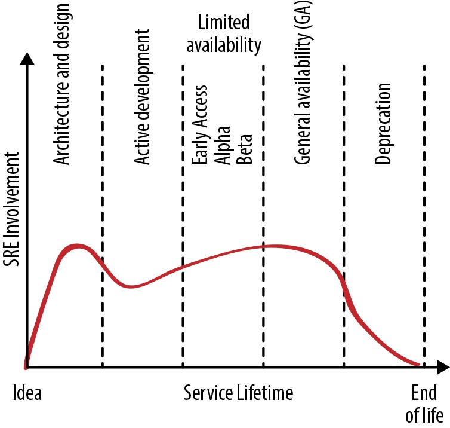
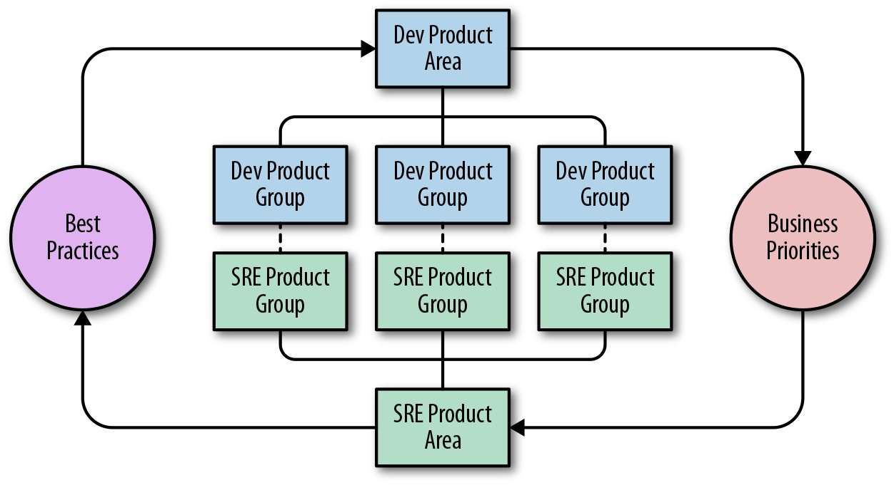

# **第18章**

### **SRE参与模式**

 

***由迈克尔·怀尔德潘纳(Michael Wildpaner)，格兰妮·希林(GráinneSheerin)，丹尼尔·罗杰斯(Daniel Rogers)和苏里亚·普拉山斯·萨纳加瓦拉普(Surya Prashanth Sanagavarapu)(《纽约时报》)与阿德里安·希尔顿(Adrian Hilton)和Shylaja Nukala撰写***

 
 

[第32章](http://bit.ly/2Lc14wG)介绍了SRE团队可以用来分析和提高服务可靠性的技术和程序方法。这些策略包括生产准备情况审查(PRR)，尽早参与和持续改进。

简而言之，SRE原则旨在最大程度地提高开发团队的工程速度，同时保持产品的可靠性。这两个目标对产品用户和公司都有利。但是，即使是最好的SRE团队能完成多少工作也是有限制的，并且当域太大且过于复杂时，SRE模型的效率就会降低。当前的微服务运动使这种动态变得更加严峻-小公司可以轻松拥有比单个SRE团队可以处理的更多的微服务。鉴于生产环境广阔，并且知道他们无法涵盖所有服务，因此SRE团队必须决定将精力集中在哪里以取得最佳效果。产品开发和SRE团队可以合作确定正确的焦点。

本章采用了SRE团队的观点，该团队打算为新服务提供支持。我们研究如何最有效地与服务以及拥有该服务的开发人员和产品团队互动。尽管SRE参与通常围绕一项或多项服务构建，但参与所涉及的不仅仅是服务本身-它着重于了解开发人员和产品团队的目标并找到支持它们的正确方法。

无论组织的规模如何，大部分讨论都适用。尽管我们经常使用"团队"一词，但从理论上讲，团队可以从一个人开始(尽管那个人会很忙)。无论您的团队规模大小，主动定义SRE的角色并管理与产品开发的沟通与协作都是很重要的。

## **服务生命周期**

如第一本SRE书籍的序言(http://bit.ly/2LexAhJ)中所述，SRE团队对服务可靠性的贡献贯穿于服务生命周期的所有阶段。他们的生产知识和经验的应用可以在SRE接起服务呼叫之前大大提高服务的可靠性。

图18-1显示了服务生命周期内SRE参与的理想水平。但是，SRE团队可能会在生命周期的任何阶段开始参与服务。例如，如果开发团队开始为SRE支持的服务计划替换服务，则SRE可能会很早就参与新服务。或者，一旦服务普遍可用几个月或几年，并且现在正面临可靠性或扩展性挑战，则SRE团队可以正式参与该服务。本节提供有关SRE团队如何在每个阶段有效做出贡献的指南。

*图18-1.服务生命周期中的SRE参与水平*

**阶段1:建筑与设计**

SRE可以以不同方式影响软件系统的体系结构和设计:

- 创建最佳实践，例如对各种单点故障的适应能力，开发人员团队在构建新产品时可以采用

- 文档化特定基础架构系统的能做与不能做什么(基于先前的经验)，以便开发人员可以明智地选择其构建基块，正确使用它们并避免已知的陷阱

- 提供早期参与咨询，以详细讨论特定的架构和设计选择，并在目标原型的帮助下帮助验证假设

- 加入开发团队并参与开发工作

- 共同设计服务的一部分

在开发周期的后期，解决架构错误变得更加困难。早期的SRE参与可以帮助避免昂贵的重新设计，当系统与实际用户互动并且需要根据服务增长而扩展时，重新设计就变得非常必要。

**阶段2:积极发展**

当产品在积极开发过程中成形时，SRE可以开始"生产"服务--即使其成形并投入生产。生产化通常包括容量规划，为冗余设置额外的资源，针对尖峰和过载处理进行规划，实现负载平衡以及实施诸如监控，警报和性能调整之类的可持续运维实践。

**阶段3:有限的可用率**

随着服务向Beta的发展，用户数量，用例的多样性，使用强度以及可用性和性能需求都在增加。在此阶段，SRE可以帮助测量和评估可靠性。我们强烈建议在一般可用性(GA)之前定义SLO，以便服务团队可以客观地衡量服务的可靠性。产品团队仍然可以选择退出不能达到其目标可靠性的产品。

在此阶段中，SRE团队还可以通过建立容量模型，为即将启动的阶段获取资源以及自动执行开通和就地调整服务大小来帮助扩展系统。SRE可以确保适当的监控范围，并帮助创建与即将到来的服务SLO理想匹配的警报。

在服务使用情况仍在变化的同时，SRE团队可以期望在事件响应和操作职责期间增加工作量，因为该团队仍在学习服务的工作方式以及如何管理其故障模式。我们建议在开发人员和SRE团队之间共享这项工作。这样，开发人员团队可以获得该服务的运维经验，而SRE则可以用一般的服务获得经验。运维工作和事件管理将告知系统更改和更新服务拥有者在Google Analytics(分析)之前需要进行的工作。

**阶段4:一般可用性**

在此阶段，该服务已通过"生产准备情况审查"(有关更多详细信息，请参阅*站点可靠性工程*中的[第32章](http://bit.ly/2Lc14wG))，并且正在接受所有用户。尽管SRE通常执行大部分运维工作，但开发人员团队应继续从事所有运营和事件响应工作的一小部分，以使他们不会对服务的这些方面失去认识。他们可能会在呼叫轮换中永久包含一名开发人员，以帮助开发人员跟踪运维负荷。

在GA的早期阶段，由于开发团队专注于使服务成熟并启动第一批新功能，因此它也需要保持循环以了解实际负载下的系统属性。在Google Analytics(分析)的后期阶段，开发人员团队会提供一些小的增量功能和修补程序，其中一些功能是根据运维需求和发生的任何生产事件告知的。

**阶段5:弃用**

没有系统会永远运行。如果有更好的替换系统可用，则对新用户关闭现有系统，并且所有工程都致力于将用户从现有系统过渡到新系统。SRE主要在没有开发人员团队参与的情况下运维现有系统，并通过开发和运维工作来支持过渡。

虽然减少了现有系统所需的SRE工作量，但SRE有效地支持了两个完整的系统。员工人数和人员配备应作相应调整。

**阶段6:放弃**

放弃服务后，开发团队通常会恢复运维支持。SRE尽力支持服务事件。对于具有内部用户的服务，SRE将服务管理移交给其他所有用户。本章提供了两个案例研究，说明SRE如何将服务交还给开发人员团队。

**阶段7:不支持**

没有更多的用户，并且该服务已关闭。SRE帮助删除生产配置和文档中对服务的引用。

## **建立关系**

服务不是凭空存在的:SRE团队与构建服务的开发团队以及确定其发展方式的产品团队合作。本节为建立和维持与这些团队的良好工作关系提出了一些策略和策略。

**沟通业务和生产优先级**

在可以帮助某人之前，您需要了解他们的需求。为此，SRE需要了解产品开发人员期望SRE参与实现的目标。与开发人员团队互动时，SRE应该建立对产品和业务目标的深刻理解。SRE应该能够阐明自己的角色，以及SRE的参与如何使开发人员能够朝着这些目标执行。

团队需要定期就业务和生产优先级进行讨论。SRE和开发人员领导团队在理想情况下应该作为一个整体工作，定期开会并就技术和优先级挑战交换意见。有时SRE领导会加入产品开发领导团队。

**识别风险**

由于SRE团队专注于系统可靠性，因此他们可以很好地识别潜在风险。尽可能准确地衡量这些风险的可能性和潜在影响非常重要，因为破坏常规开发和功能流程的成本对于产品和工程师而言都是很重要的。

**统一目标**

开发人员和SRE团队都关心可靠性，可用性，性能，可伸缩性，效率以及功能和启动速度。但是，SRE在不同的激励机制下运作，主要是支持服务的长期生存能力而不是新功能的发布。

根据我们的经验，开发人员和SRE团队可以在这里保持适当的平衡，同时保持各自的工作重点，同时也明确支持其他团队的目标。SRE可以有一个明确的目标，以支持开发人员团队的发布速度，并确保所有已批准发布的成功。例如，SRE可能会声明:"我们将支持您尽快安全发布"，其中"安全"通常表示保持在错误预算之内。然后，开发人员应致力于在工程上花费合理的时间来修复和防止破坏可靠性的事情:在设计和实施级别解决持续存在的服务问题，偿还技术债务，并尽早在新功能开发中包括SRE，以便他们可以参加设计对话。

> **共享目标:《纽约时报》的SRE参与** 

> *由Surya Prashanth Sanagavarapu(纽约时报)撰写* 

> 在我们的组织中，当涉及到云迁移，生产加速以及应用程序向容器迁移时，对SRE资源的需求很高。此外，SRE团队有自己的待办事项。面对有限的资源，这些相互竞争的优先事项决定了SRE团队的成功。雇用SRE是解决SRE时间需求的一种显而易见的方法，但并不是每个团队都有能力，经验或时间。

> 在《纽约时报》上，SRE功能的核心任务是通过产品和工具赋予产品开发团队以使支持我们新闻编辑室的应用程序的可靠性和弹性最大化的方法，从而向读者分发高质量的新闻。我们采用了"共享目标模型"，以在减少自动化积压工作和与其他团队合作之间取得平衡。
>
> 在与团队合作之前，我们会查看当前季度/年度的总体积压工作，并明确定义其工作项和类别。例如，我们的积压项目可能包括:
>
>
> - 通过点击应用程序的服务状态端点来增加自动化以设置基线监控和警报。
>
>
> - 实施更可靠和/或更快速的构建管道。
>
>
> 当团队向SRE寻求帮助时，在对请求进行优先级排序时，我们考虑的因素之一是联合参与是否可以帮助减少积压。
>
>
> **定义参与度** 
>
> 我们的SRE根据两种不同的模式与产品开发团队合作:
>
>
> - 全职
>
> - 简短和受限项目的兼职支持
>
> 我们根据SRE团队的带宽来定义参与类型。对于全职工作，我们希望将SRE嵌入产品开发团队中。这有助于提供重点和时间来减轻产品工程团队的负担。随着开发人员提高SRE技能和能力，SRE和产品团队有最大的时间互相学习。对于长期合作，我们会优先考虑最适合我们公司战略的应用程序。
>
> 在定义参与范围时，我们尝试评估与SRE实践相关的团队或应用程序的成熟度。我们发现，在考虑SRE做法和原则时，各个团队的成熟程度不同。我们正在努力应用成熟度模型来提供帮助。
>

> **设定共同的目标和期望**

> 设定正确的期望对于满足截止日期和任务完成至关重要。为此，我们根据以下原则进行工作:

> - 我们强调，应用程序所有者(而不是SRE)直接负责对应用程序进行更改。

> - SRE参与是为了整个公司的利益。任何新的自动化或工具都应改进整个公司使用的通用工具和自动化，并避免一次性脚本开发。

> - SRE应该使开发人员团队了解参与可能引入的任何新流程(例如，负载测试)。

> - 如*Site Reliability Engineering*的[第32章](http://bit.ly/2Lc14wG)中所述，约定可能涉及应用程序准备情况审查(ARR)和生产准备情况审查(PRR)。开发人员和SRE必须共同优先考虑ARR和PRR的建议更改。

> - SRE不是传统的运维工程师。他们不支持手动工作，例如运行要部署的作业。

> 设定共享目标时，我们将与开发团队一起编写这些目标，并将目标划分为多个里程碑。如果您是一家基于敏捷的公司，则可以编写[epics](http://bit.ly/2LOwI4u)或故事。然后，SRE团队可以将这些目标映射到自己的待办事项中。设定目标时，我们常见的模式是:

> 1.  定义参与范围。

>    - **范例1:**在下个季度，我希望我的团队中的所有成员都能够处理GKE/GAE部署，适应生产环境并能够处理生产中断。

>    - **范例2:**在下个季度中，我希望SRE与开发团队合作，以在扩展和监控方面稳定该应用程序，并为停机创建运行手册和自动化。

> 2.  确定最终结果成功案例，并明确指出。

>    - **示例:**参与之后，产品开发团队可以在Google Kubernetes Engine中处理我们的服务中断，而无需升级。

> **冲刺和沟通**

> 与产品开发团队的任何接触都始于启动和计划会议。在启动之前，我们的SRE团队会审查应用程序体系结构和我们的共同目标，以验证预期结果在给定时间范围内是切合实际的创建史诗和故事的联合计划会议可以成为参与的良好起点。                                                                                                                                                                                                                                                                                                                                                                                                            
> 
> 参与的路线图可能是:
>
> 1. 查看应用程序体系结构。
>
> 2. 定义共同的目标。
>
> 3. 举行启动和计划会议。
>
> 4. 实施开发周期以达到里程碑。
>
> 5. 设置回顾以征集参与反馈。
> 
> 6. 进行生产准备情况审查。
>
> 7. 实施开发周期以达到里程碑。
>
> 8. 计划并执行发射。
>
> 我们要求团队定义一种反馈方法并就其频率达成共识。SRE和开发团队都需要有关什么有效和什么无效的反馈。为了使这些合作取得成功，我们发现通过协商一致的方法在敏捷冲刺审阅之外提供恒定的反馈循环很有用，例如，每两周进行一次回顾或与团队经理签到。如果SRE参与没有奏效，我们希望团队不要回避计划脱离参与。
> 
> **衡量影响** 
>
> 我们发现，衡量参与的影响以确保SRE正在开展高价值工作非常重要。我们还将衡量每个合作伙伴团队的成熟度，以便SRE可以确定与他们合作的最有效方式。我们与Google的客户可靠性工程(CRE)团队合作采取的一种方法是，在开始参与之前，与产品工程团队的负责人进行"时间点评估"。
>
> 一个时间点评估包括遍历一个成熟度矩阵，沿着SRE的各个关注轴衡量服务的成熟度(如*站点可靠性工程*的[第32章](http://bit.ly/2Lc14wG)中所述))，并就可观察性，容量规划，变更管理和事件响应等功能领域的分数达成一致。在我们进一步了解团队的优势，劣势和盲点之后，这也有助于更恰当地调整参与度。
>
> 参与结束后，开发团队将自己完成工作，我们将再次执行评估以衡量SRE增加的价值。如果我们有一个成熟度模型，我们将对该模型进行衡量，以查看参与度是否会导致更高的成熟度。随着参与活动的结束，我们计划举行庆祝活动！

## **设置基本规则**

在Google，每个SRE团队都有两个主要目标:

*短期*

> 通过提供可操作的稳定系统来满足产品的业务需求，该系统可用并根据需求扩展，并着眼于可维护性。

*长期*

> 将服务运维优化到不再需要正在进行的人工工作的水平，因此SRE团队可以继续进行下一次高价值的工作。

为此，团队应商定一些合作原则，例如:

- 运维工作的定义(以及硬性限制)。

- 服务的商定和可衡量的SLO，用于优先考虑开发人员和SRE团队的工程工作。您*可以*在没有适当的SLO的情况下开始工作，但是我们的经验表明，没有在关系建立之初建立此上下文，这意味着您稍后必须回溯到此步骤。有关在没有SLO的情况下工程工作进展不理想的示例，请参阅"案例研究1:缩放Waze---从临时更改到计划更改"(第427页)。

- 商定的季度误差预算，用于确定释放速度和其他安全参数，例如用于处理意外使用增长的超额服务能力。

- 开发人员参与日常操作，以确保可以看到持续存在的问题，并确定解决其根本原因的优先次序。

### **计划与执行**

主动的计划和协调的执行确保SRE团队达到期望和产品目标，同时优化运维并降低运维成本。我们建议在两个(关联)级别进行规划:

- 在开发人员的领导下，确定产品和服务的优先级并发布

> 年度路线图。

- 定期检查和更新路线图，并得出与路线图一致的目标(每季度或其他)。

路线图可确保每个团队都拥有长期清晰，影响重大的工作。有充分的理由放弃路线图(例如，如果开发组织的变更太快)。但是，在稳定的环境中，缺少路线图可能是SRE团队可以与另一个团队合并，将服务管理工作移回开发团队，扩大范围或解散的信号。

与开发人员领导进行持续的战略对话有助于快速确定重点转移，讨论SRE为业务增加价值的新机会或停止对产品而言不合算的活动。

路线图的重点不仅限于改进产品。他们还可以解决如何应用和改进通用SRE技术和流程以降低运维成本的问题。

**保持有效的持续关系**

健康有效的关系需要不断的努力。本节概述的策略对我们来说效果很好。

**投入时间更好地合作**

花时间互相交流的简单行为可帮助SRE和开发人员更有效地协作。我们建议SRE与他们的同行定期会面以了解他们所提供的服务。对于SRE来说，定期与其他运行服务的SRE团队开会也是个好主意，这些团队要么向服务发送流量，要么提供服务使用的通用基础结构。然后，SRE团队可以在出现故障或分歧时自信而迅速地升级，因为这两个团队彼此了解并且已经设定了如何启动和管理升级的期望。

**保持沟通畅通**

除了团队之间的日常沟通外，我们发现了几种更正式的信息交换方法，在参与过程中特别有用。

SRE可以每季度与产品开发负责人进行一次"生产状态"演讲，以帮助他们了解应该在哪里投资资源以及SRE如何准确地帮助他们的产品或服务。同样，开发人员可以向SRE团队进行定期的"产品状态"演讲，也可以让SRE参与开发团队的执行演示。这使SRE团队可以大致了解开发人员团队在上个季度中所取得的成就(并让SRE看看他们自己的工作是如何实现的)。它还提供了有关产品在接下来的几个季度中的发展状况以及产品负责人认为SRE致力于实现这一目标的最新信息。

**执行常规服务审核**

作为服务未来的决策者，SRE和负责服务的开发团队负责人应至少每年面对面一次。比这更频繁地开会可能具有挑战性-例如，因为可能涉及洲际旅行。在本次会议期间，我们通常会分享未来12--18个月的路线图，并讨论新的项目和发布。

SRE团队有时会促进回顾性练习，牵头人讨论团队想要"停止做"，"继续做"和"开始做"的事情。项目可以出现在多个区域中，并且所有意见都是有效的。这些会议需要积极的协助，因为最好的结果来自全团队的参与。在服务会议中，这通常被认为是最有用的会议，因为它会产生可以推动重大服务更改的详细信息。

**当基本规则开始下滑时重新评估**

如果在任何已达成共识的领域中的合作(请参阅第379页的"设置基本规则")开始退步，则开发人员和SRE都需要更改优先级以使服务恢复正常。我们发现，根据紧急程度，这可能意味着以下任何情况:

- 团队确定了特定的工程师，这些工程师必须放弃其较低优先级的任务以专注于回归。

- 两个团队都将其称为"可靠性黑客马拉松"，但通常在黑客马拉松日之后一般团队优先级会继续。

- 宣布冻结功能，并且两个团队中的大多数都专注于解决回归问题。

- 技术领导者确定产品的可靠性正处于严重风险中，并且团队称其为"全力以赴"。

**根据您的SLO和错误预算调整优先级**

精心定义明确的SLO的巧妙技巧可帮助团队适当地确定优先级。如果某项服务有丢失SLO的危险或用尽了错误预算，则两个团队都可以高优先级地工作以使服务恢复安全。他们可以通过战术措施(例如，为解决与流量相关的性能下降而过度配置)和更具战略意义的软件修复(例如优化，缓存和正常降级)来解决这种情况。

如果服务在SLO范围内，并且有足够的错误预算，我们建议使用备用错误预算来提高功能速度，而不是花费过多的精力进行服务改进。

**适当处理错误**

人类不可避免地会犯错误。与我们的[事后总结文化](http://bit.ly/2J2Po2W)一致，我们不会怪罪别人，而是将注意力集中在系统行为上。您的里程可能会有所不同，但是我们在以下策略上取得了成功。

**考虑一晚上**

如果可能，在您感到疲倦或情绪激动时不要进行跟进对话。在压力很大的情况下，人们很容易误解电子邮件等书面交流中的语气。读者会记住单词的感觉，而不一定记住所写的内容。当您在各地交流时，通常值得花时间进行视频聊天，以便您可以看到面部表情并听到有助于消除单词歧义的语气。

**亲自(或尽可能接近)开会以解决问题**

仅通过代码审查或文档进行的交互就会很快被抽出并令人沮丧。当另一个团队的行为或决定与我们的期望相抵触时，我们会与他们讨论我们的假设，并询问缺失的背景。

**要积极**

感谢人们的积极行为。这样做很简单-例如，在代码审查，设计审查和失败场景培训期间，我们要求工程师指出什么是好的，然后解释原因。您也可能会认可良好的代码注释，或者感谢人们投入大量时间进行严格的设计审查。

**了解沟通差异**

不同的团队对如何传播信息有不同的内部期望。了解这些差异可以帮助加强关系。

## **将SRE扩展到更大的环境**

到目前为止，我们讨论的场景涉及一个SRE团队，一个开发人员团队和一个服务。较大的公司，甚至使用微服务模型的小型公司，可能都需要扩展其中一些或全部数量。

**通过一个SRE团队支持多种服务**

由于SRE具有专业技能并且是稀缺资源，因此Google通常将SRE与开发人员的比率保持在<10％。因此，一个SRE团队通常在其产品领域(PA)中与多个开发人员团队合作。

如果相对于需要SRE支持的服务数量而言，SRE稀缺，则SRE团队可以将精力集中在一项服务或少数开发人员团队的少数服务上。

根据我们的经验，如果那些服务具有以下特征，则可以将有限的SRE资源扩展到许多服务:

- 服务是单个产品的一部分。这提供了用户体验的端到端所有权，并与用户保持一致。

- 服务建立在类似的技术堆栈上。这样可以最大程度地减少认知负担，并有效地重用技术技能。

- 服务由同一开发人员团队或少数相关开发人员团队构建。这样可以最大程度地减少关系的数量，并可以更轻松地调整优先级。

**构建多个SRE团队环境**

如果您的公司规模足够大，可以拥有多个SRE团队，也许还有多个产品，则需要选择一种结构来确定SRE与产品组之间的关系。

在Google内部，我们支持复杂的开发人员组织。如图18-2所示，每个PA包含多个产品组，每个产品组包含多个产品。SRE组织在层次上以共同的优先级和最佳实践来覆盖开发人员组织。当一个组中的所有团队或PA中的所有组共享相同或相似的特定业务目标时，并且每个产品组都有产品负责人和SRE负责人时，此模型将起作用。

*图18-2.大规模的开发人员到SRE团队关系(按产品区域)*

如果您的组织有多个SRE团队，则需要以某种方式将它们分组。我们看到的两种有效的主要方法是:

- 将产品中的团队进行分组，因此他们不必与太多不同的开发人员团队进行协调。

- 将团队归入技术堆栈(例如"存储"或"网络")中。

为了防止开发人员重组期间SRE团队流失，我们建议根据技术而不是开发人员PA报告结构来组织SRE团队。例如，许多支持存储系统的团队的结构和运作方式都相同。将存储系统分组为以技术为重点的产品组可能更有意义，即使它们来自开发人员组织的不同部门。

**使SRE团队结构适应不断变化的情况**

如果您需要修改SRE团队的结构以反映不断变化的PA需求，我们建议根据服务需求以及工程和运维负载来创建，拆分(分片)，合并和解散SRE团队。每个SRE团队都应有清晰的章程，以反映其服务，技术和运维。当单个SRE团队提供的服务过多时，而不是从头开始构建新团队，我们更愿意将现有团队分为多个团队，以转移文化并增强现有领导能力。这样的更改不可避免地会破坏现有团队，因此我们建议您仅在必要时重组团队。

**运行内聚分布式SRE团队**

如果您需要确保24/7全天候覆盖范围和业务连续性，并且业务遍及全球，则值得尝试将您的SRE团队分布在全球各地，以提供均匀的覆盖范围。如果您有许多遍布全球的团队，我们建议根据相邻性以及服务和共享技术的相似性来安排团队。我们发现，单例团队通常效率较低，并且更容易受到团队外部重组的影响-只有在明确定义的业务需求需要他们并且我们考虑了所有其他选择的情况下，我们才创建这样的团队。

许多公司没有足够的资源来覆盖全球，但是即使您仅分布在各个建筑物之间(不要介意各大洲)，创建和维护两个地点的安排也很重要。

创建和维护组织标准以驱动计划和执行，并促进和维护共享的团队文化也很重要。为此，我们发现定期将整个团队聚集在一个物理位置很有用-例如，每12--18个月组织一次跨组织范围的峰会。

有时，团队中的每个人都承担某些职责是没有意义的-例如，从备份执行常规测试还原或实施跨公司的技术任务。在团队的分布式站点之间平衡这些职责时，请记住以下策略:

- 将个人职责分配给单个地点，但要定期轮换(例如，每年一次)。

- 分担地点之间的所有责任，积极努力平衡参与和工作量。

- 不要常年将责任锁定在单个位置。我们发现，这种配置的成本最终超过了收益。尽管该位置通常会变得非常善于履行这些职责，但这会养成"我们与他们对立"的心态，阻碍知识的分配，并带来业务连续性的风险。

所有这些策略都需要位置以维持战术和策略沟通。

## **结束关系**

SRE参与不一定是无限期的。SRE通过进行有影响力的工程工作来提供价值。如果工作不再具有影响力(即SRE约定的价值主张消失了)，或者如果大部分工作不再在工程方面(相对于运维)，则可能需要重新审视正在进行的SRE约定。通常，各个SRE将从繁重的团队转移到从事更有趣的工程工作的团队。

在团队级别，如果SRE不再提供相对于成本足够的业务价值，您可能会退还服务。例如:

- 如果服务已优化到不再需要持续参与SRE的水平

- 如果服务的重要性或相关性降低了

- 如果服务即将终止

以下案例研究说明了两种Google SRE参与模式是如何结束的。第一个结局以积极的结果告终，而其他的结局则以更为细致的告终。

**案例研究1:Ares**

Google的滥用行为SRE和通用滥用工具(CAT)团队为大多数Google产品提供了反滥用保护，并与面向客户的产品合作，确保用户安全。滥用SRE团队应用工程工作来减轻CAT的运营支持负担，从而使开发人员能够直接为用户提供支持。这些用户是操作由CAT捍卫的财产的Google员工，他们对CAT的功效及其对问题或新威胁的响应时间寄予厚望。

面对新的威胁和攻击，有效的对抗滥用行为需要不断关注，快速的适应性变化和灵活的灵活性。这些要求与可靠的和计划的功能开发的通用SRE目标相冲突。CAT团队通常需要实施快速开发并将新的保护部署到受攻击的属性。但是，滥用SRE推迟了请求的更改，要求对每个新保护措施对整个生产系统的后果进行更深入的分析。团队之间的磋商和评审的时间限制加剧了这种紧张关系。

为了希望改善情况，Abuse SRE和CAT领导层参与了一个多年项目，以在CAT中创建专门的基础架构团队。新组建的"Ares"团队负责统一Google财产的反滥用基础架构。该团队由CAT工程师组成，他们具有生产基础架构方面的知识，并且具有构建和运行大型服务的经验。这些团队启动了一项交流计划，以将生产管理知识从"滥用SRE"转移到CAT基础结构团队成员。

滥用SRE告知Ares团队，在生产环境中启动新服务的最简单方法(当您已经在运行大型分布式服务时)是最大程度地减少服务施加的额外认知负担。为了减少这种认知负担，系统应尽可能均质。一起部署和管理一系列生产服务意味着它们可以共享相同的发布结构，容量计划，用于访问存储的子服务，等等。根据此建议，Ares重新设计了整个反滥用堆栈，应用了模块化概念以转向微服务模型。他们还构建了一个新层，为开发人员提供了抽象，因此他们不必担心较低级别的生产详细信息，例如监控，日志记录和存储。

在这一点上，Ares团队开始通过管理新的反滥用基础设施，开始更像CAT的SRE团队。同时，Abuse SRE专注于整个反滥用基础设施的生产部署和高效的日常运维。

Ares工程师和Abuse SRE之间的协作带来了以下改进:

- 由于CAT团队现在拥有"内部"生产专家，他们也是打击滥用的专家，因此Abuse SRE不再需要审查新功能集成。这大大减少了生产新功能的时间。同时，由于新的基础架构抽象了生产管理细节，因此CAT团队的开发人员速度有所提高。

- 滥用SRE团队现在从CAT团队发出新功能的请求减少了，因为大多数请求都不需要更改基础结构。由于很少需要更改基础架构，因此该团队还需要较少的知识来评估新功能的影响。当需要更改基础架构时，Abuse SRE仅需要澄清对基础架构的含义，而不是特定功能。

- 需要集成到反滥用基础架构中的产品具有更快，更可预测的周转时间，因为产品集成现在的功能相当于功能发布。

在该项目结束时，负责滥用SRE不再直接支持CAT，而是专注于基础架构。这不会损害CAT的可靠性，也不会增加CAT团队的额外工作负担；相反，它提高了CAT的整体开发速度。

目前，Ares保护着众多Google产品和服务的用户。自团队成立以来，SRE和产品开发已就基础架构在生产中的工作方式进行合作决策。之所以建立这种伙伴关系，是因为Ares的努力营造了共同的命运感。

**案例研究2:数据分析管道**

有时，维护SRE支持关系的成本高于SRE提供的价值(感官的或可衡量的)。在这些情况下，通过解散SRE团队来终止关系是有意义的。[^111]

当关系的价值随时间下降时，很难确定终止该关系有意义的时间点。Google的两个支持收入关键型数据分析管道的团队必须面对这一挑战。弄清楚分开方式是不容易的，特别是在十年的合作之后。回顾过去，我们能够确定团队互动中的几种模式，这是我们需要重新考虑SRE团队与产品团队之间关系的有力指标。

**关键**

关闭之前的三年，所有参与方都意识到他们的主要数据分析管道正在遇到扩展限制。那时，开发团队决定开始计划他们的新系统，并让少数工程师致力于新工作。随着这项工作的开始，有必要对现有系统的大型，复杂或高风险功能的开发进行优先级排序，以支持新系统的工作。随着时间的推移，这产生了两个重要影响:

- 对新项目采用了非正式规则:如果项目的复杂性或修改现有系统以适应项目的风险很高，那么最好在新系统上进行投资。

随着资源转移到开发新系统，即使对现有系统进行相对保守的更改也变得更加困难。然而，使用量继续以极高的速度增长。

**沟通破裂**

在同时设计，建造和发布替换系统的同时，要保持现有系统的正常运行对任何工程团队来说都是一个挑战。专注于新系统和旧系统的人员之间自然会建立压力，团队需要做出困难的优先级决策。当团队在组织上分开时，这些困难会变得更加复杂-例如，专注于维护和运维现有系统的SRE团队和致力于下一代系统的开发团队。

在整个周期中，定期，开放和合作的交流对于维持和保持团队之间良好的工作关系至关重要。在此示例中，沟通上的差距导致团队之间的工作关系破裂。

**退役**

花了一些时间才意识到SRE和开发团队之间的脱节是无法克服的。最终，最简单的解决方案是消除组织上的障碍，并使开发人员团队可以完全控制优先级划分新旧系统的工作。在完全淘汰旧系统之前，预计这些系统会重叠18--24个月。

将SRE和产品开发功能组合到一个团队中，可以使高层管理人员最大程度地响应其责任范围。同时，团队可以决定如何平衡运维需求和速度。尽管使两个SRE团队退役不是一件令人愉快的经历，但这样做解决了在哪里投入工程精力的持续压力。

尽管开发人员团队不可避免地要承担额外的操作负担，但通过对服务内部知识更深入的人员重新调整旧系统的所有权，仍可以更快地解决操作问题。该团队还对潜在的中断原因有更深入的了解，这通常导致更有效的故障排除和更快的问题解决。但是，在开发人员团队了解到在短时间内支持该服务所需的操作工作的细微差别时，会产生一些不可避免的负面影响。SRE团队的最后一项工作是使这些知识的传递尽可能顺利，从而使开发人员团队能够承担这项工作。

值得注意的是，如果工作关系更健康-团队有效地合作以解决问题-那么SRE将在短时间内将生产工作交还给开发团队。在为预期的增长需求对系统进行了稳定和加固之后，SRE通常会重新承担系统的责任。SRE和开发团队需要愿意直接解决问题，并确定需要重新设置的紧张点。SRE的工作之一是在面对不断变化的业务需求时帮助保持卓越的生产，这通常意味着与开发人员合作以找到解决难题的解决方案。

## **结论**

SRE团队参与的形式会在服务生命周期的各个阶段发生变化。本章提供了针对每个阶段的建议。Google和"纽约时报" SRE团队的示例表明，有效管理参与度与制定良好的技术设计决策同样重要。有时，参与SRE会得出自然结论。来自Ares和数据分析管道团队的案例研究提供了如何发生这种情况以及如何最好地终止参与的示例。

关于在SRE和产品开发团队之间建立有效关系的最佳实践，通过定期和公开的沟通来共享目的和目标至关重要。您可以通过多种方式扩展SRE团队的影响力，但这些关系管理原则应始终成立。为了维持参与的长期成功，投资于调整团队目标和理解彼此的目标与捍卫SLO一样重要。

 
 

[^111]: Google HR通过在发生这种转变时寻找新的机会来支持员工。