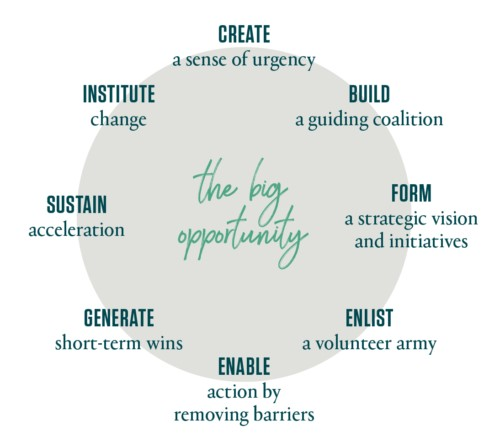
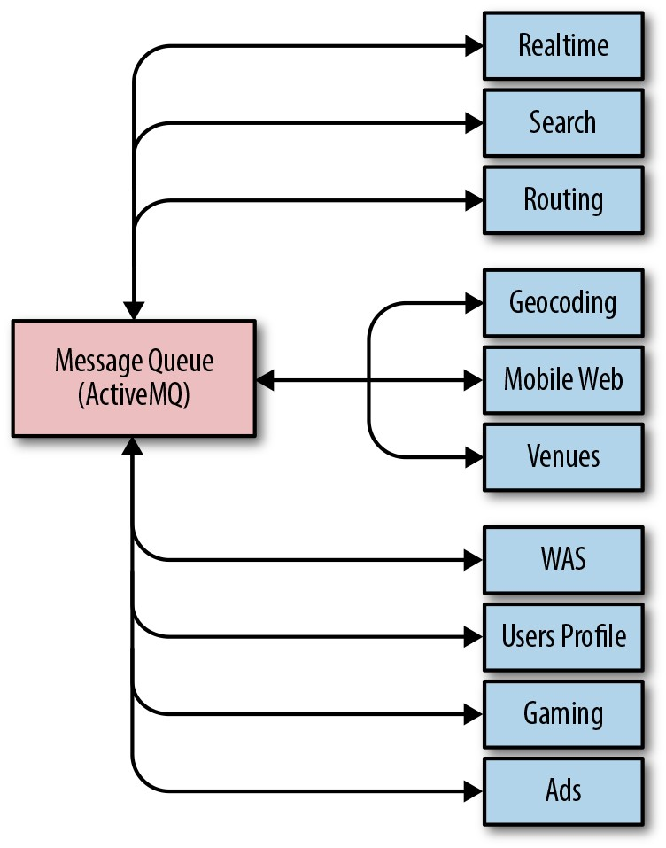
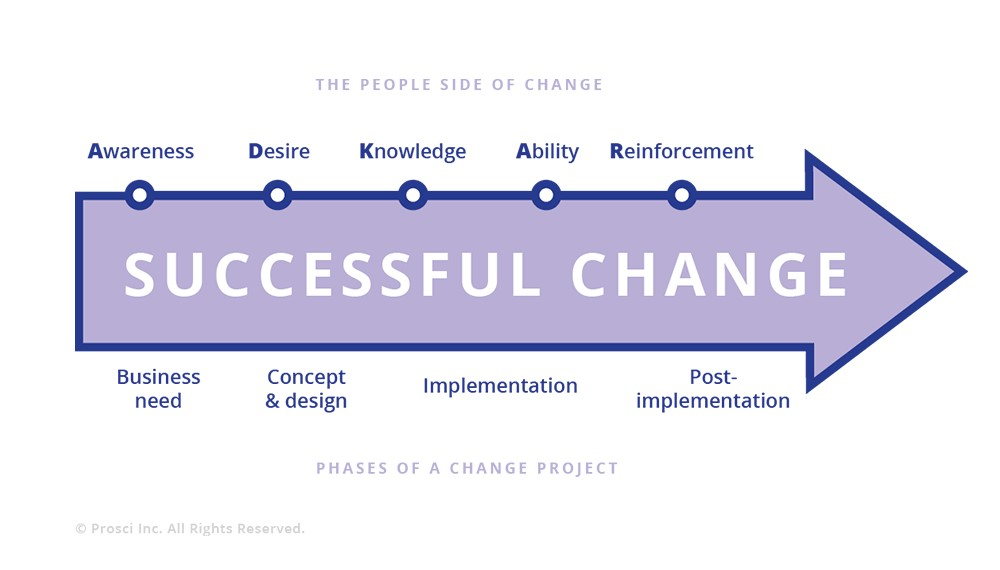

# **第21章**

### **SRE中的组织变更管理**

 

***由Alex Bramley，Ben Lutch，Michelle Duffy和Nir Tarcic与Betsy Beyer撰写***

 
 

在[第一本SRE书简介中](http://bit.ly/2xCtP3S)Ben Treynor Sloss将SRE团队描述为"以快速创新和对变革的广泛接受为特征"，并将组织变革管理指定为SRE团队的核心职责。本章探讨了理论如何在SRE团队中实践应用。在回顾了一些关键的变更管理理论之后，我们探索了两个案例研究，这些案例研究说明了如何以具体方式在Google发挥不同的变更管理风格。

注意，术语"变更管理"具有两种解释:组织变更管理和变更控制。本章将变更管理视为所有用于准备和支持个人，团队和业务部门进行组织变更的方法的统称。我们不会在项目管理环境中讨论此术语，因为在该术语中它可能用于指代变更控制过程，例如变更审查或版本控制。

## **SRE *拥抱* 变革**

2,000多年前，希腊哲学家赫拉克利特(Heraclitus)宣称变化是唯一不变的。这种公理在今天仍然适用，尤其是在技术方面，尤其是在快速发展的互联网和云领域。

产品团队的存在是为了制造产品，交付功能并取悦客户。在Google，采用"启动和迭代"的方法后，大多数变更都是快节奏的。执行此类更改通常需要跨系统，产品和全球分布的团队进行协调。站点可靠性工程师经常身处这种复杂且瞬息万变的环境之中，负责平衡变更固有的风险与产品可靠性和可用性。错误预算(请参阅第2章)是实现这种平衡的主要机制。

## **变革管理简介**

自1940年代Kurt Lewin在该领域开展基础工作以来，变革管理已成为研究和实践领域。理论主要集中于开发用于管理组织变更的框架。对特定理论的深入分析超出了本书的范围，但是为了在SRE领域中对它们进行情境化，我们简要介绍一些常见的理论以及每种理论如何适用于SRE类型的组织。尽管这些理论框架中隐含的正式流程尚未由Google的SRE应用，但通过这些框架的角度考虑SRE活动有助于我们改进了管理变更的方法。在讨论之后，我们将介绍一些案例研究，以说明其中一些理论的要素如何应用于由Google SRE领导的变更管理活动。

**Lewin的三阶段模型**

用于管理变更的[库尔特·勒温(Kurt Lewin)的"解冻-更改-冻结"模型](http://bit.ly/2Jj4aSr)是该领域中最古老的相关理论。这个简单的三阶段模型是用于管理流程审查以及由此产生的组动态变化的工具。第1阶段需要说服一个小组认为必须进行更改。一旦他们适应变更的想法，第二阶段便执行该变更。最后，当变更大致完成后，第3阶段将行为和思想的新模式制度化。该模型的核心原理将小组视为主要的动态工具，认为当小组计划，执行和完成任何变更期间时，应将个人和小组的交互作为一个系统进行检查。因此，Lewin的工作对于在宏观层面计划组织变革最为有用。

**麦肯锡的7-S模型**

[麦肯锡的七个S](https://mck.co/2JqEweE)代表结构，策略，系统，技能，风格，员工和共同价值观。与Lewin的工作类似，此框架也是计划中的组织变革的工具集。尽管Lewin的框架是通用的，但7-S的明确目标是提高组织效率。两种理论的应用都始于对当前目的和过程的分析。但是，7-S还明确涵盖业务元素(结构，策略，系统)和人员管理元素(共享价值，技能，风格，员工)。该模型对于考虑从传统系统管理重点向更全面的站点可靠性工程方法转变的团队可能有用。

**Kotter领导变革的八步程序**

*《时间》*杂志将约翰·P·科特(John P. Kotter)的1996年著作《领导变革》(哈佛商学院出版社)命名为"[有史以来前25名最具影响力的商业管理书籍](https://ti.me/2kIspvq)之一"。图21 -1描述了Kotter变更管理过程中的八个步骤。

*图21-1.Kotter的变更管理模型(来源:*[*https://www.kotterinc.com/* *8-steps-process-for-leading-change /)*](https://www.kotterinc.com/8-steps-process-for-leading-change/)

Kotter的流程与SRE团队和组织特别相关，但有一个小例外:在许多情况下(例如，即将进行的Waze案例研究)，无需*产生*紧迫感。支持产品和系统快速增长的SRE团队经常面临紧迫的规模，可靠性和运维挑战。组件系统通常由多个开发团队拥有，这些开发团队可能跨越多个组织部门。扩展问题还可能需要与从物理基础架构到产品管理的团队进行协调。由于发生问题时SRE通常位于前线，因此它有独特的动机来领导进行必要的更改以确保产品24/7/365可用。SRE的许多工作(隐式地)包含Kotter的过程，以确保受支持产品的持续可用性。

**Prosci ADKAR模型**

[Prosci ADKAR模型](https://www.prosci.com/adkar/adkar-model)专注于平衡变更管理的业务和人员方面。ADKAR是个人必须达到的-实现成功的组织变革:意识，欲望，知识，能力和强化-的目标的缩写。

原则上，ADKAR提供了一个有用的，周到的，以人为本的框架。但是，由于操作责任通常会施加相当大的时间限制，因此它在SRE中的适用性受到限制。在ADKAR的各个阶段中逐步进行迭代并提供必要的培训或指导，需要在交流方面进行调整和投入，而这在全球分布，以运维为中心的团队中很难实现。也就是说，Google已成功使用ADKAR风格的流程来引入和构建对高层变更的支持-例如，在SRE管理团队中引入全球组织变更，同时保留实施细节的本地自治权。

**基于情感的模型**

[桥梁过渡模型](http://bit.ly/2J2ssRc)描述了人们对变化的情感反应。虽然它是人员管理的有用管理工具，但它不是变更管理的框架或过程。同样，库伯勒-罗斯变化曲线描述了人们面对变化时可能会感觉到的各种情绪。它是由伊丽莎白·库伯勒·罗斯(ElisabethKübler-Ross)对死亡和垂死的研究发展而来，[^114]已用于理解和预测员工对组织变革的反应。两种模型都可用于在整个变更期间保持较高的员工生产率，因为不高兴的人很少有生产力。

**Deming周期**

统计人员Edward W.Deming的这一过程也称为计划-行动-检查-表现(或PDCA)周期，通常在DevOps环境中用于改进过程-例如，采用持续集成/持续交付技术。它不适合组织变更管理，因为它不涵盖变更的人为方面，包括动机和领导风格。Deming的重点是采用现有流程(机械，自动化或工作流)并周期性地应用持续改进。我们在本章中引用的案例研究处理的是较大的组织变革，而迭代会适得其反:频繁，棘手的组织结构图变革会削弱员工的信心，并对公司文化产生负面影响。

**这些理论如何适用于SRE**

没有变更管理模型可以普遍适用于每种情况，因此Google SRE并未专门针对一种模型进行标准化就不足为奇了。就是说，这就是我们想将这些模型应用于SRE中的常见变更管理方案的方式:

- *Kotter的"八步流程"*是针对SRE团队的变更管理模型，他们必须将变更作为核心责任。

- *Prosci ADKAR模型*是SRE管理层可能需要考虑的框架，以协调全球分布的团队之间的变更。

- 所有个体SRE经理都将受益于*Bridges Transition Model*和*Kübler-RossChange Curve*，它们在组织变革时为员工提供支持的工具。

现在，我们已经介绍了这些理论，下面让我们看两个案例研究，这些案例研究显示了变更管理在Google中的表现。

## **案例研究1:缩放Waze-从临时到计划变革**

**背景**

Waze是Google于2013年收购的基于社区的导航应用。收购之后，Waze进入了活跃用户，工程人员和计算基础架构显着增长的时期，但继续在Google内部相对自主地运作。增长带来了许多技术和组织方面的挑战。

Waze的自治权和创业精神促使他们以小组工程师的基层技术回应来应对这些挑战，而不是上一节中讨论的正式模型所隐含的管理化，结构化的组织变革。但是，他们在整个组织和基础架构中传播变更的方法与Kotter的变更管理模型非常相似。本案例研究考察了Kotter的流程(我们追溯适用)如何恰当地描述Waze在收购后增长时面临的一系列技术和组织挑战。

**消息队列:在保持可靠性的同时更换系统**

Kotter的模型以"紧迫感"开始变革的周期。当Waze消息队列系统的可靠性严重下降，导致越来越频繁且严重的中断时，Waze的SRE团队需要迅速果断地采取行动。如图21-2所示，消息排队系统对操作至关重要，因为Waze的每个组件(实时，地理编码，路由等)都使用它与内部的其他组件进行通信。

*图21-2.Waze组件之间的通信路径*

随着消息队列中吞吐量的显着增长，系统根本无法满足日益增长的需求。SRE需要手动干预以在越来越短的间隔内保持系统稳定性。在最糟糕的情况下，整个Waze SRE团队花了整整两周的24/7消防时间，最终每小时采取一次重新启动消息队列的某些组件的方式，以保持消息的畅通和数千万用户的快乐。

由于SRE还负责构建和发布Waze的所有软件，因此该操作负载对功能速度产生了显着影响-当SRE花费全部时间扑灭火灾时，他们几乎没有时间支持新功能的发布。通过强调这种情况的严重性，工程师说服Waze的领导重新评估优先级，并花费一些工程时间进行可靠性工作。由两个SRE组成的*指导联盟*和一名高级工程师共同形成了对未来的*战略构想*，该未来将不再需要SRE琐事来保持消息畅通。这个小型团队评估了现成的消息队列产品，但很快决定，使用定制解决方案只能满足Waze的扩展性和可靠性要求。

如果没有某种方式同时维护操作，则内部开发此消息队列将是不可能的。联盟从使用当前消息队列的团队中招募了一支由开发人员组成的"志愿军"，从而消除了这种"行动壁垒"。每个团队都检查了其服务的代码库，以确定减少其发布消息量的方法。整理不必要的消息并在旧队列之上部署压缩层可减少系统的某些负载。通过为负责30％以上系统流量的一个特定组件建立专用的消息传递队列，该团队还获得了更多的操作喘息空间。这些措施暂时搁置了足够的时间，以便有两个月的时间来组装和测试新消息系统的原型。

即使没有即将发生的服务崩溃的压力，迁移每秒处理数万条消息的消息队列系统也是一项艰巨的任务。但是逐渐减少旧系统上的负载将减轻一些压力，从而为团队提供更长的时间来完成迁移。为此，Waze SRE重建了用于消息队列的客户端库，以便它们可以使用集中控制界面切换流量来使用一个或两个系统发布和接收消息。

一旦新系统被证明可以正常工作，SRE就开始了迁移的第一阶段:他们确定了一些低流量，高重要性的消息流，这些消息流造成了消息中断。对于这些流，写入两个消息传递系统将提供备用路径。几近失误，在旧系统步履蹒跚的情况下，备份路径使核心Waze服务保持运行，提供了*短期获胜*，证明了最初的投资合理。

大规模迁移到新系统需要SRE与使用它的团队紧密合作。团队需要弄清楚如何最好地支持其用例以及如何协调流量切换。由于SRE团队自动化了迁移流量的过程，并且默认情况下新系统支持更多的用例，因此迁移速度"显着加快了"。

Kotter的变更管理流程以"发起变更"结束。最终，在采用新系统的背后有足够的动力，SRE团队可以宣布旧系统已弃用并且不再受支持。他们在几个季度后迁移了最后一批流浪者。如今，新系统处理的负载是上一个系统的1000倍以上，并且几乎不需要SRE的人工干预即可提供持续的支持和维护。

**下一轮变革:改善部署流程**

作为"周期"的变化过程是Kotter的关键见解之一。当涉及到SRE面临的技术变更类型时，有意义的变更的周期性本质尤其明显。消除系统中的一个瓶颈通常会突出另一个问题。随着每个变更周期的完成，最终的改进，标准化和自动化将节省工程时间。工程团队现在可以更仔细地检查他们的系统并确定更多的痛点，从而触发下一轮变革。

当Waze SRE最终可以从与消息传递系统相关的消防问题中退后一步时，出现了新的瓶颈，并带来了新的"紧迫感":SRE对发行版的唯一所有权明显并严重阻碍了开发速度。发布的手动性质需要大量的SRE时间。更糟的是，本来已经很不理想的情况更加严重，系统组件很大，而且由于发行成本很高，因此相对来说很少。结果，每个发行版都代表一个较大的增量，从而大大增加了主要缺陷需要回滚的可能性。

由于Waze SRE没有第一阶段的总体规划，因此逐步改善了发布流程。为了简化系统组件，以便团队可以更快地进行迭代，一位Waze高级开发人员创建了一个用于构建微服务的框架。这提供了一个标准的"包含电池"平台，使工程组织可以轻松地将其组件拆开。SRE与该开发人员合作，加入了一些以可靠性为中心的功能-例如，一个通用的控制界面和一系列适合自动化的行为。因此，SRE可以开发一套工具来管理发布过程中以前昂贵的部分。其中一种工具通过捆绑使用框架创建新的微服务所需的所有步骤来激励采用。

这些工具起初是很简单的-最初的原型是由一个SRE在几天的时间内构建的。随着团队从其父组件中分离出更多微服务，SRE开发的工具的价值很快就为整个组织所认识。SRE花费更少的时间将精简的组件投入生产，并且新的微服务单独发布的成本更低。

尽管发布过程已经得到了很大的改善，但是新的微服务的激增意味着SRE的整体负担仍然令人担忧。在发布的负担减轻之前，工程领导者不愿对发布过程承担责任。

作为回应，一小部分SRE和开发人员的*联盟*制定了一个[战略构想]，以使用开源，多云，连续交付平台[Spinnaker](http://spinnaker.io/)转向持续部署策略。用于构建和执行部署工作流。借助我们的引导工具节省的时间，该团队现在能够设计这个新系统，以实现一键构建和部署成百上千个微服务的功能。新系统在技术上在各个方面都优于以前的系统，但是SRE仍然不能说服开发团队进行转换。这种勉强是由两个因素造成的:明显的抑制因素是必须将自己的发行版推向生产，以及由于对发布过程的可见性较差而导致的变更厌恶。

Waze SRE通过展示新流程如何增加价值来消除这些"接受障碍"。该团队构建了一个集中式仪表板，该仪表板显示了二进制文件的发布状态以及微服务框架导出的许多标准指标。开发团队可以轻松地将其发布与这些指标的更改关联起来，这使他们对部署成功感到充满信心。SRE与一些面向志愿系统的开发团队紧密合作，将服务移至Spinnaker。这些"胜利"证明了新系统不仅可以满足其要求，而且可以在原始发行过程之外增加价值。此时，工程领导者为所有团队设定了使用新的Spinnaker部署管道执行发布的目标。

为了促进迁移，Waze SRE为具有复杂需求的团队提供了整个组织的大三角帆培训课程和咨询课程。当早期采用者熟悉新系统时，他们的积极经验引发了"加速采用"的连锁反应。他们发现新流程比等待SRE推动发布更快，更轻松。现在，工程师开始对没有移动的依赖项施加压力，因为它们阻碍了更快的开发速度，而不是SRE团队！

如今，Waze超过95％的服务都使用Spinnaker进行连续部署，并且几乎无需人工干预就可以将变更推向生产。尽管Spinnaker并非万能解决方案，但如果使用微服务框架构建新服务，则配置发布管道就变得微不足道了，因此新服务强烈希望以此解决方案标准化。

**经验教训**

Waze在消除技术变更瓶颈方面的经验为其他团队提供了许多有益的经验教训，这些团队正在尝试以工程为主导的技术或组织变更。首先，变更管理理论并不浪费时间！通过Kotter的过程查看此开发和迁移过程，证明了该模型的适用性。当时对Kotter模型进行更正式的应用可能有助于简化和指导变更过程。

从基层发起的变革需要SRE与开发之间的紧密合作，以及高层领导的支持。与来自组织各个部门(SRE，开发人员和管理人员)的成员建立一个专注的小型小组，是团队成功的关键。类似的合作对于发起变更至关重要。随着时间的流逝，这些临时小组可以而且应该发展成更加正式和结构化的合作，在这些合作中，SRE会自动参与设计讨论，并可以为在整个产品生命周期中的生产环境中构建和部署健壮的应用程序的最佳实践提供建议。

增量更改更易于管理。直接跳到"完美"解决方案的步子太大了，无法一次完成所有操作(更不用说如果您的系统即将崩溃，这可能是行不通的)，并且"完美"的概念很可能会随着新信息的出现而在变更过程中演变。迭代方法可以证明早期的成功，这可以帮助组织理解变更的愿景并证明进一步的投资合理性。另一方面，如果早期的迭代没有显示出价值，那么当您不可避免地放弃更改时，您将浪费更少的时间和更少的资源。由于增量更改不会一次全部发生，因此拥有总体规划非常宝贵。广义地描述目标，保持灵活性，并确保每次迭代都朝着目标迈进。

最后，有时您当前的解决方案不能满足您的战略远景要求。建造新的东西会花费大量的工程成本，但是如果项目使您脱离当地的最大局限并实现长期增长，那将是值得的。作为一项思想实验，找出随着业务和组织在未来几年内增长，系统和工具中可能出现瓶颈的地方。如果您怀疑任何元素都无法横向扩展，或者相对于核心业务指标(例如每日活跃用户)没有超线性(或更糟糕的是，指数增长)，则可能需要考虑重新设计或替换它们。

Waze对新的内部消息队列系统的开发表明，一小组坚定的工程师有可能进行更改，从而使针的服务可靠性更高。将Kotter的模型映射到变更上可以看出，即使在小型的，以工程为主导的组织中，对变更管理策略的一些考虑也可以为成功提供一个公式。而且，正如下一个案例研究还表明的那样，当变革促进标准化的技术和流程时，整个组织就可以收获可观的效率提升。

## **案例研究2:在SRE中采用通用工具**

**背景**

SRE对他们可以并且应该用来管理生产的软件持谨慎态度。多年的经验，观察行之有效的方法以及从事后总结的角度审视过去的经验，为SRE提供了深厚的背景和强大的直觉。尤其，构建和实施软件以自动完成今年的工作是SRE的核心价值。特别是Google SRE最近将我们的工作重点放在了横向软件上。大量用户和开发人员采用相同的解决方案会产生良性循环，并减少对轮子的重新发明。否则可能无法交互的团队共享使用同一软件自动执行的实践和策略。

此案例研究基于组织的演变，而不是对系统扩展或可靠性问题的回应(如Waze案例研究中所述)。因此，Prosci ADKAR模型(如图21-3所示)比Kotter模型更适合，因为它可以识别变更过程中组织/人员管理的明确特征和技术考虑因素。

*图21-3.Prosci ADKAR变更管理模型*

**问题陈述**

几年前，Google SRE发现自己使用了多个独立的软件解决方案来解决多个问题空间中的大致相同的问题:监控，发布和部署，事件响应，容量管理等。产生这种最终状态的部分原因是，用于SRE的人员构建工具与他们的用户及其需求无关。工具开发人员并不总是对问题陈述或整个生产情况有最新的了解，因为随着几乎每天都有新的软件，硬件和用例投入使用，生产环境以新的方式迅速变化。此外，工具的消费者也各不相同，有时有正交的需求("此发布必须快速；近似即可。"与"此发布必须100％正确；可以缓慢进行")。

结果，这些长期项目都无法完全满足任何人的需求，并且每个项目都具有不同水平的开发工作，功能完整性和持续的支持。那些等待大型用例(一种非特定的，未来的载歌载舞的解决方案)的人等待了很长时间，感到沮丧，并使用自己的软件工程技能来创建自己的小环境解决方案。那些具有较小特定需求的人不愿采用并非针对他们的广泛解决方案。更加通用的解决方案的长期，技术和组织上的好处是显而易见的，但是客户，服务和团队因为等待并没有雇佣人员或采取奖励措施。为了使这种情况更加复杂，大型和小型客户团队的需求都随时间而变化。

**我们决定要做什么**

为了将这种情况视为一个具体的问题空间，我们问自己:如果所有的Google SRE都可以使用一个通用的监控引擎和一组仪表板，它们易于使用并支持各种用例而无需自定义，该怎么办？

同样，我们可以将这种思维模式扩展到发布和推出，事件响应，容量管理等等。如果产品的初始配置能够广泛满足各种功能需求，那么随着时间的流逝，我们通用且信息灵通的解决方案将不可避免。在某个时候，与生产交互的工程师的临界数量将超过他们使用的，自行选择的解决方案，从而无法迁移到通用的，得到良好支持的工具和自动化集，从而放弃了定制工具和相关的维护成本。

Google的SRE很幸运，它的许多工程师都有软件工程背景和经验。鼓励像专家这样对特定问题有深刻见解的工程师，从负载均衡到部署工具，再到事件管理和响应，要像一个虚拟团队一样工作，自发的具有长期视野，这是第一步，这是一个很自然的第一步。这些工程师将他们的愿景转化为可以工作的，真正的软件，这些软件最终将被SRE以及整个Google所采用，作为生产的基本功能。

为了返回到用于变更管理的ADKAR模型，到目前为止讨论的步骤(识别问题并确认机会)是ADKAR启动"意识"步骤的教科书示例。Google SRE领导团队同意需求(*desire*)，并且具有足够的*知识*和*能力*，可以相当快地着手设计解决方案。

**设计**

我们的首要任务是集中讨论一些我们认为很重要的主题，这将受益于一致的愿景:提供适合大多数用例的解决方案和采用计划。从65个以上的拟议项目清单开始，我们花了几个月的时间收集客户需求，验证路线图并进行市场分析，最终将我们的工作范围限定在少数经过审查的主题上。

我们的初始设计围绕这些主题创建了一个由SRE专家组成的虚拟团队。这个虚拟团队将把大部分时间(约80％)用于这些横向项目。80％的时间和一个虚拟团队背后的想法是确保我们在与生产保持持续联系的情况下设计或构建解决方案。但是，我们(也许可以预见)通过这种方法发现了一些痛点:

- 协调虚拟团队非常困难，因为虚拟团队的工作重点是经常在多个时区待命，因此很难集中精力。在运行服务和构建严肃的软件之间可以交换很多状态。

- 从收集共识到代码审查的所有内容都受到缺少中心位置和公共时间的影响。

- 横向项目的人员最初必须来自现有团队，而现在他们的工程资源越来越少，无法解决自己的项目。即使在Google，在委派人员以支持系统与委派人员以构建具有前瞻性的基础架构之间也存在紧张关系。

有了足够的数据，我们意识到我们需要重新设计方法，并选择了更为熟悉的集中式模型。最重要的是，我们删除了要求团队成员将他们的时间80/20分配在项目工作和值班职责之间的要求。现在，大多数SRE软件开发工作都是由少数具有丰富值班经验,但头脑冷静，专注于根据这些经验来构建软件的高级工程师完成的。我们还通过招募或调动工程师将这些团队中的许多人集中起来。在一个房间内进行小组(6--10人)开发效率更高(但是，这种说法并不适用于所有小组，例如远程SRE团队)。通过视频会议，电子邮件和良好的老式旅行，我们仍然可以实现在整个Google工程组织中收集需求和观点的目标。

因此，我们的设计演变实际上是在一个熟悉的地方-小型，敏捷，大多是本地的，快速发展的团队-进行，但是更加强调选择和构建自动化工具，以供60％的Google工程师采用(我们确定的数字是对"*几乎*Google的所有人"目标的合理解释)。成功意味着大多数Google都在使用SRE构建的内容来管理其生产环境。

ADKAR模型在以人为中心的知识和能力之间映射了变更项目的实施阶段。此案例研究证明了这种映射。我们有许多敬业，有才华和知识渊博的工程师，但是我们要让专注于SRE问题的人员通过关注客户需求，产品路线图和交付承诺来像产品软件开发工程师一样工作。我们需要重新审视此更改的实施，以使工程师能够展示他们对这些新特性的能力。

**实施:监控**

回到上一节中提到的监控空间，第一本SRE书中的[第31章](http://bit.ly/2sqRwad)描述了Viceroy--Google SRE如何创建适用于以下方面的单个监控仪表板解决方案:每个人-解决了不同的自定义解决方案的问题。几个SRE团队共同创建和运行了初始迭代，随着Viceroy逐渐成为Google的事实上的监控和仪表板解决方案，一个专门的集中式SRE开发团队承担了该项目的所有权。

但是，即使Viceroy框架将SRE统一在一个通用框架下，当团队针对他们的服务构建复杂的自定义仪表板时，也要付出很多重复的努力。Viceroy提供了一种标准的托管方法来设计和构建数据的可视显示，但仍然需要每个团队决定要显示的数据以及如何组织数据。

现在集中的软件开发团队开始了第二个并行工作，以提供通用的仪表板，在较低级别的"定制"系统之上构建了一个自以为是的零配置系统。该零配置系统基于给定服务是以几种流行样式之一进行组织的假设，提供了一组标准的全面监控显示。随着时间的推移，大多数服务都迁移到使用这些标准仪表板，而不是投资自定义布局。大型，独特或其他特殊服务仍可以根据需要在托管系统中部署自定义视图。

回到ADKAR模型，Google的监控工具整合始于基层工作，由此带来的运维效率改进为开展更广泛的工作提供了可量化的基础(*意识*和*愿望*):SRE自资成立了一个软件开发团队，以为整个Google建立生产管理工具。

**经验教训**

设计相互依赖的零件的迁移通常比白板上设计复杂。但是在现实生活中，最艰巨的工程工作最终是将许多小型/受约束的系统演变为更少，更通用的系统-而不打扰许多客户所依赖的已经运行的服务。同时，除现有系统外，还添加了新的小型系统-其中一些最终通过扩展为大型系统而使我们感到惊讶。从大的设计重新开始有一个智力上的吸引力，只有真正必要的回到约束中，但是到目前为止，迁移系统和团队是最困难的工作。

设计横向软件需要大量听取潜在最终用户的意见，并且在许多方面，构建和采用的任务看起来很像产品经理的角色。为了使这项工作取得成功，我们必须确保我们吸收并确定了优先事项。满足SRE和其他生产用户的客户需求，也是成功的关键要素。重要的是要认识到向通用工具的转变仍在进行中。我们对构建共享技术的团队的结构和人员进行了迭代，以更好地满足客户需求，并增加了产品管理和用户体验人才(解决了缺失的"知识")。

在过去的一两年中，我们在Google的众多团队中看到了这些由SRE设计和制造的产品的使用。我们已经了解到，要获得成功，相对于新的通用解决方案的净收益，迁移成本(从较旧，分散但专业的解决方案中)需要很小。否则，迁移本身将成为采用的障碍。我们将继续与构建这些产品的各个团队合作，以"增强"使团队提供的通用解决方案使客户满意的行为。

我们在横向软件开发项目中发现的一个共同主题是，无论新软件和产品的质量如何，迁移成本(从已经运行的新产品迁移到新产品)始终被*认为*非常高。尽管具备易于管理且缺乏专门深度知识的诱人之处，但从熟悉的环境(包括所有累赘和琐事)中迁移出来的成本通常是一个障碍。此外，个别工程师经常有类似的内部独白:"我不是在改进或更改系统；我是在将一个工作换成另一个工作。"ADKAR将这种抵制描述为"知识与能力的鸿沟"。在人的方面，为了认识和拥抱变化，人们需要时间，指导和培训新工具和技能。在技术方面，实施更改需要了解采用成本，并包括在启动过程中将这些成本降至最低的工作。

结果，团队的迁移成本几乎为零("只需重新编译，您就可以使用new \$thing")，并且需要向团队,个人，和公司明确收益("现在您已收到\$foo漏洞的保护")。

SRE通常用于以"尽力而为"的方式来构建我们承诺的产品，这意味着我们将产品投入的时间与我们正在做的其他一切工作(管理主要服务，容量计划，处理中断，等等。)。结果，我们的执行不是很可靠。无法预测功能或服务何时可用。通过扩展，我们的产品的消费者对最终结果的信任度较低，因为它被永久地拖延了，并且产品经理和个人工程师轮流换人。当单个SRE或SRE团队构建供自己使用的工具时，重点是解决单个问题以减少维护受支持系统的SLO的成本。为了在Google上为大多数用例构建通用工具，我们需要将重点转移到衡量产品采用方面这项工作是否成功。

由于我们的组织文化和丰富的资源，我们以自下而上而不是自上而下的方式进行了此项目。我们没有强制用户迁移到我们的新监控系统，而是通过证明我们的新产品比现有解决方案更好来争取用户。

随着时间的流逝，我们了解到，我们如何进行开发过程会告知潜在的内部用户如何看待最终结果。仅当由具有生产经验的工程师100％致力于构建软件，时间表和支持与Google其余软件开发相同时，这些项目才真正吸引人。透明地构建通用软件，例如clockwork，良好的通信性("我们将在Y日期之前完成X个工作")，大大提高了向新系统的迁移速度。人们已经信任新系统，因为他们可以从早期观察到它是如何开发的。*对香肠制作方式的认识比我们一开始所期望的要重要得多。我们最初的想法是"如果您打造出了不起的东西，那么人们自然会蜂拥而至"。相反，这些项目必须明确定义，事先做好广告，针对众多用户案例(首先针对最脾气暴躁的采用者)进行评估，跨越式发展要比现有方案更好，并且可以毫不费力地采用。

您拥有更多用于通用工具和采用工具的消费者，您实际上需要花费更多的时间在编写代码以外的事情上。回想起来，这听起来似乎很明显，但最终目标明确，日期可信，定期更新以及与消费者保持经常联系至关重要。常常持怀疑态度的消费者会问:"如果我当前的一次性shell脚本可以正常工作，我真的需要吗？"采用通用软件或流程类似于将可靠性作为一项功能-您可以构建世界上最好的东西，但是如果人们不采用它(或者如果不可靠就不能使用它)，那么它对任何人就没有用。制定采用计划-从champions到Beta测试人员再到执行赞助商再到专门的了解最小化采用障碍重要性的工程师-既是构建和采用通用工具的最终目标，也是起点。

这是因为采用会带来网络效应:随着通用软件工具的规模和范围的扩大，对这些工具的渐进式改进对组织而言更有价值。随着工具价值的增加，专用于它们的开发工作也趋于增加。这些开发工作中的一部分自然会朝着进一步降低迁移成本，鼓励更多采用的方向发展。广泛采用鼓励以一致的，类似于产品的方式建立组织范围内的改进，并证明需要配备完整的团队来长期支持这些工具。这些工具应具有快速开发，功能稳定，通用控制界面和可自动化API的特点。

在衡量此类努力的影响时，我们可以提出类似以下的问题:

- 新产品开发人员可以多快构建和管理世界范围的服务？

- 在通用工具和实践的支持下，一个域中的SRE如何轻松迁移到另一个域？

- 可以使用相同的原语来管理多少项服务，如端到端用户体验与单独的服务？

这些都是衡量影响的可能且极有价值的方法，但是我们的第一个衡量标准必须是采用。

**结论**

正如Waze和横向软件案例研究所证明的那样，即使在一家公司内部，SRE变更管理也可能需要解决各种问题空间和组织环境。结果，可能没有单一的正式变更管理模型可以完美地应用于任何给定组织可能解决的变更范围。但是，这些框架，尤其是Kotter的八步流程和Prosci ADKAR模型，可以为应对变化提供有用的见解。在像SRE一样动态的环境中，所有必要更改的共同点是不断进行重新评估和迭代。尽管许多变更可能是从基层开始的，但随着变更的成熟，大多数变更都可以从结构化的协调和计划中受益。

 
 

[^114]: 伊丽莎白·库伯勒·罗斯(ElisabethKübler-Ross)，*关于死亡和垂死: 垂死者必须教医生，护士，神职人员及其家属*(纽约: Scribner，1969)。